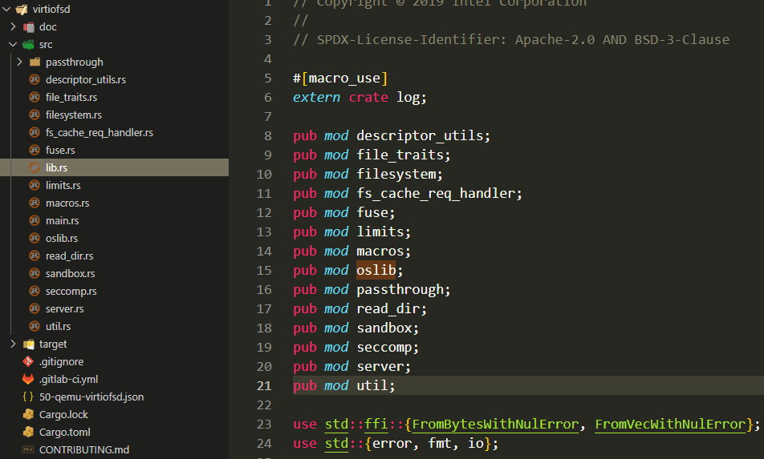

virtiofsd是有c版本和rust版本, 这里讨论的是rust版本.

virtiofsd是vhost-user的daemon程序, 运行在host上, 通过virtiofs协议对接Cloud-hypervisor的vhost后端, 作用是把host上的一个目录共享给guest.

- [使用场景](#使用场景)
- [Cargo.toml和Cargo.lock](#cargotoml和cargolock)
- [lib.rs](#librs)
- [main.rs](#mainrs)
  - [VhostUserFsThread结构体](#vhostuserfsthread结构体)
    - [多线程处理vring](#多线程处理vring)
  - [VhostUserBackend](#vhostuserbackend)
  - [处理signal](#处理signal)
  - [main 流程](#main-流程)
  - [如何handle vhost-user消息](#如何handle-vhost-user消息)
    - [master的req类型](#master的req类型)
    - [handle主要流程](#handle主要流程)
    - [如何map地址](#如何map地址)
    - [self.backend到底是什么?](#selfbackend到底是什么)
      - [`VhostUserHandler`结构体和new函数](#vhostuserhandler结构体和new函数)
      - [从VMM的虚拟地址到Guest的物理地址(GPA)](#从vmm的虚拟地址到guest的物理地址gpa)
      - [`VhostUserHandler`实现了`VhostUserSlaveReqHandler`](#vhostuserhandler实现了vhostuserslavereqhandler)

# 使用场景
首先需要在host上运行virtiofsd, 指定一个unix socket地址, 和一个共享目录.  
然后告诉cloud-hypervisor增加virtiofs设备.
```shell
WORK_DIR="/work"

cmd_mount() {
    while true; do
        virtiofsd --log-level error --seccomp none --cache=always --socket-path=$WORK_DIR/run/rootextra.sock --shared-dir=$WORK_DIR/rootfs
        echo "restarting virtiofsd"
    done &
    ch-remote --api-socket $WORK_DIR/run/clh.sock add-fs tag=rootextra,socket=$WORK_DIR/run/rootextra.sock
}
```
然后需要在guest的启动流程里面, mount这个"rootextra"
```shell
mkdir /rootextra
mount rootextra /rootextra -t virtiofs -o noatime
```

这里解释一下为什么要用`while true`来包住virtiofsd:

virtiofsd进程虽然是个daemon, 是socket server的角色, 但在socket断开链接的时候virtiofsd进程会退出, 这点设计很不友好.  
socket断开链接可能是VMM遇到了某些情况, 导致了KVM_EXIT_RESET, 从而和virtiofsd的链接中断. 导致virtiofsd退出. 但VMM可以resume, 然后依然想继续connect virtiofsd, 但后者已经不存在了, 导致超时错误, 出现下面的错误:
```shell
2022-12-26T06:47:08.579745672Z cloud-hypervisor is ready
2022-12-26T06:47:08.770061870Z Host kernel: Linux isam-reborn 5.4.209-1.el7.elrepo.x86_64 #1 SMP Wed Aug 3 09:03:41 EDT 2022 x86_64 Linux
2022-12-26T06:47:08.770251609Z VM Boot...
2022-12-26T06:47:08.867627592Z VM Redirect output to /work/run/boot.log...
2022-12-26T06:48:09.043679400Z VMM thread exited with error: Error running command: Server responded with an error: Error rebooting VM: InternalServerError: DeviceManagerApiError(ResponseRecv(RecvError))
2022-12-26T06:48:09.043719047Z (CreateVirtioFs(VhostUserConnect))
2022-12-26T06:48:09.046144519Z Error running command: Error opening HTTP socket: Connection refused (os error 111)
2022-12-26T06:48:09.081708726Z VM State: 
2022-12-26T06:48:09.082411890Z VM Ready...
2022-12-26T06:48:09.082683707Z cloud-hypervisor: 10.301501007s:  WARN:vmm/src/device_manager.rs:1854 -- Ignoring error from setting up SIGWINCH listener: Invalid argument (os error 22)
2022-12-26T06:48:09.082698957Z cloud-hypervisor: 70.509301809s:  ERROR:virtio-devices/src/vhost_user/vu_common_ctrl.rs:410 -- Failed connecting the backend after trying for 1 minute: VhostUserProtocol(SocketConnect(Os { code: 111, kind: ConnectionRefused, message: "Connection refused" }))
2022-12-26T06:48:09.083612791Z Error running command: Error opening HTTP socket: Connection refused (os error 111)
```

解决办法就是让virtiofsd不断的无条件重启.

# Cargo.toml和Cargo.lock
这是个典型的cli程序的rust工程.

* Cargo.toml描述了基本的项目信息和直接的package依赖. 依赖有:
  * [bitflags](https://crates.io/crates/bitflags): 提供`bitflags!`宏用于位操作. [`crates.io`](https://crates.io/crates/bitflags)显示有1870个包依赖它 [用法链接](https://docs.rs/bitflags/latest/bitflags/)
  * [capng](https://crates.io/crates/capng): 是libcap-ng的wrapper, 只有virtiofsd在用. 做为一个很薄的lib, 它只有两个源文件:
    * lib.rs提供了对外的接口
    * [binding.rs](https://github.com/slp/capng/blob/master/src/bindings.rs)是对c库`cap-ng`的接口的`extern "C"`声明, 对内(lib.rs)提供rust接口. 比如libcap-ng提供的C接口`int capng_name_to_capability(const char *name);`在这里被声明成了`pub fn capng_name_to_capability(name: *const ::std::os::raw::c_char) -> ::std::os::raw::c_int;` 这里注意`#[link(name = "cap-ng")]`的链接指示标记
  * [env_logger](https://crates.io/crates/env_logger): 使用环境变量控制log level. 被4630个包依赖. 使用时要同时声明对`log`包的依赖. 提供类似`info!`等记录log的宏.
  * [futures](https://crates.io/crates/futures): 异步编程框架. 提供`join!`, `select!`等宏. 被6957个包依赖, 其中包括[tokio](https://crates.io/crates/tokio)
  * [libc](https://crates.io/crates/libc): 提供对libc的引用.
  * [log](https://crates.io/crates/log): 有11367个包依赖log
  * [libseccomp-sys](https://crates.io/crates/libseccomp-sys): 比libseccomp更底层的C库binding
  * [structopt](https://crates.io/crates/structopt): 解析命令行的, 现在大多用clap
  * [vhost-user-backend](https://crates.io/crates/vhost-user-backend): vhost user后端的框架
  * [vhost](https://crates.io/crates/vhost): 支持如下三种vhost后端:
    * vhost: the dataplane is implemented by linux kernel
      * 比如vhost-net, vhost-scsi and vhost-vsock, 后端在kernel实现, VMM通过ioctl, eventfd等方式和kernel交互
    * vhost-user: the dataplane is implemented by dedicated vhost-user servers
      * 在用户态实现vhost后端, server和client通过unix socket来共享内存. 通过这个共享通道, 双方交换vqueue的信息, 共享vqueue的是master, 否则是slave. master和slave是按vqueue的所有者来分的, 和socket的server/client没有关系.
    * vDPA(vhost DataPath Accelerator): the dataplane is implemented by hardwares
  * [virtio-bindings](https://crates.io/crates/virtio-bindings): virtio的binding, `virtio-bindings = { version = "0.1", features = ["virtio-v5_0_0"] }`的意思是对应Linux kernel version 5.0
  * [vm-memory](https://crates.io/crates/vm-memory): 提供了访问VM物理内存的trait
  * [virtio-queue](https://crates.io/crates/virtio-queue): 提供了virtio queue描述符的实现, readme写的非常好, guest driver和vmm device之间通过vhost协议交互的过程写的很具体. 规范定义了两个format
    * split virtqueues: 这个crate支持这种
    * packed virtqueues: 暂时不支持
  * [vmm-sys-util](https://crates.io/crates/vmm-sys-util): 提供了一些基础功能的wrapper, 给其他rust-vmm组件使用.
  * [syslog](https://crates.io/crates/syslog): 和log配合使用, 输出到syslog
* Cargo.lock是cargo生成的完整的依赖. 和go.sum类似.

# lib.rs
main.rs引用了lib.rs, 后者声明了自己的mod, 每个mod对应一个rs文件.  
  
这个设计奇怪的地方在于要在别人(lib.rs)的代码里声明自己(比如fuse.rs)是个mod(`pub mod fuse;`)...  
我认为最好应该是自己声明自己是个mod...

# main.rs
main.rs就是virtiofsd这个命令行程序的入口.

## VhostUserFsThread结构体
看名字, 这是个vhost线程的抽象
```rust
struct VhostUserFsThread<F: FileSystem + Send + Sync + 'static> {
    mem: Option<GuestMemoryAtomic<GuestMemoryMmap>>,
    kill_evt: EventFd,
    server: Arc<Server<F>>,
    // handle request from slave to master
    vu_req: Option<SlaveFsCacheReq>,
    event_idx: bool,
    pool: Option<ThreadPool>,
}
```
给这个结构体实现了Clone trait
```rust
impl<F: FileSystem + Send + Sync + 'static> Clone for VhostUserFsThread<F> {
    fn clone(&self) -> Self {
        VhostUserFsThread {
            mem: self.mem.clone(),
            kill_evt: self.kill_evt.try_clone().unwrap(),
            server: self.server.clone(),
            vu_req: self.vu_req.clone(),
            event_idx: self.event_idx,
            pool: self.pool.clone(),
        }
    }
}
```

这个结构体的方法:
```rust
impl<F: FileSystem + Send + Sync + 'static> VhostUserFsThread<F> {
    fn new(fs: F, thread_pool_size: usize) -> Result<Self>
    fn return_descriptor(
        vring_state: &mut VringState,
        head_index: u16,
        event_idx: bool,
        len: usize,
    )
    //线程池的方式处理vring
    fn process_queue_pool(&self, vring: VringMutex) -> Result<bool>
    //单线程
    fn process_queue_serial(&self, vring_state: &mut VringState) -> Result<bool>
}
```

### 多线程处理vring
`process_queue_pool`使用了线程池+async技术来处理vring
```rust
fn process_queue_pool(&self, vring: VringMutex) -> Result<bool> {
    let mut used_any = false;
    let atomic_mem = match &self.mem {
        Some(m) => m,
        None => return Err(Error::NoMemoryConfigured),
    };

    while let Some(avail_desc) = vring
        .get_mut()  //其他笔记说过, 这里实际上是调用了mutex.lock(), 但在下面一行就会马上unlock()
        .get_queue_mut()
        .iter(atomic_mem.memory())
        .map_err(|_| Error::IterateQueue)?
        .next()
    {
        used_any = true;

        // Prepare a set of objects that can be moved to the worker thread.
        let atomic_mem = atomic_mem.clone();
        let server = self.server.clone();
        let mut vu_req = self.vu_req.clone();
        let event_idx = self.event_idx;
        let worker_vring = vring.clone();
        let worker_desc = avail_desc.clone();
        //async后面跟的fn/闭包/block都不会阻塞当前执行, 他们会变成future, 在某个地方await的时候才真正执行
        //spawn_ok()这个方法就是创建一个task(没有说一定是线程)来执行后面的future. spawn_ok的意思是返回值永远是ok
        //move是变量所有权move到下面的闭包块中
        //这里的spwan+async+各种变量clone基本上等同于go语言中的go
        self.pool.as_ref().unwrap().spawn_ok(async move {
            let mem = atomic_mem.memory();
            let head_index = worker_desc.head_index();

            let reader = Reader::new(&mem, worker_desc.clone())
                .map_err(Error::QueueReader)
                .unwrap();
            let writer = Writer::new(&mem, worker_desc.clone())
                .map_err(Error::QueueWriter)
                .unwrap();

            let len = server
                .handle_message(reader, writer, vu_req.as_mut())
                .map_err(Error::ProcessQueue)
                .unwrap();

            Self::return_descriptor(&mut worker_vring.get_mut(), head_index, event_idx, len);
        });
    }

    Ok(used_any)
}
```

## VhostUserBackend
只是个简单的结构体, 内部是带读写锁的`VhostUserFsThread`
```rust
struct VhostUserFsBackend<F: FileSystem + Send + Sync + 'static> {
    thread: RwLock<VhostUserFsThread<F>>,
}
```
它的new方法:
```rust
impl<F: FileSystem + Send + Sync + 'static> VhostUserFsBackend<F> {
    fn new(fs: F, thread_pool_size: usize) -> Result<Self> {
        let thread = RwLock::new(VhostUserFsThread::new(fs, thread_pool_size)?);
        Ok(VhostUserFsBackend { thread })
    }
}
```

它实现了`VhostUserBackend`协议trait
```rust
impl<F: FileSystem + Send + Sync + 'static> VhostUserBackend<VringMutex> for VhostUserFsBackend<F> {
  fn num_queues(&self) -> usize //返回预设的2
  fn max_queue_size(&self) -> usize //返回预设的1024
  fn features(&self) -> u64 //返回预设的flag
  fn handle_event(...) //主处理入口
  fn set_event_idx(&self, enabled: bool) {
    //write()函数是读写锁的获取写锁
    self.thread.write().unwrap().event_idx = enabled;
  }
  fn update_memory(&self, mem: GuestMemoryAtomic<GuestMemoryMmap>) -> VhostUserBackendResult<()> {
    self.thread.write().unwrap().mem = Some(mem);
    Ok(())
  }
  fn handle_event(
    &self,
    device_event: u16,
    evset: EventSet,
    vrings: &[VringMutex],
    _thread_id: usize,
) -> VhostUserBackendResult<bool> {
    if evset != EventSet::IN {
        return Err(Error::HandleEventNotEpollIn.into());
    }

    let thread = self.thread.read().unwrap(); //持有读锁直到thread消亡

    if thread.pool.is_some() {
        thread.handle_event_pool(device_event, vrings)
    } else {
        thread.handle_event_serial(device_event, vrings)
    }
  }
  fn exit_event(&self, _thread_index: usize) -> Option<EventFd> {
    Some(self.thread.read().unwrap().kill_evt.try_clone().unwrap())
  }
  fn set_slave_req_fd(&self, vu_req: SlaveFsCacheReq) {
    self.thread.write().unwrap().vu_req = Some(vu_req);
  }
}
```

## 处理signal
```rust
fn set_signal_handlers() {
    use vmm_sys_util::signal;

    extern "C" fn handle_signal(_: libc::c_int, _: *mut libc::siginfo_t, _: *mut libc::c_void) {
        unsafe { libc::_exit(1) };
    }
    let signals = vec![libc::SIGHUP, libc::SIGTERM];
    for s in signals {
        if let Err(e) = signal::register_signal_handler(s, handle_signal) {
            error!("Setting signal handlers: {}", e);
            process::exit(1);
        }
    }
}
```

## main 流程
1. 先解析命令行参数`Opt::from_args()`
2. 初始化log系统, 尝试按下面方式连接syslog
   * Unix sockets /dev/log and /var/run/syslog
   * Tcp connection to 127.0.0.1:601
   * Udp connection to 127.0.0.1:514
3. 安装sighandler for SIGHUP SIGTERM
4. 增加rlimit的open file数量到最大
5. 创建sandbox
   这里面调用了很多libc的函数. fork进程, 在父进程中等待, 在子进程中:
   * 用unshare系统调用进入名字空间
   * 在名字空间中mount `/proc`和`shared_dir`
   * 调用pivot_root系统调用来chroot
   * 也可以直接用chroot系统调用, 简单点, 但chroot不是很安全. pivot_root+mount可能麻烦点, [但安全](https://news.ycombinator.com/item?id=23167383).
6. 如果uid是0(root), 丢弃不需要的权限
7. 创建内部文件系统表达, 把收到的请求透传到底层的文件系统
8. 创建VhostUserFsBackend线程
9. 创建VhostUserDaemon daemon, 就是new一个VhostUserDaemon结构体
10. 开始服务. daemon.start 
    * vhost的后端(virtiofsd)和前端(could-hypervisor)通过unix socket来交换vqueue的信息, 分享vqueue的前端是master, 使用vqueue的后端是slave. 所以virtiofsd是socket的server端, 但是vqueue的slave端. 所以这里先new一个`SlaveListener`
    * 然后用这个SlaveListener accept一个连接. 这里就是rust不太方便的地方, 要支持多个连接, 还要搞pool+async等.
    * 然后handle这个连接, 处理vhost-user消息
11. 等待子进程结束(join), 表示client disconnect, 发送kill event到worker线程结束.

## 如何handle vhost-user消息
在main流程的第10步, vmm做为client连接到virtiofsd的时候, 两者通过unix socket交换vhost-user消息.

* 从unix socket来说, virtiofsd是server, vmm是client
* 从vqueue来说, virtiofsd是slave, vmm是master.

vhost crate的vhost-user提供了`SlaveListener`来处理连接和消息:
```rust
/// Sets up a listener for incoming master connections, and handles construction
/// of a Slave on success.
impl<S: VhostUserSlaveReqHandler> SlaveListener<S> {
    /// Create a unix domain socket for incoming master connections.
    pub fn new(listener: Listener, backend: Arc<S>) -> Result<Self> {
        Ok(SlaveListener {
            listener,
            backend: Some(backend),
        })
    }

    /// Accept an incoming connection from the master, returning Some(Slave) on
    /// success, or None if the socket is nonblocking and no incoming connection
    /// was detected
    pub fn accept(&mut self) -> Result<Option<SlaveReqHandler<S>>> {
        if let Some(fd) = self.listener.accept()? {
            return Ok(Some(SlaveReqHandler::new(
                Endpoint::<MasterReq>::from_stream(fd),
                self.backend.take().unwrap(),
            )));
        }
        Ok(None)
    }

    /// Change blocking status on the listener.
    pub fn set_nonblocking(&self, block: bool) -> Result<()> {
        self.listener.set_nonblocking(block)
    }
}
```
这里面的backend就是`Arc<VhostUserSlaveReqHandler>`, 这个`VhostUserSlaveReqHandler`应该就会处理vhost-user消息. 这个trait定义在`vhost/f87156b/src/vhost_user/slave_req_handler.rs`

vhost-user的消息头:
```rust
/// Common message header for vhost-user requests and replies.
/// A vhost-user message consists of 3 header fields and an optional payload. All numbers are in the
/// machine native byte order.
#[repr(packed)] //repr(packed)是说让编译器去掉padding, 字节对齐
#[derive(Copy)]
pub(super) struct VhostUserMsgHeader<R: Req> {
    request: u32,
    flags: u32,
    size: u32,
    _r: PhantomData<R>, //PhantomData<T>实际上是0字节, 意思是"假装"拥有T
}
```

### master的req类型
```rust
/// Type of requests sending from masters to slaves.
#[repr(u32)]
#[derive(Clone, Copy, Debug, PartialEq, Eq, PartialOrd, Ord)]
pub enum MasterReq {
    /// Null operation.
    NOOP = 0,
    /// Get from the underlying vhost implementation the features bit mask.
    GET_FEATURES = 1,
    /// Enable features in the underlying vhost implementation using a bit mask.
    SET_FEATURES = 2,
    /// Set the current Master as an owner of the session.
    SET_OWNER = 3,
    /// No longer used.
    RESET_OWNER = 4,
    /// Set the memory map regions on the slave so it can translate the vring addresses.
    SET_MEM_TABLE = 5,
    /// Set logging shared memory space.
    SET_LOG_BASE = 6,
    /// Set the logging file descriptor, which is passed as ancillary data.
    SET_LOG_FD = 7,
    /// Set the size of the queue.
    SET_VRING_NUM = 8,
    /// Set the addresses of the different aspects of the vring.
    SET_VRING_ADDR = 9,
    /// Set the base offset in the available vring.
    SET_VRING_BASE = 10,
    /// Get the available vring base offset.
    GET_VRING_BASE = 11,
    /// Set the event file descriptor for adding buffers to the vring.
    SET_VRING_KICK = 12,
    /// Set the event file descriptor to signal when buffers are used.
    SET_VRING_CALL = 13,
    /// Set the event file descriptor to signal when error occurs.
    SET_VRING_ERR = 14,
    /// Get the protocol feature bit mask from the underlying vhost implementation.
    GET_PROTOCOL_FEATURES = 15,
    /// Enable protocol features in the underlying vhost implementation.
    SET_PROTOCOL_FEATURES = 16,
    /// Query how many queues the backend supports.
    GET_QUEUE_NUM = 17,
    /// Signal slave to enable or disable corresponding vring.
    SET_VRING_ENABLE = 18,
    /// Ask vhost user backend to broadcast a fake RARP to notify the migration is terminated
    /// for guest that does not support GUEST_ANNOUNCE.
    SEND_RARP = 19,
    /// Set host MTU value exposed to the guest.
    NET_SET_MTU = 20,
    /// Set the socket file descriptor for slave initiated requests.
    SET_SLAVE_REQ_FD = 21,
    /// Send IOTLB messages with struct vhost_iotlb_msg as payload.
    IOTLB_MSG = 22,
    /// Set the endianness of a VQ for legacy devices.
    SET_VRING_ENDIAN = 23,
    /// Fetch the contents of the virtio device configuration space.
    GET_CONFIG = 24,
    /// Change the contents of the virtio device configuration space.
    SET_CONFIG = 25,
    /// Create a session for crypto operation.
    CREATE_CRYPTO_SESSION = 26,
    /// Close a session for crypto operation.
    CLOSE_CRYPTO_SESSION = 27,
    /// Advise slave that a migration with postcopy enabled is underway.
    POSTCOPY_ADVISE = 28,
    /// Advise slave that a transition to postcopy mode has happened.
    POSTCOPY_LISTEN = 29,
    /// Advise that postcopy migration has now completed.
    POSTCOPY_END = 30,
    /// Get a shared buffer from slave.
    GET_INFLIGHT_FD = 31,
    /// Send the shared inflight buffer back to slave.
    SET_INFLIGHT_FD = 32,
    /// Sets the GPU protocol socket file descriptor.
    GPU_SET_SOCKET = 33,
    /// Ask the vhost user backend to disable all rings and reset all internal
    /// device state to the initial state.
    RESET_DEVICE = 34,
    /// Indicate that a buffer was added to the vring instead of signalling it
    /// using the vring’s kick file descriptor.
    VRING_KICK = 35,
    /// Return a u64 payload containing the maximum number of memory slots.
    GET_MAX_MEM_SLOTS = 36,
    /// Update the memory tables by adding the region described.
    ADD_MEM_REG = 37,
    /// Update the memory tables by removing the region described.
    REM_MEM_REG = 38,
    /// Notify the backend with updated device status as defined in the VIRTIO
    /// specification.
    SET_STATUS = 39,
    /// Query the backend for its device status as defined in the VIRTIO
    /// specification.
    GET_STATUS = 40,
    /// Upper bound of valid commands.
    MAX_CMD = 41,
}
```

### handle主要流程
master过来的req, 由`SlaveReqHandler`来处理. `SlaveReqHandler`有个`VhostUserSlaveReqHandler`的backend
```rust
/// Server to handle service requests from masters from the master communication channel.
///
/// The [SlaveReqHandler] acts as a server on the slave side, to handle service requests from
/// masters on the master communication channel. It's actually a proxy invoking the registered
/// handler implementing [VhostUserSlaveReqHandler] to do the real work.
///
/// The lifetime of the SlaveReqHandler object should be the same as the underline Unix Domain
/// Socket, so it gets simpler to recover from disconnect.
///
/// [VhostUserSlaveReqHandler]: trait.VhostUserSlaveReqHandler.html
/// [SlaveReqHandler]: struct.SlaveReqHandler.html
pub struct SlaveReqHandler<S: VhostUserSlaveReqHandler> {
    // underlying Unix domain socket for communication
    main_sock: Endpoint<MasterReq>,
    // the vhost-user backend device object
    backend: Arc<S>,

    virtio_features: u64,
    acked_virtio_features: u64,
    protocol_features: VhostUserProtocolFeatures,
    acked_protocol_features: u64,

    // sending ack for messages without payload
    reply_ack_enabled: bool,
    // whether the endpoint has encountered any failure
    error: Option<i32>,
}
```
从socket里面先读消息头, 里面有payload size. 再读这个size, 得到具体的消息.
```rust
//每次处理一个master发过来的req
pub fn handle_request(&mut self) -> Result<()> {
  //先检查状态
  self.check_state()?;
  //读消息头, 和传递过来的fd表(files), 后者是用cmsg携带的
  let (hdr, files) = self.main_sock.recv_header()?;
    //创建header空间
    //组建iovec
    //底层使用了unix socket的传递fd的功能(SCM_RIGHTS). 最多每次收32个fd
    //SCM_RIGHTS又是基于socket的control message(man 3 cmsg)的. 

  //根据消息头里的size读payload
  let (size, buf) = match hdr.get_size() {
      0 => (0, vec![0u8; 0]),
      len => {
          //
          let (size2, rbuf) = self.main_sock.recv_data(len as usize)?;
          if size2 != len as usize {
              return Err(Error::InvalidMessage);
          }
          (size2, rbuf)
      }
  };

  //根据hdr的消息码做对应的动作
  match hdr.get_code() {
    MasterReq::SET_OWNER => {
        self.check_request_size(&hdr, size, 0)?;
        //调用后端执行动作
        let res = self.backend.set_owner();
        self.send_ack_message(&hdr, res)?;
    }
    //地址mapping
    MasterReq::SET_MEM_TABLE => {
        let res = self.set_mem_table(&hdr, size, &buf, files);
        self.send_ack_message(&hdr, res)?;
    }
    MasterReq::SET_VRING_ADDR => {
        let msg = self.extract_request_body::<VhostUserVringAddr>(&hdr, size, &buf)?;
        let flags = match VhostUserVringAddrFlags::from_bits(msg.flags) {
            Some(val) => val,
            None => return Err(Error::InvalidMessage),
        };
        let res = self.backend.set_vring_addr(
            msg.index,
            flags,
            msg.descriptor,
            msg.used,
            msg.available,
            msg.log,
        );
        self.send_ack_message(&hdr, res)?;
    }
    MasterReq::SET_VRING_BASE => {
      let msg = self.extract_request_body::<VhostUserVringState>(&hdr, size, &buf)?;
      let res = self.backend.set_vring_base(msg.index, msg.num);
      self.send_ack_message(&hdr, res)?;

    //通知
    MasterReq::SET_VRING_CALL => {
        self.check_request_size(&hdr, size, mem::size_of::<VhostUserU64>())?;
        let (index, file) = self.handle_vring_fd_request(&buf, files)?;
        let res = self.backend.set_vring_call(index, file);
        self.send_ack_message(&hdr, res)?;
    }
    MasterReq::SET_VRING_KICK => {
        self.check_request_size(&hdr, size, mem::size_of::<VhostUserU64>())?;
        let (index, file) = self.handle_vring_fd_request(&buf, files)?;
        let res = self.backend.set_vring_kick(index, file);
        self.send_ack_message(&hdr, res)?;
    }
}
```

### 如何map地址
`MasterReq::SET_MEM_TABLE`的payload是下面的结构体的slice
```rust
/// Memory region descriptors as payload for the SET_MEM_TABLE request.
#[repr(packed)]
#[derive(Default, Clone, Copy)]
pub struct VhostUserMemoryRegion {
    /// Guest physical address of the memory region.
    pub guest_phys_addr: u64,
    /// Size of the memory region.
    pub memory_size: u64,
    /// Virtual address in the current process.
    pub user_addr: u64,
    /// Offset where region starts in the mapped memory.
    pub mmap_offset: u64,
}
```
在`self.set_mem_table(&hdr, size, &buf, files)`中, 把payload重组成memory region的slice:
```rust
let regions = unsafe {
    slice::from_raw_parts(
        buf.as_ptr().add(hdrsize) as *const VhostUserMemoryRegion,
        msg.num_regions as usize,
    )
};
```
然后调用后端的`set_mem_table`
```rust
self.backend.set_mem_table(regions, files)
```


### self.backend到底是什么?
`SlaveReqHandler`收到master消息, 解析消息, 最后做动作的时候, 实际调用的是`self.backend.set_mem_table(regions, files)`. 这里的backend就是`VhostUserSlaveReqHandler`, 这是个trait, 它规定了`set_mem_table`的原型:
```rust
fn set_mem_table(&self, ctx: &[VhostUserMemoryRegion], files: Vec<File>) -> Result<()>;
```


在main里面比较早的时候, 使用命令行传入的参数, 初始化了fs_cfg
```rust
    let fs_cfg = passthrough::Config {
        cache_policy: opt.cache,
        root_dir: sandbox.get_root_dir(),
        mountinfo_prefix: sandbox.get_mountinfo_prefix(),
        xattr,
        xattrmap,
        proc_sfd_rawfd: sandbox.get_proc_self_fd(),
        proc_mountinfo_rawfd: sandbox.get_mountinfo_fd(),
        announce_submounts: opt.announce_submounts,
        inode_file_handles: opt.inode_file_handles.into(),
        readdirplus,
        writeback: opt.writeback,
        allow_direct_io: opt.allow_direct_io,
        killpriv_v2,
        security_label: opt.security_label,
        posix_acl: opt.posix_acl,
        ..Default::default()
    };

    //PassthroughFs工作在VhostUserFsBackend上面
    let fs = PassthroughFs::new(fs_cfg)
    let fs_backend = Arc::new(VhostUserFsBackend::new(fs, thread_pool_size))
    //VhostUserDaemon用上面的fs_backend初始化了VhostUserHandler
    let mut daemon = VhostUserDaemon::new(
        String::from("virtiofsd-backend"),
        fs_backend.clone(),
        GuestMemoryAtomic::new(GuestMemoryMmap::new()),
    )
    .unwrap();

```

代码在`vhost-user-backend/src/handler.rs`  

这里的关键点在于`VhostUserHandler`, 它包含了两部分, 一个是vhost user后端, 一个是guest内存  
`VhostUserDaemon.VhostUserHandler` = `VhostUserFsBackend as VhostUserBackend` + `GuestMemoryAtomic(GuestMemoryMmap)`  


#### `VhostUserHandler`结构体和new函数
```rust
pub struct VhostUserHandler<S, V, B: Bitmap + 'static> {
    backend: S,
    handlers: Vec<Arc<VringEpollHandler<S, V, B>>>,
    owned: bool,
    features_acked: bool,
    acked_features: u64,
    acked_protocol_features: u64,
    num_queues: usize,
    max_queue_size: usize,
    queues_per_thread: Vec<u64>,
    mappings: Vec<AddrMapping>,
    atomic_mem: GM<B>,
    vrings: Vec<V>,
    worker_threads: Vec<thread::JoinHandle<VringEpollResult<()>>>,
}

// Ensure VhostUserHandler: Clone + Send + Sync + 'static.
impl<S, V, B> VhostUserHandler<S, V, B>
where
    S: VhostUserBackend<V, B> + Clone + 'static,
    V: VringT<GM<B>> + Clone + Send + Sync + 'static,
    B: Bitmap + Clone + Send + Sync + 'static,
{
    pub(crate) fn new(backend: S, atomic_mem: GM<B>) -> VhostUserHandlerResult<Self> {
        let num_queues = backend.num_queues();
        let max_queue_size = backend.max_queue_size();
        let queues_per_thread = backend.queues_per_thread();

        let mut vrings = Vec::new();
        for _ in 0..num_queues {
            let vring = V::new(atomic_mem.clone(), max_queue_size as u16)
                .map_err(VhostUserHandlerError::CreateVring)?;
            vrings.push(vring);
        }

        let mut handlers = Vec::new();
        let mut worker_threads = Vec::new();
        for (thread_id, queues_mask) in queues_per_thread.iter().enumerate() {
            let mut thread_vrings = Vec::new();
            for (index, vring) in vrings.iter().enumerate() {
                if (queues_mask >> index) & 1u64 == 1u64 {
                    thread_vrings.push(vring.clone());
                }
            }

            let handler = Arc::new(
                VringEpollHandler::new(backend.clone(), thread_vrings, thread_id)
                    .map_err(VhostUserHandlerError::CreateEpollHandler)?,
            );
            let handler2 = handler.clone();
            let worker_thread = thread::Builder::new()
                .name("vring_worker".to_string())
                .spawn(move || handler2.run())
                .map_err(VhostUserHandlerError::SpawnVringWorker)?;

            handlers.push(handler);
            worker_threads.push(worker_thread);
        }

        Ok(VhostUserHandler {
            backend,
            handlers,
            owned: false,
            features_acked: false,
            acked_features: 0,
            acked_protocol_features: 0,
            num_queues,
            max_queue_size,
            queues_per_thread,
            mappings: Vec::new(),
            atomic_mem,
            vrings,
            worker_threads,
        })
    }
}
```

#### 从VMM的虚拟地址到Guest的物理地址(GPA)
从`VhostUserHandler`的mappings的vec里面, 逐个匹配地址区间
```rust
impl<S, V, B: Bitmap> VhostUserHandler<S, V, B> {
    pub(crate) fn send_exit_event(&self) {
        for handler in self.handlers.iter() {
            handler.send_exit_event();
        }
    }

    fn vmm_va_to_gpa(&self, vmm_va: u64) -> VhostUserHandlerResult<u64> {
        for mapping in self.mappings.iter() {
            if vmm_va >= mapping.vmm_addr && vmm_va < mapping.vmm_addr + mapping.size {
                return Ok(vmm_va - mapping.vmm_addr + mapping.gpa_base);
            }
        }

        Err(VhostUserHandlerError::MissingMemoryMapping)
    }
}
```

#### `VhostUserHandler`实现了`VhostUserSlaveReqHandler`
virtiofsd从unix socket接收到vhost-user消息后, 调用后者做为backend来真正执行建立和维护vring的动作.  
比如cloud hypervisor VMM做为vring的master, 发来的SET_MEM_TABLE请求, 被vritiofsd的`SlaveReqHandler`来处理. `SlaveReqHandler`有个`VhostUserSlaveReqHandler`的backend. 这个backend就是这里的`VhostUserHandler`.

那么`VhostUserHandler`如何实现这个函数的呢?
```rust
impl<S, V, B> VhostUserSlaveReqHandlerMut for VhostUserHandler<S, V, B>
where
    S: VhostUserBackend<V, B>,
    V: VringT<GM<B>>,
    B: NewBitmap + Clone,
{
    /// Memory region descriptors as payload for the SET_MEM_TABLE request.
    #[repr(packed)]
    #[derive(Default, Clone, Copy)]
    pub struct VhostUserMemoryRegion {
        /// Guest physical address of the memory region.
        pub guest_phys_addr: u64,
        /// Size of the memory region.
        pub memory_size: u64,
        /// Virtual address in the current process.
        pub user_addr: u64,
        /// Offset where region starts in the mapped memory.
        pub mmap_offset: u64,
    }

    //这个函数需要传入VhostUserMemoryRegion, 这个region是master传过来的, 声明了这个region在master端的地址信息
    //    guest_phys_addr: u64, 物理地址
    //    memory_size: u64, 大小
    //    user_addr: u64, 在master进程内的虚拟地址
    //    mmap_offset: u64, master会给每个region都传递过来一个fd, 用来共享这块内存. mmap_offset是在fd内的偏移量.
    // 详细结构体定义在上面
    fn set_mem_table(
        &mut self,
        ctx: &[VhostUserMemoryRegion],
        files: Vec<File>,
    ) -> VhostUserResult<()> {
        //GuestAddress是个包着u64的tuple struct
        let mut regions: Vec<(GuestAddress, usize, Option<FileOffset>)> = Vec::new();
    }
}
```


