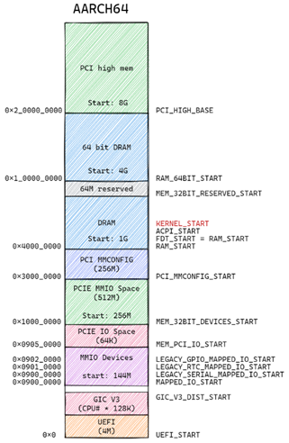

介绍Firecracker Cloud-hypervisor以及virtio基础概念. 转录自我的PPT

# VMM brief
  

# Virtio devices
Virtio is a protocol that defines how guest drivers talk to virtual devices. See the spec [v1.2](http://docs.oasis-open.org/virtio/virtio/v1.2/virtio-v1.2.html).  
Virtio devices can be exposed by PCI or MMIO
* PCI: a device with PCI vendor ID `0x1AF4` is a virtio device, device configuration structures are mapped to PCI configuration header BAR 0
  * Common configuration: feature bits, queue num, queue size, queue select, queue address
  * Notifications: driver writes to notification address triggers an event to device
  * ISR Status: not used when msi-x is enabled
  * Device-specific configuration: different virtio types(net, block…) have different layouts
  * PCI configuration access: provide an alternative way to access above registers other than BAR
* MMIO: a region of predefined register layout starting at base address, with compatible = "virtio,mmio“ in DTS, which can be “discovered” by guest driver.
* All registers are little endian

# MMIO based virtio devices
  

# PCI based virtio devices
  

# Memory Manager in cloud-hypervisor
* Defines VM physical memory layout, just like a new SOC
* Uses BtreeMap to record memory ranges
* Uses `KVM_SET_USER_MEMORY_REGION` ioctl to map the layout to VMM virtual memory. (`VM_PA` to `HOST_VA`)
* When guest VM access memory, 2 stages translate happens(e.g. AARCH64):  
  
  * `VM_VA` -> `VM_PA`
  * `HOST_VA` -> `HOST_PA`
* Mainly focus on
  * PCI MMIO space
  * PCI MMCONFIG space
* AARCH64 `VM_PA` layout  
  

# Device Manager
  
* Manages all PCI devices
  * Virtio PCI devices
  * VFIO PCI devices
* Normally has 2 PCI segments
  * Segment 0 is default
* Each PCI segment has
  * PCI root, vendor ID intel, device ID `VIRT_PCIE_HOST`
  * Uses HashMap to map bdf to PciDevice
  * A pci config mmio BusDevice to route mm config access to corresponding PciDevice
  * A MMIO address Allocator 
  * And many VirtioPciDevices

# Virtio Net example
  
* Virtio net has at least 3 virtqueues
  * Transmitq
  * Receiveq
  * Controlq
* Driver sends and receives packet
  * driver puts a packet into transmitq
  * Notifies device by writing the notification address of the queue
  * Kvm delivers the notification
  * VMM handles the packet, typically by forwarding it to tap
  * VMM receives the reply packet from tap
  * VMM injects interrupt through KVM
  * Guest irq handler receives the packet
  * Guest driver handles the received packet and hands over it to upper network stack.
* The content in the virtqueue is virtio_net_hdr + packet data

