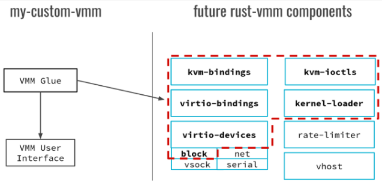
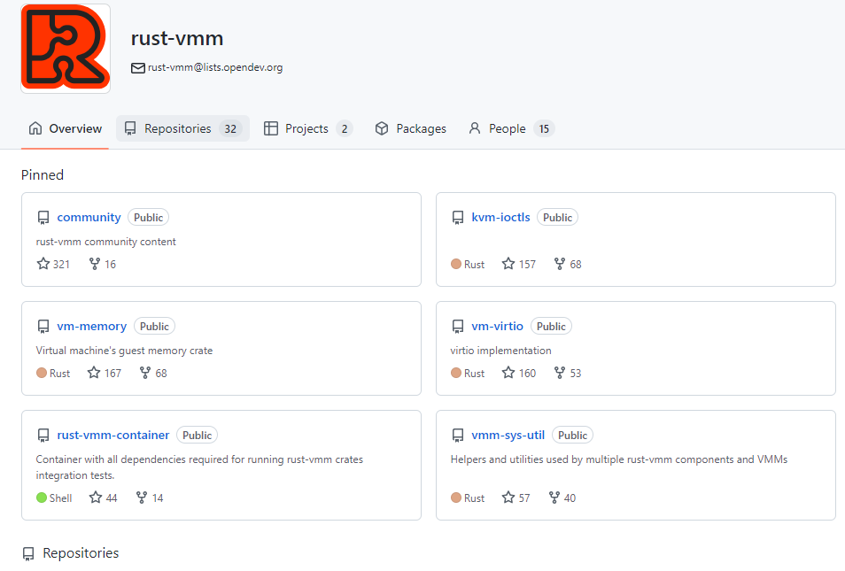

https://github.com/rust-vmm

Rust-Vmm 是一个开源工程，是一个可以自由定制的 VMM（virtual machine monitor）虚拟机管理器，用户可以按照自己的方式订制它。它是基于 Rust 语言实现的 VMM，有着 Rust 语言带来的优点和特性。

首先，Rust 语言一个内存安全的语言，相比于用 C 或者 C++ 会频繁遇到的各种内存的问题，比如内存的溢出、空指针、野指针、越界访问等等，更进一步会造成安全的问题、性能的问题，以及各种崩溃的问题。Rust 语言很好地解决了这一点，从它的语法、编译规则等杜绝了内存级别访问的漏洞以及风险，所以用 Rust 写的 Rust-Vmm 天然的就是内存安全的。

第二，Rust-Vmm 是不易被攻击的，Rust-VMM 是从零开始的，它是从最小的硬件虚拟化出发的，最小的硬件虚拟化意味着它有着最小的攻击面，被攻击的面就非常少，所以它会很安全。

第三，Rust-Vmm 能够很灵活的定制。Rust-VMM 可以灵活定制它的每一个组件，所有的对于设备的模拟或者关键特性的处理都是封装成了一个一个的 Rust-Vmm crates 包，比如有 VCPU，有 linuxloader，vm-virtIO 等等。其中 crates 是 Rust 语言中的包管理工具，可以理解 JAVA 或 golang 里面的 package，它是以发行不同的包或者库的形式对外发布它的 feature。

第四，Rust-Vmm 有非常高的性能，基于 Rust 语言的 without garbage collection 特性，它是没有 GC 回收检查机制的，不像 JAVA 或者其他更高级的语言会有一个 runtime，Rust-Vmm 的性能上会更好，同时基于 KVM 实现的虚拟化方案也是性能的保证。

简单介绍一下 Rust-Vmm 的一个历史，它是由谷歌首先实现的，谷歌首先实现一个 Rust based 的轻量级的 VMM，它叫做 crosVM，大家也可以从链接里面看到，它是一个为 chrome 浏览器做的一个微内核。然后 AWS，亚马逊基于谷歌开源出来的 crosVM，实现了自己的基于 rust 的 VMM 叫 Firecracker。两个项目的开发人员会发现做这两个项目的时候，会有很多重复的重叠的通用的代码，很自然的把可以开源的、通用的部分结合到一块，就有了 Rust-Vmm 的项目。

## 使用rust vmm
参考https://opensource.com/article/19/3/rust-virtual-machine  
  
要自己搭一个vmm, 可以使用rust rmm提供的各种模块, 这些模块都是独立的项目, rust里面叫crate.
* **KVM interface:** Creating our VMM on top of KVM requires an interface that can invoke KVM functionality from Rust. The _kvm-bindings_ crate represents the Rust Foreign Function Interface (FFI) to KVM kernel headers. Because headers only include structures and defines, we also have wrappers over the KVM ioctls (_kvm-ioctls_) that we use for opening dev/kvm, creating a VM, creating vCPUs, and so on.

* **Virtio devices and rate limiting:** Virtio has a frontend-backend architecture. Currently in rust-vmm, the frontend is implemented in the _virtio-devices_ crate, and the backend lies in the _vhost_ package. _Vhost_ has support for both user-land and kernel-land drivers, but users can also plug _virtio-devices_ to their custom backend. The _virtio-bindings_ are the bindings for Virtio devices generated using the Virtio Linux headers. All devices in the _virtio-devices_ crate are exported independently as modules using conditional compilation. Some devices, such as _block_, _net_, and _vsock_ support rate limiting in terms of I/O per second and bandwidth. This can be achieved by using the functionality provided in the _rate-limiter_ crate.

* The _kernel-loader_ is responsible for loading the contents of an [ELF](https://en.wikipedia.org/wiki/Executable_and_Linkable_Format) kernel image in guest memory.

rust-vmm的github上, 各个模块是单独成库的:  
  

## crosvm
crosvm是google的为chrome OS上运行的VMM, 安全性好, Rust写的. Rust也是静态binary
* 每个虚拟设备是个进程,fork出来的, 但不exec. 这个进程用了[minijail](https://android.googlesource.com/platform/external/minijail)做沙盒处理, 应该类似seccomp. 
* 基于KVM
* 使用Rust
* 支持x86, aarch64
* virtual device使用socket和VM通信
* 设备模型的核心是bus, 一个读/写操做到bus上, bus会按这个读或写的地址, 找到对应的`BusDevice`, 转发读/写请求到该`BusDevice`. 
    * 一个地址上只能有一个`BusDevice`
    * `BusDevice`可能出现在多个地址
    * 每个`BusDevice`都自带mutex, 所以`BusDevice`的实现里就不需要再加锁了.

