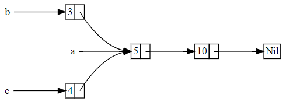
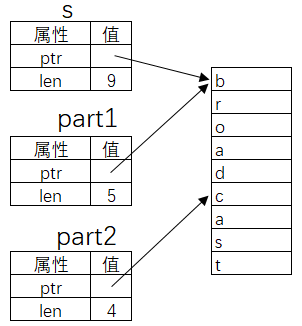

- [安装](#安装)
  - [组件](#组件)
  - [rustup](#rustup)
- [hello world](#hello-world)
- [基础语法](#基础语法)
  - [命名惯例](#命名惯例)
  - [格式化输出](#格式化输出)
  - [语法糖](#语法糖)
  - [变量](#变量)
    - [类型推导](#类型推导)
    - [默认只读](#默认只读)
    - [变量遮蔽](#变量遮蔽)
    - [类型别名](#类型别名)
    - [全局变量](#全局变量)
  - [基本数据类型](#基本数据类型)
    - [指针](#指针)
    - [什么是Box](#什么是box)
    - [什么是Rc](#什么是rc)
    - [类型转换](#类型转换)
    - [字符串](#字符串)
  - [复合数据类型](#复合数据类型)
    - [tuple 元组](#tuple-元组)
    - [数组](#数组)
    - [数组切片](#数组切片)
    - [字符串切片](#字符串切片)
    - [非字符串切片](#非字符串切片)
    - [索引和边界检查](#索引和边界检查)
    - [struct](#struct)
      - [部分初始化](#部分初始化)
      - [输出结构体](#输出结构体)
    - [tuple struct 元组结构体](#tuple-struct-元组结构体)
      - [举例](#举例)
    - [结构体方法](#结构体方法)
      - [结构体关联函数](#结构体关联函数)
    - [普遍方法](#普遍方法)
    - [静态方法](#静态方法)
    - [enum](#enum)
      - [enum和match](#enum和match)
      - [经常出现的Option就是一种enum](#经常出现的option就是一种enum)
      - [经常出现的Result也是enum](#经常出现的result也是enum)
      - [if let代替match](#if-let代替match)
  - [表达式](#表达式)
    - [if else](#if-else)
    - [if let和while let](#if-let和while-let)
    - [循环](#循环)
  - [函数](#函数)
    - [发散函数Diverging functions](#发散函数diverging-functions)
    - [main函数](#main函数)
    - [const\_fn](#const_fn)
  - [trait](#trait)
    - [默认trait](#默认trait)
    - [trait做参数](#trait做参数)
    - [匿名trait](#匿名trait)
    - [Box](#box)
    - [impl trait for trait](#impl-trait-for-trait)
    - [为别人的类型实现trait](#为别人的类型实现trait)
    - [trait不能做为参数, 返回值, 实例变量](#trait不能做为参数-返回值-实例变量)
    - [调用trait](#调用trait)
    - [方法和函数没有本质不同?](#方法和函数没有本质不同)
    - [trait约束](#trait约束)
    - [trait继承](#trait继承)
    - [derive](#derive)
    - [常见trait](#常见trait)
    - [带关联类型的trait](#带关联类型的trait)
  - [模式解构](#模式解构)
  - [match](#match)
  - [ref和mut](#ref和mut)
  - [知晓变量类型](#知晓变量类型)
    - [方案一: 利用编译错误来获取变量类型](#方案一-利用编译错误来获取变量类型)
    - [方案二: 使用标准库](#方案二-使用标准库)
    - [方案三: 不需要nightly版本](#方案三-不需要nightly版本)
  - [问号操作符](#问号操作符)
    - [问号操作背后](#问号操作背后)

# 安装
使用rustup安装:
```sh
curl --proto '=https' --tlsv1.2 -sSf https://sh.rustup.rs | sh
```
安装了如下的文件:
```sh
$ ls /home/yingjieb/.rustup
downloads  settings.toml  tmp  toolchains  update-hashes

$ ls /home/yingjieb/.cargo
bin  env

$ ls /home/yingjieb/.cargo/bin
cargo         cargo-fmt   clippy-driver  rustc    rustfmt   rust-lldb
cargo-clippy  cargo-miri  rls            rustdoc  rust-gdb  rustup
```

在`/home/yingjieb/.profile`增加了
```sh
. "$HOME/.cargo/env"
```

在`/home/yingjieb/.bashrc`增加了
```sh
. "$HOME/.cargo/env"
```
这个env主要就是干了一件事:
`export PATH="$HOME/.cargo/bin:$PATH"`

## 组件
默认安装了如下组件:
```
cargo 5.7 MiB
clippy
rust-docs
rust-std 34.9 MiB
rustc 74.2 MiB
rustfmt
```
如果是在你的CI环境下只想用rustc来编译, 可以指定profile为minimal
比如
```docker
## install RUST
ARG RUST_TOOLCHAIN="1.60.0"
RUN mkdir $CARGO_HOME && chmod 777 $CARGO_HOME
RUN curl --proto '=https' --tlsv1.2 -sSf https://sh.rustup.rs | sh -s -- -y --profile minimal --default-toolchain "$RUST_TOOLCHAIN" \
	&& rustup target add x86_64-unknown-linux-musl --toolchain "$RUST_TOOLCHAIN" \
	&& rustup component add rustfmt \
	&& rustup component add clippy
```

## rustup
rustup是管理rust工具链的工具:
```sh
$ rustup -V
rustup 1.24.3 (ce5817a94 2021-05-31)
info: This is the version for the rustup toolchain manager, not the rustc compiler.
info: The currently active `rustc` version is `rustc 1.59.0 (9d1b2106e 2022-02-23)
```

# hello world
```sh
$ cat hello.rs
fn main() {
    println!("hello world!");
}

$ rustc hello.rs
yingjieb@godev-server /repo/yingjieb/rust/practice
$ ls
hello  hello.rs
yingjieb@godev-server /repo/yingjieb/rust/practice
$ ./hello
hello world!
yingjieb@godev-server /repo/yingjieb/rust/practice
$ file hello
hello: ELF 64-bit LSB shared object, x86-64, version 1 (SYSV), dynamically linked, interpreter /lib64/ld-linux-x86-64.so.2, for GNU/Linux 3.2.0, BuildID[sha1]=ae53c8a4def1de8266d96cfe6dc8d8074ffa1d2b, with debug_info, not stripped

$ llh hello
-rwxr-xr-x 1 yingjieb platform 3.5M Mar 23 02:59 hello
yingjieb@godev-server /repo/yingjieb/rust/practice
$ ldd hello
        linux-vdso.so.1 (0x00007ffce327e000)
        libgcc_s.so.1 => /lib/x86_64-linux-gnu/libgcc_s.so.1 (0x00007fe769517000)
        librt.so.1 => /lib/x86_64-linux-gnu/librt.so.1 (0x00007fe76930f000)
        libpthread.so.0 => /lib/x86_64-linux-gnu/libpthread.so.0 (0x00007fe7690f0000)
        libdl.so.2 => /lib/x86_64-linux-gnu/libdl.so.2 (0x00007fe768eec000)
        libc.so.6 => /lib/x86_64-linux-gnu/libc.so.6 (0x00007fe768afb000)
        /lib64/ld-linux-x86-64.so.2 (0x00007fe769979000)

$ strip hello
yingjieb@godev-server /repo/yingjieb/rust/practice
$ llh
total 300K
-rwxr-xr-x 1 yingjieb platform 295K Mar 23 03:05 hello
-rw-r--r-- 1 yingjieb platform   44 Mar 23 02:59 hello.rs

```
可以看到编译出来的hello可执行程序达到3.5M, 而且还动态链接了c库.
strip后是295K. 这个大小正常
```sh
$ size -A hello
hello  :
section                 size      addr
.interp                   28       624
.note.ABI-tag             32       652
.note.gnu.build-id        36       684
.gnu.hash                 28       720
.dynsym                 1800       752
.dynstr                 1232      2552
.gnu.version             150      3784
.gnu.version_r           224      3936
.rela.dyn              16776      4160
.rela.plt                 96     20936
.init                     23     21032
.plt                      80     21056
.plt.got                   8     21136
.text                 217583     21152
.fini                      9    238736
.rodata                20335    238752
.eh_frame_hdr           3772    259088
.eh_frame              21392    262864
.gcc_except_table       2972    284256
.tdata                    40   2384528
.tbss                     57   2384576
.init_array               16   2384576
.fini_array                8   2384592
.data.rel.ro            9280   2384600
.dynamic                 576   2393880
.got                    1696   2394456
.data                     56   2396160
.bss                     456   2396216
.comment                  41         0
.debug_aranges         37632         0
.debug_pubnames       401408         0
.debug_info           785107         0
.debug_abbrev           3086         0
.debug_line           413191         0
.debug_frame              96         0
.debug_str           1057897         0
.debug_pubtypes          144         0
.debug_ranges         514768         0
Total                3512131
```
实际上是debug信息占了绝大部分size.

# 基础语法
* 用`//`或`/**/`来注释
* 函数声明
```rust
fn Foo( input1 : i32, input2 : u32) -> i32 {
    ...
}
```
* 局部变量声明使用let关键字开头，用双引号包含起来的部分是字符串常量
* 分号结尾
* 最简单的标准输出是使用println！宏来完成. println后面的感叹号，它代表这是一个宏，而不是一个函数。
* 代码组织:
    * crate: 类似项目概念
    * mod: 类似namespace概念
    * std: 标准库. 编译器会为用户写的每个crate自动插入一句话 `use std::prelude::*;`
* 函数可以在使用的位置后面声明

## 命名惯例
rust混合了驼峰式和下划线式的名字惯例, 但用于不同的场景:
Item|	Convention
--|--
Crates|	unclear
Modules|	snake_case
Types|	UpperCamelCase
Traits|	UpperCamelCase
Enum variants|	UpperCamelCase
Functions|	snake_case
Methods|	snake_case
General constructors|	new or with_more_details
Conversion constructors|	from_some_other_type
Macros|	snake_case!
Local variables|	snake_case
Statics|	SCREAMING_SNAKE_CASE
Constants|	SCREAMING_SNAKE_CASE
Type parameters|	concise UpperCamelCase, usually single uppercase letter: T
Lifetimes|	short lowercase, usually a single letter: 'a, 'de, 'src
Features|	unclear but see C-FEATURE

## 格式化输出
```rust
fn main() {
    println!("{}", 1);              // 打印变量的默认格式
    println!("{:o}", 9);            // 八进制
    println!("{:x}", 255);          // 十六进制 小写
    println!("{:X}", 255);          // 十六进制 大写
    println!("{:p}", &0);           // 指针
    println!("{:b}", 15);           // 二进制
    println!("{:e}", 10000f32);     // 科学计数(小写)
    println!("{:E}", 10000f32);     // 科学计数(大写)
    println!("{:?}", "test");       // 打印Debug
    println!("{:#?}", ("test1", "test2"));      // 带换行和缩进的Debug打印
    println!("{a} {b} {b}", a = "x", b = "y");  // 命名参数
}
```
从属于`std::fmt`模块, 这些是宏可以做编译时检查, 最终是调用`std::io`里面的函数输出.

## 语法糖
* `..`表示range
```rust
fn main() {
    let r = 1..10; // r是一个Range<i32>,中间是两个点,代表[1,10)这个区间
    for i in r {
        print!("{:?}\t", i);
    }
}
```
两个小数点的语法仅仅是一个“语法糖”而已，用它构造出来的变量 是Range类型
```rust
use std::ops::Range;
fn main() {
    let r = Range { start: 1, end: 10 }; // r是一个Range<i32>
    for i in r {
        print!("{:?}\t", i);
    }
}
```
这个类型本身实现了Iterator trait，因此它可以直接应用到循环语句中。Range具有迭代器的全部功能，因此它能调用迭代器的成员方法。
```rust
fn main() {
    use std::iter::Iterator;
    // 先用rev方法把这个区间反过来,然后用map方法把每个元素乘以10
    let r = (1i32..11).rev().map(|i| i * 10);
    for i in r {
        print!("{:?}\t", i);
    }
}
```
* 左闭右开: `start..end`
* 左闭右闭: `start..=end`

## 变量
Rust的变量必须先声明后使用, 变量必须初始化, 不初始化会报错。对于局部变量，最常见的声明语法为：
```rust
let variable : i32 = 100;
```

### 类型推导
变量类型可以推导:
```rust
let x = 5;
```
而且类型推导比较强大:
```rust
fn main() {
    // 没有明确标出变量的类型,但是通过字面量的后缀,
    // 编译器知道elem的类型为u8
    let elem = 5u8;
    // 创建一个动态数组,数组内包含的是什么元素类型可以不写
    let mut vec = Vec::new();
    vec.push(elem);
    // 到后面调用了push函数,通过elem变量的类型,
    // 编译器可以推导出vec的实际类型是 Vec<u8>
    println!("{:?}", vec);
}
```
我们甚至还可以只写一部分类型，剩下的部分让编译器去推导，比如下面的这个程序，我们只知道players变量是Vec动态数组类型，但是里面包含什么元素类型并不清楚，可以在尖括号中用下划线来代替：
```rust
fn main() {
let player_scores = [
    ("Jack", 20), ("Jane", 23), ("Jill", 18), ("John", 19),
    ];
    // players 是动态数组,内部成员的类型没有指定,交给编译器自动推导
    let players : Vec<_> = player_scores
        .iter()
        .map(|&(player, _score)| {
        player
        })
        .collect();
    println!("{:?}", players);
}
```

### 默认只读
默认变量是只读的, 重新赋值会出错:
```rust
fn main() {
    let x = 5;
    x = 10; //编译错误: re-assignment of immutable variable`x`
}
```
加mut关键字才能可写:
```rust
let mut x = 5; // mut x: i32
x = 10;
```
按照我的理解, 第一次赋值叫变量绑定, 后面再修改需要加mut
```rust
fn test(condition: bool) {
    let x: i32; // 声明 x,不必使用 mut 修饰
    if condition {
        x = 1; // 初始化 x,不需要 x 是 mut 的,因为这是初始化,不是修改
        println!("{}", x);
    }
    // 如果条件不满足,x 没有被初始化
    // 但是没关系,只要这里不使用 x 就没事
}
```
类型没有“默认构造函数”，变量没有“默认值”。对于`let x：i32`；如果没有显式赋值，它就没有被初始化，不要想当然地以为它的值是0。编译器会做变量检查, 没有"绑定"的使用会报错.

### 变量遮蔽
比如
```rust
fn main() {
    let x = "hello";
    println!("x is {}", x);
    let x = 5;
    println!("x is {}", x);
}
```
第二个`let x`中的x把前面的x遮蔽了, 这两个x是两个变量, 类型和在内存里的空间都不一样; 前面的x实际上从此不能再次被访问到
变量遮蔽在类型转换, 改变变量读写属性时很有用:
```rust
// 注意：这段代码只是演示变量遮蔽功能,并不是Vec类型的最佳初始化方法
fn main() {
    let mut v = Vec::new(); // v 必须是mut修饰,因为我们需要对它写入数据
    v.push(1);
    v.push(2);
    v.push(3);
    let v = v; // 从这里往下,v成了只读变量,可读写变量v已经被遮蔽,无法再访问
    for i in &v {
        println!("{}", i);
    }
}
```
反过来也行
```rust
fn main() {
    let v = Vec::new(); //v是不可变的
    let mut v = v; //这个v可变, 这个v和上面的v已经不是一个v了
    v.push(1);
    println!("{:?}", v);
}
```

### 类型别名
```rust
type Age = u32;

fn grow(age: Age, year: u32) -> Age {
    age + year
}
fn main() {
    let x : Age = 20;
    println!("20 years later: {}", grow(x, 20));
}
```
或者用在泛型场景里:
```rust
type Double<T> = (T, Vec<T>); // 小括号包围的是一个 tuple,请参见后文中的复合数据类型
// 那么以后使用Double<i32>的时候，就等同于（i32，Vec<i32>）
```

### 全局变量
比如:
```rust
static GLOBAL: i32 = 0;
```
* 全局变量必须是静态变量
* 全局变量必须在声明的时候马上初始化
* 全局变量的初始化必须是编译期可确定的常量，不能包括执行期才能确定的表达式、语句和函数调用
```rust
// 这样是允许的
static array : [i32; 3] = [1,2,3];
// 这样是不允许的
static vec : Vec<i32> = { let mut v = Vec::new(); v.push(1); v };
```
但使用const fn是可以的:
```rust
#![feature(const_fn)]
fn main() {
    use std::sync::atomic::AtomicBool;
    static FLAG: AtomicBool = AtomicBool::new(true);
}
```
* 带有mut修饰的全局变量，在使用的时候必须使用unsafe关键字
```rust
fn main() {
    //局部变量声明,可以留待后面初始化,只要保证使用前已经初始化即可
    let x;
    let y = 1_i32;
    x = 2_i32;
    println!("{} {}", x, y);

    //全局变量必须声明的时候初始化,因为全局变量可以写到函数外面,被任意一个函数使用
    static G1 : i32 = 3;
    println!("{}", G1);

    //可变全局变量无论读写都必须用 unsafe修饰
    static mut G2 : i32 = 4;
    unsafe {
        G2 = 5;
        println!("{}", G2);
    }
    //全局变量的内存不是分配在当前函数栈上,函数退出的时候,并不会销毁全局变量占用的内存空间,程序退出才会回收
}
```

## 基本数据类型
* bool
```rust
fn main() {
    let x = true;
    let y: bool = !x;   // 取反运算
    let z = x && y;     // 逻辑与,带短路功能
    println!("{}", z);
    let z = x || y;     // 逻辑或,带短路功能
    println!("{}", z);
    let z = x & y;      // 按位与,不带短路功能
    println!("{}", z);
    let z = x | y;      // 按位或,不带短路功能
    println!("{}", z);
    let z = x ^ y;      // 按位异或,不带短路功能
    println!("{}", z);
}
```
* char
```rust
let love = '❤';        // 可以直接嵌入任何 unicode 字符
let c1 = '\n';          // 换行符
let c2 = '\x7f';        // 8 bit 字符变量
let c3 = '\u{7FFF}';    // unicode字符
```
因为char类型的设计目的是描述任意一个unicode字符，因此它占据的内存空间不是1个字节，而是4个字节
用u8或者前面加b前缀来表示1个字节的ASCII字符
```rust
let x :u8 = 1;
let y :u8 = b'A';
let s :&[u8;5] = b"hello";
let r :&[u8;14] = br#"hello \n world"#; //这里表示byte的raw string, 好像去掉前后的#也行
```
注意这里的`b"hello"`和`"hello"`不一样:
```rust
fn print_type_of<T: std::fmt::Debug>(t: &T) {
    println!("{:#?}: {}", t, std::any::type_name::<T>())
}
fn main() {
    print_type_of(&"hello");
    print_type_of(&b"hello");
}
//结果
"hello": &str
[
    104,
    101,
    108,
    108,
    111,
]: &[u8; 5]
```
* 整型
用i或者u加位位宽表示, 比如i32 u64 i128等.
指针用isize或者usize表示, 在32位机器上是32位, 在64位机器上是64位.
```rust
let var1 : i32 = 32;        // 十进制表示
let var2 : i32 = 0xFF;      // 以0x开头代表十六进制表示
let var3 : i32 = 0o55;      // 以0o开头代表八进制表示
let var4 : i32 = 0b1001;    // 以0b开头代表二进制表示
let var5 = 0x_1234_ABCD;    //使用下划线分割数字,不影响语义,但是极大地提升了阅读体验。
let var6 = 123usize;        // i6变量是usize类型
let var7 = 0x_ff_u8;        // i7变量是u8类型
let var8 = 32;              // 不写类型,默认为 i32 类型
```
rust可以在整型溢出时panic, 但需要"debug"版本编译, 比如`rustc test.rs`, 而`rustc -O test.rs`产生的"release"版本则不会panic, 而是自动截断. 通过开关`rustc -C overflow-checks=no test.rs`可以控制这个行为.
* 浮点
```rust
let f1 = 123.0f64;      // type f64
let f2 = 0.1f64;        // type f64
let f3 = 0.1f32;        // type f32
let f4 = 12E+99_f64;    // type f64 科学计数法
let f5 : f64 = 2.;      // type f64
```

### 指针
|类型名|简介
|--|--
|`Box<T>`|指向类型T的, 具有所有权的指针, 有权释放内存; T在堆中分配
|`&T`|指向类型T的借用指针, 也称为引用, 无权释放内存, 无权写数据
|`&mut T`|指向类型T的mut借用指针, 无权释放内存, 有权写数据
|`*const T`|指向类型T的只读指针, 没有生命周期信息, 无权写数据
|`*mut T`|指向类型T的读写指针, 没有生命周期信息, 有权写数据

注: `&T`是借用指针, 而`*T`实际上也存在的, 叫raw pointer. 但是必须以`*mut T`或`*const T`存在. 一般raw pointer不常用.

除此之外，在标准库中还有一种封装起来的可以当作指针使用的类型，叫“智能指针”（smart pointer）

|类型名|简介
|--|--
|`Rc<T>`|指向类型T的引用计数指针, 共享所有权, 线程不安全
|`Arc<T>`|指向类型T的原子引用计数指针, 共享所有权, 线程安全
|`Cow<'a,T>`|clone on write, 写时复制指针. 可能是借用指针, 也可能是具有所有权的指针

### 什么是Box
`Box<T>`是指向堆中类型为T的变量的**指针**. 这个T可以是unsized的.

> All values in Rust are stack allocated by default. Values can be boxed (allocated on the heap) by creating a `Box<T>`. A box is a smart pointer to a heap allocated value of type T. When a box goes out of scope, its destructor is called, the inner object is destroyed, and the memory on the heap is freed.

默认变量是分配在栈上的, 用Box可以指定分配到堆上. 除了在堆上分配内存, Box没有其他的性能损失.
比如下面的代码:
```rust
fn main() {
    let b = Box::new(5); //在堆中分配int32类型的5, Box这个"指针"是在栈上. 当b离开scope的时候, 堆上的数字5会被回收.
    println!("b = {}", b);
}
```
这个例子在堆里分配一个i32并没有实际意义, 只是演示Box的分配原理.

Box的使用情况:
*   When you have a type whose size can’t be known at compile time and you want to use a value of that type in a context that requires an exact size
*   When you have a large amount of data and you want to transfer ownership but ensure the data won’t be copied when you do so 在堆里分配的数据在转移所有权的时候不拷贝.
*   When you want to own a value and you care only that it’s a type that implements a particular trait rather than being of a specific type

### 什么是Rc
> To enable multiple ownership, Rust has a type called `Rc<T>`, which is an abbreviation for reference counting. The `Rc<T>` type keeps track of the number of references to a value to determine whether or not the value is still in use. If there are zero references to a value, the value can be cleaned up without any references becoming invalid.

> We use the `Rc<T>` type when we want to allocate some data on the heap for multiple parts of our program to read and we can’t determine at compile time which part will finish using the data last. 

比如b和c都"拥有"a这个链表  
  

如果用Box是不行的:
```rust
enum List {
    Cons(i32, Box<List>),
    Nil,
}

use crate::List::{Cons, Nil};

fn main() {
    let a = Cons(5, Box::new(Cons(10, Box::new(Nil))));
    let b = Cons(3, Box::new(a));
    let c = Cons(4, Box::new(a)); // 当a move进b的时候, 所有权已经转给b了. a就不能再访问了.
}
```
> The `Cons` variants own the data they hold, so when we create the `b` list, `a` is moved into `b` and `b` owns `a`. Then, when we try to use `a` again when creating `c`, we’re not allowed to because `a` has been moved.

下面的代码把Box换成了Rc
> Instead, we’ll change our definition of List to use `Rc<T>` in place of `Box<T>`, as shown in Listing 15-18. Each Cons variant will now hold a value and an `Rc<T>` pointing to a List. When we create b, instead of taking ownership of a, we’ll clone the `Rc<List>` that a is holding, thereby increasing the number of references from one to two and letting a and b share ownership of the data in that `Rc<List>`. We’ll also clone a when creating c, increasing the number of references from two to three. Every time we call Rc::clone, the reference count to the data within the `Rc<List>` will increase, and the data won’t be cleaned up unless there are zero references to it.

```rust
enum List {
    Cons(i32, Rc<List>),
    Nil,
}

use crate::List::{Cons, Nil};
use std::rc::Rc;

fn main() {
    let a = Rc::new(Cons(5, Rc::new(Cons(10, Rc::new(Nil)))));
    let b = Cons(3, Rc::clone(&a)); //这里是clone应该只是clone包装, 而不是clone里面的数据, 但增加引用计数.
    let c = Cons(4, Rc::clone(&a));
}
```
注: 用`Rc::clone(&a)`和`a.clone()`是一样的. 前者更隐含了是浅拷贝的意思, 开销非常小.


### 类型转换
Rust对不同类型之间的转换控制得非常严格。即便是下面这样的程序，也会出现编译错误
```rust
fn main() {
    let var1 : i8 = 41;
    let var2 : i16 = var1;
}
```
Rust提供了一个关键字as，专门用于这样的类型转换
```rust
fn main() {
    let var1 : i8 = 41;
    let var2 : i16 = var1 as i16;
}
```
类型不能随便转换:
```rust
let a = "some string";
let b = a as u32; // 编译错误
```
有时必须用多个as转换
```rust
fn main() {
    let i = 42;
    // 先转为 *const i32,再转为 *mut i32
    let p = &i as *const i32 as *mut i32;
    println!("{:p}", p);
}
```

### 字符串
Rust的字符串涉及两种类型，一种是&str，另外一种是String.  
str是Rust的内置类型。&str是对str的借用。Rust的字符串内部默认是使用utf-8编码格式的。而内置的char类型是4字节长度的，存储的内容是Unicode Scalar Value。所以，Rust里面的字符串不能视为char类型的数组，而更接近u8类型的数组.

`[T]`是DST类型，对应的str是DST类型。 `&[T]`是数组切片类型，对应的`&str`是字符串切片类型.  
下面的代码能编过

`&str`是个胖指针, 它对指向的字符串没有所有权. 
```rust
let greeting : &str = "Hello";
```
```rust
fn main() {
    let greeting: &str = "Hello";
    let substr: &str = &greeting[2..];
    println!("{}", substr);
}
```
`&greeting[2..]`去掉&就编译不过, 我觉得加上个小括号更容易理解: `&(greeting[2..])`, 借用的不是greeting, 而是对`"Hello"`"切片"后的`"llo"`的借用.

我们没办法扩大greeting所引用的范围，在它后面增加内容。但是String类型可以:
```rust
fn main() {
    let mut s = String::from("Hello");
    s.push(' ');
    s.push_str("World.");
    println!("{}", s);
}
```
`&String`类型可以被编译器自动转换为`&str`类型:
```rust
fn capitalize(substr: &mut str) {
    substr.make_ascii_uppercase();
}
fn main() {
    let mut s = String::from("Hello World");
    capitalize(&mut s);
    println!("{}", s);
}
```
在这个例子中，capitalize函数调用的时候，形式参数要求是`&mut str`类型，而实际参数是`&mut String`类型，这里编译器给我们做了自动类型转换。在capitalize函数内部，它有权修改`&mut str`所指向的内容，但是无权给这个字符串扩容或者释放内存。

和go的字符串一样, String 内部表达包括三部分:
* 一个指向buffer的指针
* 长度
* 最大容量

## 复合数据类型
### tuple 元组
用一对 `()` 包括的一组数据，可以包含不同种类的数据  
```rust
let a = (1i32, false);       // 元组中包含两个元素,第一个是i32类型,第二个是bool类型
let b = ("a", (1i32, 2i32)); // 元组中包含两个元素,第二个元素本身也是元组,它又包含了两个元素
```
只有一个元素要加逗号
```rust
let a = (0,); // a是一个元组,它有一个元素
let b = (0);  // b是一个括号表达式,它是i32类型
```
访问tuple可以用模式匹配
```rust
let p = (1i32, 2i32);
let (a, b) = p;     //模式匹配
let x = p.0;        //数字索引
let y = p.1;        //数字索引
println!("{} {} {} {}", a, b, x, y);
```

空元组占用0内存空间:
```rust
let empty : () = ();
```
```rust
fn main() {
    println!("size of i8 {}" , std::mem::size_of::<i8>());
    println!("size of char {}" , std::mem::size_of::<char>());
    println!("size of '()' {}" , std::mem::size_of::<()>());
}
```
注: size_of的原型是
```rust
pub const fn size_of<T>() -> usize
```
这个函数没有入参, 但需要实例化类型参数T
本例中这样调用: `std::mem::size_of::<i8>()` 用了双冒号实例化类型参数的方式.

### 数组
用一对 `[]` 包括的同类型数据  
数组是一个容器，它在一块连续空间内存中，存储了一系列的同样类型的数据。数组中元素的占用空间大小必须是编译期确定的。数组本身所容纳的元素个数也必须是编译期确定的，执行阶段不可变。如果需要使用变长的容器，可以使用标准库中的Vec/LinkedList等。数组类型的表示方式为`[T;n]`。其中T代表元素类型；n代表元素个数；它必须是编译期常量整数；中间用分号隔开。
```rust
let a = [1, 2, 3, 4, 5];
// a 是一个长度为 5 的整型数组

let b = ["January", "February", "March"];
// b 是一个长度为 3 的字符串数组

let c: [i32; 5] = [1, 2, 3, 4, 5];
// c 是一个长度为 5 的 i32 数组

let d = [3; 5];
// 等同于 let d = [3, 3, 3, 3, 3];

let first = a[0];
let second = a[1];
// 数组访问

a[0] = 123; // 错误：数组 a 不可变
let mut a = [1, 2, 3];
a[0] = 4; // 正确
```
只有元素类型和元素个数都完全相同，这两个数组才是同类型的。数组与指针之间不能隐式转换。同类型的数组之间可以互相赋值
```rust
fn main() {
    let mut xs: [i32; 5] = [1, 2, 3, 4, 5];
    let ys: [i32; 5] = [6, 7, 8, 9, 10];
    xs = ys;
    xs[0] = 111;
    println!("new array {:?}", xs);
    println!("old array {:?}", ys);
}

//output
new array [111, 7, 8, 9, 10]
old array [6, 7, 8, 9, 10]
```
把数组xs作为参数传给一个函数，这个数组并不会退化成一个指针。而是会将这个数组完整复制进这个函数。函数体内对数组的改动不会影响到外面的数组。

这里再解释一下, rust的数组赋值(或者说是move), 是拷贝完整数组. rust默认在栈上分配变量, 如果想在退出作用域的时候继续使用数据, 用Box来声明变量.

数组可以直接比较:
```rust
fn main() {
    let v1 = [1, 2, 3];
    let v2 = [1, 2, 4];
    println!("{:?}", v1 < v2 );
}
```
数组支持for in
```rust
fn main() {
    let v = [0_i32; 10];
    for i in &v {
        println!("{:?}", i);
    }
}
```

### 数组切片
对数组取借用borrow操作，可以生成一个“数组切片”（Slice）。数组切片对数组没有“所有权”，我们可以把数组切片看作专门用于指向数组的指针，是对数组的另外一个“视图”。比如，我们有一个数组`[T; n]`，它的借用指针的类型就是`&[T; n]`。它可以通过编译器内部魔法转换为数组切片类型`&[T]`。数组切片实质上还是指针，它不过是在类型系统中丢弃了编译阶段定长数组类型的长度信息，而将此长度信息存储为运行期的值。示例如下:
```rust
fn main() {
    fn mut_array(a: &mut [i32]) {
        a[2] = 5;
    }
    println!("size of &[i32; 3] : {:?}", std::mem::size_of::<&[i32; 3]>());
    println!("size of &[i32] : {:?}", std::mem::size_of::<&[i32]>());
    let mut v: [i32; 3] = [1, 2, 3];
    {
        let s: &mut [i32; 3] = &mut v;
        mut_array(s);
    }
    println!("{:?}", v);
}
```
变量v是`[i32; 3]`类型；变量s是`&mut[i32; 3]`类型，占用的空间大小与指针相同。它可以自动转换为`&mut[i32]`数组切片类型传入函数 mut_array，占用的空间大小等于两个指针的空间大小。通过这个指针，在函数内部，修改了外部的数组v的值。

数组切片是指向一个数组的指针，而它比指针又多了一点东西——它不止包含有一个指向数组的指针，切片本身还含带长度信息。又叫胖指针.  
由于不定长数组类型`[T]`在编译阶段是无法判断该类型占用空间的大小的，目前我们不能在栈上声明一个不定长大小数组的变量实例，也不能用它作为函数的参数、返回值。但是，指向不定长数组的胖指针的大小是确定的，`&[T]`类型可以用做变量实例、函数参数、返回值。

### 字符串切片
```rust
fn main() {
    let s = String::from("broadcast");

    let part1 = &s[0..5];
    let part2 = &s[5..9];

    println!("{}={}+{}", s, part1, part2);
}

// broadcast=broad+cast
```
  

### 非字符串切片
```rust
fn main() {
    let arr = [1, 3, 5, 7, 9];
    let part = &arr[0..3];
    for i in part.iter() {
        println!("{}", i);
    }
}
```

### 索引和边界检查
rust的索引是会边界检查的. 如果越界会panic

数组的index操做执行的是下面的代码:
```rust
impl<T> ops::Index<usize> for [T] {
    type Output = T;
    fn index(&self, index: usize) -> &T {
        assert!(index < self.len());
        unsafe { self.get_unchecked(index) }
    }
}
```

实际上, 自己也可以定义index操做, 只要满足
```rust
std::ops::Index trait       //索引读操做
std::ops::IndexMut trait    //索引写操做
```
一般情况下，Rust不鼓励大量使用“索引”操作。正常的“索引”操作 都会执行一次“边界检查”。从执行效率上来说，Rust比C/C++的数组索引效率低一点，因为C/C++的索引操作是不执行任何安全性检查的，它们对应的Rust代码相当于调用`get_unchecked()`函数  
**更推荐使用迭代器**
```rust
fn main() {
    use std::iter::Iterator;
    let v = &[10i32, 20, 30, 40, 50];
    // 如果我们同时需要index和内部元素的值,调用enumerate()方法
    for (index, value) in v.iter().enumerate() {
        println!("{} {}", index, value);
    }
    // filter方法可以执行过滤,nth函数可以获取第n个元素
    let item = v.iter().filter(|&x| *x % 2 == 0).nth(2);
    println!("{:?}", item);
}
```
注: filter的原型如下, 可以看到闭包的入参是引用`&Self::Item`
```rust
    fn filter<P>(self, predicate: P) -> Filter<Self, P>
    where
        Self: Sized,
        P: FnMut(&Self::Item) -> bool,
    {
        Filter::new(self, predicate)
    }
```
FnMut原型如下, 闭包都会自动实现FnMut.
```rust
pub trait FnMut<Args>: FnOnce<Args> {
    extern "rust-call" fn call_mut(        &mut self,         args: Args    ) -> Self::Output;
}
```

### struct
普通结构体定义:
```rust
struct Site {
    domain: String,
    name: String,
    nation: String,
    found: u32
}
```
普通结构体实例化:
```rust
let runoob = Site {
    domain: String::from("www.runoob.com"),
    name: String::from("RUNOOB"),
    nation: String::from("China"),
    found: 2013
};
```

举例:
```rust
struct Point {
    x: i32,
    y: i32,
}

fn main() {
    let p = Point { x: 0, y: 0};
    println!("Point is at {} {}", p.x, p.y);
}

fn main() {
    // 刚好局部变量名字和结构体成员名字一致
    let x = 10;
    let y = 20;
    // 下面是简略写法,等同于 Point { x: x, y: y },同名字的相对应
    let p = Point { x, y };
    println!("Point is at {} {}", p.x, p.y);
}
```

访问struct内部的元素:
```rust
fn main() {
    let p = Point { x: 0, y: 0};
    // 声明了px 和 py,分别绑定到成员 x 和成员 y
    let Point { x : px, y : py } = p;
    println!("Point is at {} {}", px, py);
    // 同理,在模式匹配的时候,如果新的变量名刚好和成员名字相同,可以使用简写方式
    let Point { x, y } = p;
    println!("Point is at {} {}", x, y);
}
```

#### 部分初始化
Rust设计了一个语法糖，允许用一种简化的语法赋值使用另外一个 struct的部分成员。比如：
```rust
struct Point3d {
    x: i32,
    y: i32,
    z: i32,
}
fn default() -> Point3d {
    Point3d { x: 0, y: 0, z: 0 }
}
// 可以使用default()函数初始化其他的元素
// ..expr 这样的语法,只能放在初始化表达式中,所有成员的最后最多只能有一个
let origin = Point3d { x: 5, ..default()};
let point = Point3d { z: 1, x: 2, ..origin };
```

#### 输出结构体
调试中，完整地显示出一个结构体实例是非常有用的。但如果我们手动的书写一个格式会非常的不方便。所以 Rust 提供了一个方便地输出一整个结构体的方法：
```rust
#[derive(Debug)]

struct Rectangle {
    width: u32,
    height: u32,
}

fn main() {
    let rect1 = Rectangle { width: 30, height: 50 };

    println!("rect1 is {:?}", rect1);
}
```
如第一行所示：一定要导入调试库 `#[derive(Debug)]` ，之后在 println 和 print 宏中就可以用 `{:?}` 占位符输出一整个结构体：
```
rect1 is Rectangle { width: 30, height: 50 }
```
如果属性较多的话可以使用另一个占位符 `{:#?}`
```
rect1 is Rectangle {
    width: 30,
    height: 50
}
```

### tuple struct 元组结构体
有一种更简单的定义和使用结构体的方式：**元组结构体**。

元组结构体是一种形式是元组的结构体。

与元组的区别是它有名字和固定的类型格式。它存在的意义是为了处理那些需要定义类型（经常使用）又不想太复杂的简单数据：

```rust
struct Color(u8, u8, u8);
struct Point(f64, f64);

let black = Color(0, 0, 0);
let origin = Point(0.0, 0.0);
```

"颜色"和"点坐标"是常用的两种数据类型，但如果实例化时写个大括号再写上两个名字就为了可读性牺牲了便捷性，Rust不会遗留这个问题。元组结构体对象的使用方式和元组一样，通过. 和下标来进行访问：
```rust
fn main() {
    struct Color(u8, u8, u8);
    struct Point(f64, f64);

    let black = Color(0, 0, 0);
    let origin = Point(0.0, 0.0);

    println!("black = ({}, {}, {})", black.0, black.1, black.2);
    println!("origin = ({}, {})", origin.0, origin.1);
}
```

#### 举例
```rust
//以下三种都可以,内部可以没有成员: 空struct
struct Foo1;
struct Foo2();
struct Foo3{}

// struct有名字, 但成员不用名字, 这种类型的叫tuple struct
struct Color(i32, i32, i32);
struct Point(i32, i32, i32);
// 可以类似下面的结构体:
struct Color{
    0: i32,
    1: i32,
    2: i32,
}
struct Point {
    0: i32,
    1: i32,
    2: i32,
}
```

举例:
```rust
// define struct
struct T1 {
    v: i32
}
// define tuple struct
struct T2(i32);
fn main() {
    let v1 = T1 { v: 1 };
    let v2 = T2(1); // init tuple struct
    let v3 = T2 { 0: 1 }; // init tuple struct
    let i1 = v1.v;
    let i2 = v2.0;
    let i3 = v3.0;
}
```
```rust
fn main() {
    struct Inches(i32);
    fn f1(value : Inches) {}
    fn f2(value : i32) {}
    let v : i32 = 0;
    f1(v); // 编译不通过,'mismatched types'
    f2(v);
}
```
```rust
fn type_alias() {
    type I = i32;
    fn f1(v : I) {}
    fn f2(v : i32) {}
    let v : i32 = 0;
    f1(v); //可以编译过, 因为type只是别名
    f2(v);
}
```

### 结构体方法
第一个入参是`&self`的函数就是这个结构体方法, 用impl块包住:
```rust
struct Rectangle {
    width: u32,
    height: u32,
}

impl Rectangle {
    fn area(&self) -> u32 {
        self.width * self.height
    }
}

fn main() {
    let rect1 = Rectangle { width: 30, height: 50 };
    println!("rect1's area is {}", rect1.area());
}

//结果
//rect1's area is 1500
```
请注意，在调用结构体方法的时候不需要填写 self ，这是出于对使用方便性的考虑。

#### 结构体关联函数
impl块里面的没有用`&self`的函数就是关联函数, 使用的时候要加这个结构体的前缀::
```rust
#[derive(Debug)]
struct Rectangle {
    width: u32,
    height: u32,
}

impl Rectangle {
    fn create(width: u32, height: u32) -> Rectangle {
        Rectangle { width, height }
    }
}

fn main() {
    let rect = Rectangle::create(30, 50);
    println!("{:?}", rect);
}

//结果
//Rectangle { width: 30, height: 50 }
```

### 普遍方法
在Rust中，我们可以为任何一个类型添加方法，整型也不例外。比如在标准库中，整数类型有一个方法是pow，它可以计算n次幂，于是我们可以这么使用：
```rust
let x : i32 = 9;
println!("9 power 3 = {}", x.pow(3));
println!("9 power 3 = {}", 9_i32.pow(3)); //也可以直接使用字面量来调用方法
```

### 静态方法
没有receiver参数的方法（第一个参数不是self参数的方法）称作“静态方法”。静态方法可以通过`Type::FunctionName()`的方式调用。 需要注意的是，即便我们的第一个参数是Self相关类型，只要变量名字不是self，就不能使用小数点的语法调用函数。
```rust
struct T(i32);
impl T {
    // 这是一个静态方法
    fn func(this: &Self) {
        println!{"value {}", this.0};
    }
}
fn main() {
    let x = T(42);
    // x.func(); 小数点方式调用是不合法的
    T::func(&x);
}
```

trait也可以定义静态函数:
```rust
pub trait Default {
    fn default() -> Self;
}
```
Default trait实际上可以看作一个针对无参数构造函数的统一抽象

```rust
impl<T> Default for Vec<T> {
    fn default() -> Vec<T> {
        Vec::new()
    }
}
```

### enum
枚举类在 Rust 中并不像其他编程语言中的概念那样简单，但依然可以十分简单的使用：
```rust
#[derive(Debug)]

enum Book {
    Papery, Electronic
}

fn main() {
    let book = Book::Papery;
    println!("{:?}", book);
}

// 结果
// Papery
```
书分为纸质书（Papery book）和电子书（Electronic book）。

如果你现在正在开发一个图书管理系统，你需要描述两种书的不同属性（纸质书有索书号，电子书只有 URL），你可以为枚举类成员添加元组属性描述：
```rust
enum Book {
    Papery(u32),
    Electronic(String),
}

let book = Book::Papery(1001);
let ebook = Book::Electronic(String::from("url://..."));
```

如果你想为属性命名，可以用结构体语法：
```rust
enum Book {
    Papery { index: u32 },
    Electronic { url: String },
}
let book = Book::Papery{index: 1001};
```
虽然可以如此命名，但请注意，并不能像访问结构体字段一样访问枚举类绑定的属性。访问的方法在 match 语法中。

enum有或的意思, 下面的Number就是或者是Int, 或者是Float
```rust
enum Number {
    Int(i32),
    Float(f32),
}
fn read_num(num: &Number) {
    match num {
        // 如果匹配到了 Number::Int 这个成员,那么value的类型就是 i32
        &Number::Int(value) => println!("Integer {}", value),
        // 如果匹配到了 Number::Float 这个成员,那么value的类型就是 f32
        &Number::Float(value) => println!("Float {}", value),
    }
}
fn main() {
    let n: Number = Number::Int(10);
    read_num(&n);
}
```
在Rust中，enum和struct为内部成员创建了新的名字空间。如果要访问内部成员，可以使用`::`符号
```rust
enum Message {
    Quit,
    ChangeColor(i32, i32, i32),
    Move { x: i32, y: i32 },
    Write(String),
}
let x: Message = Message::Move { x: 3, y: 4 };
enum BoardGameTurn {
    Move { squares: i32 },
    Pass,
}
let y: BoardGameTurn = BoardGameTurn::Move { squares: 1 };
```

#### enum和match
Rust 通过 match 语句来实现分支结构。先认识一下如何用 match 处理枚举类：
```rust
fn main() {
    enum Book {
        Papery {index: u32},
        Electronic {url: String},
    }

    let book = Book::Papery{index: 1001};
    let ebook = Book::Electronic{url: String::from("url...")};

    match book {
        Book::Papery { index } => {
            println!("Papery book {}", index);
        },
        Book::Electronic { url } => {
            println!("E-book {}", url);
        }
    }
}
// 结果
//Papery book 1001
```

match 块也可以当作函数表达式来对待，它也是可以有返回值的：
```rust
match 枚举类实例 {
    分类1 => 返回值表达式,
    分类2 => 返回值表达式,
    ...
}
```
但是所有返回值表达式的类型必须一样！

如果把枚举类附加属性定义成元组，在 match 块中需要临时指定一个名字：
```rust
enum Book {
    Papery(u32),
    Electronic {url: String},
}
let book = Book::Papery(1001);

match book {
    Book::Papery(i) => {
        println!("{}", i);
    },
    Book::Electronic { url } => {
        println!("{}", url);
    }
}
```

#### 经常出现的Option就是一种enum
enum Option是个标准库里经常用到的类型, 已经被preclude了, 不用use能直接用:
```rust
enum Option<T> {
    None,
    Some(T),
}
```
它表示的含义是“要么存在、要么不存在”。比如`Option<i32>`表达的意思 就是“可以是一个i32类型的值，或者没有任何值”。

Rust引入Option是为了解决Null指针问题
如果你想定义一个可以为空值的类，你可以这样：
```rust
let opt = Option::Some("Hello"); // 这个opt的类型是core::option::Option<&str>
```
如果你想针对 opt 执行某些操作，你必须先判断它是否是 `Option::None`：
```rust
fn main() {
    let opt = Option::Some("Hello");
    match opt {
        Option::Some(something) => {
            println!("{}", something);
        },
        Option::None => {
            println!("opt is nothing");
        }
    }
}

//结果
//Hello
```
由于 Option 是 Rust 编译器默认引入的，在使用时可以省略 `Option::` 直接写 `None` 或者 `Some()`。
```rust
fn main() {
        let t = Some(64);
        match t {
                Some(64) => println!("Yes"),
                _ => println!("No"),
        }
}
```

总结一下:
* 如果从逻辑上说，我们需要一个变量确实是可空的，那么就应该显式标明其类型为`Option<T>`，否则应该直接声明为T类型。从类型系 统的角度来说，这二者有本质区别，切不可混为一谈
* 不要轻易使用unwrap方法。这个方法可能会导致程序发生 panic。对于小工具来说无所谓，在正式项目中，最好是使用lint工具强制禁止调用这个方法
* 相对于裸指针，使用Option包装的指针类型的执行效率不会降低，这是“零开销抽象”
* 不必担心这样的设计会导致大量的match语句，使得程序可读性变差。因为`Option<T>`类型有许多方便的成员函数，再配合上闭包功能，实际上在表达能力和可读性上要更胜一筹

#### 经常出现的Result也是enum
```rust
pub enum Result<T, E> {
    /// Contains the success value
    #[lang = "Ok"]
    #[stable(feature = "rust1", since = "1.0.0")]
    Ok(#[stable(feature = "rust1", since = "1.0.0")] T),

    /// Contains the error value
    #[lang = "Err"]
    #[stable(feature = "rust1", since = "1.0.0")]
    Err(#[stable(feature = "rust1", since = "1.0.0")] E),
}
```

#### if let代替match
match需要强制做全匹配, 否则会编译报错. 用下划线可以解决编译错误, 但有点笨.
用if let可以更好的表达只关心一部分匹配的情况:
```rust
if let 匹配值 = 源变量 {
    语句块
}
```
比如
```rust
let i = 0;
if let 0 = i {
    println!("zero");
}
```
更完整的例子:
```rust
fn main() {
    enum Book {
        Papery(u32),
        Electronic(String)
    }
    let book = Book::Electronic(String::from("url"));
    if let Book::Papery(index) = book {
        println!("Papery {}", index);
    } else {
        println!("Not papery book");
    }
}
```

## 表达式
> 小知识: `!` 按位取反或者逻辑取反, 按照operand类型决定  
Rust不支持`++`、`--`运算符，请使用`+=1`、`-=1`替代

rust里面每个表达式都是有类型的, 比如赋值表达式的类型为空的tuple `()`, 也叫unit
```rust
fn main() {
    let x = 1;
    let mut y = 2;
    // 注意这里专门用括号括起来了
    let z = (y = x);
    println!("{:?}", z); //编译有警告, 但能运行, 结果为()
}
```
连续语句块的类型是最后一个表达式的类型:
```rust
// 语句块可以是表达式,注意后面有分号结尾,x的类型是()
let x : () = { println!("Hello."); };
// Rust将按顺序执行语句块内的语句,并将最后一个表达式类型返回,y的类型是 i32
let y : i32 = { println!("Hello."); 5 };
```
利用这个特点, 函数的返回可以不写return
```rust
fn my_func() -> i32 {
    // ... blablabla 各种语句
    100 //最后一个表达式是100, 是i32. 注意没有分号
}
```

### if else
```rust
fn func(i : i32) {
    if n < 0 {
        print!("{} is negative", n);
    } else if n > 0 {
        print!("{} is positive", n);
    } else {
        print!("{} is zero", n);
    }
}

```
if else也可以当作表达式:
```rust
let x : i32 = if condition { 1 } else { 10 }; //注意1和10后面不加分号. 因为加了分号表达式的整体类型就变了
```

### if let和while let
while-let与if-let一样，提供了在while语句中使用“模式解构”的能力
```rust
if let Some(x) = optVal {
    doSomethingWith(x);
}
```
相当于:
```rust
match optVal {
    Some(x) => {
        doSomethingWith(x);
    }
    _ => {}
}
```
也相当于:
```rust
if optVal.is_some() { // 首先判断它一定是 Some(_)
    let x = optVal.unwrap(); // 然后取出内部的数据
    doSomethingWith(x);
}
```

### 循环
* loop 没条件  
注意break和continue都可以跳转到外层
我们可以在loop while for循环前面加上“生命周期标识符”。该标识符以单引号开头，在内部的循环中可以使用break语句选择跳出到哪一层。
```rust
fn main() {
    // A counter variable
    let mut m = 1;
    let n = 1;
'a: loop {
    if m < 100 {
        m += 1;
    } else {
        'b: loop {
            if m + n > 50 {
                    println!("break");
                    break 'a;
                } else {
                    continue 'a;
                }
            }
        }
    }
}
```
loop表达式也可以做右值:
```rust
fn main() {
    let v = loop {
        break 10;
    };
    println!("{}", v);
}
```
在loop内部break的后面可以跟一个表达式，这个表达式就是最终的 loop表达式的值。如果一个loop永远不返回，那么它的类型就是“发散类型”。示例如下：
```rust
fn main() {
    let v = loop {};
    println!("{}", v); //永远到不了这里
}
```

* while是带条件的循环
* for in是迭代器循环. 没有三段式的语法

## 函数
```rust
fn add1(t : (i32,i32)) -> i32 {
    t.0 + t.1
}

// 模式解构传参
fn add2((x,y) : (i32,i32)) -> i32 {
    x + y //也可以用return x+y
}
```

* 函数不写返回类型默认是unit `()`
* 函数是一等公民
* 函数内部可以定义函数, 类型, trait等
* 虽然add1和add2的入参和出参都一样, 但每个函数都有自己的类型
```rust
fn main() {
    // 先让 func 指向 add1
    let mut func = add1;
    // 再重新赋值,让 func 指向 add2
    func = add2; //这样不行, 会编译报错. 原因就是函数名也是类型的一部分
}
```
上面的func声明改成下面的写法就不会出错了:
```rust
// 写法一,用 as 类型转换
let mut func = add1 as fn((i32,i32))->i32;
// 写法二,用显式类型标记
let mut func : fn((i32,i32))->i32 = add1;
```
但只有add1和add2形式一样的时候才行. 形式不同不能转换.

### 发散函数Diverging functions
返回类型是`!`的函数是发散函数, 比如:
```rust
fn diverges() -> ! {
    panic!("This function never returns!");
}
```
`!`可以转换为任何类型
```rust
let x : i32 = diverges();
let y : String = diverges();
```
比如下面的情况就很有用:
```rust
let p = if x {
    panic!("error");
} else {
    100
};
```
上面的代码能编译通过, 因为`!`也可以赋值给`p`

内置发散函数:
* panic! 以及基于它实现的各种函数/宏，比如`unimplemented!` `unreachable!`
* 死循环loop{}
* 进程退出函数`std::process::exit`以及类似的libc中的exec一类函数

### main函数
main函数没有入参和返回值, 命令行参数用`std::env::args()`
```rust
fn main() {
    for arg in std::env::args() {
        println!("Arg: {}", arg);
    }
    std::process::exit(0);
}
```

### const_fn
函数可以用const关键字修饰，这样的函数可以**在编译阶段被编译器执行，返回值也被视为编译期常量**
```rust
#![feature(const_fn)]
const fn cube(num: usize) -> usize {
    num * num * num
}
fn main() {
    const DIM : usize = cube(2);
    const ARR : [i32; DIM] = [0; DIM];
    println!("{:?}", ARR);
}
```

## trait
trait的意思是特性
初看和go的interface差不多.
```rust
trait Shape {
    fn area(&self) -> f64;
}
```
Rust中Self（大写S）和self（小写s）都是关键字，大写S的是类型名，小写s的是变量名
所有的trait中都有一个隐藏的类型Self（大写S），代表当前这个实现了此trait的具体类型

```rust
trait T {
    fn method1(self: Self);
    fn method2(self: &Self);
    fn method3(self: &mut Self);
}
// 上下两种写法是完全一样的
trait T {
    fn method1(self);
    fn method2(&self);
    fn method3(&mut self);
}
```

上面定义的这个area方法的参数的名字为self，它的类型是&Self类型。我们可以把上面这个方法的声明看成：
```rust
trait Shape {
    fn area(self: &Self) -> f64;
}
```

假如我们有一个结构体类型Circle，它实现了这个trait，代码如下:
```rust
struct Circle {
    radius: f64,
}
impl Shape for Circle {
    // Self 类型就是 Circle
    // self 的类型是 &Self,即 &Circle
    fn area(&self) -> f64 {
        // 访问成员变量,需要用 self.radius
        std::f64::consts::PI * self.radius * self.radius
    }
}

fn main() {
    let c = Circle { radius : 2f64};
    // 第一个参数名字是 self,可以使用小数点语法调用
    println!("The area is {}", c.area());
}
```

### 默认trait
这是特性与接口的不同点：接口只能规范方法而不能定义方法，但特性可以定义方法作为默认方法，因为是"默认"，所以对象既可以重新定义方法，也可以不重新定义方法使用默认的方法

trait中可以包含方法的默认实现。如果这个方法在trait中已经有了方法体，那么在针对具体类型实现的时候，就可以选择不用重写

```rust
trait Descriptive {
    fn describe(&self) -> String {
        String::from("[Object]")
    }
}

struct Person {
    name: String,
    age: u8
}

impl Descriptive for Person {
    fn describe(&self) -> String {
        format!("{} {}", self.name, self.age)
    }
}

fn main() {
    let cali = Person {
        name: String::from("Cali"),
        age: 24
    };
    println!("{}", cali.describe());
}
//结果
//Cali 24
```
如果Person不实现describe, 则最后打印
```
[Object]
```

### trait做参数
```rust
fn output(object: impl Descriptive) {
    println!("{}", object.describe());
}
```
任何实现了 Descriptive 特性的对象都可以作为这个函数的参数，这个函数没必要了解传入对象有没有其他属性或方法，只需要了解它一定有 Descriptive 特性规范的方法就可以了。当然，此函数内也无法使用其他的属性与方法。

特性参数还可以用这种等效语法实现：
```rust
fn output<T: Descriptive>(object: T) {
    println!("{}", object.describe());
}
```
这是一种风格类似泛型的语法糖，这种语法糖在有多个参数类型均是特性的情况下十分实用：
```rust
fn output_two<T: Descriptive>(arg1: T, arg2: T) {
    println!("{}", arg1.describe());
    println!("{}", arg2.describe());
}
```
特性作类型表示时如果涉及多个特性，可以用 + 符号表示，例如：
```rust
fn notify(item: impl Summary + Display)
fn notify<T: Summary + Display>(item: T)
```
复杂的实现关系可以使用 where 关键字简化，例如：
```rust
fn some_function<T: Display + Clone, U: Clone + Debug>(t: T, u: U)
```

可以简化成:
```rust
fn some_function<T, U>(t: T, u: U) -> i32
    where T: Display + Clone,
          U: Clone + Debug
```

### 匿名trait
针对一个类型，我们可以直接对它impl来增加成员方法，无须trait名字。比如：
```rust
impl Circle {
    fn get_radius(&self) -> f64 { self.radius }
}
```
我们可以把这段代码看作是为Circle类型impl了一个匿名的trait。用这种方式定义的方法叫作这个类型的“内在方法”（inherent methods）。

### Box
```rust
trait Shape {
    fn area(self: Box<Self>) -> f64;
}
struct Circle {
    radius: f64,
}
impl Shape for Circle {
    // Self 类型就是 Circle
    // self 的类型是 Box<Self>,即 Box<Circle>
    fn area(self : Box<Self>) -> f64 {
        // 访问成员变量,需要用 self.radius
        std::f64::consts::PI * self.radius * self.radius
    }
}
fn main() {
    let c = Circle { radius : 2f64};
    // 编译错误
    // c.area();
    let b = Box::new(Circle {radius : 4f64});
    // 编译正确
    b.area();
}
```

### impl trait for trait
语法:
`impl <特性名> for <所实现的类型名>`  
Rust 同一个类可以实现多个特性，每个 impl 块只能实现一个。

```rust
trait Shape {
    fn area(&self) -> f64;
}
trait Round {
    fn get_radius(&self) -> f64;
}
struct Circle {
    radius: f64,
}
impl Round for Circle {
    fn get_radius(&self) -> f64 { self.radius }
}
// 注意这里是 impl Trait for Trait
impl Shape for dyn Round {
    fn area(&self) -> f64 {
        std::f64::consts::PI * self.get_radius() * self.get_radius()
    }
}
fn main() {
    let c = Circle { radius : 2f64};
    // 编译错误
    // c.area();
    // let b = Circle { radius : 2f64} as dyn Round; //这样也不行, error[E0620]: cast to unsized type: `Circle` as `dyn Round`
    let b = Box::new(Circle {radius : 4f64}) as Box<dyn Round>;
    // 编译正确
    b.area();
}

```
注: 以上代码在edition2021编译不过, 需要在`Round`前面加`dyn`关键词(已加)  
加了以后上面代码能编过, 但有个变量c没有使用的警告.

### 为别人的类型实现trait
比如下面的代码就给内置类型i32实现了Double方法:
```rust
trait Double {
    fn double(&self) -> Self;
}
impl Double for i32 {
    fn double(&self) -> i32 { *self * 2 }
    //相当于下面
    //fn double(self: &Self) -> i32 { *self * 2 }
    //self实际上是个指针, 但不加*, 好像能自动解引用
    //fn double(self: &Self) -> i32 { self * 2 }
}

fn main() {
    // 可以像成员方法一样调用
    let x : i32 = 10.double();
    println!("{}", x);
}
```
要给别人的类型添加方法, 需要满足下面的条件:  
impl块要么与trait的声明在同一个的crate中，要么与类型的声明在同一个crate中

### trait不能做为参数, 返回值, 实例变量
参数, 返回值, 实例变量等需要明确知道size的地方不能直接用trait.  
Rust是一种用户可以对内存有精确控制能力的强类型语言。我们可以自由指定一个变量是在栈里面，还是在堆里面，变量和指针也是不同的类型。类型是有大小（Size）的。有些类型的大小是在编译阶段可以确定的，有些类型的大小是编译阶段无法确定的。目前版本的Rust规定，在函数参数传递、返回值传递等地方，都要求这个类型在编译阶段有确定的大小。否则，编译器就不知道该如何生成代码了。 
而trait本身既不是具体类型，也不是指针类型，它只是定义了针对类型的、抽象的“约束”。不同的类型可以实现同一个trait，满足同一个trait的类型可能具有不同的大小。因此，trait在编译阶段没有固定大小，目前我们不能直接使用trait作为实例变量、参数、返回值。

下面的代码是不对的:
```rust
let x: Shape = Circle::new(); // Shape 不能做局部变量的类型
fn use_shape(arg : Shape) {}  // Shape 不能直接做参数的类型
fn ret_shape() -> Shape {}    // Shape 不能直接做返回值的类型
```

### 调用trait
```rust
trait Cook {
    fn start(&self);
}
trait Wash {
    fn start(&self);
}
struct Chef;
impl Cook for Chef {
    fn start(&self) {
        println!("Cook::start");
    }
}
impl Wash for Chef {
    fn start(&self) {
        println!("Wash::start");
    }
}
fn main() {
    let me = Chef;
    me.start(); //这里编不过, 因为两个trait都有start方法
}

//应该用下面的格式来调用:
fn main() {
    let me = Chef;
    // 函数名字使用更完整的path来指定,同时,self参数需要显式传递
    // 下面两种格式都可以
    <dyn Cook>::start(&me);
    <Chef as Wash>::start(&me);
}
```
方法的点引用是语法糖:
和go一样, 通过小数点语法调用方法调用，有一个“隐藏着”的“取引用”步骤。虽然我们看起来源代码长的是这个样子 `me.start()`，但是大家心里要清楚，真正传递给`start()`方法的参数是 `&me`而不是`me`，这一步是编译器自动帮我们做的。不论这个方法接受的self参数究竟是`Self`、`&Self`还是`&mut Self`，最终在源码上，我们都是统一的写法：`variable.method()`

### 方法和函数没有本质不同?
```rust
struct T(usize);
impl T {
    fn get1(&self) -> usize {
        self.0
    }
    fn get2(&self) -> usize {
        self.0
    }
}
fn get3(t: &T) -> usize {
    t.0
}
fn check_type(_: fn(&T) -> usize) {}
fn main() {
    check_type(T::get1);
    check_type(T::get2);
    check_type(get3);
}
```
可以看到，get1、get2和get3都可以自动转成`fn（&T）-> usize`类型

### trait约束
```rust
use std::fmt::Debug;
fn my_print<T : Debug>(x: T) {
    println!("The value is {:?}.", x);
}
fn main() {
    my_print("China");
    my_print(41_i32);
    my_print(true);
    my_print(['a', 'b', 'c'])
}
```
上面的代码能编过, 是因为`my_print`需要泛型T满足Debug约束(因为使用了`{:?}`), 而字符串, i32, bool, 数组都实现了Debug trait.
如果一个自定义类型没有实现Debug trait, 编译就会报错.
上面的约束还可以写成:
```rust
fn my_print<T>(x: T) where T: Debug {
    println!("The value is {:?}.", x);
}
```

### trait继承
实现Derived trait的struct也被要求实现Base trait
```rust
trait Base {}
trait Derived : Base {} //等同于trait Derived where Self：Base{}
struct T;
impl Derived for T {}
impl Base for T {} //需要再加上这句

fn main() {
    ...
}
```

### derive
derive是个特殊的编译指示:
```rust
#[derive(Copy, Clone, Default, Debug, Hash, PartialEq, Eq, PartialOrd, Ord)]
struct Foo {
    data: i32,
}
fn main() {
    let v1 = Foo { data: 0 };
    let v2 = v1;
    println!("{:?}", v2);
}
```
意思是编译器会自动生成如下的代码:
```rust
impl Copy for Foo { ... }
impl Clone for Foo { ... }
impl Default for Foo { ... }
impl Debug for Foo { ... }
impl Hash for Foo { ... }
impl PartialEq for Foo { ... }
...
```
从而让Foo能够继承列表里的trait.
能够被derive的trait有:
```
Debug Clone Copy Hash RustcEncodable RustcDecodable PartialEq Eq
ParialOrd Ord Default FromPrimitive Send Sync
```

### 常见trait
只有实现了Display trait的类型，才能用`{}`格式控制打印出来；只有实现了Debug trait的类型，才能用`{:?} {:#?}`格式控制打印出来
```rust
// std::fmt::Display
pub trait Display {
    fn fmt(&self, f: &mut Formatter) -> Result<(), Error>;
}
// std::fmt::Debug
pub trait Debug {
    fn fmt(&self, f: &mut Formatter) -> Result<(), Error>;
}
```

### 带关联类型的trait
标准库中有一个trait叫FromStr，它有一个关联类型代表错误：
```rust
pub trait FromStr {
    type Err;
    fn from_str(s: &str) -> Result<Self, Self::Err>;
}
```
如果某些类型调用`from_str`方法永远不会出错，那么这个Err类型可以指定为`!`
```rust
use std::mem::{size_of, size_of_val};
use std::str::FromStr;
struct T(String);
impl FromStr for T {
    type Err = !;
    fn from_str(s: &str) -> Result<T, !> {
        Ok(T(String::from(s)))
    }
}
fn main() {
    let r: Result<T, !> = T::from_str("hello");
    println!("Size of T: {}", size_of::<T>());
    println!("Size of Result: {}", size_of_val(&r));
    // 将来甚至应该可以直接用 let 语句进行模式匹配而不发生编译错误
    // 因为编译器有能力推理出 Err 分支没必要存在
    // let Ok(T(ref s)) = r;
    // println!("{}", s);
}
```

## 模式解构
```rust
struct T1(i32, char);
struct T2 {
    item1: T1,
    item2: bool,
}
fn main() {
    let x = T2 {
        item1: T1(0, 'A'),
        item2: false,
    };
    let T2 {
        item1: T1(value1, value2),
        item2: value3,
    } = x; //从x解构出value1, value2, value3; 后者直接就当变量用了
    println!("{} {} {}", value1, value2, value3);
}
```
下划线用来占位:
```rust
struct P(f32, f32, f32);
fn calc(arg: P) -> f32 {
    // 匹配 tuple struct,但是忽略第二个成员的值
    let P(x, _, y) = arg;
    x * x + y * y
}
fn main() {
    let t = P(1.0, 2.0, 3.0);
    println!("{}", calc(t));
}
```

## match
rust的match初看和switch case意思差不多:
```rust
enum Direction {
    East,
    West,
    South,
    North,
}
fn print(x: Direction) {
    match x {
        Direction::East => {
            println!("East");
        }
        Direction::West => {
            println!("West");
        }
        Direction::South => {
            println!("South");
        }
        Direction::North => {
            println!("North");
        }
    }
}
fn main() {
    let x = Direction::East;
    print(x);
}
```

但match更严格, 比如我们删除North分支, 编译会报错. 解决办法就是把不需要的分支用`_`覆盖:
```rust
fn print(x: Direction) {
    match x {
        Direction::East => {
            println!("East");
        }
        Direction::West => {
            println!("West");
        }
        Direction::South => {
            println!("South");
        }
        _ => {
            println!("Other");
        }
    }
}
```

类似的, 下面的match如果没有下划线那个分支, 也是编译不过的:
```rust
fn category(x: i32) {
    match x {
        -1 => println!("negative"),
        0 => println!("zero"),
        1 => println!("positive"),
        _ => println!("error"),
    }
}
fn main() {
    let x = 1;
    category(x);
}
```

match还支持`|`操做和`..`范围操做:
```rust
fn category(x: i32) {
    match x {
        -1 | 1 => println!("true"),
        0 => println!("false"),
        _ => println!("error"),
    }
}
fn main() {
    let x = 1;
    category(x);
}

let x = 'X';
match x {
    'a' ..= 'z' => println!("lowercase"),
    'A' ..= 'Z' => println!("uppercase"),
    _ => println!("something else"),
}
```

match还支持在分支内加if判断:
```rust
match x {
    OptionalInt::Value(i) if i > 5 => println!("Got an int bigger than five!"),
    OptionalInt::Value(..) => println!("Got an int!"),
    OptionalInt::Missing => println!("No such luck."),
}

fn intersect(arg: i32) {
    match arg {
        i if i < 0 => println!("case 1"),
        i if i < 10 => println!("case 2"),
        i if i * i < 1000 => println!("case 3"),
        _ => println!("default case"),
    }
}
```

还可以用`@`绑定变量. `@`符号前面是新声明的变量，后面是需要匹配的模式：
```rust
let x = 1;
match x {
    e @ 1 ..= 5 => println!("got a range element {}", e),
    _ => println!("anything"),
}
```

## ref和mut
ref: 引用, 避免出现所有权转移
mut: 借用
```
let mut x: &mut i32;
```
以上两处的mut含义是不同的。第1处mut，代表这个变量x本身可变，因此它能够重新绑定到另外一个变量上去，具体到这个示例来说，就是指针的指向可以变化。第2处mut，修饰的是指针，代表这个指针对于所指向的内存具有修改能力，因此我们可以用`*x=1;`这样的语句，改变它所指向的内存的值。

## 知晓变量类型
### 方案一: 利用编译错误来获取变量类型
```rust
// 这个函数接受一个 unit 类型作为参数
fn type_id(_: ()) {}
fn main() {
    let ref x = 5_i32;
    // 实际参数的类型肯定不是 unit,此处必定有编译错误,通过编译错误,我们可以看到实参的具体类型
    type_id(x);
}
```

### 方案二: 使用标准库
```rust
#![feature(core_intrinsics)]
fn print_type_name<T>(_arg: &T) {
    unsafe {
        println!("{}", std::intrinsics::type_name::<T>());
    }
}
fn main() {
    let ref x = 5_i32;
    print_type_name(&x);
}
```

比如要知道下面的变量类型:
```rust
let x = 5_i32;      // i32
let x = &5_i32;     // &i32
let ref x = 5_i32;  // ???
let ref x = &5_i32; // ???
```
代码:
```rust
#![feature(core_intrinsics)]
fn print_type_name<T>(_arg: &T) {
    println!("{}", std::intrinsics::type_name::<T>());
}
fn main() {
    let x = 5_i32;
    print_type_name(&x); //i32
    let x = &5_i32;
    print_type_name(&x); //&i32
    let ref x = 5_i32;
    print_type_name(&x); //&i32
    let ref x = &5_i32;
    print_type_name(&x); //&&i32
}
```
注: 上面代码只能在debug优化模式和nightly channel下编译通过

### 方案三: 不需要nightly版本
```rust
fn print_type_of<T>(_: &T) {
    println!("{}", std::any::type_name::<T>())
}
```

## 问号操作符
用在`Result<T, E>`或`Option<T>`后面, 用于提前返回或者unwrap value  
用在`Result<T, E>`上, 可以提前返回`Err(From::from(e))`; 没有Error时则unwrap返回T
```rust
fn try_to_parse() -> Result<i32, ParseIntError> {
    let x: i32 = "123".parse()?; // x = 123
    let y: i32 = "24a".parse()?; // returns an Err() immediately
    Ok(x + y)                    // Doesn't run.
}

let res = try_to_parse();
println!("{:?}", res);
```
用在`Option<T>`上, 可以提前返回None; 有值则unwrap返回T:
```rust
fn try_option_some() -> Option<u8> {
    let val = Some(1)?;
    Some(val)
}
assert_eq!(try_option_some(), Some(1));

fn try_option_none() -> Option<u8> {
    let val = None?;
    Some(val)
}
assert_eq!(try_option_none(), None);
```

### 问号操作背后
代码`rust/library/core/src/ops/try_trait.rs`
问号operator背后是Try这个trait
```rust
pub trait Try: FromResidual {
    type  Output;
    type Residual;
    fn from_output(output: Self::Output) -> Self;
    fn branch(self) -> ControlFlow<Self::Residual, Self::Output>;
}
```
