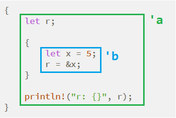

- [宏](#宏)
- [泛型](#泛型)
  - [结构体的泛型](#结构体的泛型)
  - [结构体泛型的具化](#结构体泛型的具化)
  - [枚举的泛型](#枚举的泛型)
  - [泛型参数可以有默认值](#泛型参数可以有默认值)
  - [函数中的泛型](#函数中的泛型)
  - [泛型实现重载](#泛型实现重载)
    - [重载需要判断类型](#重载需要判断类型)
  - [impl块中的泛型](#impl块中的泛型)
  - [泛型的约束](#泛型的约束)
  - [关联类型](#关联类型)
  - [trait for trait](#trait-for-trait)
  - [泛型的方法](#泛型的方法)
- [内存安全](#内存安全)
  - [生命周期](#生命周期)
    - [生命周期标记](#生命周期标记)
    - [类型的生命周期标记](#类型的生命周期标记)
    - [省略生命周期标记](#省略生命周期标记)
  - [所有权](#所有权)
    - [所有权规则](#所有权规则)
    - [数据赋值和拷贝](#数据赋值和拷贝)
    - [所有权与函数](#所有权与函数)
    - [返回值与作用域](#返回值与作用域)
    - [println不会发生所有权转移(move)](#println不会发生所有权转移move)
    - [Rc允许多个所有权拥有者](#rc允许多个所有权拥有者)
  - [引用和借用](#引用和借用)
  - [copy和clone](#copy和clone)
  - [析构函数](#析构函数)
    - [mut和&mut](#mut和mut)
    - [借用指针](#借用指针)
  - [为什么rust是内存安全的?](#为什么rust是内存安全的)
- [解引用](#解引用)
  - [自定义解引用](#自定义解引用)
  - [常见指针类型](#常见指针类型)
  - [自动解引用](#自动解引用)
    - [Rc的自动解引用](#rc的自动解引用)
  - [引用计数](#引用计数)
    - [cow](#cow)
    - [智能指针](#智能指针)
- [其他](#其他)
  - [在方法里定义struct是可以的](#在方法里定义struct是可以的)
  - [文件打开](#文件打开)
- [unsafe](#unsafe)
  - [unsafe可以操作裸指针](#unsafe可以操作裸指针)
    - [不用unsafe的swap例子](#不用unsafe的swap例子)
    - [标准库的swap](#标准库的swap)
- [Vec代码](#vec代码)

# 宏
比如打印当前文件和行号:
```rust
fn main() {
    println!("file {} line {} ", file!(), line!());
}
```
比如避免重复:
```rust
add_impl! { usize u8 u16 u32 u64 isize i8 i16 i32 i64 f32 f64 }
```

比如初始化一个动态数组:
```rust
let v = vec![1, 2, 3, 4, 5];
```

# 泛型
max函数的入参是泛型T的数组
```rust
fn max<T>(array: &[T]) -> T {
    let mut max_index = 0;
    let mut i = 1;
    while i < array.len() {
        if array[i] > array[max_index] {
            max_index = i;
        }
        i += 1;
    }
    array[max_index]
}
```

## 结构体的泛型
```rust
struct Point<T> {
    x: T,
    y: T
}
```
可以这样用:
```rust
let p1 = Point {x: 1, y: 2};
let p2 = Point {x: 1.0, y: 2.0};
```
但这样不行:
```rust
let p = Point {x: 1, y: 2.0};
```
x 与 1 绑定时就已经将 T 设定为 i32，所以不允许再出现 f64 的类型。如果我们想让 x 与 y 用不同的数据类型表示，可以使用两个泛型标识符：
```rust
struct Point<T1, T2> {
    x: T1,
    y: T2
}
```

## 结构体泛型的具化
可以让编译器自动推断, 也可以指定类型, 在左侧和右侧都可以, 但在右侧不支持`S<f64>`的语法:
```rust
fn print_type_of<T>(_: &T) {
    println!("{}", std::any::type_name::<T>())
}

struct S<T = i32> {
    data: T,
}

fn main() {
    //let four: u32 = "4".parse();
    //println!("{:?}", four);
    let x = S { data: 6 };      //编译器自动推断
    let y = S { data: 5.5 };    //编译器自动推断
    let y1: S<f64> = S { data: 5.5 };   //声明y1是S<f64>
    let y2: S::<f64> = S { data: 5.5 }; //声明y2是S::<f64>
    //let y3 = S<f64> {data: 5.5};      //NOK, 编译不过, 编译器认为<>是大于小于号. 据说是编译器图简单
    let y3 = S::<f64> { data: 5.5 };    //显式实例化y3, 在右侧只能用双冒号

    print_type_of(&x);
    print_type_of(&y);
    print_type_of(&y1);
    print_type_of(&y2);
    print_type_of(&y3);

    print_type_of(&"4".parse::<u32>());
}

//结果
playground::S
playground::S<f64>
playground::S<f64>
playground::S<f64>
playground::S<f64>
core::result::Result<u32, core::num::error::ParseIntError>
```

## 枚举的泛型
比如
```rust
enum Option<T> {
    Some(T),
    None,
}
```
这里的`<T>`实际上是声明了一个“类型”参数。在这个Option内部，`Some(T)`是一个tuple struct，包含一个元素类型为T。这个泛型参数类型T，可以在使用时指定具体类型。
使用的时候:
```rust
let x: Option<i32> = Some(42);
let y: Option<f64> = None;
```

## 泛型参数可以有默认值
比如下面的泛型T默认是i32
```rust
struct S<T=i32> {
    data: T
}
fn main() {
    let v1 = S { data: 0};
    let v2 = S::<bool> { data: false};
    println!("{} {}", v1.data, v2.data);
}
```

## 函数中的泛型
比如:
```rust
fn compare_option<T>(first: Option<T>, second: Option<T>) -> bool
{
    match(first, second) {
        (Some(..), Some(..)) => true,
        (None, None) => true,
        _ => false
    }
}
```
注:`Some(..)`中的双点表示ignore全部, `Some(_)`表示ignore第一个参数.

再举例:
```rust
fn largest<T: std::cmp::PartialOrd>(list: &[T]) -> &T {
    let mut largest = &list[0];
    for item in list.iter() {
        if item > largest {
            largest = item;
        }
    }
    largest
}
fn main() {
    let number_list = vec![34, 50, 25, 100, 65];
    let result = largest(&number_list);
    println!("The largest number is {}", result);
    let char_list = vec!['y', 'm', 'a', 'q'];
    let result = largest(&char_list);
    println!("The largest char is {}", result);
}

//结果
The largest number is 100
The largest char is y
```

## 泛型实现重载
比如str的contains方法就接受不同类型的参数:
```rust
fn main() {
    let s = "hello";
    println!("{}", s.contains('a'));
    println!("{}", s.contains("abc"));
    println!("{}", s.contains(&['H'] as &[char]));
    println!("{}", s.contains(|c : char| c.len_utf8() > 2));
}
```
这个contains的签名是:
`fn contains<'a, P: Pattern<'a>>(&'a self, pat: P) -> bool`
第二个参数pat是个泛型P, 只要满足Pattern trait, 就能被contains所用.

### 重载需要判断类型
下面的代码编译不过, 因为`let f = i.convert();`中, 编译器无法知道f的类型, 于是无法推断出应该调用哪个.
```rust
trait ConvertTo<T> {
    fn convert(&self) -> T;
}
impl ConvertTo<f32> for i32 {
    fn convert(&self) -> f32 {
        *self as f32
    }
}
impl ConvertTo<f64> for i32 {
    fn convert(&self) -> f64 {
        *self as f64
    }
}
fn main() {
    let i = 1_i32;
    let f = i.convert(); // 这里编译不过
    println!("{:?}", f);
}
```
要这样改:
```rust
let f : f32 = i.convert();
// 或者
let f = ConvertTo::<f32>::convert(&i);
```

## impl块中的泛型
可以impl 某个trait for type, 也可以为trait impl trait. 即trait for trait.
这个impl trait for trait比如:
```rust
impl<T, U> Into<U> for T
where
    U: From<T>,
{
    fn into(self) -> U {
        U::from(self)
    }
}
```

## 泛型的约束
下面的代码编译不通过:
```rust
fn max<T>(a: T, b: T) -> T {
    if a < b {
        b
    } else {
        a
    }
}
fn main() {
    let m = max(1, 2);
}
```
因为并不是所有类型都实现了比较操作, 那么泛型T没有约束的话, 是编译不过的.
加约束有两个写法:
* 冒号方式
```rust
use std::cmp::PartialOrd;
// 第一种写法：在泛型参数后面用冒号约束
fn max<T: PartialOrd>(a: T, b: T) -> T {
```

* where语法
```rust
// 第二种写法,在后面单独用 where 子句指定
fn max<T>(a: T, b: T) -> T
    where T: PartialOrd
```

where语法灵活性更好:
```rust
trait Iterator {
    type Item; // Item 是一个关联类型
               // 此处的where子句没办法在声明泛型参数的时候写出来
    fn max(self) -> Option<Self::Item>
    where
        Self: Sized,
        Self::Item: Ord,
    {
        ...
    }
    ...
}
```
它要求Self类型满足Sized约束，同时关联类型`Self::Item`要满足Ord约束，这是用冒号语法写不出来的。

比较泛型的完整代码:
```rust
use std::cmp::Ordering;
use std::cmp::PartialOrd;
fn max<T>(a: T, b: T) -> T
where
    T: PartialOrd,
{
    if a < b {
        b
    } else {
        a
    }
}
struct T {
    value: i32,
}
impl PartialOrd for T {
    fn partial_cmp(&self, other: &T) -> Option<Ordering> {
        self.value.partial_cmp(&other.value)
    }
}
impl PartialEq for T {
    fn eq(&self, other: &T) -> bool {
        self.value == other.value
    }
}
fn main() {
    let t1 = T { value: 1 };
    let t2 = T { value: 2 };
    let m = max(t1, t2);
}
```
注意由于标准库中的PartialOrd继承了PartialEq，因此单独实现PartialOrd 还是会产生编译错误，必须同时实现PartialEq才能编译通过。

## 关联类型
trait中不仅可以包含方法（包括静态方法）、常量，还可以包含“类型”。
比如迭代器中的Item就是个关联类型, 关联类型也必须指定才能实例化. 
```rust
pub trait Iterator {
    type Item;
    ...
}
```
可以看到，我们希望参数是一个泛型迭代器，可以在约束条件中写`Iterator<Item=ITEM>`。跟普通泛型参数比起来，关联类型参数必须使用名字赋值的方式。
```rust
use std::fmt::Debug;
use std::iter::Iterator;
fn use_iter<ITEM, ITER>(mut iter: ITER)
where
    ITER: Iterator<Item = ITEM>,
    ITEM: Debug,
{
    while let Some(i) = iter.next() {
        println!("{:?}", i);
    }
}
fn main() {
    let v: Vec<i32> = vec![1, 2, 3, 4, 5];
    use_iter(v.iter());
}
```
也可以将ITEM ITER简化为一个, 因为满足`ITER: Iterator`, 就可以继续声明其关联类型需要满足的约束`ITER::Item: Debug`
```rust
use std::fmt::Debug;
use std::iter::Iterator;
fn use_iter<ITER>(mut iter: ITER)
where
    ITER: Iterator,
    ITER::Item: Debug,
{
    while let Some(i) = iter.next() {
        println!("{:?}", i);
    }
}
fn main() {
    let v: Vec<i32> = vec![1, 2, 3, 4, 5];
    use_iter(v.iter());
}
```

## trait for trait
下面的例子中, 为一个泛型T, 实现了ToString trait
```rust
pub trait ToString {
    fn to_string(&self) -> String;
}

impl<T: fmt::Display + ?Sized> ToString for T {
    #[inline]
    fn to_string(&self) -> String {
        use core::fmt::Write;
        let mut buf = String::new();
        let _ = buf.write_fmt(format_args!("{}", self));
        buf.shrink_to_fit();
        buf
    }
}
```

凡是实现了这个trait的类型，都可以调用`to_string`来得到一个String 类型的结果。同时，标准库中还存在一个`std::fmt::Display trait`， 也可以做到类似的事情。而且Display是可以通过`#[derive（Display）]`由 编译器自动实现的。所以，我们可以想到，针对所有满足`T: Display`的类型，我们可以为它们提供一个统一的实现.


## 泛型的方法
```rust
struct Point<T> {
    x: T,
    y: T,
}

//注意下面的第一个<T>是类型声明, 第二个<T>是"实例化"这个Point, 虽然是用泛型来"实例化"
//所以写成这样也可以的: impl<T> Point::<T> {
impl<T> Point<T> {
    fn x(&self) -> &T {
        &self.x
    }
}

fn main() {
    let p = Point { x: 1, y: 2 };
    println!("p.x = {}", p.x());
}
```

# 内存安全
## 生命周期
```rust
fn main() {
    let v = vec![1, 2, 3, 4, 5];    // --> v 的生命周期开始
    {
        let center = v[2];          // --> center 的生命周期开始
        println!("{}", center);
    }                               // <-- center 的生命周期结束
    println!("{:?}", v);
}                                   // <-- v 的生命周期结束
```

### 生命周期标记
引用往往导致极其复杂的资源管理问题，首先认识一下垂悬引用：
```rust
{
    let r;

    {
        let x = 5;
        r = &x;
    }

    println!("r: {}", r);
}
```
这段代码是不会通过 Rust 编译器的，原因是 r 所引用的值已经在使用之前被释放。  
  
上图中的绿色范围 `'a` 表示 `r` 的生命周期，蓝色范围 `'b` 表示 `x` 的生命周期。很显然，`'b` 比 `'a` 小得多，引用必须在值的生命周期以内才有效

下面的例子中 longer函数不能编译通过
```rust
fn longer(s1: &str, s2: &str) -> &str {
    if s2.len() > s1.len() {
        s2
    } else {
        s1
    }
}
```
原因是返回值引用可能会返回过期的引用, 一般情况下, 编译器可以推导出返回值的生命周期标记, 比如函数只有唯一入参的时候; 但这里编译器不知道到底返回的引用是s1还是s2
```rust
fn main() {
    let r;
    {
        let s1 = "rust";
        let s2 = "ecmascript";
        r = longer(s1, s2);
    }
    println!("{} is longer", r);
}
```
把longer函数改成带生命周期声明的方式, 就可以成功运行了:
```rust
fn longer<'a>(s1: &'a str, s2: &'a str) -> &'a str {
    if s2.len() > s1.len() {
        s2
    } else {
        s1
    }
}

fn main() {
    let r;
    {
        let s1 = "rust";
        let s2 = "ecmascript";
        r = longer(s1, s2);
    }
    println!("{} is longer", r);
    //println!("s2: {}", s2);
}

//ecmascript is longer
```
可以看到, r实际引用的s2, s2的内容在出了scope后还能被r引用. 但直接打印s2是不行的, 会报错误:`cannot find value s2 in this scope`

生命周期注释用单引号开头，跟着一个小写字母单词：
```rust
&i32        // 常规引用
&'a i32     // 含有生命周期注释的引用
&'a mut i32 // 可变型含有生命周期注释的引用

'static     // 特殊的生命周期标记, 表示静态, 好像是全局的意思
```
下面的写法是一样的:
```rust
fn test<'a>(arg: &'a T) -> &'a i32
fn test<'a, 'b>(arg: &'a T) -> &'b i32 where 'a:'b //'a:'b表示'a比'b“活”得长
```

### 类型的生命周期标记
如果自定义类型中有成员包含生命周期参数，那么这个自定义类型 也必须有生命周期参数:
```rust
struct Test<'a> {
    member: &'a str
}
```
在使用impl的时候，也需要先声明再使用:
```rust
impl<'t> Test<'t> {
    fn test<'a>(&self, s: &'a str) {
    }
}
```
如果在泛型约束中有`where T: 'a`之类的条件，其意思是，类型T的所有生命周期参数必须大于等于`'a`。要特别说明的是，若是有`where T: 'static`的约束，意思则是，类型T里面不包含任何指向短生命周期的借用指针，意思是要么完全不包含任何借用，要么可以有指向`'static`的借用指针。

### 省略生命周期标记
```rust
fn get_str(s: &String) -> &str {
    s.as_ref()
}
```
等同于
```rust
fn get_str<'a>(s: &'a String) -> &'a str {
    s.as_ref()
}
```

## 所有权
下面的代码编译不过:
```rust
fn main() {
    let s = String::from("hello");
    let s1 = s;
    println!("{}", s);
}
```
出现错误的原因是`let s1 = s;`导致了所有权转移, 转移后`s`就不能再访问了.
每个值只有一个所有者。变量`s`的生命周期从声明开始，到move给`s1`就结束了。变量`s1`的生命周期则是从它声明开始， 到函数结束。而字符串本身，由`String::from`函数创建出来，到函数结束的时候就会销毁。中间所有权的转换，并不会将这个字符串本身重新销毁再创建。在任意时刻，这个字符串只有一个所有者，要么是`s`， 要么是`s1`。

一个变量可以把它拥有的值转移给另外一个变量，称为“所有权转移”。赋值语句、函数调用、函数返回等，都有可能导致所有权转移。

Rust中的变量绑定操作，默认是move语义，执行了新的变量绑定后，原来的变量就不能再被使用！一定要记住！

就是说rust里面的赋值语句实际上是移动语义.但是有例外:
比如下面的代码就可以编译通过:
```rust
fn main() {
    let v1 : isize = 0;
    let v2 = v1;
    println!("{}", v1);
}
```
因为在Rust中有一部分“特殊照顾”的类型，其变量绑定操作是**copy**语义。实现了copy trait的类型就会在assign的时候使用copy. 所谓的copy语义，是指在执行变量绑定操作的时候，`v2`是对`v1`所属数据的一份复制。`v1`所管理的这块内存依然存在，并未失效，而`v2`是新开辟了一块内存，它的内容是从v1管理的内存中复制而来的。和手动调用clone方法效果一样，`let v2=v1`；等效于`let v2=v1.clone()`

Rust中，在普通变量绑定、函数传参、模式匹配等场景下，凡是实 现了`std::marker::Copy trait`的类型，都会执行copy语义。基本类型，比如数字、字符、bool等，都实现了Copy trait，因此具备copy语 义。
对于自定义类型，默认是没有实现Copy trait的，但是我们可以手动添上。
要实现这个copy trait:
```rust
#[derive(Copy, Clone)]
struct Foo {
    data : i32
}
fn main() {
    let v1 = Foo { data : 0 };
    let v2 = v1;
    println!("{:?}", v1.data);
}
```
Rust中的copy语义就是**浅复制**

### 所有权规则
* Rust中的每一个值都有一个对应的变量作为它的所有者 。
* 在同一时间内，值有且仅有一个所有者。
* Rc允许多个所有权的owner
* 当所有者离开自己的作用域时，它持有的值就会被释放掉。

### 数据赋值和拷贝
Rust永远不会自动地创 建数据的深度拷贝。因此在Rust中，任何自动的赋值操作都可以被视为高效的。
```rust
let s1 = String::from("hello"); //s1在堆里
let s2 = s1;                    // s2是s1的浅拷贝, 同时s1失效
println!("{}, world!", s1);     //这里会报错, 因为所有权已经move了
//后面s2拥有对应的数据, s2退出作用域的时候, drop函数被自动调用以释放空间
```

但下面的代码也是对的, 因为i32有Copy trait
```rust
let x = 5;
let y = x;
println!("x = {}, y = {}", x, y);
```
有copy trait的类型有:
* 所有的整数类型，诸如u32
* 仅拥有两种值（true和false）的布尔类型：bool
* 字符类型：char
* 所有的浮点类型，诸如f64
* 如果元组包含的所有字段的类型都是Copy的，那么这个元组也 是Copy的。例如，(i32, i32)是Copy的，但(i32, String)则不是

### 所有权与函数
将值传递给函数在语义上类似于对变量进行赋值。将变量传递给 函数将会触发移动或复制，就像是赋值语句一样。
```rust
fn main() {
    let s = String::from("hello");  // 变量s进入作用域
    take_ownership(s);              // s的值被移动进了函数
                                    // 所以它从这里开始不再有效

    let x = 5;                      // 变量x进入作用域
    make_copy(x);                   // 变量x同样被传递进了函数
    //但由于i32是copy的, 所以我们依然可以在这之后使用x
} // x首先离开作用域, 随后是s. 但由于s的值已经发生了移动, 所以没什么特别的事情发生.

fn take_ownership(some_string: String) { // some_string进入作用域
    println!("{}", some_string);
} // some_string在这里离开作用域, 它的drop函数被自动调用, 其所占的内存也随之被释放了

fn make_copy(some_integer: i32) { // some_integer进入作用域
    println!("{}", some_integer);
} // some_integer在这里离开了作用域, 没有什么特别的事情发生
```

### 返回值与作用域
函数在返回值的过程中也会发生所有权的转移。
```rust
fn main() {
    let s1 = give_ownership();          // 返回值移动至s1中
    let s2 = String::from("hello");     // s2进入作用域
    let s3 = take_and_giveback(s2);     // s2被移动进函数, 而这个函数的返回值又被移动到了s3上
} // s3在这里离开作用域并被销毁. 由于s2已经移动了, 所以它不会在离开作用域的时候发生任何事情. s1最后离开作用域并被销毁.

// give_ownership 会将它的返回值移动至调用它的函数内
fn give_ownership() -> String {
    let some_string = String::from("hello"); // some_string进入作用域
    some_string                              // some_string做为返回值移动到调用函数
}

// take_and_giveback 将取得一个String的所有权并将它做为结果返回
fn take_and_giveback(a_string: String) -> String { // a_string进入作用域
    a_string                                       // a_string做为返回值移动至调用函数
}
```

### println不会发生所有权转移(move)
因为println是宏, 比如下面的代码:
```rust
fn main() {
    let x = 5;
    println!("{}", x);
}
```
用这个命令`rustc -Z unstable-options --pretty expanded`得到下面宏展开的代码:
```rust
#![feature(prelude_import)]
#[prelude_import]
use std::prelude::v1::*;
#[macro_use]
extern crate std;
fn main() {
    let x = 5;
    {
        ::std::io::_print(::core::fmt::Arguments::new_v1(
            &["", "\n"],
            &match (&x,) {
                (arg0,) => [::core::fmt::ArgumentV1::new(
                    arg0,
                    ::core::fmt::Display::fmt,
                )],
            },
        ));
    };
}
```
化简后是借用传参的.
```rust
use std::{fmt, io};

fn main() {
    let x = 5;
    io::_print(fmt::Arguments::new_v1(
        &["", "\n"],
        &[fmt::ArgumentV1::new(&x, fmt::Display::fmt)],
        //                     ^^
    ));
}
```

### Rc允许多个所有权拥有者
> To enable multiple ownership, Rust has a type called `Rc<T>`, which is an abbreviation for _reference counting_. The `Rc<T>` type keeps track of the number of references to a value to determine whether or not the value is still in use.

```rust
enum List {
    Cons(i32, Box<List>),
    Nil,
}

use crate::List::{Cons, Nil};
fn main() {
    let a = Rc::new(Cons(5, Rc::new(Cons(10, Rc::new(Nil)))));
    println!("count after creating a = {}", Rc::strong_count(&a));
    let b = Cons(3, Rc::clone(&a));
    println!("count after creating b = {}", Rc::strong_count(&a));
    {
        let c = Cons(4, Rc::clone(&a));
        println!("count after creating c = {}", Rc::strong_count(&a));
    }
    println!("count after c goes out of scope = {}", Rc::strong_count(&a));
}

//结果
$ cargo run
   Compiling cons-list v0.1.0 (file:///projects/cons-list)
    Finished dev [unoptimized + debuginfo] target(s) in 0.45s
     Running `target/debug/cons-list`
count after creating a = 1
count after creating b = 2
count after creating c = 3
count after c goes out of scope = 2
```
注: 用`Rc::clone(&a)`和`a.clone()`是一样的. 前者更隐含了是浅拷贝的意思, 开销非常小.

## 引用和借用
引用方式传递也叫借用, 所有权不转移.
* 在任何一段给定的时间里，你要么只能拥有一个可变引用，要么只能拥有任意数量的不可变引用。 
* 引用总是有效的。

```rust
fn dangle() -> &String{             // dangle会返回一个指向String的引用
    let s = String::from("hello");  // s被绑定到新的String上
    &s                              // 我们将指向s的引用返回给调用者
} // 变量s在这里离开作用域并随之被销毁, 它指向的内存自然也不再有效.
// 危险!
```

## copy和clone
copy是`std::marker::Copy` 带marker的都是特殊的trait, 编译器会有特殊处理  
一旦一个类型实现了Copy trait，那么它在变量绑定、函数参数传递、函数返回值传递等场景下，都是copy语义，而不再是默认的move语义。  
并不是所有的类型都可以实现Copy trait。Rust规定，对于自定义类型，只有所有成员都实现了Copy trait，这个类型才有资格实现Copy trait。  
常见的数字类型、bool类型、共享借用指针&，都是具有Copy属性的类型。而Box、Vec、可写借用指针&mut等类型都是不具备Copy属性的类型。
对于数组类型，如果它内部的元素类型是Copy，那么这个数组也是 Copy类型。 对于元组tuple类型，如果它的每一个元素都是Copy类型，那么这个 tuple也是Copy类型。

clone是`std::clone::Clone`
```rust
pub trait Clone: Sized {
    fn clone(&self) -> Self;
    fn clone_from(&mut self, source: &Self) {
        *self = source.clone()
    }
}
```
即使实现了clone trait的对象, 在赋值的时候也是move语义.
举例:
```rust
// A unit struct without resources
#[derive(Debug, Clone, Copy)]
struct Unit;

// A tuple struct with resources that implements the `Clone` trait
#[derive(Clone, Debug)]
struct Pair(Box<i32>, Box<i32>);

fn main() {
    // Instantiate `Unit`
    let unit = Unit;
    // Copy `Unit`, there are no resources to move
    let copied_unit = unit;

    // Both `Unit`s can be used independently
    println!("original: {:?}", unit);
    println!("copy: {:?}", copied_unit);

    // Instantiate `Pair`
    let pair = Pair(Box::new(1), Box::new(2));
    println!("original: {:?}", pair);

    // Move `pair` into `moved_pair`, moves resources
    let moved_pair = pair;
    println!("moved: {:?}", moved_pair);

    // Error! `pair` has lost its resources
    //println!("original: {:?}", pair);
    // TODO ^ Try uncommenting this line

    // Clone `moved_pair` into `cloned_pair` (resources are included)
    let cloned_pair = moved_pair.clone();
    // Drop the original pair using std::mem::drop
    drop(moved_pair);

    // Error! `moved_pair` has been dropped
    //println!("copy: {:?}", moved_pair);
    // TODO ^ Try uncommenting this line

    // The result from .clone() can still be used!
    println!("clone: {:?}", cloned_pair);
}

```

总结:
* Copy内部没有方法，Clone内部有两个方法。
* Copy trait是给编译器用的，告诉编译器这个类型默认采用copy语 义，而不是move语义。
* Clone trait是给程序员用的，赋值操作还是move语义. 我们必须手动调用 clone方法，它才能发挥作用。
* Copy trait不是想实现就能实现的，它对类型是有要求的，有些类型不可能impl Copy。而Clone trait则没有什么前提条件，任何类型都可以实现（unsized类型除外，因为无法使用unsized类型作为返回值）
* Copy trait规定了这个类型在执行变量绑定、函数参数传递、函数返回等场景下的操作方式。即这个类型在这种场景下，必然执行的 是“简单内存复制”操作，这是由编译器保证的，程序员无法控制。 Clone trait里面的clone方法究竟会执行什么操作，则是取决于程序员自己写的逻辑。一般情况下，clone方法应该执行一个“深复制”操作，但这不是强制性的，如果你愿意，在里面启动一个人工智能程序都是有可能的。

## 析构函数
rust没有构造函数, 但允许析构函数: 用户可以自己写满足`std::ops::Drop`的trait
```rust
trait Drop {
    fn drop(&mut self);
}
```
这个Drop会在变量声明周期结束的时候被调用. 自己调用Drop是非法的, 但可以间接调用标准库的drop函数:
```rust
use std::mem::drop;
fn main() {
    let mut v = vec![1, 2, 3];  // <--- v的生命周期开始
    drop(v);                    // ---> v的生命周期结束
    v.push(4);                  // 错误的调用
}
```

其实, 标准库的drop就是入参是值传递的空函数:
```rust
#[inline]
pub fn drop<T>(_x: T) { }
```
这里入参是值传递非常重要, 将对象的所有权移入函数中，什么都不用做，编译器就会自动释放掉这个对象了。
因为这个drop函数的关键在于使用move语义把参数传进来，使得变量的所有权从调用方移动到drop函数体内，参数类型一定要是T，而不是&T或者其他引用类型。函数体本身其实根本不重要，重要的是把变量的所有权move进入这个函数体中，函数调用结束的时候该变量的生命周期结束，变量的析构函数会自动调用，管理的内存空间也会自然释放。这个过程完全符合前面讲的生命周期、move语义，无须编译器做特殊处理。事实上，我们完全可以自己写一个类似的函数来实现同样的效果，只要保证参数传递是move语义即可。

因此, 有`copy()`语义的变量, 对其`drop()`是没有作用的, 因为这些变量是复制不是move.

### mut和&mut
mut可以出现在绑定(=)的左右两侧
```rust
fn main() {
    let mut var = 0_i32;
    {
        let p1 = &mut var;      // p1 指针本身不能被重新绑定,我们可以通过p1改变变量var的值
        *p1 = 1;
    }
    {
        let temp = 2_i32;
        let mut p2 = &var;      // 我们不能通过p2改变变量var的值,但p2指针本身指向的位置可以被改变
        p2 = &temp;
    }
    {
        let mut temp = 3_i32;
        let mut p3 = &mut var;  // 我们既可以通过p3改变变量var的值,而且p3指针本身指向的位置也可以改变
        *p3 = 3;
        p3 = &mut temp;
    }
}
```

### 借用指针
* 借用指针不能比它指向的变量存在的时间更长
* &mut型借用只能指向本身具有mut修饰的变量，对于只读变量，不可以有&mut型借用
* &mut型借用指针存在的时候，被借用的变量本身会处于“冻结”状态
* 如果只有&型借用指针，那么能同时存在多个；如果存在&mut型借用指针，那么只能存在一个；如果同时有其他的&或者&mut型借用指针存在，那么会出现编译错误

```rust
// 这里的参数采用的“引用传递”,意味着实参本身并未丢失对内存的管理权
fn borrow_semantics(v: &Vec<i32>) {
    // 打印参数占用空间的大小,在64位系统上,结果为8,表明该指针与普通裸指针的内部表示方法相同
    println!("size of param: {}", std::mem::size_of::<&Vec<i32>>());
    for item in v {
        print!("{} ", item);
    }
    println!("");
}
// 这里的参数采用的“值传递”,而Vec没有实现Copy trait,意味着它将执行move语义
fn move_semantics(v: Vec<i32>) {
    // 打印参数占用空间的大小,结果为24,表明实参中栈上分配的内存空间复制到了函数的形参中
    println!("size of param: {}", std::mem::size_of::<Vec<i32>>());
    for item in v {
        print!("{} ", item);
    }
    println!("");
}
fn main() {
    let array = vec![1, 2, 3];
    // 需要注意的是,如果使用引用传递,不仅在函数声明的地方需要使用&标记
    // 函数调用的地方同样需要使用&标记,否则会出现语法错误
    // 这样设计主要是为了显眼,不用去阅读该函数的签名就知道这个函数调用的时候发生了什么
    // 而小数点方式的成员函数调用,对于self参数,会“自动转换”,不必显式借用,这里有个区别
    borrow_semantics(&array);
    // 在使用引用传递给上面的函数后,array本身依然有效,我们还能在下面的函数中使用
    move_semantics(array);
    // 在使用move语义传递后,array在这个函数调用后,它的生命周期已经完结
}
```

任何借用指针的存在，都会导致原来的变量被“冻结”（Frozen）:
```rust
fn main() {
    let mut x = 1_i32;
    let p = &mut x;
    x = 2;              // 因为p的存在，此时对x的改变被认为是非法的
    println!("value of pointed : {}", p);
}
```

## 为什么rust是内存安全的?
比如c语言在迭代vector的时候, 改变vector自身, 编译的时候没问题, 但运行时会崩溃;
而rust在编译时就会报错, 因为rust的原则是: **共享不可变，可变不共享**

首先我们介绍一下这两个概念Alias和Mutation。 
1. Alias的意思是“别名”。如果一个变量可以通过多种Path来访问，那它们就可以互相看作alias。Alias意味着“共享”，我们可以通过多个入口访问同一块内存。 
2. Mutation的意思是“改变”。如果我们通过某个变量修改了一块内存，就是发生了mutation。Mutation意味着拥有“修改”权限，我们可以写入数据。 

Rust保证内存安全的一个重要原则就是，如果能保证alias和 mutation不同时出现，那么代码就一定是安全的.

为什么在Rust中永远不会出现迭代器失效这样的错误？因为通 过“mutation+alias”规则，就可以完全杜绝这样的现象，这个规则是Rust 内存安全的根，是解决内存安全问题的灵魂。

Rust防范“内存不安全”代码的原则极其清晰明了。如果你对同一块内存存在多个引用，就不要试图对这块内存做修改；如果你需要对一块内存做修改，就不要同时保留多个引用。只要保证了这个原则，我们就可以保证内存安全。它在实践中发挥了强大的作用，可以帮助我们尽早发现问题。这个原则是Rust的立身之本、生命之基、活力之源。

注: `std::cell::Cell`可以"突破"这个“唯一修改权”的原则. 但实际上, Cell被小心的设计成一个包裹, 支持多个共享引用, 可以内部可变.

# 解引用
和c一样, 用`*`解引用

## 自定义解引用
实现`std::ops::Deref`或者`std::ops::DerefMut`这两个trait就能自定义解引用
```rust
pub trait Deref {
    type Target: ?Sized;
    fn deref(&self) -> &Self::Target;
}
pub trait DerefMut: Deref {
    fn deref_mut(&mut self) -> &mut Self::Target;
}
```
`*expr`的类型是Target，而 `deref()`方法返回的类型却是`&Target`

## 常见指针类型
* `Box<T>`是“指针”，指向一个在堆上分配的对象
* `Vec<T>`是“指针”，指向一组同类型的顺序排列的堆上分配的对象，且携带有当前缓存空间总大小和元素个数大小的元数据
* String是“指针”，指向的是一个堆上分配的字节数组，其中保存的内容是合法的utf8字符序列。且携带有当前缓存空间总大小和字符串实际长度的元数据

以上几个类型都对所指向的内容拥有所有权，管理着它们所指向的内存空间的分配和释放

* `Rc<T>`和`Arc<T>`也是某种形式的、携带了额外元数据的“指针”，它们提供的是一种“共享”的所有权，当所有的引用计数指针都销毁之后，它们所指向的内存空间才会被释放

## 自动解引用
len的函数签名是:`fn len(&self) -> usize`
按理说只有形式是`&str`的参数才行, 但下面的代码都正确:
```rust
fn main() {
    let s = "hello";
    println!("length: {}", str::len(&s));
    println!("length: {}", str::len(s));
    println!("length: {}", s.len());
    println!("length: {}", (&s).len());
    println!("length: {}", (&&&&&&&&&&&&&s).len());
}
```
这是因为Rust编译器帮我们做了隐式的deref调用，当它找不到这个成员方法的时候，会自动尝试使用deref方法后再找该方法，一 直循环下去。所以`&&&&&&&&&&str`会被正确解引用
自动deref的规则是，如果类型T可以解引用为U，即`T：Deref<U>`， 则`&T`可以转为`&U`

### Rc的自动解引用
Rc是带引用计数的智能指针, 它实现了Deref trait
```rust
impl<T: ?Sized> Deref for Rc<T> {
    type Target = T;
    #[inline(always)]
    fn deref(&self) -> &T {
        &self.inner().value
    }
}
```
它的Target类型是它的泛型参数T。这么设计有什么好处呢？我们 看下面的用法：
```rust
use std::rc::Rc;
fn main() {
    let s = Rc::new(String::from("hello"));
    println!("{:?}", s.bytes());
}
```
我们创建了一个指向String类型的Rc指针，并调用了`bytes()`方 法。这里是不是有点奇怪？  
这里的机制是这样的：Rc类型本身并没有`bytes()`方法，所以编译器会尝试自动deref，试试`s.deref().bytes()`。 
String类型其实也没有`bytes()`方法，但是String可以继续deref，于是再试试`s.deref().deref().bytes()`。 这次在str类型中找到了`bytes()`方法，于是编译通过。 
我们实际上通过Rc类型的变量调用了str类型的方法，让这个智能指针透明。这就是自动Deref的意义。

这就是为什么String需要实现Deref trait，是为了让&String类型的变量可以在必要的时候自动转换为&str类型。所以String类型的变量可以直接调用str类型的方法。比如：
```rust
let s = String::from("hello");
let len = s.bytes();
```
虽然s的类型是String，但它在调用`bytes()`方法的时候，编译器会自动查找并转换为`s.deref().bytes()`调用。所以String类型的变量就可以直接调用str类型的方法了。
同理：`Vec<T>`类型也实现了Deref trait，目标类型是`[T]`，`&Vec<T>`类型的变量就可以在必要的时候自动转换为`&[T]`数组切片类型；`Rc<T>`类型也实现了Deref trait，目标类型是T，`Rc<T>`类型的变量就可以直接调用T类型的方法。

## 引用计数
普通变量绑定自身消亡的时候，这块内存就会被释放。引用计数智能指针给我们提供了另外一种选择：一块不可变内存可以有多个所有者，当所有的所有者消亡后，这块内存才会被释放。
* `std：：rc：：Rc<T>`: Rc是普通的引用计数, 只能单线程使用
* `std：：sync：：Arc<T>`: Arc是atomic Rc, 多线程安全

一般Rust不允许多owner, 但Rc可以突破这个限制:
```rust
use std::rc::Rc;
struct SharedValue {
    value: i32,
}
fn main() {
    let shared_value: Rc<SharedValue> = Rc::new(SharedValue { value: 42 });
    let owner1 = shared_value.clone();
    let owner2 = shared_value.clone();
    //shared_value.value = 88; 这句编译不过, 因为Rc就被设计成引用计数, 而不是共享变量. 用Cell来解决变量共享问题.
    println!("value : {} {}", owner1.value, owner2.value);
    println!("address : {:p} {:p}", &owner1.value, &owner2.value);
}
```
运行结果:
```
$ ./test
value : 42 42
address : 0x13958abdf20 0x13958abdf20
```
这说明，owner1 owner2里面包含的数据不仅值是相同的，而且地址也是相同的。这正是Rc的意义所在。
如果要创建指向同样 内存区域的多个Rc指针，需要显式调用clone函数。请注意，Rc指针是 没有实现Copy trait的。如果使用直接赋值方式，会执行move语义，导致前一个指针失效，后一个指针开始起作用，而且引用计数值不变。如果需要创造新的Rc指针，必须手工调用`clone()`函数，此时引用计数值才会加1。当某个Rc指针失效，会导致引用计数值减1。当引用计数值减到0的时候，共享内存空间才会被释放。

### cow
写时拷贝. 它对指向的数据可能“拥有所有权”，或者 可能“不拥有所有权”。
当它只需要对所指向的数据进行只读访问的时候，它就只是一个借用指针；当它需要写数据功能时，它会先分配内存，执行复制操作，再对自己拥有所有权的内存进行写入操作。
在标准库里:
```rust
pub enum Cow<'a, B: ?Sized + 'a> where B: ToOwned {
    /// Borrowed data.
    Borrowed(&'a B),
    /// Owned data.
    Owned(<B as ToOwned>::Owned)
}
```

它可以是Borrowed或者Owned两种状态。如果是Borrowed状态，可以通过调用`to_mut()`函数获取所有权。在这个过程中，它实际上会分配一块新的内存，并将原来Borrowed状态的数据通过调用`to_owned()`方法 构造出一个新的拥有所有权的对象，然后对这块拥有所有权的内存执行操作。

比如下面的`remove_spaces()`函数, 如果入参没有空格, 就只返回借用; 如果有空格, 就返回一个新申请的有所有权的对象buf.
```rust
use std::borrow::Cow;
fn remove_spaces<'a>(input: &'a str) -> Cow<'a, str> {
    if input.contains(' ') {
        let mut buf = String::with_capacity(input.len());
        for c in input.chars() {
            if c != ' ' {
                buf.push(c);
            }
        }
        return Cow::Owned(buf);
    }
    return Cow::Borrowed(input);
}
fn main() {
    let s1 = "no_spaces_in_string";
    let result1 = remove_spaces(s1);
    let s2 = "spaces in string";
    let result2 = remove_spaces(s2);
    println!("{}\n{}", result1, result2);
}
```

为什么这里要用Cow呢?
因为这个函数的返回值类型用&str类 型和String类型都不大合适。 
* 如果返回类型指定为&str类型，那么需要新分配内存的时候，会出现生命周期编译错误。因为函数内部新分配的字符串的引用不能在函数调用结束后继续存在。 
* 如果返回类型指定为String类型，那么对于那种不需要对输入参数做修改的情况，有一些性能损失。因为输入参数&str类型转为String类 型需要分配新的内存空间并执行复制，性能开销较大。这种时候使用Cow类型就是不二之选。既能满足编译器的生命周期要求，也避免了无谓的数据复制。Cow类型，就是优秀的“零性能损失抽象”的设计范例。

Cow类型还实现了Deref trait，所以当我们需要调用类型T的成员函数的时候，可以直接调用，完全无须考虑后面具体是“借用指针”还是“拥有所有权的指针”。所以我们也可以把它当成是一种“智能指针”。

### 智能指针
上面提到的Rc和Cow都是智能指针.  
Rust中允许一部分运算符可以由用户自定义行为，即“操作符重载”。其中“解引用”是一个非常重要的操作符，它允许重载。
而需要提醒大家注意的是，“取引用”操作符，如&、&mut，是不允许重载的。因此，“取引用”和“解引用”并非对称互补关系。`*&T`的类型 一定是T，而`&*T`的类型未必就是T。 
更重要的是，读者需要理解，在某些情况下，编译器帮我们插入了自动deref的调用，简化代码。 
在Deref的基础上，我们可以封装出一种自定义类型，它可以直接调用其内部的其他类型的成员方法，我们可以把这种类型称为智能指针类型

# 其他
## 在方法里定义struct是可以的
```rust
impl<T: Clone> Clone for Box<[T]> {
    fn clone(&self) -> Self {
        let mut new = BoxBuilder {
            data: RawVec::with_capacity(self.len()),
            len: 0,
        };
        let mut target = new.data.ptr();
        for item in self.iter() {
            unsafe {
                ptr::write(target, item.clone());
                target = target.offset(1);
            };
            new.len += 1;
        }
        return unsafe { new.into_box() };
        // Helper type for responding to panics correctly.
        struct BoxBuilder<T> {
            data: RawVec<T>,
            len: usize,
        }
        impl<T> BoxBuilder<T> {
            unsafe fn into_box(self) -> Box<[T]> {
                let raw = ptr::read(&self.data);
                mem::forget(self);
                raw.into_box()
            }
        }
        impl<T> Drop for BoxBuilder<T> {
            fn drop(&mut self) {
                let mut data = self.data.ptr();
                let max = unsafe { data.offset(self.len as isize) };
                while data != max {
                    unsafe {
                        ptr::read(data);
                        data = data.offset(1);
                    }
                }
            }
        }
    }
}
```
为什么明明可以直接在一个方法里写完的代码，还要引入一个新的类型呢？原因就在于panic safety问题。注意我们这里调用了T类型的 clone方法。T是一个泛型参数，谁能保证clone方法不会产生panic？没有谁能保证，我们只能尽可能让clone发生panic的时候，RawVec的状态不会乱掉。 所以，标准库的实现利用了RAII机制，即便在clone的时候发生了 panic，这个BoxBuilder类型的局部变量的析构函数依然会正确执行，并在析构函数中做好清理工作。上面这段代码之所以搞这么复杂，就是为了保证在发生panic的时候逻辑依然是正确的。大家可以去翻一下标准库中的代码，有大量类似的模式存在，都是因为需要考虑panic safety问题。Rust的标准库在编写的时候有这样一个目标：即便发生了panic，也不会产生“内存不安全”和“线程不安全”的情况。

## 文件打开
```rust
use std::fs::File;
use std::io::Read;
fn main() {
    let f = File::open("/target/file/path");
    if f.is_err() {
        println!("file is not exist.");
        return;
    }
    let mut f = f.unwrap();
    let mut content = String::new();
    let result = f.read_to_string(&mut content);
    if result.is_err() {
        println!("read file error.");
        return;
    }
    println!("{}", result.unwrap());
}
```

# unsafe
unsafe可以修饰fn, 代码块, trait, impl等
unsafe有传递性, 比如使用unsafe的fn的代码块也必须用unsafe来修饰.

## unsafe可以操作裸指针
```rust
fn main() {
    let x = 1_i32;
    let mut y: u32 = 1;
    let raw_mut = &mut y as *mut u32 as *mut i32 as *mut i64; // 这是安全的
    unsafe {
        *raw_mut = -1; // 这是不安全的,必须在 unsafe 块中才能通过编译
    }
    println!("{:X} {:X}", x, y);
}
```
上面的例子中:
* 首先raw_mut必须经过三个as as as的转换才能从u32的指针转为i64的指针
* 对raw_mut的直接修改是unsafe的
* 修改了raw_mut, 也就是y, 但也"一起"修改了x, 因为x和y两个变量地址是挨着的.

又比如下面的例子:
```rust
fn raw_to_ref<'a>(p: *const i32) -> &'a i32 {
    unsafe { &*p }
}
fn main() {
    let p: &i32 = raw_to_ref(std::ptr::null::<i32>());
    println!("{}", p);
}
```
这个例子会运行错误, 因为传入了一个空指针, 而在unsafe里面对空指针解引用出现错误.

* 不加unsafe是不能对裸指针解引用的
* 在unsafe里, 用户要自己避免空指针问题, 编译器是不管的

要修复这个错误, 改成这样就好了:
```rust
fn raw_to_ref<'a>(p: *const i32) -> Option<&'a i32> {
    if p.is_null() {
        None
    } else {
        unsafe { Some(&*p) }
    }
}
fn main() {
    let p: Option<&i32> = raw_to_ref(std::ptr::null::<i32>());
    println!("{:?}", p);
}
```

### 不用unsafe的swap例子
下面的例子是我自己写的, 能正常工作, 没用unsafe. 
```rust
fn swap(x: &mut i32, y: &mut i32) {
    let z = *x;
    *x = *y;
    *y = z;
}

fn main() {
    let mut a = 5;
    let mut b = 8;
    swap(&mut a, &mut b);
    println!("a: {}, b: {}", a, b)
}
```

但如果用泛型, 就会出现编译错误:
```rust
fn swap<T>(x: &mut T, y: &mut T) {
    let z = *x;
    *x = *y;
    *y = z;
}

fn main() {
    let mut a = 5;
    let mut b = 8;
    swap(&mut a, &mut b);
    println!("a: {}, b: {}", a, b)
}
```
错误是:`cannot move out of *x which is behind a mutable reference`
编译器还提示`move occurs because *x has type T, which does not implement the Copy trait`
意思是assign的时候, 默认执行的是move语义, 但这里因为x只是借用, 但没有权限解引用.
但如果实现了Copy trait, 也可以调用Copy

那么添加T的约束为Copy, 也就好了:
```rust
fn swap<T: Copy>(x: &mut T, y: &mut T) {
    let z = *x; //这里用了copy语义
    *x = *y;
    *y = z;
}

fn main() {
    let mut a = 5;
    let mut b = 8;
    swap(&mut a, &mut b);
    println!("a: {}, b: {}", a, b)
}
```

### 标准库的swap
标准的swap并没有要求copy, 而是直接操作指针
```rust
fn swap<T>(x: &mut T, y: &mut T) {
    unsafe {
        let mut t: T = mem::uninitialized();
        ptr::copy_nonoverlapping(&*x, &mut t, 1);
        ptr::copy_nonoverlapping(&*y, x, 1);
        ptr::copy_nonoverlapping(&t, y, 1);
        mem::forget(t);
    }
}
```
首先，我们依然需要一个作为中转的局部变量。这个局部变量该怎么初始化呢？其实我们不希望它执行初始化，因为我们只需要这部分内存空间而已，它里面的内容马上就会被覆盖掉，做初始化是浪费性能。况且，我们也不知道用什么通用的办法初始化一个泛型类型，它连Default约束都未必满足。所以我们要用`mem::uninitialized`函数。接下来，我们可以直接通过内存复制来交换两个变量。因为在Rust中，所有的类型、所有的move操作，都是简单的内存复制，不涉及其他的语义。Rust语言已经假定任何一个类型的实例，随时都可以被move到另外的地方，不会产生任何问题。所以，我们可以直接使用`ptr::copy`系列函数来完成。再加上在safe代码中，&mut型指针具有排他性，
我们可以确信，x和y一定指向不同的变量。所以可以使用`ptr::copy_nonoverlapping`函数，比`ptr::copy`要快一点。

最后，一定要记得，要阻止临时的局部变量t执行析构函数。因为t本身并未被合理地初始化，它内部的值是直接通过内存复制获得的。在复制完成后，它内部的指针（如果有的话）会和y指向的变量是相同的。如果我们不阻止它，那么在函数结束的时候它的析构函数就会被自动调用，这样y指向的变量就变成非法的了。

这样我们才能正确地完成这个功能。虽然源代码看起来比较长，但是实际生成的代码并不多，就是3次内存块的复制。

# Vec代码
下面的代码中, 用Vec的new创建出来的变量v1, 开始的capacity是0, length也是0, 增长的倍数也是2倍速.
```rust
fn main() {
    let mut v1 = Vec::<i32>::new();
    println!("Start: length {} capacity {}", v1.len(), v1.capacity());
    for i in 1..10 {
        v1.push(i);
        println!(
            "[Pushed {}] length {} capacity {}",
            i,
            v1.len(),
            v1.capacity()
        );
    }
    let mut v2 = Vec::<i32>::with_capacity(1);
    println!("Start: length {} capacity {}", v2.len(), v2.capacity());
    v2.reserve(10);
    for i in 1..10 {
        v2.push(i);
        println!(
            "[Pushed {}] length {} capacity {}",
            i,
            v2.len(),
            v2.capacity()
        );
    }
}

//结果
Start: length 0 capacity 0
[Pushed 1] length 1 capacity 4
[Pushed 2] length 2 capacity 4
[Pushed 3] length 3 capacity 4
[Pushed 4] length 4 capacity 4
[Pushed 5] length 5 capacity 8
[Pushed 6] length 6 capacity 8
[Pushed 7] length 7 capacity 8
[Pushed 8] length 8 capacity 8
[Pushed 9] length 9 capacity 16
Start: length 0 capacity 1
[Pushed 1] length 1 capacity 10
[Pushed 2] length 2 capacity 10
[Pushed 3] length 3 capacity 10
[Pushed 4] length 4 capacity 10
[Pushed 5] length 5 capacity 10
[Pushed 6] length 6 capacity 10
[Pushed 7] length 7 capacity 10
[Pushed 8] length 8 capacity 10
[Pushed 9] length 9 capacity 10
```
用`with_capacity()`创建的容量一开始就分配了.
Vec的特点是空间会自动扩展, 并且当变量生命周 期结束的时候，它会自动释放它管理的内存空间
为什么Vec能够自动回收空间呢? 因为Vec实现了Drop:
```rust
unsafe impl<#[may_dangle] T> Drop for Vec<T> {
    fn drop(&mut self) {
        unsafe {
            // use drop for [T]
            ptr::drop_in_place(&mut self[..]);
        }
        // RawVec handles deallocation
    }
}
```
