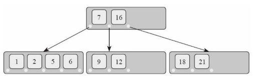

- [静态分派和动态分派](#静态分派和动态分派)
  - [trait不能用作入参或者返回值](#trait不能用作入参或者返回值)
  - [impl Trait做为入参](#impl-trait做为入参)
    - [impl trait只是语法糖](#impl-trait只是语法糖)
  - [trait object](#trait-object)
  - [impl trait](#impl-trait)
- [闭包](#闭包)
  - [普通的函数不能捕获局部变量](#普通的函数不能捕获局部变量)
  - [闭包和函数](#闭包和函数)
  - [闭包如何捕获变量?](#闭包如何捕获变量)
  - [move关键字](#move关键字)
  - [闭包和泛型](#闭包和泛型)
  - [可以用Box封装闭包](#可以用box封装闭包)
- [容器](#容器)
  - [Vec](#vec)
  - [VecDeque](#vecdeque)
  - [HashMap](#hashmap)
  - [BTreeMap](#btreemap)
- [迭代器](#迭代器)
  - [从容器创造迭代器](#从容器创造迭代器)
  - [迭代器组合](#迭代器组合)
  - [for in](#for-in)
- [生成器](#生成器)
- [协程](#协程)
- [标准库](#标准库)
  - [类型转换](#类型转换)
    - [AsRef/AsMut](#asrefasmut)
    - [borrow](#borrow)
    - [From/Into](#frominto)
    - [ToOwned](#toowned)
    - [ToString/FromStr](#tostringfromstr)
  - [运算符重载](#运算符重载)
    - [complex加法重载](#complex加法重载)
  - [IO](#io)
    - [OsString和OsStr](#osstring和osstr)
    - [文件和路径](#文件和路径)
    - [标准输入输出](#标准输入输出)
    - [进程启动参数](#进程启动参数)
    - [Any和反射](#any和反射)
- [线程安全](#线程安全)
  - [创建线程](#创建线程)
  - [更多线程参数](#更多线程参数)
  - [rust怎么保证线程安全](#rust怎么保证线程安全)
  - [Send \& Sync](#send--sync)
  - [什么是Send类型](#什么是send类型)
  - [什么是Sync类型](#什么是sync类型)
  - [保证线程安全的类型](#保证线程安全的类型)
    - [Arc](#arc)
    - [Mutex](#mutex)
    - [RwLock](#rwlock)
    - [Atomic](#atomic)
    - [Barrier](#barrier)
    - [Condvar](#condvar)
    - [全局变量](#全局变量)
    - [线程局部存储](#线程局部存储)
  - [异步管道](#异步管道)
  - [同步管道 相当于go channel](#同步管道-相当于go-channel)
  - [第三方线程库](#第三方线程库)

# 静态分派和动态分派
## trait不能用作入参或者返回值
比如下面的Bird这个trait, 有两个实现, Duck和Swan
```rust
trait Bird {
    fn fly(&self);
}
struct Duck;
struct Swan;
impl Bird for Duck {
    fn fly(&self) {
        println!("duck duck");
    }
}
impl Bird for Swan {
    fn fly(&self) {
        println!("swan swan");
    }
}
```
但Bird不能直接用作入参和出参, 因为trait是一种DST类型，它的大小在编译阶段是不固定的. 这点和go的interface是不同的.
```rust
// 以下代码不能编译
fn test(arg: Bird) {}
fn test() -> Bird {}
```
有两个办法:

* 用泛型传参, 即静态分派
```rust
fn test<T: Bird>(arg: T) {
    arg.fly();
}
```
* 用trait object, 即自己给trait穿个Box的马甲, 做到动态分派
```rust
// 根据不同需求,可以用不同的指针类型,如 Box/&/&mut 等
fn test(arg: Box<dyn Bird>) {
    arg.fly();
}
```

* 似乎还有个办法是加dyn关键词, dyn是比较新的关键词
```rust
trait Bird {
    fn fly(&self);
}
struct Duck;
struct Swan;
impl Bird for Duck {
    fn fly(&self) {
        println!("duck duck");
    }
}
impl Bird for Swan {
    fn fly(&self) {
        println!("swan swan");
    }
}
fn call_fly(f: &dyn Bird) {
    f.fly()
}
fn main() {
    let duck = Duck;
    call_fly(&duck);
    call_fly(&Swan{});
}
//输出
duck duck
swan swan
```

## impl Trait做为入参
比如下面的函数
```rust
fn parse_csv_document<R: std::io::BufRead>(src: R) -> std::io::Result<Vec<Vec<String>>> {
    src.lines()
        .map(|line| {
            // For each line in the source
            line.map(|line| {
                // If the line was read successfully, process it, if not, return the error
                line.split(',') // Split the line separated by commas
                    .map(|entry| String::from(entry.trim())) // Remove leading and trailing whitespace
                    .collect() // Collect all strings in a row into a Vec<String>
            })
        })
        .collect() // Collect all lines into a Vec<Vec<String>>
}
```
可以由泛型约束`<R: std::io::BufRead>`改成impl trait, 即声明src必须实现`std::io::BufRead`这个trait. 这点和golang传入interface有点像.
```rust
fn parse_csv_document(src: impl std::io::BufRead) -> std::io::Result<Vec<Vec<String>>> {
    src.lines()
        .map(|line| {
            // For each line in the source
            line.map(|line| {
                // If the line was read successfully, process it, if not, return the error
                line.split(',') // Split the line separated by commas
                    .map(|entry| String::from(entry.trim())) // Remove leading and trailing whitespace
                    .collect() // Collect all strings in a row into a Vec<String>
            })
        })
        .collect() // Collect all lines into a Vec<Vec<String>>
}
```

### impl trait只是语法糖
比如下面的代码用了impl trait形式的入参:
```rust
pub fn notify(item: &impl Summary) {
    println!("Breaking news! {}", item.summarize());
}
```
它实际上是下面显式声明泛型约束的方法一样:
```rust
pub fn notify<T: Summary>(item: &T) {
    println!("Breaking news! {}", item.summarize());
}
```

## trait object
指向trait的指针就是trait object。假如Bird是一个trait的名称，那么`dyn Bird`就是一个DST动态大小类型。`&dyn Bird`、`&mut dyn Bird`、`Box<dyn Bird>`、`*const dyn Bird`、`*mut dyn Bird`以及`Rc<dyn Bird>`等等都是Trait Object。

> A trait object points to both an instance of a type implementing our specified trait as well as a table used to look up trait methods on that type at runtime. We create a trait object by specifying some sort of pointer, such as a `&` reference or a `Box<T>` smart pointer, then the `dyn` keyword, and then specifying the relevant trait.


## impl trait
还有个impl trait语法, 比如:
```rust
fn foo(n: u32) -> impl Iterator<Item=u32> {
    (0..n).map(|x| x * 100)
}
```
返回一个函数也可以用类似的语法:
```rust
fn multiply(m: i32) -> impl Fn(i32) -> i32 {
    move |x| x * m
}
fn main() {
    let f = multiply(5);
    println!("{}", f(2));
}
//结果
10
```

# 闭包
闭包(closure)是一种匿名函数，具有“捕获”外部变量的能力。闭包有时候也被称作lambda表达式。它有两个特点: 
1. 可以像函数一 样被调用；
2. 可以捕获当前环境中的变量。

语法如下:
```rust
fn main() {
    let add = |a: i32, b: i32| -> i32 {
        return a + b;
    };
    let x = add(1, 2);
    println!("result is {}", x);
}
```
以上闭包有两个参数，以两个`|`包围。执行语句包含在`{}`中。闭包的参数和返回值类型的指定与普通函数的语法相同。闭包的参 数和返回值类型都是可以省略的，因此以上闭包可省略为:
```rust
let add = |a, b| a + b; //省略了类型, 括号, 和return
```

## 普通的函数不能捕获局部变量
rust支持函数中定义函数, 但不支持内部函数引用外部函数的局部变量.
比如下面的代码编译不过
```rust
fn main() {
    let x = 1_i32;
    fn inner_add() -> i32 {
        x + 1
    }
    let x2 = inner_add();
    println!("result is {}", x2);
}
```
要改为闭包:
```rust
fn main() {
    let x = 1_i32;
    let inner_add = || x + 1;
    let x2 = inner_add();
    println!("result is {}", x2);
}
```

## 闭包和函数
闭包的实现:
```rust
fn main() {
    let x = 1_i32;
    let add_x = | a | x + a;
    let result = add_x( 5 );
    println!("result is {}", result);
}
```
如果改为非闭包的普通实现:
```rust
struct Closure {
    inner1: i32,
}
impl Closure {
    fn call(&self, a: i32) -> i32 {
        self.inner1 + a
    }
}
fn main() {
    let x = 1_i32;
    let add_x = Closure { inner1: x };
    let result = add_x.call(5);
    println!("result is {}", result);
}
```
可以看到闭包的方式更简洁.

## 闭包如何捕获变量?
Rust主要是通过分析外部变量在闭包中的使用方式，通过一系列的规则自动推导出来的。主要规则如下: 
1. 如果一个外部变量在闭包中，只通过借用指针`&`使用，那么这个变量就可通过引用`&`的方式捕获；
2. 如果一个外部变量在闭包中，通过`&mut`指针使用过，那么这个变量就需要使用`&mut`的方式捕获；
3. 如果一个外部变量在闭包中，通过所有权转移的方式使用过，那么这个变量就需要使用“by value”的方式捕获。

简单点总结规则是，在保证能编译通过的情况下，编译器会自动选择一种对外部影响最小的类型存储。对于被捕获的类型为T的外部变量，在匿名结构体中的存储方式选择为: 尽可能先选择`&T`类型，其次选择`&mut T`类型，最后选择`T`类型。

## move关键字
闭包的捕获默认是引用捕获, 即捕获`&T`. 下面的例子编译不通过
```rust
fn make_adder(x: i32) -> Box<dyn Fn(i32) -> i32> {
    Box::new(|y| x + y)
}
fn main() {
    let f = make_adder(3);
    println!("{}", f(1));   // 4
    println!("{}", f(10));  // 13
}
```
函数`make_adder`中有一个局部变量`x`，按照前面所述的规则，它被闭包所捕获，而且可以使用引用`&`的方式完成闭包内部的逻辑，因此它是被引用捕获的。而闭包则作为函数返回值被传递出去了。于是，闭包被调用的时候，它内部的引用所指向的内容已经被释放了。

这个时候就要用move关键字了, 表示后面语句块的所有变量都强制使用"值传递":
```rust
fn make_adder(x: i32) -> Box<dyn Fn(i32) -> i32> {
    Box::new(move |y| x + y)    // 使用move来强制使用值传递
}
```

## 闭包和泛型
下面的例子是传入一个闭包函数到泛型函数:
```rust
fn call_with_closure<F>(some_closure: F) -> i32
where
    F: Fn(i32) -> i32,
{
    some_closure(1)
}
fn main() {
    let answer = call_with_closure(|x| x + 2);
    println!("{}", answer);
}
```
每个闭包，编译器都会为它生成一个匿名结构体类型；即使两个闭包的参数和返回值一致，它们也是完全不同的两个类 型，只是都实现了同一个trait而已。

## 可以用Box封装闭包
```rust
fn test() -> Box<dyn Fn(i32) -> i32> {
    let c = |i: i32| i * 2;
    Box::new(c)
}
fn main() {
    let closure = test();
    let r = closure(2);
    println!("{}", r);
}
```

# 容器
|容器|描述
|--|--
|Vec|可变长数组, 连续存储
|VecDeque|双向队列, 适用于从头部和尾部插入删除数据
|LinkedList|双向链表, 非连续存储
|HashMap|基于Hash算法存储key value
|HashSet|只有key没有value的HashMap
|BTreeMap|基于B树存储key value
|BTreeSet|只有key没有value的BtreeMap
|BinaryHeap|基于二叉堆的优先级队列

## Vec
它就是一个可以自动扩展容量的动态数组。它重载了Index运算符，可以通过中括号取下标的形式访问内部成员。它还重载了Deref/DerefMut运算符，因此可 以自动被解引用为数组切片。
用法示例:
```rust
fn main() {
    // 常见的几种构造Vec的方式
    // 1. new() 方法与 default() 方法一样,构造一个空的Vec
    let v1 = Vec::<i32>::new();
    // 2. with_capacity() 方法可以预先分配一个较大空间,避免插入数据的时候动态扩容
    let v2: Vec<String> = Vec::with_capacity(1000);
    // 3. 利用宏来初始化,语法跟数组初始化类似
    let v3 = vec![1, 2, 3];
    // 插入数据
    let mut v4 = Vec::new();
    // 多种插入数据的方式
    v4.push(1);
    v4.extend_from_slice(&[10, 20, 30, 40, 50]);
    v4.insert(2, 100);
    println!("capacity: {} length: {}", v4.capacity(), v4.len());
    // 访问数据
    // 调用 IndexMut 运算符,可以写入数据
    v4[5] = 5;
    let i = v4[5];
    println!("{}", i);
    // Index 运算符直接访问,如果越界则会造成 panic,而 get 方法不会,因为它返回一个 Option<T>
    if let Some(i) = v4.get(6) {
        println!("{}", i);
    }
    // Index 运算符支持使用各种 Range 作为索引
    let slice = &v4[4..];
    println!("{:?}", slice);
}
```

## VecDeque
> A double-ended queue implemented with a growable ring buffer

VecDeque是一个双向队列。在它的头部或者尾部执行添加或者删除操作，都是效率很高的。它的用法和Vec非常相似，主要是多了`pop_front()`和`push_front()`等方法
```rust
use std::collections::VecDeque;
fn main() {
    let mut queue = VecDeque::with_capacity(64);
    // 向尾部按顺序插入一堆数据
    for i in 1..10 {
        queue.push_back(i);
    }
    // 从头部按顺序一个个取出来
    while let Some(i) = queue.pop_front() {
        println!("{}", i);
    }
}
```

## HashMap
`HashMap<K,V,S>`泛型参数`K`是键的类型，`V`是值的类型，`S`是哈希算法的类型。`S`这个泛型参数有一个默认值.
Hash trait就是这个算法:
```rust
trait Hash {
    fn hash<H: Hasher>(&self, state: &mut H);
    ...
}
trait Hasher {
    fn finish(&self) -> u64;
    fn write(&mut self, bytes: &[u8]);
    ...
}
```
如果一个类型，实现了Hash，给定了一种哈希算法Hasher，就能计算出一个u64类型的哈希值, 比如类似下面的:
```rust
struct Person {
    first_name: String,
    last_name: String,
}
impl Hash for Person {
    fn hash<H: Hasher>(&self, state: &mut H) {
        self.first_name.hash(state);
        self.last_name.hash(state);
    }
}
```
但通常写作:
```rust
#[derive(Hash)]
struct Person {
    first_name: String,
    last_name: String,
}
```
完整的写法如下:
```rust
use std::collections::HashMap;
#[derive(Hash, Eq, PartialEq, Debug)]
struct Person {
    first_name: String,
    last_name: String,
}
impl Person {
    fn new(first: &str, last: &str) -> Self {
        Person {
            first_name: first.to_string(),
            last_name: last.to_string(),
        }
    }
}
fn main() {
    let mut book = HashMap::new();
    book.insert(Person::new("John", "Smith"), "521-8976");
    book.insert(Person::new("Sandra", "Dee"), "521-9655");
    book.insert(Person::new("Ted", "Baker"), "418-4165");
    let p = Person::new("John", "Smith");
    // 查找键对应的值
    if let Some(phone) = book.get(&p) {
        println!("Phone number found: {}", phone);
    }
    // 删除
    book.remove(&p);
    // 查询是否存在
    println!("Find key: {}", book.contains_key(&p));
}
```

HashMap对查询和insert/delete这种组合, 提供了entry API, 可以节省一次hash运算.
比如下面的代码:
```rust
if map.contains_key(key) {  // 执行了一遍hash查找的工作
    map.insert(key, value); // 又执行了一遍hash查找的工作
}
```
使用entry API可以写成:
```rust
map.entry(key).or_insert(value);
```

## BTreeMap
和HashMap用起来类似, 但使用B树来存储key value. 和hash不同, 这个解构是有序的.  
  

BTreeMap对key的要求是满足Ord约束，即具备“全序”特征.
BTreeMap使用起来和Hashap类似, 但多了一个range功能如下:
```rust
use std::collections::BTreeMap;
fn main() {
    let mut map = BTreeMap::new();
    map.insert(3, "a");
    map.insert(5, "b");
    map.insert(8, "c");
    for (k, v) in map.range(2..6) {
        println!("{} : {}", k, v);
    }
}
```

# 迭代器
迭代器的trait:
```rust
trait Iterator {
    type Item;
    fn next(&mut self) -> Option<Self::Item>;
}
```
它最主要的一个方法就是`next()`，返回一个`Option<Item>`。一般情况返回`Some(Item)`；如果迭代完成，就返回None。

一个迭代器需要自己记录内部状态, 比如下面Seq结构体里的current:
```rust
use std::iter::Iterator;
struct Seq {
    current: i32,
}
impl Seq {
    fn new() -> Self {
        Seq { current: 0 }
    }
}
impl Iterator for Seq {
    type Item = i32; //指定关联类型
    fn next(&mut self) -> Option<i32> {
        if self.current < 100 {
            self.current += 1;
            return Some(self.current);
        } else {
            return None;
        }
    }
}
fn main() {
    let mut seq = Seq::new();
    while let Some(i) = seq.next() {
        println!("{}", i);
    }
}
```

## 从容器创造迭代器
从容器创造迭代器:
* `iter()`创造一个Item是`&T`类型的迭代器； 
* `iter_mut()`创造一个Item是`&mut T`类型的迭代器； 
* `into_iter()`创造一个Item是`T`类型的迭代器。--这里有问题, 不一定是T

比如Vec等容器创造迭代器:
```rust
fn main() {
    let v = vec![1, 2, 3, 4, 5];
    let mut iter = v.iter();
    while let Some(i) = iter.next() {
        println!("{}", i);
    }
}
```
这个和用for in是一样的:
```rust
fn main() {
    let v = vec![1, 2, 3, 4, 5];
    for i in v {
        println!("{}", i)
    }
}
```

## 迭代器组合
比如下面的例子:
```rust
fn main() {
    let v = vec![1, 2, 3, 4, 5, 6, 7, 8, 9];
    let mut iter = v
        .iter()
        .take(5)
        .filter(|&x| x % 2 == 0)
        .map(|&x| x * x)
        .enumerate();
    while let Some((i, v)) = iter.next() {
        println!("{} {}", i, v);
    }
}
```
直到执行`iter.next()`前, 创造iter使用的"组合"模式的代价很小, 它只是按照用户定义的组合, 初始化了一个迭代器对象, 并没有真正干活.
比如下面的代码只是构造了一个迭代器示例, 不会打印, 因为没有调用`next()`方法.
```rust
let v = vec![1, 2, 3, 4, 5];
v.iter().map(|x| println!("{}", x));
```

## for in
for in就是给迭代器设计的语法糖
```rust
use std::collections::HashMap;
fn main() {
    let v = vec![1, 2, 3, 4, 5, 6, 7, 8, 9];
    for i in v {
        println!("{}", i);
    }
    //从array生成一个hashmap
    let map: HashMap<i32, char> = [(1, 'a'), (2, 'b'), (3, 'c')].iter().cloned().collect();
    //比较新的版本>1.56, 可以用from函数
    let map = HashMap::from([(1, 'a'), (2, 'b'), (3, 'c')]);
    for (k, v) in &map {
        println!("{} : {}", k, v);
    }
}
```
因为for调用的是
```rust
trait IntoIterator {
    type Item;
    type IntoIter: Iterator<Item = Self::Item>; //感觉这行是约束的意思
    fn into_iter(self) -> Self::IntoIter;
}
```
只要某个类型实现了IntoIterator，那么调用`into_iter()`方法就可以得到对应的迭代器。这个`into_iter()`方法的receiver是`self`，而不是`&self`，执行的是move语义。这么做，可以同时支持Item类型为`T`、`&T` 或者`&mut T`，用户有选择的权力。
那么如何实现这个trait呢? 需要三个版本一起实现:
```rust
impl<K, V> IntoIterator for BTreeMap<K, V> {
    type Item = (K, V);
    type IntoIter = IntoIter<K, V>;
}
impl<'a, K: 'a, V: 'a> IntoIterator for &'a BTreeMap<K, V> {
    type Item = (&'a K, &'a V);
    type IntoIter = Iter<'a, K, V>;
}
impl<'a, K: 'a, V: 'a> IntoIterator for &'a mut BTreeMap<K, V> {
    type Item = (&'a K, &'a mut V);
    type IntoIter = IterMut<'a, K, V>;
}
```

对于一个容器类型，标准库里面对它impl了三次IntoIterator。当`Self`类型为`BTreeMap`的时候，Item类型为`(K，V)`，这意味着，每次`next()`方法都是把内部的元素move出来了；当Self类型为`&BTreeMap`的时候，Item类型为`(&K，&V)`，每次`next()`方法返回的是借用； 当`Self`类型为`&mut BTreeMap`的时候，Item类型为`(&K，&mut V)`，每次`next()`方法返回的key是只读的，value是可读写的。

所以，如果有个变量`m`，其类型为`BTreeMap`，那么用户可以选择使用`m.into_iter()`或者`(&m).into_iter()`或者`(&mut m).into_iter()`，分别达到不同的目的。

for in循环用了`into_iter()`方法, 对应上面三种实现, 使用方法如下:

```rust
// container在循环之后生命周期就结束了,循环过程中的每个item是从container中move出来的
for item in container {}
// 迭代器中只包含container的&型引用,循环过程中的每个item都是container中元素的借用
for item in &container {}
// 迭代器中包含container的&mut型引用,循环过程中的每个item都是指向container中元素的可变借用
for item in &mut container {}
```

可以看到, 实现了IntoIterator, 就可以被for in所使用.

# 生成器
生成器的语法像闭包, 区别是在语句块中有yield关键词, 比如:
```rust
// 方案一
#![feature(generators, generator_trait)]
use std::ops::{Generator, GeneratorState};
fn main() {
    let mut g = || {
        let mut curr: u64 = 1;
        let mut next: u64 = 1;
        loop {
            let new_next = curr.checked_add(next);
            if let Some(new_next) = new_next {
                curr = next;
                next = new_next;
                yield curr; // <-- 新的关键字
            } else {
                return;
            }
        }
    };
    loop {
        unsafe {
            match g.resume() {
                GeneratorState::Yielded(v) => println!("{}", v),
                GeneratorState::Complete(_) => return,
            }
        }
    }
}
```
注意以上代码编译不过, 但可以看看其中原理:
生成器最大的特点就是，程序的执行流程可以在生成器和调用者之间来回切换。当我们需要暂时从生成器中返回的时候，就使用yield关键字；当调用者希望再次进入生成器的时候，就调用`resume()`方法，这时程序执行的流程是从上次yield返回的那个点继续执行。

回想迭代器, next方法就很像resume. 迭代器需要自己维护内部状态, 生成器也是类似的, 感觉生成器能自动维护其内部状态.

# 协程
用户态调度的协程.  
Rust的协程设计，核心是async和await两个关键字，以及Future这个 trait: 
```rust
pub trait Future {
    type Output;
    fn poll(self: PinMut<Self>, cx: &mut Context) -> Poll<Self::Output>;
    ......
}
```
比如下面的代码:
```rust
async fn async_fn(x: u8) -> u8 {
    let msg = await!(read_from_network());
    let result = await!(calculate(msg, x));
    result
}
```
在这个示例中，假设`read_from_network()`以及`calculate()`函数都是异步的。最外层的`async_fn()`函数当然也是异步的。当代码执行到 `await！(read_from_network())`里面的时候，发现异步操作还没有完成，它会直接退出当前这个函数，把CPU让给其他任务执行。当这个数据从网络上传输完成了，调度器会再次调用这个函数，它会从上次中断的地方恢复执行。所以用async/await的语法写代码，异步代码的逻辑在源码组织上跟同步代码的逻辑差别并不大。这里面状态保存和恢复这些琐碎的事情，都由编译器帮我们完成了。

async关键字可以修饰函数、闭包以及代码块。对于函数: 
`async fn f1(arg: u8) -> u8 {}`
实际上等同于: 
`fn f1(arg: u8) -> impl Future<Output = u8> {}`

rust和go不同的, rust需要显式的手动指定调度点, 比如上面的await宏就埋了调度的代码; 而go的调度代码是"隐藏"的, 表面上让人感觉不到发生了用户态调度.

# 标准库
## 类型转换
常用的类型转换已经被preclude
包括AsRef、AsMut、Into、From、ToOwned等

### AsRef/AsMut
AsRef这个trait代表的意思是，这个类型可以通过调用`as_ref`方法，得到另外一个类型的共享引用:
```rust
pub trait AsRef<T: ?Sized> {
    fn as_ref(&self) -> &T;
}
```
这里的`?Sized`约束指T可以是Sized也可以不是Sized, 如果没有, 则默认T是Sized.

类似的, 还有AsMut有一个`as_mut`方法，可以得到另外一个类型的可读写 引用: 
```rust
pub trait AsMut<T: ?Sized> {
    fn as_mut(&mut self) -> &mut T;
}
```
比如标准库的String类型, 就针对好几个类型参数实现了 AsRef trait: 
```rust
impl AsRef<str> for String
impl AsRef<[u8]> for String
impl AsRef<OsStr> for String
impl AsRef<Path> for String
```
AsRef这样的trait很适合用在泛型代码中，为一系列类型做统一抽 象。比如，我们可以写一个泛型函数，它接受各种类型，只要可以被转 换为&[u8]即可: 
```rust
fn iter_bytes<T: AsRef<[u8]>>(arg: T) {
    for i in arg.as_ref() {
        println!("{}", i);
    }
}
fn main() {
    let s: String = String::from("this is a string");
    let v: Vec<u8> = vec![1, 2, 3];
    let c: &str = "hello";
    // 相当于函数重载。只不过基于泛型实现的重载,一定需要重载的参数类型满足某种共同的约束
    iter_bytes(s);
    iter_bytes(v);
    iter_bytes(c);
}
```

### borrow
```rust
pub trait Borrow<Borrowed: ?Sized> {
    fn borrow(&self) -> &Borrowed;
}
```

### From/Into
AsRef/Borrow做的类型转换都是从一种引用`&T`到另一种引用`&U`的转换。而From/Into做的则是从任意类型`T`到`U`的类型转换: 
```rust
pub trait From<T> {
    fn from(T) -> Self;
}
pub trait Into<T> {
    fn into(self) -> T;
}
```
Into和From是逆操作, 如果存在`U: From<T>`，则实现`T: Into<U>`
```rust
impl<T, U> Into<U> for T where U: From<T>
{
    fn into(self) -> U {
        U::from(self)
    }
}
```

比如标准库的String就实现了From
```rust
impl<'a> From<&'a str> for String
```
可以使用`&str.into()`或者`String::from(s)`调用
```rust
fn main() {
    let s: &'static str = "hello";
    let str1: String = s.into();
    let str2: String = String::from(s);
}
```

### ToOwned
ToOwned trait提供的是一种更“泛化”的Clone的功能。Clone一般是从`&T`类型变量创造一个新的`T`类型变量，而ToOwned一般是从一个`&T`类型变量创造一个新的`U`类型变量。
```rust
impl<T> ToOwned for T
where
    T: Clone,
{
    type Owned = T;
    fn to_owned(&self) -> T {
        self.clone()
    }
    fn clone_into(&self, target: &mut T) {
        target.clone_from(self);
    }
}
```

### ToString/FromStr
ToString trait提供了其他类型转换为String类型的能力
```rust
pub trait ToString {
    fn to_string(&self) -> String;
}
```
一般情况下，我们不需要自己为自定义类型实现ToString trait。因为标准库中已经提供了一个默认实现: 
```rust
impl<T: fmt::Display + ?Sized> ToString for T {
    #[inline]
    default fn to_string(&self) -> String {
        use core::fmt::Write;
        let mut buf = String::new();
        buf.write_fmt(format_args!("{}", self))
            .expect("a Display implementation return an error unexpectedly");
        buf.shrink_to_fit();
        buf
    }
}
```
这意味着，任何一个实现了Display trait的类型，都自动实现了ToString trait。而Display trait是可以自动derive的，我们只需要为类型添加一个attribute即可。

FromStr则提供了从字符串切片`&str`向其他类型转换的能力:
```rust
pub trait FromStr {
    type Err;
    fn from_str(s: &str) -> Result<Self, Self::Err>;
}
```

str类型有个方法是parse
`pub fn parse<F: FromStr>(&self) -> Result<F, F::Err> { … }`
可以这样用:
```rust
fn print_type_of<T>(_: &T) {
    println!("{}", std::any::type_name::<T>())
}

fn main() {
    print_type_of(&"4".parse::<u32>());

    let four1 = "4".parse::<u32>(); //和结构体一样, 函数的泛型参数也可以用双冒号指定
    let four2: Result<f64,_> = "4".parse();
    println!("{:?}", four1);
    println!("{:?}", four2);
}
```

## 运算符重载
Rust允许一部分运算符重载，用户可以让这些运算符支持自定义类型。运算符重载的方式是: 针对自定义类型，impl一些在标准库中预定 义好的trait，这些trait都存在于`std::ops`模块中。比如前面已经讲过了的Deref trait就属于运算符重载

比如加法运算符重载需要满足下面的trait:
```rust
trait Add<RHS = Self> {
    type Output;
    fn add(self, rhs: RHS) -> Self::Output;
}
```
基本库为i32实现的加法trait:
```rust
impl Add<i32> for i32
    type Output = i32;
impl<'a> Add<i32> for &'a i32
    type Output = <i32 as Add<i32>>::Output;
impl<'a> Add<&'a i32> for i32
    type Output = <i32 as Add<i32>>::Output;
impl<'a, 'b> Add<&'a i32> for &'b i32
    type Output = <i32 as Add<i32>>::Output;
```
这意味着，不仅`i32+i32`是允许的，而且`i32+&i32`、`&i32+i32`、`&i32+&i32`这几种形式也都是允许的。它们的返回类型都是`i32`

### complex加法重载
```rust
use std::ops::Add;
#[derive(Copy, Clone, Debug, PartialEq)]
struct Complex {
    real: i32,
    imaginary: i32,
}
impl Add for Complex {
    type Output = Complex;
    fn add(self, other: Complex) -> Complex {
        Complex {
            real: self.real + other.real,
            imaginary: self.imaginary + other.imaginary,
        }
    }
}
fn main() {
    let c1 = Complex {
        real: 1,
        imaginary: 2,
    };
    let c2 = Complex {
        real: 2,
        imaginary: 4,
    };
    println!("{:?}", c1 + c2);
}
```

可以实现多个类型的add:
```rust
use std::ops::Add;
#[derive(Copy, Clone, Debug, PartialEq)]
struct Complex {
    real: i32,
    imaginary: i32,
}

impl<'a> Add<&'a Complex> for Complex {
    type Output = Complex;
    fn add(self, other: &'a Complex) -> Complex {
        Complex {
            real: self.real + other.real,
            imaginary: self.imaginary + other.imaginary,
        }
    }
}
impl Add<i32> for Complex {
    type Output = Complex;
    fn add(self, other: i32) -> Complex {
        Complex {
            real: self.real + other,
            imaginary: self.imaginary,
        }
    }
}
```

## IO
### OsString和OsStr
Rust的String和Str是utf-8编码的, 但操作系统的字符串不一定用什么格式. 所以rust设计了OsString和OsStr来屏蔽差异.
使用场景如下:
```rust
use std::path::PathBuf;
fn main() {
    let mut buf = PathBuf::from("/");
    buf.set_file_name("bar");
    if let Some(s) = buf.to_str() {
        println!("{}", s);
    } else {
        println!("invalid path");
    }
}
```
这里的`set_file_name`方法声明如下:
`fn set_file_name<S: AsRef<OsStr>>(&mut self, file_name: S)`
因为`&str`满足这个约束:
```rust
impl AsRef <osstr>for str</osstr>
```

### 文件和路径
rust对文件的实现在`std::fs::File`. 对文件的读写，则需要用到`std::io`模块了. 这个模块内部定义了几个重要的trait，比如Read/Write。File类型也实现了Read和Write两个 trait，因此它拥有一系列方便读写文件的方法.
```rust
use std::fs::File;
use std::io::prelude::*;
use std::io::BufReader;
fn test_read_file() -> Result<(), std::io::Error> {
    let mut path = std::env::home_dir().unwrap();
    path.push(".rustup");
    path.push("settings");
    path.set_extension("toml");
    let file = File::open(&path)?;
    let reader = BufReader::new(file);
    for line in reader.lines() {
        println!("Read a line: {}", line?);
    }
    Ok(())
}
fn main() {
    match test_read_file() {
        Ok(_) => {}
        Err(e) => {
            println!("Error occured: {}", e);
        }
    }
}
```

### 标准输入输出
```rust
use std::io::prelude::*;
use std::io::BufReader;
fn test_stdin() -> Result<(), std::io::Error> {
    let stdin = std::io::stdin();
    let handle = stdin.lock();
    let reader = BufReader::new(handle);
    for line in reader.lines() {
        let line = line?;
        if line.is_empty() {
            return Ok(());
        }
        println!("Read a line: {}", line);
    }
    Ok(())
}
fn main() {
    match test_stdin() {
        Ok(_) => {}
        Err(e) => {
            println!("Error occured: {}", e);
        }
    }
}
```

### 进程启动参数
在Rust中，进程启动参数是调用独立的函数`std::env::args()`来得到的，或者使用`std::env::args_os()`来得到，进程返回值也是调用独立函数`std::process::exit()`来指定的。
比如:
```rust
fn main() {
    if std::env::args().any(|arg| arg == "-kill") {
        std::process::exit(1);
    }
    for arg in std::env::args() {
        println!("{}", arg);
    }
}
```

### Any和反射
Rust标准库中提供了一个乞丐版的“反射”功能，那就是`std::any`模块。这个模块内，有个trait名字叫作`Any`。**所有的类型**都自动实现了Any这个trait，因此我们可以把任何一个对象的引用转为`&Any`这个trait object，然后调用它的方法。
它可以判断这个对象是什么类型，以及强制转换`&Any`为某个具体类型。另外，成员函数`get_type_id()`暂时要求`'static`约束，这个限制条件以后会放宽。

```rust
#![feature(get_type_id)]
use std::any::Any;
use std::fmt::Display;
fn log<T: Any + Display>(value: &T) {
    let value_any = value as &Any;
    if let Some(s) = value_any.downcast_ref::<String>() {
        println!("String: {}", s);
    } else if let Some(i) = value_any.downcast_ref::<i32>() {
        println!("i32: {}", i);
    } else {
        let type_id = value_any.get_type_id();
        println!("unknown type {:?}: {}", type_id, value);
    }
}
fn do_work<T: Any + Display>(value: &T) {
    log(value);
}
fn main() {
    let my_string = "Hello World".to_string();
    do_work(&my_string);
    let my_i32: i32 = 100;
    do_work(&my_i32);
    let my_char: char = '❤';
    do_work(&my_char);
}
```

# 线程安全
## 创建线程
```rust
use std::thread;
thread::spawn(move || {
    // 这里是新建线程的执行逻辑
});
```
如果我们需要等待子线程执行结束，那么可以使用join方法: 
```rust
use std::thread;
// child 的类型是 JoinHandle<T>,这个T是闭包的返回类型
let child = thread::spawn(move || {
    // 子线程的逻辑
});
// 父线程等待子线程结束
let res = child.join();
```

## 更多线程参数
```rust
use std::thread;
thread::Builder::new().name("child1".to_string()).spawn(move || {
    println!("Hello, world!");
});
```
thread的常用API:
1. `thread::sleep(dur: Duration)`
使得当前线程等待一段时间继续执行。在等待的时间内，线程调度器会调度其他的线程来执行。
2. `thread::yield_now()`
放弃当前线程的执行，要求线程调度器执行线程切换。
3. `thread::current()`
获得当前的线程。
4. `thread::park()`
暂停当前线程，进入等待状态。当`thread::Thread::unpark(&self)`方法被调用的时候，这个线程可以被恢复执行。
5. `thread::Thread::unpark(&self)`

综合例子如下:
```rust
use std::thread;
use std::time::Duration;
fn main() {
    let t = thread::Builder::new()
        .name("child1".to_string())
        .spawn(move || {
            println!("enter child thread.");
            thread::park();
            println!("resume child thread");
        })
        .unwrap();
    println!("spawn a thread");
    thread::sleep(Duration::new(5, 0));
    t.thread().unpark();
    t.join();
    println!("child thread finished");
}
```

## rust怎么保证线程安全
下面的代码编译不过:
```rust
use std::thread;
fn main() {
    let mut health = 12;
    thread::spawn(|| {
        health *= 2;
    });
    println!("{}", health);
}
```
spawn函数接受的参数是一个闭包。我们在闭包里面引用了函数体内的局部变量，而这个闭包是运行在另外一个线程上，编译器无法肯定局部变量health的生命周期一定大于闭包的生命周期，于是发生了错误.

如果在闭包前面加move, 虽然能够编译过, 但运行结果是health还是12, 因为move的语义是copy, 导致在闭包里面的health已经不是外面的health了.

rust编译器可以识别下面的代码, 带不带move都编译不过.
```rust
use std::thread;
fn main() {
    let mut v: Vec<i32> = vec![];
    thread::spawn(|| {
        v.push(1);
    });
    println!("{:?}", v);
}
```

那么rust能不能让一个变量在不同的线程中共享呢?
答: 不能. 我们没有办法在多线程中直接读写普通的共享变量，除非使用Rust提供的线程安全相关的设施 。
> The compiler prevents all data races.
> “共享不可变，可变不共享”

## Send & Sync
* `std::marker::Sync`: 如果类型T实现了Sync类型，那说明在不同的线程中使用`&T`访问同一个变量是安全的。
* `std::marker::Send`: 如果类型T实现了Send类型，那说明这个类型的变量在不同的线程中传递所有权是安全的。

在spawn签名中:
```rust
pub fn spawn<F, T>(f: F) -> JoinHandle<T>
where F: FnOnce() -> T, F: Send + 'static, T: Send + 'static
```
我们需要注意的是，参数类型F有重要的约束条件`F: Send+'static`， `T: Send+'static`。它要求参数满足传递所有权的约束, 但凡在线程之间传递所有权会发生安全问题的类型，都无法在这个参数中出现，否则就是编译错误。另外，Rust对全局变量也有很多限制，你不可能简单地通过全局变量在多线程中随意共享状态。这样，编译器就会禁止掉可能有危险的线程间共享数据的行为。

## 什么是Send类型
> Types that can be transferred across thread boundaries.
This trait is automatically implemented when the compiler determines it's appropriate.

Send trait由编译器自动判断并实现.

如果一个类型可以安全地从一个线程move进入另一个线程，那它就是Send类型。比如: 普通的数字类型是Send，因为我们把数字move进入另一个线程之后，两个线程同时执行也不会造成什么安全问题.
更进一步，内部不包含引用的类型，都是Send。因为这样的类型跟外界没有什么关联，当它被move进入另一个线程之后，它所有的部分都跟原来的线程没什么关系了，不会出现并发访问的情况。比如String类型。
稍微复杂一点的，具有泛型参数的类型，是否满足Send大多是取决于参数类型是否满足Send。比如`Vec<T>`，只要我们能保证`T: Send`，那么`Vec<T>`肯定也是Send，把它move进入其他线程是没什么问题的。再比如`Cell<T>、RefCell<T>、Option<T>、Box<T>`，也都是这种情况。
还比如加锁的类型也是Send类型, 比如`Mutex<T>`就是这种。 `Mutex<T>`这个类型实际上不关心它内部类型是怎样的，反正要访问内部数据，一定要调用`lock()`方法上锁，它的所有权在哪个线程中并不重要，所以把它move到其他线程也是没有问题的.

那什么不是send类型呢? 答案是编译器报错的就不是. 比如`Rc<T>`

## 什么是Sync类型
> Types for which it is safe to share references between threads.
This trait is automatically implemented when the compiler determines it's appropriate.

Sync trait由编译器自动判断并实现.

如果类型T实现了Sync trait，那说明在不 同的线程中使用&T访问同一个变量是安全的。注意这里是`&T`是只读的.
显然，基本数字类型肯定是Sync。假如不同线程都拥有指向同一个`i32`类型的只读引用`&i32`，这是没什么问题的。因为这个类型引用只能读，不能写。多个线程读同一个整数是安全的。 -- 这里我有疑问, 如果所有权的线程去写呢? 不就不安全了么?

大部分具有泛型参数的类型是否满足Sync，很多都是取决于参数类 型是否满足Sync。像`Box<T>、Vec<T> Option<T>` 这种也是Sync的，只要其中的参数T是满足Sync的。

也有一些类型，不论泛型参数是否满足Sync，它都是满足Sync的。 这种类型把不满足Sync条件的类型用它包起来，就变成了满足Sync条件 的。`Mutex<T>`就是这种。多个线程同时拥有`&Mutex<T>`型引用，指向同一个变量是没问题的。

## 保证线程安全的类型
### Arc
Arc是Rc的线程安全版本。它的全称是“Atomic reference counter”。
```rust
use std::sync::Arc;
use std::thread;
fn main() {
    let numbers: Vec<_> = (0..100u32).collect();
    // 引用计数指针,指向一个 Vec
    let shared_numbers = Arc::new(numbers);
    // 循环创建 10 个线程
    for _ in 0..10 {
        // 复制引用计数指针,所有的 Arc 都指向同一个 Vec
        let child_numbers = shared_numbers.clone();
        // move修饰闭包,上面这个 Arc 指针被 move 进入了新线程中
        thread::spawn(move || {
            // 我们可以在新线程中使用 Arc,读取共享的那个 Vec
            let local_numbers = &child_numbers[..];
            // 继续使用 Vec 中的数据
        });
    }
}
```

### Mutex
下面我们用一个示例来演示一下Arc和Mutex配合。使用多线程修改共享变量: 
```rust
use std::sync::Arc;
use std::sync::Mutex;
use std::thread;
const COUNT: u32 = 1000000;
fn main() {
    let global = Arc::new(Mutex::new(0));
    let clone1 = global.clone();
    let thread1 = thread::spawn(move || {
        for _ in 0..COUNT {
            let mut value = clone1.lock().unwrap();
            *value += 1;
        }
    });
    let clone2 = global.clone();
    let thread2 = thread::spawn(move || {
        for _ in 0..COUNT {
            let mut value = clone2.lock().unwrap();
            *value -= 1;
        }
    });
    thread1.join().ok();
    thread2.join().ok();
    println!("final value: {:?}", global);
}
```
而MutexGuard类型则是一个“智能指针”类型，它实现了`DerefMut`和`Deref`这两个trait，所以它可以被当作指向内部数据的普通指针使用。 `MutexGuard`实现了一个析构函数，通过RAII手法，在析构函数中调用了`unlock()`方法解锁。因此，用户是不需要手动调用方法解锁的  
> An RAII implementation of a "scoped lock" of a mutex. When this structure is dropped (falls out of scope), the lock will be unlocked.

### RwLock
```rust
use std::sync::Arc;
use std::sync::RwLock;
use std::thread;
const COUNT: u32 = 1000000;
fn main() {
    let global = Arc::new(RwLock::new(0));
    let clone1 = global.clone();
    let thread1 = thread::spawn(move || {
        for _ in 0..COUNT {
            let mut value = clone1.write().unwrap();
            *value += 1;
        }
    });
    let clone2 = global.clone();
    let thread2 = thread::spawn(move || {
        for _ in 0..COUNT {
            let mut value = clone2.write().unwrap();
            *value -= 1;
        }
    });
    thread1.join().ok();
    thread2.join().ok();
    println!("final value: {:?}", global);
}
```

### Atomic
```rust
use std::sync::atomic::{AtomicIsize, Ordering};
use std::sync::Arc;
use std::thread;
const COUNT: u32 = 1000000;
fn main() {
    // Atomic 系列类型同样提供了线程安全版本的内部可变性
    let global = Arc::new(AtomicIsize::new(0));
    let clone1 = global.clone();
    let thread1 = thread::spawn(move || {
        for _ in 0..COUNT {
            clone1.fetch_add(1, Ordering::SeqCst);
        }
    });
    let clone2 = global.clone();
    let thread2 = thread::spawn(move || {
        for _ in 0..COUNT {
            clone2.fetch_sub(1, Ordering::SeqCst);
        }
    });
    thread1.join().ok();
    thread2.join().ok();
    println!("final value: {:?}", global);
}
```

### Barrier
```rust
use std::sync::{Arc, Barrier};
use std::thread;
fn main() {
    let barrier = Arc::new(Barrier::new(10));
    let mut handlers = vec![];
    for _ in 0..10 {
        let c = barrier.clone();
        // The same messages will be printed together.
        // You will NOT see any interleaving.
        let t = thread::spawn(move || {
            println!("before wait");
            c.wait();
            println!("after wait");
        });
        handlers.push(t);
    }
    for h in handlers {
        h.join().ok();
    }
}
```
这个程序创建了一个多个线程之间共享的Barrier，它的初始值是`10`。我们创建了10个子线程，每个子线程都有一个Arc指针指向了这个Barrier，并在子线程中调用了`Barrier::wait`方法。这些子线程执行到 wait方法的时候，就开始进入等待状态，一直到wait方法被调用了10 次，10个子线程都进入等待状态，此时Barrier就通知这些线程可以继续了。然后它们再开始执行下面的逻辑。

### Condvar
等待和通知的机制
```rust
use std::sync::{Arc, Condvar, Mutex};
use std::thread;
use std::time::Duration;
fn main() {
    let pair = Arc::new((Mutex::new(false), Condvar::new()));
    let pair2 = pair.clone();
    thread::spawn(move || {
        thread::sleep(Duration::from_secs(1));
        let &(ref lock, ref cvar) = &*pair2;
        let mut started = lock.lock().unwrap();
        *started = true;
        cvar.notify_one();
        println!("child thread {}", *started);
    });
    // wait for the thread to start up
    let &(ref lock, ref cvar) = &*pair;
    let mut started = lock.lock().unwrap();
    println!("before wait {}", *started);
    while !*started {
        started = cvar.wait(started).unwrap();
    }
    println!("after wait {}", *started);
}

```

### 全局变量
Rust中允许存在全局变量。在基本语法章节讲过，使用static关键字修饰的变量就是全局变量。全局变量有一个特点: 如果要修改全局变量，必须使用unsafe关键字

### 线程局部存储
线程局部(Thread Local)的意思是，声明的这个变量看起来是一个变量，但它实际上在每一个线程中分别有自己独立的存储地址，是不同的变量，互不干扰。在不同线程中，只能看到与当前线程相关联的那个副本，因此对它的读写无须考虑线程安全问题。
* 可以使用`#[thread_local]attribute`
* 可以使用`thread_local！`宏

## 异步管道
相当于无限扩容的go channel, 但只是多生产单消费  
异步管道是最常用的一种管道类型。它的特点是: 发送端和接收端之间存在一个缓冲区，发送端发送数据的时候，是先将这个数据扔到缓冲区，再由接收端自己去取。因此，每次发送，立马就返回了，发送端不用管数据什么时候被接收端处理
```rust
use std::sync::mpsc::channel;
use std::thread;
fn main() {
    let (tx, rx) = channel();
    thread::spawn(move || {
        for i in 0..10 {
            tx.send(i).unwrap(); //这里依次发送10个数字, 改成tx.send("hello")发字符串也行的.
        }
    });
    while let Ok(r) = rx.recv() {
        println!("received {}", r);
    }
}
```

channel是个泛型函数:
`pub fn channel<T>() -> (Sender<T>, Receiver<T>)`
Sender和Receiver 都是泛型类型，且一组发送者和接收者必定是同样的类型参数，因此保 证了发送和接收端都是同样的类型。因为Rust中的类型推导功能的存在，使我们可以在调用channel的时候不指定具体类型参数，而通过后续的方法调用，推导出正确的类型参数。
Sender和Receiver的泛型参数必须满足`T: Send`约束。这个条件是显而易见的: 被发送的消息会从一个线程转移到另外一个线程，这个约束是为了满足线程安全。如果用户指定的泛型参数没有满足条件，在编译的时候会发生错误，提醒我们修复bug。
发送者调用send方法，接收者调用recv方法，返回类型都是Result类型，用于错误处理，因为它们都有可能调用失败。当发送者已经被销毁 的时候，接收者调用recv则会返回错误；同样，当接收者已经销毁的时候，发送者调用send也会返回错误。
在管道的接收端，如果调用recv方法的时候还没有数据，它会进入等待状态阻塞当前线程，直到接收到数据才继续往下执行。

## 同步管道 相当于go channel
异步管道内部有一个不限长度的缓冲区，可以一直往里面填充数据，直至内存资源耗尽。异步管道的发送端调用send方法不会发生阻塞，只要把消息加入到缓冲区，它就马上返回。
同步管道的特点是: 其内部有一个固定大小的缓冲区，用来缓存消息。如果缓冲区被填满了，继续调用send方法的时候会发生阻塞，等待接收端把缓冲区内的消息拿走才能继续发送。缓冲区的长度可以在建立管道的时候设置，而且0是有效数值。如果缓冲区的长度设置为0，那就 意味着每次的发送操作都会进入等待状态，直到这个消息被接收端取走才能返回。

## 第三方线程库
* threadpool: threadpool是一个基本的线程池实现
```rust
use std::sync::mpsc::channel;
use threadpool::ThreadPool;
fn main() {
    let n_workers = 4;
    let n_jobs = 8;
    let pool = ThreadPool::new(n_workers);
    let (tx, rx) = channel();
    for _ in 0..n_jobs {
        let tx = tx.clone();
        pool.execute(move || {
            tx.send(1)
                .expect("channel will be there waiting for the pool");
        });
    }
    assert_eq!(rx.iter().take(n_jobs).fold(0, |a, b| a + b), 8);
}
```
* scoped-threadpool  
在前面的章节中，我们已经知道，如果要在多线程之间共享变量， 必须使用Arc这样的保证线程安全的智能指针。然而，Arc是有运行期开销的(虽然很小)。假如我们有时候需要子线程访问当前调用栈中的局部变量，而且能保证当前函数的生命周期一定大于子线程的生命周期， 子线程一定先于当前函数退出，那我们能不能直接在子线程中使用最简单的借用指针&来访问父线程栈上的局部对象呢？
* parking_lot  
Rust标准库帮我们封装了一些基本的操作系统的同步原语，比如 Mutex Condvar等。一般情况下这些够我们使用了。但是还有一些对性能有极致要求的开发者对标准库的实现并不满意，于是社区里又有人开发出来了一套替代品，在性能和易用性方面，都比标准库更好，这就是 parking_lot库。
* crossbeam  
标准库给了一份mpsc(多生产者单消费者)管道的实现， 但是它有许多缺陷。crossbeam-channel这个库给我们提供了另外一套管 道的实现方式。不仅包括mpsc，还包括mpmc(多生产者多消费者)， 而且使用便捷，执行效率也很高。  
下面是一个双端管道的使用示例。它基本实现了go语言的内置管道 功能，在执行效率上甚至有过之而无不及:
```rust
extern crate crossbeam;
#[macro_use]
extern crate crossbeam_channel as channel;
use channel::{Receiver, Sender};
fn main() {
    let people = vec!["Anna", "Bob", "Cody", "Dave", "Eva"];
    let (tx, rx) = channel::bounded(1); // Make room for one unmatched send.
    let (tx, rx) = (&tx, &rx);
    crossbeam::scope(|s| {
        for name in people {
            s.spawn(move || seek(name, tx, rx));
        }
    });
    if let Ok(name) = rx.try_recv() {
        println!("No one received {}’s message.", name);
    }
}
// Either send my name into the channel or receive someone else's, whatever happens first.
fn seek<'a>(name: &'a str, tx: &Sender<&'a str>, rx: &Receiver<&'a str>) {
    select_loop! {
    recv(rx, peer) => println!("{} received a message from {}.", name, peer),
    send(tx, name) => {}, // Wait for someone to receive my message.
    }
}
```
* rayon
Rayon是Rust核心组成员Nicholas Matsakis开发的一个并行迭代器项目。它可以把一个按顺序执行的任务轻松变成并行执行。它非常轻量级，效率极高，而且使用非常简单。而且它保证了无数据竞争的线程安全。
