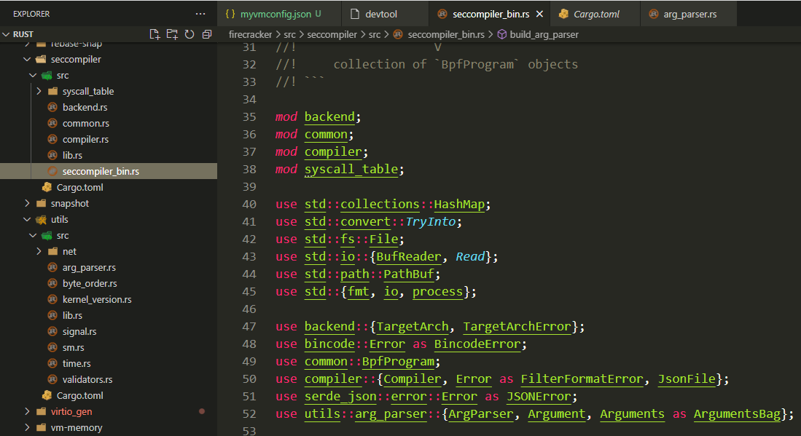
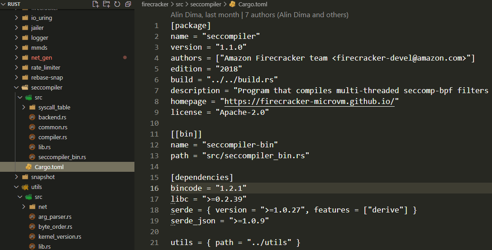
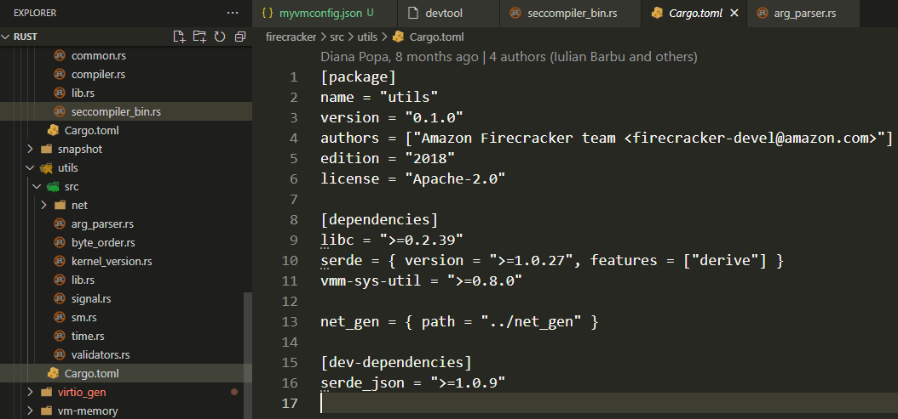

- [C调用rust慢吗?](#c调用rust慢吗)
- [论Mutex的unlock](#论mutex的unlock)
  - [提前unlock](#提前unlock)
  - [结论](#结论)
- [impl块](#impl块)
  - [内部函数](#内部函数)
  - [receiver](#receiver)
- [调用libc函数](#调用libc函数)
- [和C兼容data layout](#和c兼容data-layout)
- [生命周期标记](#生命周期标记)
- [线程](#线程)
- [宏](#宏)
  - [宏可以用小括号, 中括号, 大括号](#宏可以用小括号-中括号-大括号)
  - [简单例子](#简单例子)
  - [例子1](#例子1)
  - [例子2](#例子2)
- [迭代器](#迭代器)
- [闭包](#闭包)
- [rust指针cheatsheet](#rust指针cheatsheet)
- [ownership](#ownership)
- [方法和瀑布式设计](#方法和瀑布式设计)
- [小知识点](#小知识点)
  - [Default值](#default值)
  - [Result必须处理, 否则有编译警告](#result必须处理-否则有编译警告)
  - [if else赋值](#if-else赋值)
  - [std库的catch\_unwind](#std库的catch_unwind)
    - [catch\_unwind和FnOnce](#catch_unwind和fnonce)
      - [什么是FnOnce](#什么是fnonce)
      - [catch\_unwind](#catch_unwind)
      - [代码解释](#代码解释)
  - [std库的同步功能](#std库的同步功能)
  - [u32可以调用checked\_add做溢出检查](#u32可以调用checked_add做溢出检查)
  - [tuple返回值](#tuple返回值)
  - [宏调用使用()或{}都行?](#宏调用使用或都行)
  - [该传值的时候传借用也行?](#该传值的时候传借用也行)
  - [方法impl块里面的Self](#方法impl块里面的self)
  - [条件编译](#条件编译)
  - [static变量](#static变量)
- [trait](#trait)
  - [关联类型, 关联类型可以是trait?](#关联类型-关联类型可以是trait)
  - [trait object](#trait-object)
- [可以在函数定义里干任何事?](#可以在函数定义里干任何事)
- [结构体定义和C对比](#结构体定义和c对比)
- [crate和mod](#crate和mod)
  - [bin文件的例子](#bin文件的例子)
  - [lib的例子](#lib的例子)
- [firecracker/src/utils/src/arg\_parser.rs代码走读](#firecrackersrcutilssrcarg_parserrs代码走读)
  - [use 使用了BTreeMap](#use-使用了btreemap)
  - [重定义了Result](#重定义了result)
  - [ArgParser对象](#argparser对象)
  - [ArgParser对象方法](#argparser对象方法)
    - [new这个对象:](#new这个对象)
    - [从命令行parse](#从命令行parse)
    - [增加arg项](#增加arg项)
    - [格式化help output](#格式化help-output)
  - [Argument对象](#argument对象)
- [test](#test)
- [std collections](#std-collections)
  - [Sequences性能](#sequences性能)
  - [Maps性能](#maps性能)
- [BTreeMap](#btreemap)
  - [iter()](#iter)
  - [keys()和values()](#keys和values)


# C调用rust慢吗?
不慢. 重点词: FFI `#[repr(C)]`
> Let me expand on this a bit: The reason why FFI is slow in many languages (Java, C#, Go, etc) is that incoming data has to be registered to the runtime, maybe even copied into GC memory space, and then unregistered or again copied into the other direction.

> Rust doesn't have a runtime, and it can handle C data structures directly (with #[repr(C)]). There is no conversion needed at all.

> That said, sometimes you do want to conversions, like using Vec instead of a C array (although std::slice::from_raw_parts solves most of the use cases without a copy), but that's on you to implement, so you can see the costs directly.


# 论Mutex的unlock
rust里面, mutex不需要手动unlock. 比如下面的代码:
```rust
use std::sync::Mutex;

fn main() {
    let my_mutex = Mutex::new(5); // A new Mutex<i32>. We don't need to say mut
    let mut mutex_changer = my_mutex.lock().unwrap(); // mutex_changer is a MutexGuard
                                                     // It has to be mut because we will change it
                                                     // Now it has access to the Mutex
                                                     // Let's print my_mutex to see:

    println!("{:?}", my_mutex); // This prints "Mutex { data: <locked> }"
                                // So we can't access the data with my_mutex now,
                                // only with mutex_changer

    println!("{:?}", mutex_changer); // This prints 5. Let's change it to 6.

    *mutex_changer = 6; // mutex_changer is a MutexGuard<i32> so we use * to change the i32

    println!("{:?}", mutex_changer); // Now it says 6
}
```

但我这里要讨论的是, `my_mutex.lock().unwrap()`这句返回的是`MutexGuard`, 它实现了`Drop` trait, 在out of scope后(即脱离变量作用域)被自动调用.

上面的代码, `mutex_changer`就是那个返回的`MutexGuard`, 它会存活到`main`函数的最后, 就是说到最后这个lock才会被解锁.

那怎么提前解锁呢?

把上面的代码改一下:
```rust
use std::sync::Mutex;

#[derive(Debug)]
struct MyType  {
    n: i32
}

fn main() {
    let my_mutex = Mutex::new(MyType{n: 5});
    let mut mutex_changer = my_mutex.lock().unwrap();
    println!("{:?}", my_mutex);
    println!("{:?}", mutex_changer);
    mutex_changer.n = 6; 
    println!("{:?}", mutex_changer);
    println!("{:?}", my_mutex);
}

//输出
Mutex { data: <locked>, poisoned: false, .. }
MyType { n: 5 }
MyType { n: 6 }
Mutex { data: <locked>, poisoned: false, .. }
```
可以看到直到最后, my_mutex的锁还是保持的, 直到main结束, my_mutex退出作用域

## 提前unlock
下面的代码中, `my_mutex.lock().unwrap().n`这句, `lock().unwrap()`得到的`MutexGuard`对象, 是在一句内的临时对象, 在取出`n`后就消亡了, 导致它的`unlock()`函数被调用.  
所以最后输出里面, 显示`my_mutex`的状态不是`data: <locked>`, 而是显示data的值: `data: MyType { n: 5 }`
```rust
use std::sync::Mutex;

#[derive(Debug)]
struct MyType  {
    n: i32
}

fn main() {
    let my_mutex = Mutex::new(MyType{n: 5});
    let mutex_changer = my_mutex.lock().unwrap().n;
    println!("{:?}", my_mutex);
    println!("{:?}", mutex_changer);
}

//输出
Mutex { data: MyType { n: 5 }, poisoned: false, .. }
5
```

## 结论
* 如果持有`MutexGuard`对象, 比如`let var = someLock.lock().unwrap()`那么这个lock会一直hold到变量生命周期结束
* 如果在`unwrap()`后还取了数据对象的field, 比如`let var = someLock.lock().unwrap().someField`, 那么锁在这一行就会`unlock()`, 可以理解为`MutexGuard`对象是临时对象, 已经消亡.
* 这个就是所谓的RAII(Resource Acquisition Is Initialization)
> An RAII implementation of a "scoped lock" of a mutex. When this structure is dropped (falls out of scope), the lock will be unlocked.

# impl块
## 内部函数
impl块中不全是带self参数的方法, 比如典型的new函数, 和一些内部函数.  
比如virtiofsd中的结构体VhostUserFsThread, 有个函数`return_descriptor()`, 第一个入参就不是`&self`, 这个函数只在本impl块做为内部函数使用.
```rust
impl<F: FileSystem + Send + Sync + 'static> VhostUserFsThread<F> {
    fn new(fs: F, thread_pool_size: usize) -> Result<Self>
    fn return_descriptor(vring_state: &mut VringState, head_index: u16, event_idx: bool, len: usize,)
}
```

## receiver
不知道rust里面叫什么， 但类似go的receiver概念， 在同一个impl块中, receiver可以是多个形态, 可以是`&self`, 也可以是`&mut self`等.


# 调用libc函数
virtiofsd新建线程的时候, 会调用`unshare()`
```rust
impl<F: FileSystem + Send + Sync + 'static> VhostUserFsThread<F> {
    let ret = unsafe { libc::unshare(libc::CLONE_FS) };
    if ret == -1 {
        return Err(Error::UnshareCloneFs(std::io::Error::last_os_error()));
    }
}
```
这里调用了`libc::unshare()`函数
* [libc](https://crates.io/crates/libc)是github上的一个crate, 提供了很多c的基础库函数. Rust能直接调用c库这点应该说是rust的一个优点
  * 这个crate提供多个平台的libc接口, 比如
    * unix
    * vxworks
    * windows
    * fuchsia
    * [HermitCore](https://hermitcore.org/): 应该是基于KVM的unikernel, for HPC和云环境. A Unikernel for Extreme-Scale Computing
    * solid
* 调用c库要用unsafe包起来?
* 这个c库函数原型是`pub fn unshare(flags: ::c_int) -> ::c_int;`注意返回值是`c_int`, 这个`c_int`的类型是`pub type c_int = i32;`

这个unshare本质上是个系统调用, 由libc代为提供. `int unshare(int flags);`的作用是让当前进程丢弃部分的和其他进程共享的运行上下文. 比如  
* CLONE_FILES: 去除共享的fd. 即调用`unshare(CLONE_FILES)`后, 调用进程和其他进程都不共享fd
* CLONE_FS: 不再共享root目录, 当前目录, mask属性等. 和自己调用`chroot()`, `chdir()`, `umask()`效果差不多?
* CLONE_NEWIPC: 和clone加`CLONE_NEWIPC`效果一样. 不再共享IPC名字空间
* CLONE_NEWNET: 和clone加`CLONE_NEWNET`效果一样. 不再共享网络名字空间
* CLONE_NEWNS: 同上, 不再共享mount名字空间
* CLONE_NEWUTS: 同上, 不再共享UTS IPC namespace
* CLONE_SYSVSEM: 同上, 不再共享System V semaphore

有个`unshare`shell命令, 可以方便的用新的名字空间来启动一个新进程.  
* 在新的pid空间运行程序, 显示pid是1
```shell
//Establish a PID namespace, ensure we're PID 1 in it against newly mounted procfs instance.
# unshare --fork --pid --mount-proc readlink /proc/self
1
```
* 在新的user空间使用root用户. 注意当前是普通用户
```shell
//Establish a user namespace as an unprivileged user with a root user within it.
$ unshare --map-root-user --user sh -c whoami
root
```

# 和C兼容data layout
virtiofsd的源码里, 经常会出现类似下面的代码:`
```rust
#[repr(C)]
#[derive(Debug, Default, Copy, Clone)]
pub struct SecctxHeader {
    pub size: u32,
    pub nr_secctx: u32,
}

unsafe impl ByteValued for SecctxHeader {}
```
rust调用C的时候, 需要跨越FFI(Foreign Function Interface)

一般的, 如果只是在rust里调用C函数, 可以这样
```rust
use libc::size_t;

#[link(name = "snappy")]
extern {
    fn snappy_max_compressed_length(source_length: size_t) -> size_t;
}

fn main() {
    let x = unsafe { snappy_max_compressed_length(100) };
    println!("max compressed length of a 100 byte buffer: {}", x);
}
```

但如果是要使用C的结构体, 就要使用`#[repr(C)]`来声明一个和C一模一样的结构体. `#[repr(C)]`就是控制编译器如何生成data layout的.  
这点rust做的比较好, 复合数据类型的data layout默认是`repr(Rust)`, 用`#[repr(C)]`可以声明和C一模一样的数据布局.

`server.rs`里面, 就使用了前面的`SecctxHeader`的定义:
```rust
fn parse_security_context(data: &[u8]) -> Result<Option<SecContext>> {
    if data.len() < size_of::<SecctxHeader>() {
        return Err(Error::DecodeMessage(einval()));
    }
    let (header, data) = data.split_at(size_of::<SecctxHeader>());
    let secctx_header: SecctxHeader =
        unsafe { std::ptr::read_unaligned(header.as_ptr() as *const SecctxHeader) };

    if secctx_header.nr_secctx > 1 {
        return Err(Error::DecodeMessage(einval()));
    } else if secctx_header.nr_secctx == 0 {
        // No security context sent. May be no LSM supports it.
        return Ok(None);
    }
    ...
}
```
上面的代码把输入的`data: &[u8]`按`size_of::<SecctxHeader>()`截取两段, 第一段是header, 第二段是data.  
然后把header强转成SecctxHeader: `let secctx_header: SecctxHeader = unsafe { std::ptr::read_unaligned(header.as_ptr() as *const SecctxHeader) };`

# 生命周期标记
只有引用才有生命周期标记的说法, 其他都没有:
* 没有结构体生命周期标记的说法. 看见一个struct带标记, 实际上是对其内部的field的引用的标记
* 编译器会自动推导一般的生命标记. 比如:  
```rust
fn announce(value: &impl Display) {
    println!("Behold! {}!", value);
}
fn main() {
    let num = 42;
    let num_ref = &num;
    announce(num_ref);
}
```
去掉编译器语法糖的版本
```rust
fn announce<'a, T>(value: &'a T) where T: Display {
    println!("Behold! {}!", value);
}
fn main() {
    'x: {
        let num = 42;
        'y: {
            let num_ref = &'y num;
            'z: {
                announce(num_ref);
            }
        }
    }
}
```

# 线程
```rust
use std::thread;

fn main() {
    let guard = thread::scoped(|| {
        println!("Hello from a thread!");
    });

    // guard goes out of scope here. 就是说在这里会等着上面的线程结束
}
```

scoped原型是
```rust
fn scoped<'a, T, F>(self, f: F) -> JoinGuard<'a, T>
    where T: Send + 'a,
          F: FnOnce() -> T,
          F: Send + 'a
```
> Specifically, `F`, the closure that we pass to execute in the new thread. It has two restrictions: It must be a `FnOnce` from `()` to `T`. Using `FnOnce` allows the closure to take ownership of any data it mentions from the parent thread. The other restriction is that `F` must be `Send`. We aren't allowed to transfer this ownership unless the type thinks that's okay.

如果用spawn就不会卡住了, main退出会强制退出线程.
```rust
fn main() {
    thread::spawn(|| {
        println!("Hello from a thread!");
    });

    timer::sleep(Duration::milliseconds(50));
}
```

# 宏
比如Vec!宏:
```rust
let x: Vec<u32> = vec![1, 2, 3];
```
展开后是:
```rust
let x: Vec<u32> = {
    let mut temp_vec = Vec::new();
    temp_vec.push(1);
    temp_vec.push(2);
    temp_vec.push(3);
    temp_vec
};
```
对应的宏实现是:
```rust
macro_rules! vec {
    ( $( $x:expr ),* ) => {
        {
            let mut temp_vec = Vec::new();
            $(
                temp_vec.push($x);
            )*
            temp_vec
        }
    };
}
```
`( $( $x:expr ),* ) => {...}`里, `$x:expr`是类似match的语法, `$(...),*`是类似正则的语法, 表示match expr 0次或多次; `$x`是个临时变量.
`=>`右边的`$()*`表示重复每个匹配

## 宏可以用小括号, 中括号, 大括号
比如`Vec!`宏, 下面几个形式都可以:
```rust
fn main() {
    // vector creation with vec! macro
    let v = vec!(1, 2, 3);
    println!("v2= {:?}", v);
}

fn main() {
    // vector creation with vec! macro
    let v = vec![1, 2, 3];
    println!("v2= {:?}", v);
}

fn main() {
    // vector creation with vec! macro
    let v = vec!{1, 2, 3};
    println!("v2= {:?}", v);
}

```
但用尖括号会报错.  
通常Vec大家喜欢用中括号.  


## 简单例子
```rust
macro_rules! five_times {
    ($x:expr) => (5 * $x);
}

fn main() {
    assert_eq!(25, five_times!(2 + 3));
}
```

## 例子1
```rust
macro_rules! foo {
    (x => $e:expr) => (println!("mode X: {}", $e));
    (y => $e:expr) => (println!("mode Y: {}", $e));
}

fn main() {
    foo!(y => 3); //这里的y => 3被宏做匹配
    //foo!(z => 3);这样调用不行, 会报错. error: no rules expected the token `z`
}

//输出
mode Y: 3
```

## 例子2
```rust
macro_rules! o_O {
    (
        $(
            $x:expr; [ $( $y:expr ),* ]
        );*
    ) => {
        &[ $($( $x + $y ),*),* ]
    }
}

fn main() {
    let a: &[i32]
        = o_O!(10; [1, 2, 3];
               20; [4, 5, 6]);

    assert_eq!(a, [11, 12, 13, 24, 25, 26]);

```

# 迭代器
```rust
for x in 0..10 {
    println!("{}", x);
}
```
for相当于在loop里不断的调用range这个迭代器的next方法.
```rust
let mut range = 0..10;

loop {
    match range.next() {
        Some(x) => {
            println!("{}", x);
        },
        None => { break }
    }
}
```

vec的iter方法返回一个迭代器:
```rust
let nums = vec![1, 2, 3];

for num in nums.iter() {
    //这里的num是个引用, println默认会解引用.
    println!("{}", num);
    //下面的写法也行
    println!("{}", *num);
}
```
> Now we're explicitly dereferencing `num`. Why does `iter()` give us references? Well, if it gave us the data itself, we would have to be its owner, which would involve making a copy of the data and giving us the copy. With references, we're just borrowing a reference to the data, and so it's just passing a reference, without needing to do the copy.

见: https://www.cs.brandeis.edu/~cs146a/rust/doc-02-21-2015/book/iterators.html
有些概念挺有用的:
* [Iterator adapters](https://www.cs.brandeis.edu/~cs146a/rust/doc-02-21-2015/book/iterators.html#iterator-adapters), 比如map, filter等API
* [Consumers](https://www.cs.brandeis.edu/~cs146a/rust/doc-02-21-2015/book/iterators.html#consumers), 比如collect等

# 闭包
```rust
let add_one = |x| { 1 + x };

println!("The sum of 5 plus 1 is {}.", add_one(5));
```

```rust
fn main() {
    let x: i32 = 5;

    let printer = || { println!("x is: {}", x); };

    printer(); // prints "x is: 5"
}
```

带move关键词的闭包的语义是take ownership:
> a moving closure always takes ownership of all variables that it uses. Ordinary closures, in contrast, just create a reference into the enclosing stack frame.

每个闭包的type都是独特的, 下面的例子用了F和G两个fn, 虽然签名是一模一样的, 但F和G是两个不同的type, 对应了两个不同的闭包.
```rust
fn compose<F, G>(x: i32, f: F, g: G) -> i32
    where F: Fn(i32) -> i32, G: Fn(i32) -> i32 {
    g(f(x))
}

fn main() {
    compose(5,
            |n: i32| { n + 42 },
            |n: i32| { n * 2 }); // evaluates to 94
}
```

# rust指针cheatsheet
| Type | Name | Summary |
| --- | --- | --- |
| `&T` | Reference | Allows one or more references to read `T` |
| `&mut T` | Mutable Reference | Allows a single reference to read and write `T` |
| `Box<T>` | Box | Heap allocated `T` with a single owner that may read and write `T`. |
| `Rc<T>` | "arr cee" pointer | Heap allocated `T` with many readers |
| `Arc<T>` | Arc pointer | Same as above, but safe sharing across threads |
| `*const T` | Raw pointer | Unsafe read access to `T` |
| `*mut T` | Mutable raw pointer | Unsafe read and write access to `T` |

# ownership
说的很细
https://www.cs.brandeis.edu/~cs146a/rust/doc-02-21-2015/book/ownership.html

# 方法和瀑布式设计
https://www.cs.brandeis.edu/~cs146a/rust/doc-02-21-2015/book/method-syntax.html

# 小知识点

## Default值
有人问下面的代码怎么弄的更好点?
```rust
struct cParams {
    iInsertMax: i64,
    iUpdateMax: i64,
    iDeleteMax: i64,
    iInstanceMax: i64,
    tFirstInstance: bool,
    tCreateTables: bool,
    tContinue: bool,
}

impl cParams {
    fn new() -> cParams {
        cParams {
            iInsertMax: -1,
            iUpdateMax: -1,
            iDeleteMax: -1,
            iInstanceMax: -1,
            tFirstInstance: false,
            tCreateTables: false,
            tContinue: false,
        }
    }
}
```
回答是实现Default trait, 然后在初始化的时候调用`..Default::default()`:  
```rust
impl Default for cParams {
    fn default() -> cParams {
        cParams {
            iInsertMax: -1,
            iUpdateMax: -1,
            iDeleteMax: -1,
            iInstanceMax: -1,
            tFirstInstance: false,
            tCreateTables: false,
            tContinue: false,
        }
    }
}

let p = cParams { iInsertMax: 10, ..Default::default() };
```
注: rust里`..`表示范围, 在range和初始化的时候用的多.  
比如
```rust
let r = 1..10; // r是一个Range<i32>,中间是两个点,代表[1,10)这个区间
let r = (1i32..11).rev().map(|i| i * 10);

let greeting: &str = "Hello";
let substr: &str = &greeting[2..];

let origin = Point3d { x: 5, ..default()};
```


## Result必须处理, 否则有编译警告
rust要求调用函数时, 必须处理返回的Result, 比如这样的函数`pub fn signal_used_queue(&self) -> io::Result<()>`
如果像下面这样调用是不行的:
```rust
vring_state.signal_used_queue();
```
会有编译警告`unused std::result::Result that must be used`

`signal_used_queue()`这个函数返回值Result本身就是个空值或Err, 如果实在不像麻烦的处理返回这, 可以这样:
```rust
vring_state.signal_used_queue().unwrap();
```
`unwrap()`如果碰到Err会panic.

## if else赋值
比如下面的代码:
```rust
    let mut vl = None;
    println!("{:?}", vl);
    if 5 > 1 {
        vl = Some(100)
    }
    println!("{:?}", vl);
    
    let vl2 = if 5 > 1 {
        Some(100) //这里写成Some(100,), 即多个逗号, 效果一样.
    } else {
        None
    };
    println!("{:?}", vl2);

//输出
None
Some(100)
Some(100)
```
* `vl`是普通的赋值: 先赋默认值, 再根据条件更改. 这要求变量**必须是mut的**
* `vl2`是if else 赋值: 用rust的不带分号的`值`做为if else块的值来赋值给`vl2`, `vl2`不需要是mut, 但要注意else最后的括号后面要有分号.

实例:
```rust
        let pool = if thread_pool_size > 0 {
            Some(
                ThreadPoolBuilder::new()
                    .after_start(|_| {
                        // unshare FS for xattr operation
                        let ret = unsafe { libc::unshare(libc::CLONE_FS) };
                        assert_eq!(ret, 0); // Should not fail
                    })
                    .pool_size(thread_pool_size)
                    .create()
                    .map_err(Error::CreateThreadPool)?,
            )
        } else {
            None
        };
```

## std库的catch_unwind
`panic::catch_unwind`可以捕获rust运行时的panic
```rust
use std::panic;

let result = panic::catch_unwind(|| {
    println!("hello!");
});
assert!(result.is_ok());

let result = panic::catch_unwind(|| {
    panic!("oh no!");
});
assert!(result.is_err());
```

### catch_unwind和FnOnce
```rust
std::panic::catch_unwind(AssertUnwindSafe(f))
```
上面的代码是ok的, 只要F满足约束:
```rust
where
    F: FnOnce(),
    F: Send + 'static,
```

#### 什么是FnOnce
```rust
pub trait FnOnce<Args> {
    type Output;
    extern "rust-call" fn call_once(self, args: Args) -> Self::Output;
}
```
> Instances of FnOnce can be called, but might not be callable multiple times. Because of this, if the only thing known about a type is that it implements FnOnce, it can only be called once.

FnOnce只能被调用一次.

> FnOnce is implemented automatically by closure that might consume captured variables, as well as all types that implement FnMut, e.g. (safe) function pointers (since FnOnce is a supertrait of FnMut).

闭包自动实现了FnOnce, Fn, FnMut中的一个.

> Since both Fn and FnMut are subtraits of FnOnce, any instance of Fn or FnMut can be used where a FnOnce is expected.

`Fn`和`FnMut`是`FnOnce`的子trait

> Use FnOnce as a bound when you want to accept a parameter of function-like type and only need to call it once. If you need to call the parameter repeatedly, use FnMut as a bound; if you also need it to not mutate state, use Fn.
Also of note is the special syntax for Fn traits (e.g. Fn(usize, bool) -> usize).

FnOnce是个函数形式的trait, 和Fn一样拥有特殊语法:`Fn(usize, bool) -> usize`

详见: [Closures: Anonymous Functions](http://web.mit.edu/rust-lang_v1.25/arch/amd64_ubuntu1404/share/doc/rust/html/book/second-edition/ch13-01-closures.html)

#### catch_unwind
`std::panic::catch_unwind()`的入参类型是`FnOnce() -> R + UnwindSafe`这个特殊语法的Fn trait
```rust
pub fn catch_unwind<F: FnOnce() -> R + UnwindSafe, R>(f: F) -> Result<R> {
    unsafe { panicking::r#try(f) }
}
```

#### 代码解释
```rust
std::panic::catch_unwind(AssertUnwindSafe(f))
```
AssertUnwindSafe是个元组结构体:
`pub struct AssertUnwindSafe<T>(pub T);`
它实现了FnOnce:
```rust
impl<R, F: FnOnce() -> R> FnOnce<()> for AssertUnwindSafe<F> {
    type Output = R;

    extern "rust-call" fn call_once(self, _args: ()) -> R {
        (self.0)()
    }
}
```

所以:
* FnOnce不一定非要是个闭包, 也可以是个结构体, 比如`struct AssertUnwindSafe`
* 记住Fn这个特殊的trait

## std库的同步功能
在多线程的情况下, 希望所有线程在某个点"集合":
```rust
use std::sync::{Arc, Barrier};
use std::thread;

let mut handles = Vec::with_capacity(10);
let barrier = Arc::new(Barrier::new(10));
for _ in 0..10 {
    let c = Arc::clone(&barrier);
    // The same messages will be printed together.
    // You will NOT see any interleaving.
    handles.push(thread::spawn(move|| {
        println!("before wait");
        c.wait();
        println!("after wait");
    }));
}
// Wait for other threads to finish.
for handle in handles {
    handle.join().unwrap();
}
```

## u32可以调用checked_add做溢出检查
```rust
//self.next_gsi类型是u32
self.next_gsi = self.next_gsi.checked_add(1).ok_or(Error::Overflow)?;
```

## tuple返回值
一个函数如果想返回多个返回值, 可以这样:
```rust
fn prepare_default_values() -> (String, String, String) {
    let default_vcpus =
        format! {"boot={},max_phys_bits={}", config::DEFAULT_VCPUS,config::DEFAULT_MAX_PHYS_BITS};
    let default_memory = format! {"size={}M", config::DEFAULT_MEMORY_MB};
    let default_rng = format! {"src={}", config::DEFAULT_RNG_SOURCE};

    (default_vcpus, default_memory, default_rng)
}
```
使用的时候用模式匹配:
```rust
let (default_vcpus, default_memory, default_rng) = prepare_default_values();
```

## 宏调用使用()或{}都行?
比如下面的代码, format和println宏, 用小括号和大括号调用, 作用一模一样.
```rust
    let default_vcpus = format! {"boot={},max_phys_bits={}", 8, 6.78};
    let default_vcpus2 = format!("boot={},max_phys_bits={}", 8, 6.78);
    println!("{}", default_vcpus);
    println! {"{}", default_vcpus2};
```

## 该传值的时候传借用也行?
比如这个函数, 第二个参数guest_mem的类型要求是`&GuestMemoryMmap`
```rust
    pub fn memory_init(
        &mut self,
        guest_mem: &GuestMemoryMmap,
        kvm_max_memslots: usize,
        track_dirty_pages: bool,
    ) -> Result<()>
```
调用的时候:
```rust
//已知guest_memory是&GuestMemoryMmap类型
guest_memory: &GuestMemoryMmap

let mut vm = Vm::new()
//这样可以编译, guest_memory的借用传入
vm.memory_init(&guest_memory, kvm.max_memslots(), track_dirty_pages)

//这样也可以, 直接传入guest_memory, 这个应该是更符合函数signature
vm.memory_init(guest_memory, kvm.max_memslots(), track_dirty_pages)

//这样竟然也行
vm.memory_init(&&&&&&&&&guest_memory, kvm.max_memslots(), track_dirty_pages)
```
可能GuestMemoryMmap实现了Dref trait? 还是这种形式的传参都是被rust支持的?????

## 方法impl块里面的Self
一个结构体的方法, 并不都是入参一定是Self, 比如类似new()方法, 返回值才是Self(或者&Self等)
比如:
```rust
pub struct VmResources {
    ...
}

impl  VmResources {
    //new函数
    pub fn from_json() -> std::result::Result<Self, Error> {
        ...实例化Self
    }
    
    //其他方法
    pub fn set_vsock_device(&mut self, config: VsockDeviceConfig) -> Result<VsockConfigError>
    
    //等等
}
```
调用"new"方法的时候, 用的是`VmResources::from_json()`, 调用其他方法的时候, 用的是`对象.xxx()`.
而且, 一般的方法第一个入参是`&mut self`或者`&self`
它们都在一个impl块里.

## 条件编译
比如只有再cfg的target_arch是aarch64时才编译:
```rust
#[cfg(target_arch = "aarch64")]
enable_ssbd_mitigation();
```

## static变量
比如下面的代码:
```rust
use lazy_static::lazy_static;
lazy_static! {
    static ref _LOGGER_INNER: Logger = Logger::new();

    /// Static instance used for handling human-readable logs.
    pub static ref LOGGER: &'static Logger = {
        set_logger(_LOGGER_INNER.deref()).expect("Failed to set logger");
        _LOGGER_INNER.deref()
    };
}
```
* static说的是被static标记的变量在整个程序的周期内都有效
* ref说的是后面的变量在被match做pattern匹配的时候, 使用借用方式.  
注: match默认采用move方式, 比如下面的maybe_name变量被match后就没法用了.
```rust
let maybe_name = Some(String::from("Alice"));
// The variable 'maybe_name' is consumed here ...
match maybe_name {
    Some(n) => println!("Hello, {}", n),
    _ => println!("Hello, world"),
}
// ... and is now unavailable.
println!("Hello again, {}", maybe_name.unwrap_or("world".into()));
```
用ref就可以: 注意Some(ref n)那句
```rust
let maybe_name = Some(String::from("Alice"));
// Using `ref`, the value is borrowed, not moved ...
match maybe_name {
    Some(ref n) => println!("Hello, {}", n),
    _ => println!("Hello, world"),
}
// ... so it's available here!
println!("Hello again, {}", maybe_name.unwrap_or("world".into()));
```
* `_LOGGER_INNER.deref()`这种神奇操作来自lazy_static!宏, 这是github上实现的第三方库, 用来在运行时声明static变量, 比如:
```rust
lazy_static! {
    static ref NAME: TYPE = EXPR;
}
```
大义是自动实现了Deref trait, 在第一次deref的时候, 执行后面的EXPR, 后面再解引用的时候, 就直接返回第一次的值的引用.

# trait
## 关联类型, 关联类型可以是trait?
有些trait里面定义了一个type, 这个就是关联类型. 关联类型在具体struct实现的时候是要在impl块里指定的.
```rust
pub trait Deref {
    /// The resulting type after dereferencing.
    type Target: ?Sized;

    /// Dereferences the value.
    fn deref(&self) -> &Self::Target;
}
```
DerefMut继承自Deref, 或者说Deref是DerefMut的supertrait. subtrait也拥有supertrait的关联类型.
```rust
pub trait DerefMut: Deref {
    /// Mutably dereferences the value.
    fn deref_mut(&mut self) -> &mut Self::Target;
}
```

virtiofsd里面, 定义了一个trait:
```rust
pub trait VringStateMutGuard<'a, M: GuestAddressSpace> {
    /// Type for guard returned by `VringT::get_mut()`.
    type G: DerefMut<Target = VringState<M>>;
}
```
这个trait里, 关联类型G要满足约束: `DerefMut<Target = VringState<M>>`看起来是一种特殊的"实例化"trait DerefMut的语法, 指定了其关联类型是`Target = VringState<M>`.

`VringMutex`结构体实现了上面的trait, 具体做法就是用实例化了的`MutexGuard`类型做为`VringStateMutGuard`的关联类型`G`;  
```rust
/// A `VringState` object protected by Mutex for multi-threading context.
#[derive(Clone)]
pub struct VringMutex<M: GuestAddressSpace = GuestMemoryAtomic<GuestMemoryMmap>> {
    state: Arc<Mutex<VringState<M>>>,
}

impl<'a, M: 'a + GuestAddressSpace> VringStateMutGuard<'a, M> for VringMutex<M> {
    type G = MutexGuard<'a, VringState<M>>;
}

//MutexGuard是个结构体, 是在标准库里定义的
pub struct MutexGuard<'a, T: ?Sized + 'a> {
    lock: &'a Mutex<T>,
    poison: poison::Guard,
}
```
`MutexGuard<'a, VringState<M>>;`能当作`G`, 那它就必须满足`type G: DerefMut<Target = VringState<M>>;`约束, 查一下代码, 确实满足:
```rust
#[stable(feature = "rust1", since = "1.0.0")]
impl<T: ?Sized> Deref for MutexGuard<'_, T> {
    type Target = T;

    fn deref(&self) -> &T {
        unsafe { &*self.lock.data.get() }
    }
}

#[stable(feature = "rust1", since = "1.0.0")]
impl<T: ?Sized> DerefMut for MutexGuard<'_, T> {
    fn deref_mut(&mut self) -> &mut T {
        unsafe { &mut *self.lock.data.get() }
    }
}
```

这个`VringStateMutGuard`是下面的trait的supertrait(可以理解成父trait?)之一:
```rust
pub trait VringT<M: GuestAddressSpace>:
    for<'a> VringStateGuard<'a, M> + for<'a> VringStateMutGuard<'a, M>
{
    //这个trait定义了一个函数, 把Self当作VringStateMutGuard<M>, 并返回后者的关联类型
    /// Get a mutable reference to the kick event fd.
    fn get_mut(&self) -> <Self as VringStateMutGuard<M>>::G;
}
```
注:
* `for<'a> VringStateGuard<'a, M>`中的`for<'a>`是[Higher-ranked trait bounds(HRTB)](https://doc.rust-lang.org/nightly/reference/trait-bounds.html#higher-ranked-trait-bounds), 另外参考[hrtb](https://doc.rust-lang.org/nomicon/hrtb.html)., 意思是
  > for<'a> can be read as "for all choices of 'a", and basically produces an infinite list of trait bounds.
* `<Self as VringStateMutGuard<M>>::G`这样的语法好像不常见. 意思是把Self当作`VringStateMutGuard<M>`, 然后取其关联类型G

做了前面这么多, 就是为了实现`VringT<M>`trait:
```rust
pub trait VringT<M: GuestAddressSpace>:
    for<'a> VringStateGuard<'a, M> + for<'a> VringStateMutGuard<'a, M>
{
    fn new(mem: M, max_queue_size: u16) -> Result<Self, VirtQueError>
    fn get_mut(&self) -> <Self as VringStateMutGuard<M>>::G;
    ...
}
```
而`VringMutex<M>`和`VringRwLock<M>`都实现了这个trait.

## trait object
比如下面的代码中, 返回值`Arc<dyn Hypervisor>`是个trait object, 和golang的iface差不多的意思.
编译时选择虚拟化平台, 比如选了kvm, kvm的那个new函数返回具体的结构体.
```rust
pub fn new() -> std::result::Result<Arc<dyn Hypervisor>, HypervisorError> {
    #[cfg(feature = "kvm")]
    let hv = kvm::KvmHypervisor::new()?;

    #[cfg(feature = "mshv")]
    let hv = mshv::MshvHypervisor::new()?;

    Ok(Arc::new(hv))
}
```

# 可以在函数定义里干任何事?
比如可以在函数定义里定义结构体, 并实现一个trait
```rust
    fn write_fmt(&mut self, fmt: fmt::Arguments<'_>) -> Result<()> {
        // Create a shim which translates a Write to a fmt::Write and saves
        // off I/O errors. instead of discarding them
        struct Adapter<'a, T: ?Sized + 'a> {
            inner: &'a mut T,
            error: Result<()>,
        }

        impl<T: Write + ?Sized> fmt::Write for Adapter<'_, T> {
            fn write_str(&mut self, s: &str) -> fmt::Result {
                match self.inner.write_all(s.as_bytes()) {
                    Ok(()) => Ok(()),
                    Err(e) => {
                        self.error = Err(e);
                        Err(fmt::Error)
                    }
                }
            }
        }

        let mut output = Adapter { inner: self, error: Ok(()) };
        match fmt::write(&mut output, fmt) {
            Ok(()) => Ok(()),
            Err(..) => {
                // check if the error came from the underlying `Write` or not
                if output.error.is_err() {
                    output.error
                } else {
                    Err(error::const_io_error!(ErrorKind::Uncategorized, "formatter error"))
                }
            }
        }
    }
```

# 结构体定义和C对比
同样的结构体, C的定义和rust定义分别如下:
```c
struct sock_fprog {
    unsigned short      len;    /* Number of BPF instructions */
    struct sock_filter *filter; /* Pointer to array of
                                   BPF instructions */
};

struct sock_filter {            /* Filter block */
    __u16 code;                 /* Actual filter code */
    __u8  jt;                   /* Jump true */
    __u8  jf;                   /* Jump false */
    __u32 k;                    /* Generic multiuse field */
};
```
rust对应的定义更严谨(啰嗦):
```rust
/// BPF instruction structure definition.
/// See /usr/include/linux/filter.h .
#[repr(C)]
#[derive(Clone, Debug, PartialEq, Deserialize, Serialize)]
#[doc(hidden)]
pub  struct  sock_filter {
    pub  code:  ::std::os::raw::c_ushort,
    pub  jt:  ::std::os::raw::c_uchar,
    pub  jf:  ::std::os::raw::c_uchar,
    pub  k:  ::std::os::raw::c_uint,
}

/// Program made up of a sequence of BPF instructions.
pub  type  BpfProgram  =  Vec<sock_filter>;
```

# crate和mod

## bin文件的例子
firecracker工程下, 有个seccompiler目录:  
  

  
上面的图中:
* toml文件里的关键字都是规范定的, 见https://doc.rust-lang.org/cargo/reference/manifest.html
* Cargo.toml里面说这个seccompiler目录是个crate, 会产生一个seccompiler-bin文件, 产生这个bin的源文件是src/seccompiler_bin.rs; [[bin]]是个表数组, 表示可能会有多个bin.
* src里面每个文件名都是个mod
* 在主文件seccompiler_bin.rs里要声明这些mod

## lib的例子
比如下面这个utils, 是多个工具库的集合. 因为都是库, 就没有一个叫utils.rs的文件
外部crate要引用其中某个库的时候, 用`use utils::arg_parser::{ArgParser, Argument, Arguments  as  ArgumentsBag};`  
  

# firecracker/src/utils/src/arg_parser.rs代码走读
## use 使用了BTreeMap
```rust
use std::collections::BTreeMap;
use std::env;
use std::fmt;
use std::result;
```

## 重定义了Result
`std::result::Result`是个泛型, 是对函数返回值的"标准"抽象
```rust
pub type Result<T> = result::Result<T, Error>; //这个Error就是下面的Error
```
arg_parser自己的Error定义:
其中每个field基本上都是"元组结构体"的形式:
```rust
/// Errors associated with parsing and validating arguments.
#[derive(Debug, PartialEq)]
pub enum Error {
    /// The argument B cannot be used together with argument A.
    ForbiddenArgument(String, String),
    /// The required argument was not provided.
    MissingArgument(String),
    /// A value for the argument was not provided.
    MissingValue(String),
    /// The provided argument was not expected.
    UnexpectedArgument(String),
    /// The argument was provided more than once.
    DuplicateArgument(String),
}
```

Error这个enum实现了`fmt::Display`
```rust
impl fmt::Display for Error {
    fn fmt(&self, f: &mut fmt::Formatter) -> fmt::Result {
        use self::Error::*;

        match *self {
            ForbiddenArgument(ref arg1, ref arg2) => write!(
                f,
                "Argument '{}' cannot be used together with argument '{}'.",
                arg2, arg1
            ),
            MissingArgument(ref arg) => write!(f, "Argument '{}' required, but not found.", arg),
            MissingValue(ref arg) => write!(
                f,
                "The argument '{}' requires a value, but none was supplied.",
                arg
            ),
            UnexpectedArgument(ref arg) => write!(
                f,
                "Found argument '{}' which wasn't expected, or isn't valid in this context.",
                arg
            ),
            DuplicateArgument(ref arg) => {
                write!(f, "The argument '{}' was provided more than once.", arg)
            }
        }
    }
}
```
这里面用了`write!`这个宏, 把一个formated文本写入f.

## ArgParser对象
ArgParser对象是程序的命令行对象:
这里面一直都带着生命周期标记`'a`
```rust
/// Keep information about the argument parser.
#[derive(Clone, Default)]
pub struct ArgParser<'a> {
    arguments: Arguments<'a>,
}
```

arguments是个BTree
```rust
/// Stores the arguments of the parser.
#[derive(Clone, Default)]
pub struct Arguments<'a> {
    // A BTreeMap in which the key is an argument and the value is its associated `Argument`.
    args: BTreeMap<&'a str, Argument<'a>>,
    // The arguments specified after `--` (i.e. end of command options).
    extra_args: Vec<String>,
}
```

再里面的Argument是命令行的option的抽象:
```rust
/// Stores the characteristics of the `name` command line argument.
#[derive(Clone, Debug, PartialEq)]
pub struct Argument<'a> {
    name: &'a str,
    required: bool,
    requires: Option<&'a str>,
    forbids: Vec<&'a str>,
    takes_value: bool,
    allow_multiple: bool,
    default_value: Option<Value>,
    help: Option<&'a str>,
    user_value: Option<Value>,
}
```

## ArgParser对象方法
所有对象方法都包在impl块中:
```rust
impl<'a> ArgParser<'a> {
}
```

### new这个对象:
new返回Self本身, 而不能返回借用(&Self), 因为这个函数结束后, 所有local的东西都会被drop, 那显然就没有什么可以借用的.
```rust
    /// Create a new ArgParser instance.
    pub fn new() -> Self {
        ArgParser::default()
    }
```

### 从命令行parse
从下面的函数能看到, ArgParser对象虽然只包括Arguments, 但明显没有继承.
所以这里还要显式的转一把:
```rust
    /// Parse the command line arguments.
    pub fn parse_from_cmdline(&mut self) -> Result<()> {
        self.arguments.parse_from_cmdline()
    }
```

### 增加arg项
这里用了"瀑布式"的函数形式, 入参和出参都是Self类型:
这个过程发生了所有权转移, 这里的`mut self`入参会导致Self move, 但最后返回的时候又move出去了.
```rust
    /// Add an argument with its associated `Argument` in `arguments`.
    pub fn arg(mut self, argument: Argument<'a>) -> Self {
        self.arguments.insert_arg(argument);
        self
    }
```

调用形式, 在其他的模块中:
下面的连续`.arg()`调用, 我理解没有发生Self的拷贝.
```rust
fn build_arg_parser() -> ArgParser<'static> {
    ArgParser::new()
        .arg(
            Argument::new("input-file")
                .required(true)
                .takes_value(true)
                .help("File path of the JSON input."),
        )
        .arg(
            Argument::new("output-file")
                .required(false)
                .takes_value(true)
                .default_value(DEFAULT_OUTPUT_FILENAME)
                .help("Optional path of the output file."),
        )
        .arg(
            Argument::new("target-arch")
                .required(true)
                .takes_value(true)
                .help("The computer architecture where the BPF program runs. Supported architectures: x86_64, aarch64."),
        )
        .arg(
            Argument::new("basic")
                .takes_value(false)
                .help("Deprecated! Transforms the filters into basic filters. Drops all argument checks \
                and rule-level actions. Not recommended."),
        )
}
```

### 格式化help output

```rust
    // Filter arguments by whether or not it is required.
    // Align arguments by setting width to length of the longest argument.
    fn format_arguments(&self, is_required: bool) -> String {
        let filtered_arguments = self
            .arguments
            .args
            .values() //这是个实体的Values<'a, K:  'a, V:  'a>, 实现了Iterator; 
            //但它声明了自己实现了Iterator, 能编译过, 那就"继承"了Iterator的其他N多方法
            //比如就继承了下面的filter
            .filter(|arg| is_required == arg.required)
            .collect::<Vec<_>>(); //编译器会自动推导出返回类型是Vec<&Argument>

        let max_arg_width = filtered_arguments
            .iter()
            .map(|arg| arg.format_name().len())
            .max()
            .unwrap_or(0); //因为上面的max函数返回Option类型, 这里unwrap Some层, 取得raw数据.

        filtered_arguments
            .into_iter()
            .map(|arg| arg.format_help(max_arg_width))
            .collect::<Vec<_>>()
            .join("\n") //Vec<T>并没有join方法, 这里自动解引用了, 调用了[String]的join
    }
```
上面的Values是`stable-x86_64-unknown-linux-gnu/lib/rustlib/src/rust/library/alloc/src/collections/btree/map.rs`定义的结构体
```rust
pub struct Values<'a, K: 'a, V: 'a> {
    inner: Iter<'a, K, V>,
}
```
而且它还实现了Iterator
```rust
impl<'a, K, V> Iterator for Values<'a, K, V> {
}
```
在这里这个泛型结构体被实例化成了`struct Values<&str, Argument>`
那么这个`struct Values<&str, Argument>`对象就能享受Iterator的一系列方法
那么接下来的filter方法, 返回的`Filter<Self, P>`依旧是个Iterator
```rust
    fn filter<P>(self, predicate: P) -> Filter<Self, P>
    where
        Self: Sized,
        P: FnMut(&Self::Item) -> bool,
    {
        Filter::new(self, predicate)
    }
```
这里的Self就是`struct Values<&str, Argument>`对象本身, filter函数需要一个predicate(谓语)函数来执行filter的具体动作, 而它的入参是`&Self::Item`, 那么`struct Values<&str, Argument>`的Iterator关联类型是什么呢?
见下面, 是`&'a V`, 这里实例化后是`&Argument`
```rust
impl<'a, K, V> Iterator for Values<'a, K, V> {
    type Item = &'a V;

    fn next(&mut self) -> Option<&'a V> {
        self.inner.next().map(|(_, v)| v)
    }

    fn size_hint(&self) -> (usize, Option<usize>) {
        self.inner.size_hint()
    }

    fn last(mut self) -> Option<&'a V> {
        self.next_back()
    }
}
```
那么就能得出:
```rust
.filter(|arg| is_required == arg.required)
```
其中:
* `arg`是`struct Values<&str, Argument>`的关联类型`&Argument的`借用, 即`&&Argument`
* rust有自动解引用机制, 所以`arg.required`可以直接用

## Argument对象
这里全程都带生命周期标记, 怎么看着挺啰嗦的.
```rust
#[derive(Clone, Debug, PartialEq)]
pub struct Argument<'a> {
    name: &'a str,
    required: bool,
    requires: Option<&'a str>,
    forbids: Vec<&'a str>,
    takes_value: bool,
    allow_multiple: bool,
    default_value: Option<Value>,
    help: Option<&'a str>,
    user_value: Option<Value>,
}
```

# test
这个文件1k多行, 有一般都是test
test从`#[cfg(test)]`开始
包在mod里面:
```rust
#[cfg(test)]
mod tests {
    use super::*;
    use crate::arg_parser::Value; //即使在同一个文件, 也要显式引用
}
```

* 测试项以`#[test]`标记, 函数以`test_`开头
```rust
    fn test_value() {
        //Test `as_string()` and `as_flag()` functions behaviour.
        let mut value = Value::Flag;
        assert!(Value::as_single_value(&value).is_none());
        value = Value::Single("arg".to_string());
        assert_eq!(Value::as_single_value(&value).unwrap(), "arg");
        value = Value::Single("arg".to_string());
        assert!(!Value::as_flag(&value));
        value = Value::Flag;
        assert!(Value::as_flag(&value));
    }
```

* 使用了大量的`assert_eq!`宏, 比如:
```rust
assert_eq!(
    arg_parser.formatted_help(),
    "optional arguments:\n  \
     --config-file <config-file>         'config-file' info.\n  \
     --id <id>                           'id' info.\n  \
     --seccomp-filter <seccomp-filter>   'seccomp-filter' info."
);
```

* 判断Result是否ok
```rust
assert!(arguments.parse(&args).is_ok());
```

* 没有看到golang类似的benchmark测试

# std collections
代码在`.rustup/toolchains/stable-x86_64-unknown-linux-gnu/lib/rustlib/src/rust/library/std/src/collections/mod.rs`
主要是对其他crate的重新引用:
```rust
pub use alloc_crate::collections::{binary_heap, btree_map, btree_set};
pub use alloc_crate::collections::{linked_list, vec_deque};
pub use alloc_crate::collections::{BTreeMap, BTreeSet, BinaryHeap};
pub use alloc_crate::collections::{LinkedList, VecDeque};
pub use self::hash_map::HashMap;
pub use self::hash_set::HashSet;
```
Rust's collections can be grouped into four major categories:

* Sequences: Vec, VecDeque, LinkedList
* Maps: HashMap, BTreeMap
* Sets: HashSet, BTreeSet
* Misc: BinaryHeap

## Sequences性能

||get(i) | insert(i) | remove(i) | append | split_off(i) |
| --- | --- | --- | --- | --- | --- |
|Vec|    O(1)|    O(n-i)|    O(n-i)|    O(m)|    O(n-i)|
|VecDeque|    O(1)|    O(min(i, n-i))|    O(min(i, n-i))|    O(m)|    O(min(i, n-i))|
|LinkedList|    O(min(i, n-i))|    O(min(i, n-i))|    O(min(i, n-i))|    O(1)|    O(min(i, n-i))|

## Maps性能
| |get| insert| remove| range| append|
| -- | -- | -- | -- | -- | -- |
|HashMap|    O(1)~|    O(1)~|    O(1)~|    N/A|    N/A
|BTreeMap|    O(log(n))|    O(log(n))|    O(log(n))|    O(log(n))|    O(n+m)|

# BTreeMap
## iter()
BTreeMap的`iter()`方法返回`Iter<'_, K, V>`结构体
这是个
```rust
pub struct Iter<'a, K: 'a, V: 'a> {
    range: LazyLeafRange<marker::Immut<'a>, K, V>,
    length: usize,
}
```
它实现了Iterator:
```rust
#[stable(feature = "rust1", since = "1.0.0")]
impl<'a, K: 'a, V: 'a> Iterator for Iter<'a, K, V> {
    type Item = (&'a K, &'a V);

    fn next(&mut self) -> Option<(&'a K, &'a V)> {
        if self.length == 0 {
            None
        } else {
            self.length -= 1;
            Some(unsafe { self.range.next_unchecked() })
        }
    }

    fn size_hint(&self) -> (usize, Option<usize>) {
        (self.length, Some(self.length))
    }

    fn last(mut self) -> Option<(&'a K, &'a V)> {
        self.next_back()
    }

    fn min(mut self) -> Option<(&'a K, &'a V)> {
        self.next()
    }

    fn max(mut self) -> Option<(&'a K, &'a V)> {
        self.next_back()
    }
}
```

BTreeMap的iter使用举例:
```rust
use std::collections::BTreeMap;

let mut map = BTreeMap::new();
map.insert(3, "c");
map.insert(2, "b");
map.insert(1, "a");

for (key, value) in map.iter() {
    println!("{}: {}", key, value);
}

let (first_key, first_value) = map.iter().next().unwrap();
assert_eq!((*first_key, *first_value), (1, "a"));
```

## keys()和values()
BTreeMap还有keys()和values()方法, 分别返回keys和values.
比如:
```rust
    let mut a = BTreeMap::new();
    a.insert(2, "b");
    a.insert(1, "a");
    let keys = a.keys();
    let values = a.values();
    println!("{:?}", keys);
    println!("{:?}", values);
```
结果:
```
[1, 2]
["a", "b"]
```
key就是key, value就只有value, 很通顺.

但实际上, keys()和values()方法分别返回Keys和Values结构体, 而他们的内部都是`inner: Iter<'a, K, V>`
```rust
pub struct Keys<'a, K: 'a, V: 'a> {
    inner: Iter<'a, K, V>,
}

pub struct Values<'a, K: 'a, V: 'a> {
    inner: Iter<'a, K, V>,
}
```
区别在于它们各自实现的迭代器不同, 比如:
```rust
impl<'a, K, V> Iterator for Values<'a, K, V> {
    type Item = &'a V;

    fn next(&mut self) -> Option<&'a V> {
        self.inner.next().map(|(_, v)| v) //把(k,v)map成v
    }

    fn size_hint(&self) -> (usize, Option<usize>) {
        self.inner.size_hint()
    }

    fn last(mut self) -> Option<&'a V> {
        self.next_back()
    }
}
```