- [SPEC int](#spec-int)
  - [测试项](#测试项)
- [Intel scalable processor](#intel-scalable-processor)
  - [QDT AW vs Intel Skylake](#qdt-aw-vs-intel-skylake)
  - [overview](#overview)
- [AMD server](#amd-server)
  - [QDT AW vs EPYC](#qdt-aw-vs-epyc)
  - [overview](#overview-1)
- [UDIMM和RDIMM](#udimm和rdimm)
- [DDR interleaved mode](#ddr-interleaved-mode)
- [DDR rank](#ddr-rank)
- [DDR bank](#ddr-bank)
- [AHCI](#ahci)
- [NVMe](#nvme)

# SPEC int
* SPECspeed(SPECint2006)测试执行单任务的性能
* SPECrate(SPECint_rate2006)测试的是系统执行数个任务（比如和核数相同的任务数，多copy同时运行）的性能。
* base是基本的编译选项，比如SPECint_base2006
* peak是加了优化的编译选项，比如SPECint2006
* 综上，SPECint_base2006是单任务的base性能，或者SPECint_rate2006单个copy也反映了单核性能？
* 一共有12个测试项，C和C++，基于现实的计算模型
* Intel一般用ICC，和GCC比较的时候要把数字打折，一般减去15%到30%

## 测试项
|case|lang|descritpion
|--|--|--
400.perlbench|	C|	PERL Programming Language
401.bzip2|	C|	Compression
403.gcc|	C|	C Compiler
429.mcf|	C|	Combinatorial Optimization
445.gobmk|	C|	Artificial Intelligence: go
456.hmmer|	C|	Search Gene Sequence
458.sjeng|	C|	Artificial Intelligence: chess
462.libquantum|	C|	Physics: Quantum Computing
464.h264ref|	C|	Video Compression
471.omnetpp|	C++|	Discrete Event Simulation
473.astar|	C++|	Path-finding Algorithms
483.xalancbmk|	C++|	XML Processing

# Intel scalable processor
## QDT AW vs Intel Skylake
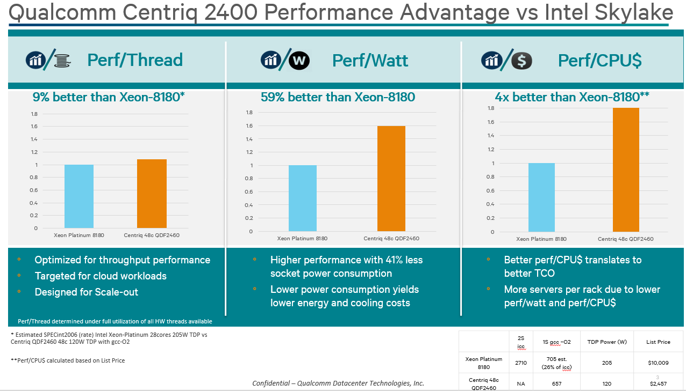  

## overview
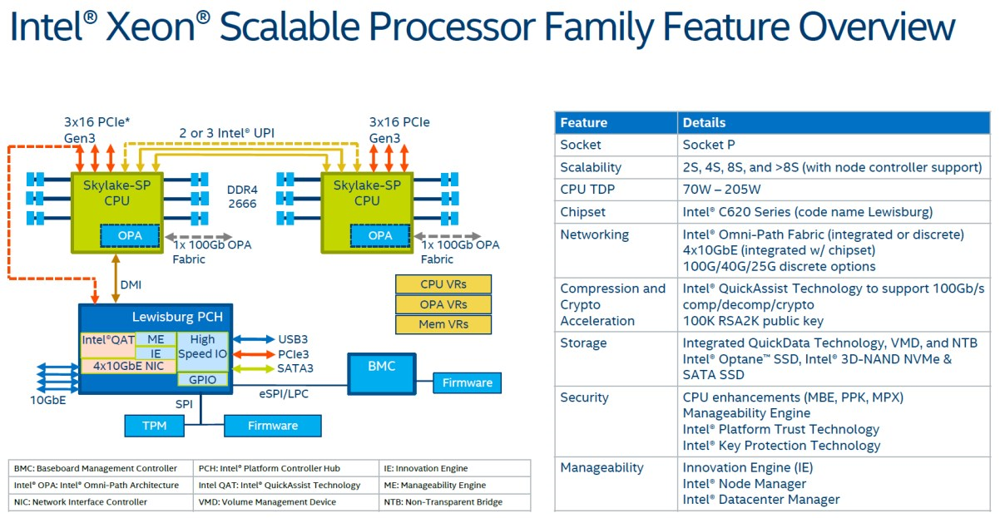  
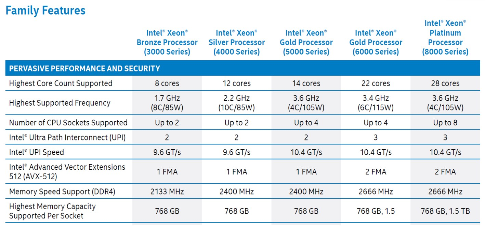  
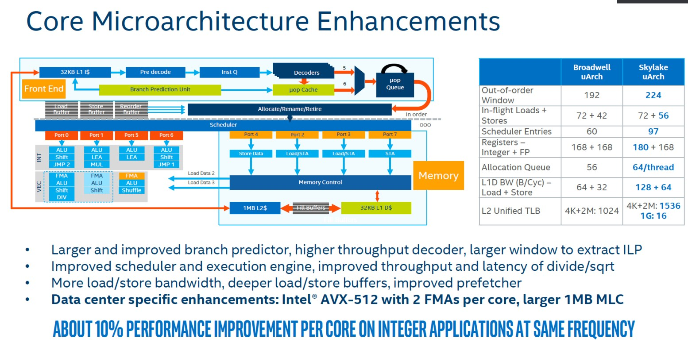  
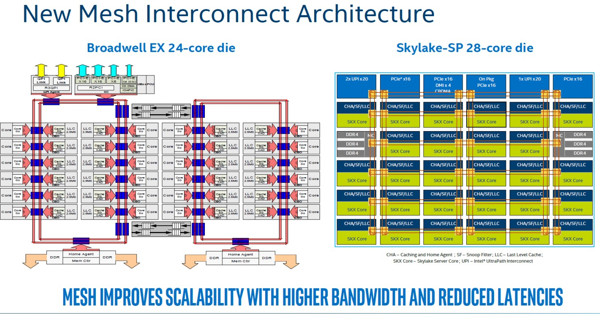  
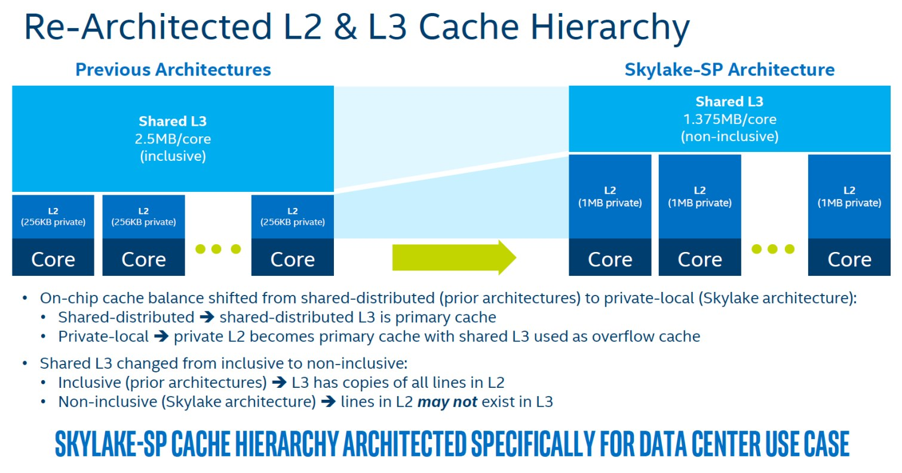  
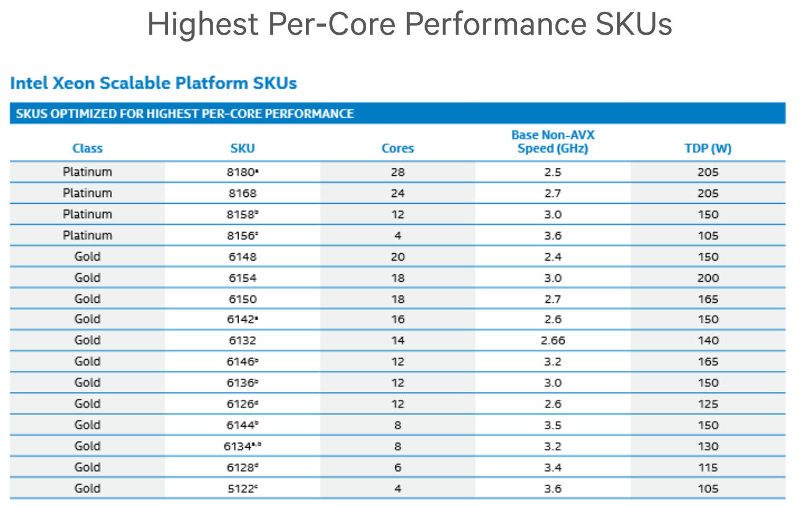  
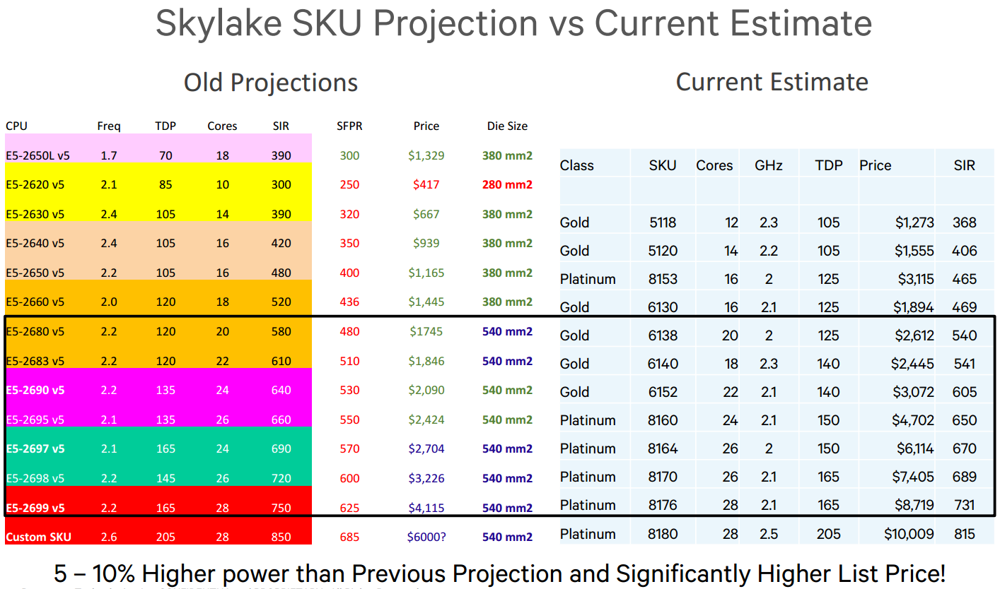  
L2的cache miss降低了很多, L3的cache miss差不多

# AMD server
## QDT AW vs EPYC
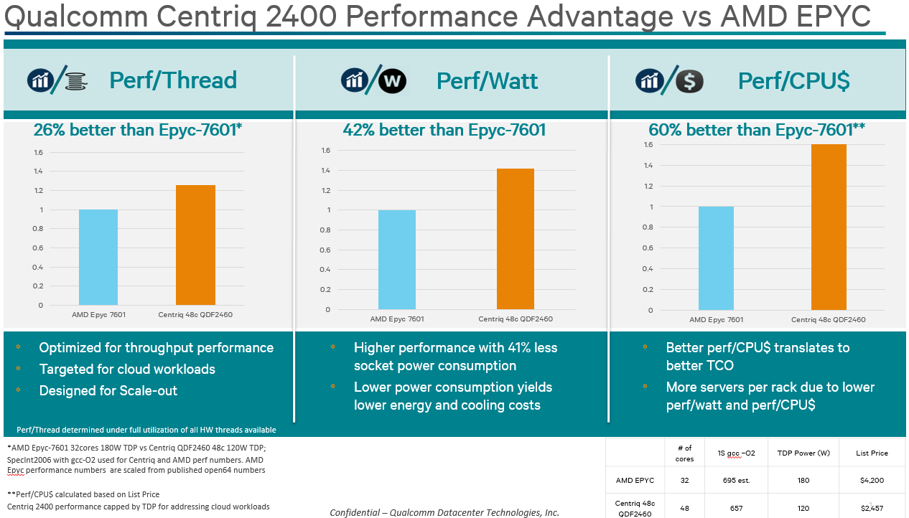  

## overview
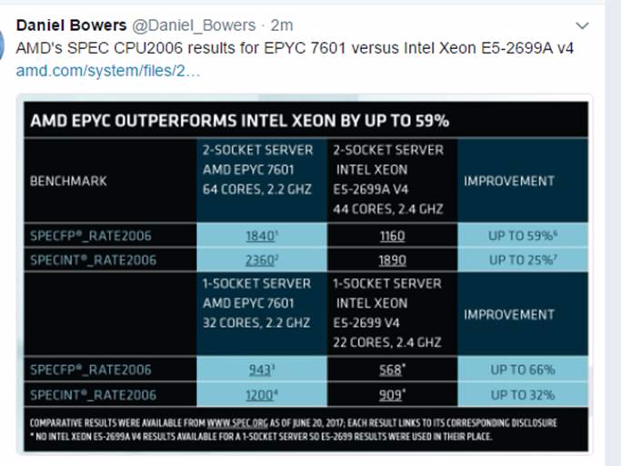  
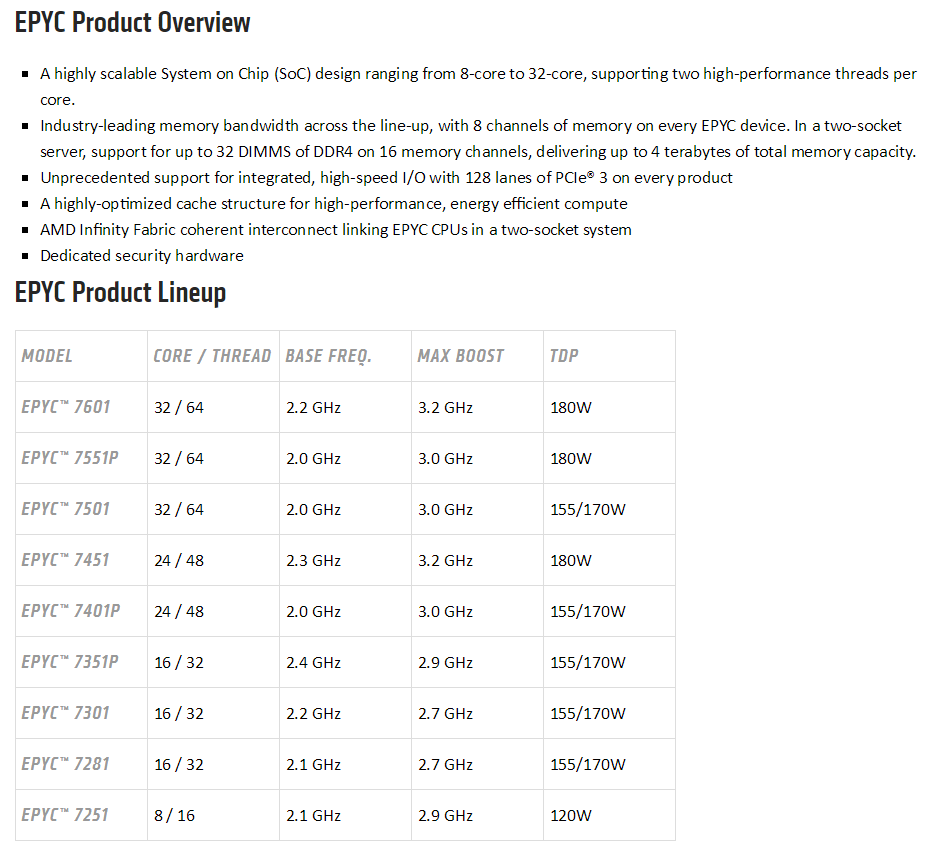  
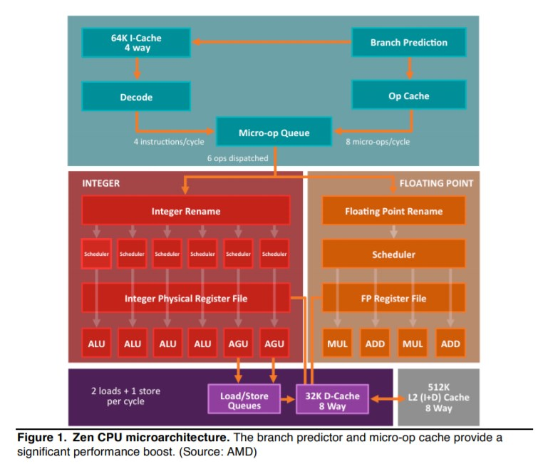  
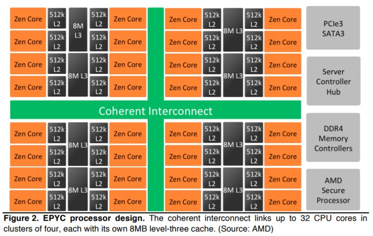  

# UDIMM和RDIMM
* UDIMM是传统的DIMM
* RDIMM里面的R是指Register, 缓存了地址和命令。通常容量和频率更高些。

# DDR interleaved mode
* interleaved banks：比如一个内存颗粒有8个bank，和传统的flat模式不同，interleaved模式会把连续的内存地址交替的分配在8个bank上。
* interleaved channels：有的内存控制器支持连续内存地址在多channel级别上交替分配。
* interleaved模式会大大提高连续内存的访问性能，因为bank或是channel都有等待时间。
* 随机内存访问的性能和flat模式差不多，但由于局部性，一般内存访问都不是完全随机的，小块连续的多。

# DDR rank
* rank对应的是片选
* 一个2rank的DIMM和两个1rank的DIMM从原理上几乎是一样的。
* DRAM有4bit的，也有8bit的
* 多rank在bus上的loading会大一些

# DDR bank
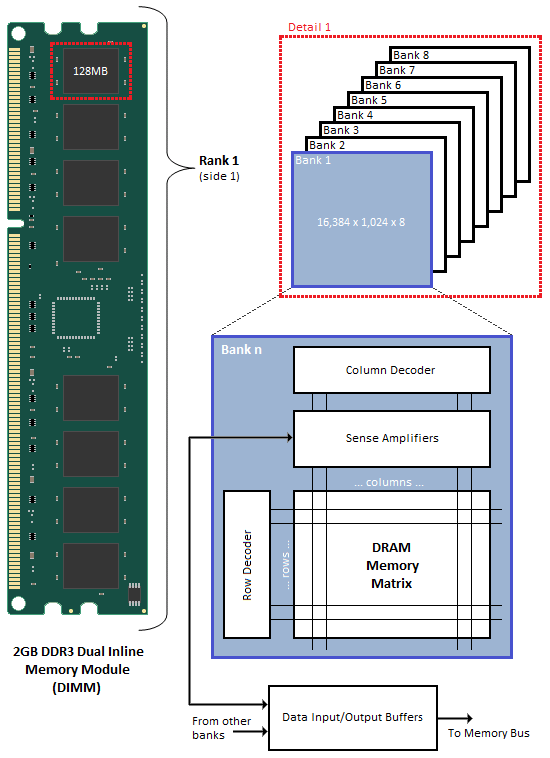  

# AHCI
AHCI（Serial ATA Advanced Host Controller Interface）串行ATA高级主控接口/高级主机控制器接口）

推出较早，主要是针对机械硬盘做的优化。

# NVMe
对SSD做了很大优化，明显降低延迟，提高IOPS。解决了相对SSD的速度，SATA接口日益成为瓶颈。  
其中一部分的优化来自于软件stack。通过标准的制定，NVMe SSD有通用的驱动，不同厂家兼容，主流操作系统都支持。

> NVMe精简了调用方式，执行命令时不需要读取寄存器；而AHCI每条命令则需要读取4次寄存器，一共会消耗8000次CPU循环，从而造成2.5μs的延迟。

但这也不是一劳永逸的，目前SSD使用的NAND闪存本身也会造成约50μs的延迟，也是很大的延迟的因素。

> 要解决存储介质造成的较高延迟，还需要依赖于未来可能应用的诸如PCM、RRAM、MRAM等新式存储器。

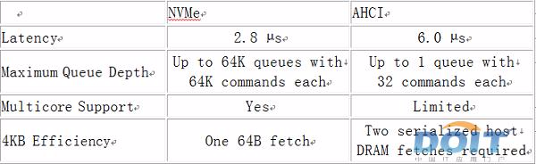  
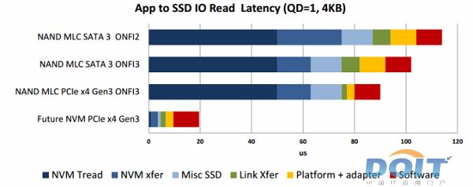  
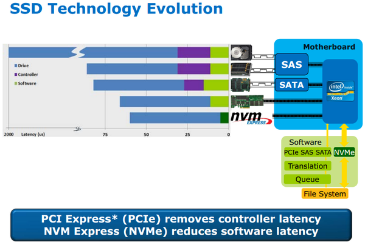  
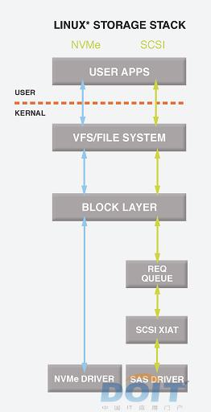  
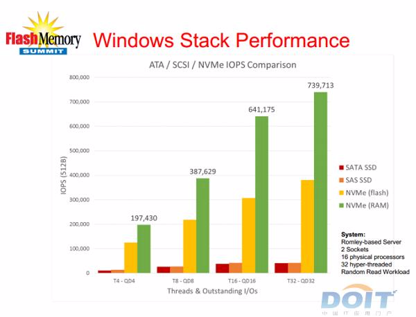  
