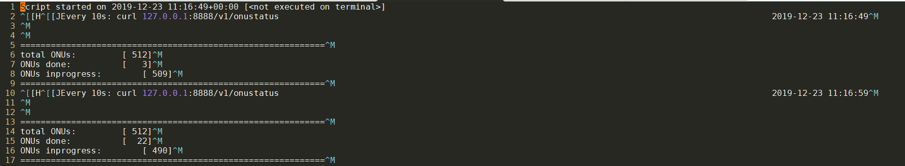

- [用ip monitor命令监测网口变化](#用ip-monitor命令监测网口变化)
- [用socat连接pty](#用socat连接pty)
  - [什么是tty pty](#什么是tty-pty)
  - [读写pts](#读写pts)
- [socat概览](#socat概览)
  - [常用选项](#常用选项)
  - [地址格式](#地址格式)
  - [地址类型](#地址类型)
    - [选项](#选项)
      - [FD组](#fd组)
      - [NAMED option group](#named-option-group)
      - [OPEN option group](#open-option-group)
      - [REG and BLK option group](#reg-and-blk-option-group)
      - [PROCESS option group](#process-option-group)
      - [APPLICATION option group](#application-option-group)
      - [SOCKET option group](#socket-option-group)
      - [IP4 and IP6 option groups](#ip4-and-ip6-option-groups)
      - [TERMIOS option group](#termios-option-group)
      - [FORK option group](#fork-option-group)
  - [例子](#例子)
- [脚本命令行解析之declare -f](#脚本命令行解析之declare--f)
- [shell变量扩展和引号保留](#shell变量扩展和引号保留)
  - [背景:](#背景)
  - [简单wrapper](#简单wrapper)
  - [参数重载](#参数重载)
  - [变量赋值导致字符串多变一](#变量赋值导致字符串多变一)
  - [shell变量扩展方式](#shell变量扩展方式)
  - [printf](#printf)
  - [最终版, 用eval](#最终版-用eval)
  - [补充: shell的变量扩展](#补充-shell的变量扩展)
- [curl使用说明和举例](#curl使用说明和举例)
  - [使用举例1](#使用举例1)
  - [使用举例2](#使用举例2)
  - [使用举例3](#使用举例3)
  - [URL格式](#url格式)
- [curl和RESTful gitlab API举例](#curl和restful-gitlab-api举例)
  - [简介](#简介)
  - [举例](#举例)
    - [创建新project](#创建新project)
    - [获取gitignore模板](#获取gitignore模板)
    - [分支维护](#分支维护)
- [sed解析log](#sed解析log)
- [CPU利用率条件触发perf record](#cpu利用率条件触发perf-record)
- [top的记录导入到excel](#top的记录导入到excel)
  - [比较粗糙的版本](#比较粗糙的版本)
    - [CPU](#cpu)
    - [mem](#mem)
  - [同时导出CPU利用率和mem](#同时导出cpu利用率和mem)
  - [只导出cpu利用率](#只导出cpu利用率)
    - [改进版](#改进版)
- [用tr处理多余字符](#用tr处理多余字符)
- [一次shell重定向过程](#一次shell重定向过程)
  - [shell重定向和exec](#shell重定向和exec)
- [动态变量名及其引用: eval的使用](#动态变量名及其引用-eval的使用)
  - [用eval生成动态变量名](#用eval生成动态变量名)
  - [间接引用变量](#间接引用变量)
  - [举例: 读出\*.conf文件内容到动态文件名变量](#举例-读出conf文件内容到动态文件名变量)
  - [uaes进程管理, 关系数组方式实现](#uaes进程管理-关系数组方式实现)
- [判断字串是否包含子串](#判断字串是否包含子串)
  - [也可以用case in](#也可以用case-in)
- [exec重定向](#exec重定向)
  - [在shell里直接重定向stdin](#在shell里直接重定向stdin)
  - [重定向整个shell的stdout](#重定向整个shell的stdout)
  - [输入和输出的例子](#输入和输出的例子)
  - [crosstool ng的例子](#crosstool-ng的例子)
  - [补充: test可以检测FD是否是terminal](#补充-test可以检测fd是否是terminal)
- [shell读写socket](#shell读写socket)
  - [更简单的写法](#更简单的写法)
  - [/dev/tcp是shell内建的设备节点](#devtcp是shell内建的设备节点)
- [shell进程间通信](#shell进程间通信)
  - [有名管道和nc](#有名管道和nc)
- [shell检查一个脚本是否已经被include了](#shell检查一个脚本是否已经被include了)
- [sed](#sed)
  - [向sed传递变量](#向sed传递变量)
  - [sed使用记录](#sed使用记录)
  - [sed命令](#sed命令)
  - [sed匹配2行之间的内容](#sed匹配2行之间的内容)
  - [提取文件特定行](#提取文件特定行)
  - [sed正则表达式](#sed正则表达式)
  - [sed定址替换](#sed定址替换)
  - [sed删除](#sed删除)
  - [sed替换引用](#sed替换引用)
  - [sed的分组匹配, 用()分组, 用\\1引用](#sed的分组匹配-用分组-用1引用)
- [awk](#awk)
  - [shell变量传给awk](#shell变量传给awk)
  - [再说patten](#再说patten)
  - [awk在if里匹配](#awk在if里匹配)
  - [awk支持浮点](#awk支持浮点)
  - [awk逻辑与](#awk逻辑与)
  - [awk多行解析](#awk多行解析)
  - [awk分组提取](#awk分组提取)
  - [awk变量](#awk变量)
  - [awk数组](#awk数组)
  - [awk字符串替换](#awk字符串替换)
  - [awk的条件判断和数字运算](#awk的条件判断和数字运算)
  - [awk执行其他程序](#awk执行其他程序)
  - [awk替换命令](#awk替换命令)
- [shell管道和循环](#shell管道和循环)
- [看一个interface是否存在](#看一个interface是否存在)
  - [用/proc/net/dev](#用procnetdev)
  - [用ifconfig intf返回值](#用ifconfig-intf返回值)
- [awk计算时间差](#awk计算时间差)
- [ping延迟大于0.5ms触发动作](#ping延迟大于05ms触发动作)
- [计算cpu掩码, mask](#计算cpu掩码-mask)
- [shell的进程创建](#shell的进程创建)
- [粘贴多行文本管道后再用后续命令处理](#粘贴多行文本管道后再用后续命令处理)
- [关系数组 sed 和 awk](#关系数组-sed-和-awk)
  - [改进版 awk多维数组](#改进版-awk多维数组)
  - [原始版](#原始版)
- [shell关系数组 -- 或者说是list](#shell关系数组----或者说是list)
- [shell数组](#shell数组)
- [shell脚本解析文件, 输出可以导入到excel的文本](#shell脚本解析文件-输出可以导入到excel的文本)
- [shell处理命令行选项](#shell处理命令行选项)
- [shell也可以递归调用函数](#shell也可以递归调用函数)
  - [改进版本](#改进版本)
- [local system monitor](#local-system-monitor)
- [system monitor for pangu](#system-monitor-for-pangu)
- [增加fedora分区的脚本](#增加fedora分区的脚本)

# 用ip monitor命令监测网口变化
```shell
ip -o monitor link | while read -r index interface status remaining; do
    iface=$(printf '%s\n' "$interface" | sed -E 's/(@.*)?:$//')
    operstate=$(printf '%s\n' "$remaining" | grep -Eo ' state [^ ]+' | sed 's/^ state //')
    printf '%s %s\n' "$iface" "$operstate"
done
```

# 用socat连接pty
## 什么是tty pty
linux终端(Terminals)有三种:
* 串口: 比如ttyS0, ttyUSB0
* pty: /dev/pts/xx
* 屏幕命令行终端: tty1, tty2...

这里我们使用pty, pty是master slave模式的, master用于创建slave, 向slave读写内容; slave就是模拟的终端
* master: `/dev/ptmx`
* slave: `/dev/pts/*`

## 读写pts
比如cloud-hypervisor使用pty文件`/dev/pts/2`做为VM的控制台, `cat /dev/pts/2`能够在host上查看VM的输出, `echo xxxx > /dev/pts/2`可以向VM输入. 
但怎么同时输入输出? 就像进入VM的控制台一样?
先给出结果, 用socat:
```sh
socat -,rawer,escape=29 /dev/pts/2
```
这个命令的意思是, 建立从raw模式的`stdio`到`/dev/pts/2`的双向stream连接
* `-`: 表示stdin和stdout
* rawer是raw模式, 不echo; 在raw模式下, 比如ctrl+c会发送给VM, 不再用来退出socat
* `escape=29`: 使用`ctrl+]`来退出socat
* `/dev/pts/2`: 是pty文件

# socat概览
socat是强大的双向stream对接工具, 基本作用就是建立address1到address2的双向byte stream连接.
`socat [options] <address1> <address2>`

## 常用选项
* `-d -d`: 打印verbose debug信息, 可多个-d
* `-T<timeout>`: 空闲timeout时间自动退出
* `-u`/`-U`: 单向数据传输
* `-L`: lock文件

## 地址格式
socat支持多种地址类型, 格式为`地址类型:地址,选项1,选项2`
某些常用地址类型可以用简化写法:
* `-`: stdio
* TCP: TCP4
* 数字: FD

## 地址类型
* `CREATE:<filename>`
创建文件写入
* `EXEC:<command-line>`
使用command做为input/output
* `FD:<fdnum>`
使用已经存在的fd
* `GOPEN:<filename>`
打开文件读写. 文件可以是unix socket, 会自动connect, connect失败则假定用sendto. 可以省略GOPEN.
* `INTERFACE:<interface>`
带L2的raw packet
* `IP-DATAGRAM:<address>:<protocol>`
`IP4-DATAGRAM:<host>:<protocol>`
`IP6-DATAGRAM:<host>:<protocol>`
`IP-RECVFROM:<protocol>`
`IP4-RECVFROM:<protocol>`
`IP6-RECVFROM:<protocol>`
`IP-RECV:<protocol>`
`IP-SENDTO:<host>:<protocol>`
`IP4-SENDTO:<host>:<protocol>`
`IP6-SENDTO:<host>:<protocol>`
raw/datagram socket
* `PIPE:<filename>`
`PIPE`
有名和无名管道
* `PROXY:<proxy>:<hostname>:<port>`
proxy
* `PTY`
创建新的pty slave
* `SCTP-CONNECT:<host>:<port>`
SCTP协议
* `SOCKET-CONNECT:<domain>:<protocol>:<remote-address>`
`SOCKET-DATAGRAM:<domain>:<type>:<protocol>:<remote-address>`
`SOCKET-RECV:<domain>:<type>:<protocol>:<local-address>`
`SOCKS4:<socks-server>:<host>:<port>`
socket
* `STDIN`
`STDIO`
`STDOUT`
* `SYSTEM:<shell-command>`
感觉和exec差不多
* `TCP:<host>:<port>`
`TCP-LISTEN:<port>`
* `TUN[:<if-addr>/<bits>]`
新建tun设备做为写侧
* `UDP:<host>:<port>`
`UDP-LISTEN:<port>`
udp还有listen?
* `UNIX-CONNECT:<filename>`
`UNIX-LISTEN:<filename>`
`UNIX-SENDTO:<filename>`
`UNIX-RECVFROM:<filename>`
`UNIX-RECV:<filename>`
`UNIX-CLIENT:<filename>`
`ABSTRACT-CONNECT:<string>`
unix socket

### 选项
socat支持很多选项, 比如上面例子中的`raw`
不同的group支持不同的option
#### FD组
这个组里的option支持对fd配置某种参数.
```
cloexec
setlk
flock-ex
lock
user
mode
append
nonblock
null-eof
...
很多
```
#### NAMED option group
作用于文件名
```
umask
unlink-close
```

#### OPEN option group
```
creat
noatime
rdonly
rsync
...
```

#### REG and BLK option group
```
seek
...
```

#### PROCESS option group
```
chroot
setgid
su
...
```

#### APPLICATION option group
作用于数据
```
cr     Converts the default line termination character NL (’\n’, 0x0a) to/from CR (’\r’, 0x0d) when writing/reading on this channel.
escape
```

#### SOCKET option group
```
bind=
broadcast
rcvbuf
sndbuf
```

#### IP4 and IP6 option groups
```
tos
ip-pktinfo
```

#### TERMIOS option group
```
b0 波特率0, 即断开连接
b19200
echo=
rawer
ignbrk
brkint
... 很多关于特殊字符控制的
```

#### FORK option group
```
pipes
sighup, sigint, sigquit
```

## 例子
```sh
#把stdio转到tcp
socat - TCP4:www.domain.org:80
#和上面差不多, 但支持line edit
socat -d -d READLINE,history=$HOME/.http_history TCP4:www.domain.org:www,crnl
#转发listen, 但只accept一个connection
socat TCP4-LISTEN:www TCP4:www.domain.org:www
#加了fork就能允许多个connection
socat TCP4-LISTEN:5555,fork,tcpwrap=script EXEC:/bin/myscript,chroot=/home/sandbox,su-d=sandbox,pty,stderr
#stdion转到ttyS0, 用control-O退出socat
socat -,escape=0x0f /dev/ttyS0,rawer,crnl
```

# 脚本命令行解析之declare -f
下面的代码中, 脚本main里面解析命令行, 只看了通用的--help等, 而其他的命令都通过`declare -f "cmd_$1"  > /dev/null`先"声明"函数, 再调用:`$cmd "$@"`
```sh
main() {

    if [ $# = 0 ];  then
    die "No command provided. Please use \`$0 help\` for help."
    fi

    # Parse main command line args.
    #
    while [ $# -gt 0 ];  do
        case  "$1"  in
            -h|--help)              { cmd_help;  exit 1;     } ;;
            -y|--unattended)        { OPT_UNATTENDED=true;  } ;;
            -*)
                die "Unknown arg: $1. Please use \`$0 help\` for help."
            ;;
            *)
                break
            ;;
        esac
        shift
    done

    # $1 is now a command name. Check if it is a valid command and, if so,
    # run it.
    #
    declare -f "cmd_$1"  > /dev/null
    ok_or_die "Unknown command: $1. Please use \`$0 help\` for help."

    cmd=cmd_$1
    shift

    # $@ is now a list of command-specific args
    #
    $cmd "$@"
}

main "$@"
```

比如想实现`$0 build_rootfs`命令, 用上面的方法, 只需要增加`cmd_build_rootfs()`函数:
但需要每个"子命令"函数都自己实现命令解析
```sh
# `./devtool build_rootfs -s 500MB`
# Build a rootfs of custom size.
#
cmd_build_rootfs() {
    # Default size for the resulting rootfs image is 300MB.
    SIZE="300MB"
    FROM_CTR=ubuntu:18.04
    flavour="bionic"

    # Parse the command line args.
    while [ $# -gt 0 ];  do
        case  "$1"  in
            "-h"|"--help")      { cmd_help;  exit 1; } ;;
            "-s"|"--size")
                shift
                SIZE="$1"
                ;;
            "-p"|"--partuuid")
                shift
                PARTUUID=1
                ;;
            *)
                die "Unknown argument: $1. Please use --help for help."
            ;;
        esac
        shift
    done
    ...
}
```

# shell变量扩展和引号保留
[shell变量扩展语法](https://www.gnu.org/software/bash/manual/html_node/Shell-Parameter-Expansion.html)

## 背景:
这里的测试命令是:
```sh
go list -f "{{context.GOARCH}} {{context.Compiler}}" -- unsafe

#正常的结果是
amd64 gc
#说明go命令能正确理解传入的参数
```

但我这里需要用一个bash wrapper封装原始的go命令(重命名为`_go`), 把原始参数修改后再传入`_go`

## 简单wrapper
这样是可以的
```sh
#!/bin/bash

exec _go "$@"
```
这里
* `"$@"`会把所有的参数"原封不动"的传入底层命令
补充一下:
* `$#`是参数个数, 这里为5, 用`for a in "$@"`来遍历参数, 这5个参数分别是
    * `list`
    * `-f`
    * `{{context.GOARCH}} {{context.Compiler}}` : 这里说明 for in对位置参数的遍历, 不是以空白符为分隔的. 因为这里虽然有空格, 但它们会做为一个整体被赋值到变量`a`
    * `--`
    * `unsafe`

## 参数重载
但我的需求是更改参数, 有如下尝试:
```sh
#!/bin/bash

cmd=$1
shift
exec _go $cmd "$@"
```
这个可以.
* 说明`shift`对参数移位了, 但不会影响`"$@"`对原始字符串的操作

## 变量赋值导致字符串多变一
但下面的代码不正常工作:
```sh
#!/bin/bash

cmd=$1
shift
args="$@"

exec _go $cmd "$args"
#或者下面的命令
exec _go $cmd $args
```
的结果是`flag provided but not defined: -f {{context.GOARCH}} {{context.Compiler}} -- unsafe`
经过检查, 和这样执行原始命令是一样的:
`_go list "-f {{context.GOARCH}} {{context.Compiler}} -- unsafe"`
说明:
* `args="$@"`的结果是, `args`把`-f {{context.GOARCH}} {{context.Compiler}} -- unsafe`会变成一个整体的string

## shell变量扩展方式
下面的都不行
```sh
#!/bin/bash

cmd=$1
shift

exec _go $cmd ${*@Q}
#结果
can't load package: package '-f': malformed module path "'-f'": invalid char '\''

exec _go $cmd "${*@Q}"
#结果
can't load package: package '-f' '{{context.GOARCH}} {{context.Compiler}}' '--' 'unsafe': malformed module path "'-f' '{{context.GOARCH}} {{context.Compiler}}' '--' 'unsafe'": invalid char '\''
```
这里用到了shell的[变量扩展](https://www.gnu.org/software/bash/manual/html_node/Shell-Parameter-Expansion.html):
```sh
${parameter@operator}
The expansion is either a transformation of the value of parameter or information about parameter itself, depending on the value of operator. Each operator is a single letter:
Q
    The expansion is a string that is the value of parameter quoted in a format that can be reused as input.
    
If parameter is ‘@’ or ‘*’, the operation is applied to each positional parameter in turn, and the expansion is the resultant list. If parameter is an array variable subscripted with ‘@’ or ‘*’, the operation is applied to each member of the array in turn, and the expansion is the resultant list.    
```
意思是把`$*`当作一个list, 对其中的每个成员做`Q`操作. 从结果来看`Q`操作实际上把成员做了转义-引号:  
比如`-f`变成了`\'-f\'`, `{{context.GOARCH}} {{context.Compiler}}`变成了`\'{{context.GOARCH}} {{context.Compiler}}\'`  
传递给`_go`命令时, 这些转义被当作原始输入, 不能被正确解析.  
`${*@Q}`和`"${*@Q}"`的区别是, 后者被当作一个整体的string被传入.

## printf
printf也支持
```sh
printf: printf [-v var] format [arguments]
 %b        expand backslash escape sequences in the corresponding argument
 %q        quote the argument in a way that can be reused as shell input
The format is re-used as necessary to consume all of the arguments. 
```
比如
```sh
#!/bin/bash

args="$@"
echo "${args@Q}"
#输出
'list -f {{context.GOARCH}} {{context.Compiler}} -- unsafe'

printf "====%s\n" ${args@Q}
#输出
===='list
====-f
===={{context.GOARCH}}
===={{context.Compiler}}
====--
====unsafe'
```
`${args@Q}`中, `${args}`被当作一个整体, 加上了引号. 这个整体传入printf的时候, printf按空白符分割, 被当作6个argument, 并分别用`"====%s\n"`来格式化.

## 最终版, 用eval
```sh
#!/bin/bash

cmd=$1
shift
args=${*@Q}
echo $cmd $args

eval exec _go $cmd $args
#不用exec也是可以的
eval _go $cmd $args
```
解释: 既然`${*@Q}`能够把每个成员都加转义-引号, 那么用shell的eval命令, 重新解析一下这个命令, 就能正常运作了.

## 补充: shell的变量扩展
还是[这个链接](https://www.gnu.org/software/bash/manual/html_node/Shell-Parameter-Expansion.html)
变量扩展能够:
* 变量重定向: `${!var}`
>If the first character of parameter is an exclamation point (!), and parameter is not a nameref, it introduces a level of indirection. Bash uses the value formed by expanding the rest of parameter as the new parameter; this is then expanded and that value is used in the rest of the expansion, rather than the expansion of the original parameter. This is known as indirect expansion.
* 变量替换: `${parameter/pattern/string}` 根据[匹配规则](https://www.gnu.org/software/bash/manual/html_node/Pattern-Matching.html#Pattern-Matching), 用`string`替换变量`$parameter`中的`pattern`串.
可以全部替换, 可以只替换第一个
`parameter`支持list模式, 比如`array[@]`
* 大小写转换: `${parameter^pattern} ${parameter,pattern}` 
* 匹配和删除: `${parameter#word} ${parameter##word} ${parameter%word} ${parameter%%word}` 
* 字符个数: `${#parameter}` 如果是`array[@]`的形式, 返回成员个数
* 变量默认值: `${parameter:-word} ${parameter:=word} ${parameter:?word} ${parameter:+word}`
* `${!prefix*} ${!prefix@} ${!name[@]} ${!name[*]}` 没看懂有啥用
>Expands to the names of variables whose names begin with prefix, separated by the first character of the IFS special variable.
* 子串扩展: `${parameter:offset} ${parameter:offset:length}`
支持负数

```sh
$ string=01234567890abcdefgh
$ echo ${string:7}
7890abcdefgh
$ echo ${string:7:0}

$ echo ${string:7:2}
78
$ echo ${string:7:-2}
7890abcdef
$ echo ${string: -7}
bcdefgh
$ echo ${string: -7:0}

$ echo ${string: -7:2}
bc
$ echo ${string: -7:-2}
bcdef
$ set -- 01234567890abcdefgh
$ echo ${1:7}
7890abcdefgh
$ echo ${1:7:0}

$ echo ${1:7:2}
78
$ echo ${1:7:-2}
7890abcdef
$ echo ${1: -7}
bcdefgh
$ echo ${1: -7:0}

$ echo ${1: -7:2}
bc
$ echo ${1: -7:-2}
bcdef
$ array[0]=01234567890abcdefgh
$ echo ${array[0]:7}
7890abcdefgh
$ echo ${array[0]:7:0}

$ echo ${array[0]:7:2}
78
$ echo ${array[0]:7:-2}
7890abcdef
$ echo ${array[0]: -7}
bcdefgh
$ echo ${array[0]: -7:0}

$ echo ${array[0]: -7:2}
bc
$ echo ${array[0]: -7:-2}
bcdef
```
支持list模式(array模式).
```sh
$ array=(0 1 2 3 4 5 6 7 8 9 0 a b c d e f g h)
$ echo ${array[@]:7}
7 8 9 0 a b c d e f g h
$ echo ${array[@]:7:2}
7 8
$ echo ${array[@]: -7:2}
b c
$ echo ${array[@]: -7:-2}
bash: -2: substring expression < 0
$ echo ${array[@]:0}
0 1 2 3 4 5 6 7 8 9 0 a b c d e f g h
$ echo ${array[@]:0:2}
0 1
$ echo ${array[@]: -7:0}
```

# curl使用说明和举例
curl不仅可以传输http, 还支持几乎所有的传输协议:比如tftp telnet smbs imap 等等等等
curl有非常多的选项

## 使用举例1
```sh
# https://www.jfrog.com/confluence/display/JFROG/Artifactory+REST+API#ArtifactoryRESTAPI-WorkingwithArtifactoryCloud
curl -X PUT $ARTIFACTORY_URL/$RELEASE_BASE/$versiondir/$subdir/$arch/$remote_package_name -T $package

# https://www.jfrog.com/confluence/display/JFROG/Artifactory+REST+API#ArtifactoryRESTAPI-FileInfo
curl -s -X GET $ARTIFACTORY_URL/api/storage/$RELEASE_BASE/$versiondir/$subdir/$arch

curl -s -X GET $ARTIFACTORY_URL/api/storage/$RELEASE_BASE/$versiondir/$subdir/$arch/$package_name
curl -s -X GET $ARTIFACTORY_URL/$RELEASE_BASE/$versiondir/$subdir/$arch/$package_name -o $local_package
```

说明:
```sh
       -X, --request <command>
              (HTTP) Specifies a custom request method to use when communicating with the HTTP server.  The specified request method will be used instead of the method otherwise used
              (which defaults to GET). Read the HTTP 1.1 specification for details and explanations. Common additional HTTP requests include PUT and DELETE, but related  technologies
              like WebDAV offers PROPFIND, COPY, MOVE and more.

              Normally you don't need this option. All sorts of GET, HEAD, POST and PUT requests are rather invoked by using dedicated command line options.

              This  option  only  changes  the actual word used in the HTTP request, it does not alter the way curl behaves. So for example if you want to make a proper HEAD request,
              using -X HEAD will not suffice. You need to use the -I, --head option.

              The method string you set with -X, --request will be used for all requests, which if you for example use -L, --location may  cause  unintended  side-effects  when  curl
              doesn't change request method according to the HTTP 30x response codes - and similar.
              
              
       -T, --upload-file <file>
              This transfers the specified local file to the remote URL. If there is no file part in the specified URL, curl will append the local file name. NOTE that you must use a
              trailing  /  on  the  last directory to really prove to Curl that there is no file name or curl will think that your last directory name is the remote file name to use.
              That will most likely cause the upload operation to fail. If this is used on an HTTP(S) server, the PUT command will be used.

              Use the file name "-" (a single dash) to use stdin instead of a given file.  Alternately, the file name "." (a single period) may be specified instead  of  "-"  to  use
              stdin in non-blocking mode to allow reading server output while stdin is being uploaded.

              You  can  specify  one  -T,  --upload-file for each URL on the command line. Each -T, --upload-file + URL pair specifies what to upload and to where. curl also supports
              "globbing" of the -T, --upload-file argument, meaning that you can upload multiple files to a single URL by using the same URL globbing style supported in the URL, like
              this:

               curl --upload-file "{file1,file2}" http://www.example.com

              or even

               curl -T "img[1-1000].png" ftp://ftp.example.com/upload/

```

## 使用举例2
```sh
#For example, the following cURL and build-info-permission.json define a new permission target called “java-developers”, for a build called “test-maven”:
curl -uadmin:password -XPUT "http://localhost:8081/artifactory/api/v2/security/permissions/java-developers"  -H "Content-type: application/json"  -T build-info-permission.json
```
说明:
```sh
       -u, --user <user:password>
              Specify the user name and password to use for server authentication. Overrides -n, --netrc and --netrc-optional.

              If you just give the user name (without entering a colon) curl will prompt for a password.

              If you use an SSPI-enabled curl binary and do NTLM authentication, you can force curl to pick up the user name and password from your environment by simply specifying a
              single colon with this option: "-u :".

              If this option is used several times, the last one will be used.

       -H, --header <header>
              (HTTP)  Extra  header to use when getting a web page. You may specify any number of extra headers. Note that if you should add a custom header that has the same name as
              one of the internal ones curl would use, your externally set header will be used instead of the internal one. This allows you to make  even  trickier  stuff  than  curl
              would  normally  do.  You  should not replace internally set headers without knowing perfectly well what you're doing. Remove an internal header by giving a replacement
              without content on the right side of the colon, as in: -H "Host:". If you send the custom header with no-value then its header must be terminated with a semicolon, such
              as -H "X-Custom-Header;" to send "X-Custom-Header:".

              curl  will  make  sure that each header you add/replace is sent with the proper end-of-line marker, you should thus not add that as a part of the header content: do not
              add newlines or carriage returns, they will only mess things up for you.

              See also the -A, --user-agent and -e, --referer options.

              This option can be used multiple times to add/replace/remove multiple headers.

```

## 使用举例3
下载vscode server
```sh
curl -#fL -o ~/.cache/code-server/code-server-3.6.0-linux-amd64.tar.gz.incomplete -C - https://github.com/cdr/code-server/releases/download/v3.6.0/code-server-3.6.0-linux-amd64.tar.gz
```
* `-#` 使用简化的进度条
* `-f` Fail silently (no output at all) on server  errors. 主要的目的是给远程执行脚本用的
* `-L` 之前遇到过, follow redirection
* `-C -` 这两个连起来是说curl会 continue/Resume a previous file transfer

## URL格式
curl支持多个url地址, 比如
```sh
http://site.{one,two,three}.com
ftp://ftp.example.com/file[1-100].txt
ftp://ftp.example.com/file[a-z].txt

#在一个url里面包含多个可变部分
http://example.com/archive[1996-1999]/vol[1-4]/part{a,b,c}.html

#带步进的
http://example.com/file[1-100:10].txt
http://example.com/file[a-z:2].txt
```

# curl和RESTful gitlab API举例
## 简介
gitlab API的根目录是`https://gitlab.example.com/api/v4`
比如
```sh
# 获取gitlabe1.ext.net.nokia.com下所有的projects, 返回值是json格式的
curl "https://gitlabe1.ext.net.nokia.com/api/v4/projects"
```

POST是新建, PUT是更新: 使用curl的`-X, --request`选项指定. 默认是GET

| Methods | Description |
| --- | --- |
| `--header "PRIVATE-TOKEN: <your_access_token>"` | Use this method as is, whenever authentication needed |
| `--request POST` | Use this method when creating new objects |
| `--request PUT` | Use this method when updating existing objects |
| `--request DELETE` | Use this method when removing existing objects |

有些API是需要权限的, 没有权限可能返回public data或者直接返回错误.
有几种方式提供权限, 比如
```sh
# 在参数里
curl https://gitlab.example.com/api/v4/projects?private_token=<your_access_token>

# 在header里
curl --header  "Private-Token: <your_access_token>" https://gitlab.example.com/api/v4/projects
```

比如获取group信息
```sh
curl --header  "PRIVATE-TOKEN: <your_access_token>"  "https://gitlab.example.com/api/v4/groups/gitlab-org"
```

## 举例
### 创建新project
使用POST
```sh
curl --request POST --header  "PRIVATE-TOKEN: <your_access_token>"  "https://gitlab.example.com/api/v4/projects?name=foo"
```
也可以使用curl的--data
```sh
curl --data  "name=foo"  --header  "PRIVATE-TOKEN: <your_access_token>"  "https://gitlab.example.com/api/v4/projects"
```

再举个创建新group的例子: 这个例子使用json格式的数据做为输入
```sh
curl --request POST --header  "PRIVATE-TOKEN: <your_access_token>"  --header  "Content-Type: application/json"  --data  '{"path": "my-group", "name": "My group"}'  "https://gitlab.example.com/api/v4/groups"
```

### 获取gitignore模板
对每个语言, gitlab都有gitignore模板, 对应`GET /templates/gitignores`请求
```sh
# 获取所有模板, 返回json格式的列表
curl https://gitlab.example.com/api/v4/templates/gitignores
# 实例返回结果
[
  {
    "key": "Autotools",
    "name": "Autotools"
  },
  {
    "key": "C",
    "name": "C"
  },
  {
    "key": "C++",
    "name": "C++"
  },
  {
    "key": "CFWheels",
    "name": "CFWheels"
  },
  {
    "key": "CMake",
    "name": "CMake"
  },
  {
    "key": "CUDA",
    "name": "CUDA"
  }
]

```

比如看Ruby的gitignore模板, 需要用这样的语法:`GET /templates/gitignores/:key`
```sh
curl https://gitlab.example.com/api/v4/templates/gitignores/Ruby
#结果
{
  "name": "Ruby",
  "content": "*.gem\n*.rbc\n/.config\n/coverage/\n/InstalledFiles\n/pkg/\n/spec/reports/\n/spec/examples.txt\n/test/tmp/\n/test/version_tmp/\n/tmp/\n\n# Used by dotenv library to load environment variables.\n# .env\n\n## Specific to RubyMotion:\n.dat*\n.repl_history\nbuild/\n*.bridgesupport\nbuild-iPhoneOS/\nbuild-iPhoneSimulator/\n\n## Specific to RubyMotion (use of CocoaPods):\n#\n# We recommend against adding the Pods directory to your .gitignore. However\n# you should judge for yourself, the pros and cons are mentioned at:\n# https://guides.cocoapods.org/using/using-cocoapods.html#should-i-check-the-pods-directory-into-source-control\n#\n# vendor/Pods/\n\n## Documentation cache and generated files:\n/.yardoc/\n/_yardoc/\n/doc/\n/rdoc/\n\n## Environment normalization:\n/.bundle/\n/vendor/bundle\n/lib/bundler/man/\n\n# for a library or gem, you might want to ignore these files since the code is\n# intended to run in multiple environments; otherwise, check them in:\n# Gemfile.lock\n# .ruby-version\n# .ruby-gemset\n\n# unless supporting rvm < 1.11.0 or doing something fancy, ignore this:\n.rvmrc\n"
}
```

### 分支维护
获取分支格式
`GET /projects/:id/repository/branches`
或者
`GET /projects/:id/repository/branches/:branch`
比如:
```sh
curl https://gitlabe1.ext.net.nokia.com/api/v4/projects/57103/repository/branches
curl https://gitlabe1.ext.net.nokia.com/api/v4/projects/57103/repository/branches/master
```

创建分支格式
`POST /projects/:id/repository/branches`
需要下面的参数:

| Attribute | Type | Required | Description |
| --- | --- | --- | --- |
| `id` | integer | yes | ID or [URL-encoded path of the project](https://docs.gitlab.com/12.10/ee/api/README.html#namespaced-path-encoding) owned by the authenticated user. |
| `branch` | string | yes | Name of the branch. |
| `ref` | string | yes | Branch name or commit SHA to create branch from. |

举例:
```sh
curl --request POST --header  "PRIVATE-TOKEN: <your_access_token>" https://gitlab.example.com/api/v4/projects/5/repository/branches?branch=newbranch&ref=master

# 返回
{  "commit":  {  "author_email":  "john@example.com",  "author_name":  "John Smith",  "authored_date":  "2012-06-27T05:51:39-07:00",  "committed_date":  "2012-06-28T03:44:20-07:00",  "committer_email":  "john@example.com",  "committer_name":  "John Smith",  "id":  "7b5c3cc8be40ee161ae89a06bba6229da1032a0c",  "short_id":  "7b5c3cc",  "title":  "add projects API",  "message":  "add projects API",  "parent_ids":  [  "4ad91d3c1144c406e50c7b33bae684bd6837faf8"  ]  },  "name":  "newbranch",  "merged":  false,  "protected":  false,  "default":  false,  "developers_can_push":  false,  "developers_can_merge":  false,  "can_push":  true  }
```

删除分支:`DELETE /projects/:id/repository/branches/:branch`
举例:
```sh
curl --request DELETE --header  "PRIVATE-TOKEN: <your_access_token>" https://gitlab.example.com/api/v4/projects/5/repository/branches/newbranch
```

# sed解析log
要在一个很大的log里面提取OMCI的消息:
格式1
```sh
[trace] 08:36:48.888471 Dir: Tx --> Onu: ont1-fwlt-b Retry: 0 
00000000  1c ee 49 0a 00 02 00 00  80 00 00 00 00 00 00 00  |..I.............|
00000010  00 00 00 00 00 00 00 00  00 00 00 00 00 00 00 00  |................|
00000020  00 00 00 00 00 00 00 00  00 00 00 28              |...........(|
```

格式2
```sh
[2018/04/28 07:54:20.393226][omci][INFO]Dir: Rx <-- Onu: ont1-fwlt-b 
00000000  1c ee 29 0a 00 02 00 00  00 80 00 3d 00 00 00 00  |..)........=....|
00000010  00 00 00 00 00 00 00 00  00 00 00 00 00 00 00 00  |................|
00000020  00 00 00 00 00 00 00 00  00 00 00 28 62 68 9f 0c  |...........(bh..|
```

格式1和格式2就是打印的header不一样

用下面的sed命令提取
```sh
sed -rn -e '/.*Dir: .*--.*/,+4{s/.* (..:..:..\.......).*(Dir.*)/\1 \2/g;p}' stdout_824128194_ok.log
```

其中
```sh
-r 使用扩展正则
-n 不自动打印pattern空间. 不加-n会打印所有原始行和修改行
-e 后面跟定址 /.*Dir: .*--.*/,+4 意思是所有匹配到Dir: Tx --> Onu和Dir: Rx <-- Onu的行,以及接下来的4行
定址后面是命令, 用{}括起来, 不用应该也行
s/.* (..:..:..\.......).*(Dir.*)/\1 \2/g是第一个命令: 去掉除了时间戳和OMCI Dir提示外的打印; 这里用了扩展正则和反向引用.
;p是第二命令, 打印pattern空间, 即打印处理后的行. 没有p命令将没有输出
```

# CPU利用率条件触发perf record

条件是两个进程`pidof onumgnt_hypervisor_app`和`pidof onu_engine`的CPU利用率同时到10%以上.

注意用整个`while`块使用小括号括起来的, 小括号会产生子进程, 目的是让块内的`exit`退出这个子进程.
不用小括号的话, 这个代码块是在当前shell进程执行, 那`exit`会退出当前shell.
```sh
./topid -p `pidof onumgnt_hypervisor_app` -p `pidof onu_engine` > pid.log &

(
while true
do
    if [[ $(tail -n 2 pid.log | awk '{if ($3>10) print $5}' | wc -l) == 2 ]];then
        echo doing profiling
        LD_LIBRARY_PATH=`pwd` ./perf record -F 500 -e cycles -g --call-graph dwarf -p `pidof onumgnt_hypervisor_app` -- sleep 60
        exit
    fi
    sleep 3
done
)
```
另外, 这个这个代码块不要用`tab`来缩进, 否则会被shell解析成auto completion来自动联想命令.

# top的记录导入到excel
## 比较粗糙的版本
### CPU
```sh
(echo time switch_hwa_app vonu xpon_hwa_app xponhwadp && cat top.log | awk '/GMT/{printf "\n"$4} /run\/switch_hwa_app/{printf(" switch_hwa_app>%s",$8)} /run\/xpon_hwa_app/{printf(" xpon_hwa_app>%s",$8)} /run\/xponhwadp/{printf(" xponhwadp>%s",$8)} /vONU-PoC-1 -skipav yes/{printf(" vonu>%s",$8)}' | while read line; do echo $line | xargs -n1 | sort | xargs; done | tr ">" " " | awk '{printf("%s %s %s %s %s\n", $1, $3, $5, $7, $9)}' ) > ~/sf_work/tmp/$(basename `pwd`).csv
```

### mem
```sh
#这里实际上是统计的VSS, 是虚拟内存占用
cat top.log | awk '/GMT/{printf "\n"$4"\t"} /vONU-PoC-1 -skipav yes/ {if($5 ~ /.*m/) printf $5; else printf $5/1024}' | tr -d 'm' > ~/sf_work/tmp/$(basename `pwd`).csv
```

## 同时导出CPU利用率和mem
这个top.log是用如下命令记录的, 每秒一次.
```sh
#grep -E记录的是RSS, 物理内存.
while true; do
    date
    top -bn1 | grep -E "$patten|CPU|Mem|COMMAND"
    top -bn1 -m | grep -E "$patten|COMMAND"
    sleep 1
done >> log/top.log
```

原始的log如下:
```sh
Tue Jan  6 13:05:29 GMT 1970
Mem: 884920K used, 1072956K free, 152152K shrd, 42636K buff, 356908K cached
CPU:  54% usr  16% sys   0% nic  29% idle   0% io   0% irq   0% sirq
  PID  PPID USER     STAT   VSZ %VSZ CPU %CPU COMMAND
24514     1 root     S     110m   6%   1  50% ./vONU-PoC-1 -profilingperiod 5
18455   165 root     S     204m  11%   1   0% /isam/slot_default/xpon_hwa_app/run/xpon_hwa_app --json=/isam/slot_default/xpon_hwa_app/config/app_config --pty=/isam/slot_default/xpon_hwa_app/run/tty1_ext --tnd-client
18047   131 root     S     184m  10%   0   0% /isam/slot_default/switch_hwa_app/run/switch_hwa_app --json=/isam/slot_default/switch_hwa_app/config/app_config --pty=/isam/slot_default/switch_hwa_app/run/tty1_ext --tnd-client --json=/isam/slot_default/switch_hwa_app/config/app_config --pty=/isam/slot_default/switch_hwa_app/run/tty1_ext --tnd-client
22037     1 root     S    51844   3%   1   0% //lib/confd/erts/bin/confd -K false -MHe true -- -root //lib/confd -progname confd -- -home / -- -smp disable -boot confd -delayed-detach -noshell -noinput -yaws embedded true -stacktrace_depth 24 -shutdown_time 30000 -conffile //etc/confd/confd.conf -start_phase0 -max_fds 1024 -detached-fd 4
18067   166 root     S    36168   2%   1   0% /isam/slot_default/xponhwadp/run/xponhwadp --json=/isam/slot_default/xponhwadp/config/app_config --pty=/isam/slot_default/xponhwadp/run/tty1_ext --tnd-client
18601   124 root     S    34260   2%   1   0% /isam/slot_default/dmsp_app/run/dmsp_app --json=/isam/slot_default/dmsp_app/config/app_config --pty=/isam/slot_default/dmsp_app/run/tty1_ext --tnd-client
24522 24515 root     S     2952   0%   1   0% grep -E vONU-PoC-1|xponhwadp|switch_hwa_app|xpon_hwa_app|confd|dmsp_app|CPU|Mem|COMMAND
  124     1 root     S     2788   0%   0   0% s6-supervise dmsp_app
  131     1 root     S     2788   0%   0   0% s6-supervise switch_hwa_app
  165     1 root     S     2788   0%   0   0% s6-supervise xpon_hwa_app
  166     1 root     S     2788   0%   0   0% s6-supervise xponhwadp
  PID^^^VSZ^VSZRW   RSS (SHR) DIRTY (SHR) STACK COMMAND
18047  176m  148m  123m  6948 95676  5896   132 /isam/slot_default/switch_hwa_app/run/switch_hwa_app --json=/isam/slot_default/switch_hwa_app/config/app_config --pty=/isam/slot_default/switch_hwa_app/run/tty1_ext --tnd-client --json=/isam/slot_default/switch_hwa_app/config/app_config --pty=/isam/slot_default/switch_hwa_app/run/tty1_ext --tnd-client
24514  110m  100m 11020     0 11020     0   132 ./vONU-PoC-1 -profilingperiod 5
22037 51844 39868 38424  2608 38420  2604   132 //lib/confd/erts/bin/confd -K false -MHe true -- -root //lib/confd -progname confd -- -home / -- -smp disable -boot confd -delayed-detach -noshell -noinput -yaws embedded true -stacktrace_depth 24 -shutdown_time 30000 -conffile //etc/confd/confd.conf -start_phase0 -max_fds 1024 -detached-fd 4
18067 36168  7624 20760 11224 11272  6816   128 /isam/slot_default/xponhwadp/run/xponhwadp --json=/isam/slot_default/xponhwadp/config/app_config --pty=/isam/slot_default/xponhwadp/run/tty1_ext --tnd-client
18601 34260 14452 22652 11304 17688  6916   132 /isam/slot_default/dmsp_app/run/dmsp_app --json=/isam/slot_default/dmsp_app/config/app_config --pty=/isam/slot_default/dmsp_app/run/tty1_ext --tnd-client
18455 29104  8324 14208  7192  8392  5540   132 /isam/slot_default/xpon_hwa_app/run/xpon_hwa_app --json=/isam/slot_default/xpon_hwa_app/config/app_config --pty=/isam/slot_default/xpon_hwa_app/run/tty1_ext --tnd-client
24527  2952   384  1532  1464  1528  1460   132 grep -E vONU-PoC-1|xponhwadp|switch_hwa_app|xpon_hwa_app|confd|dmsp_app|COMMAND
  124  2788   400  1464  1348  1460  1344   132 s6-supervise dmsp_app
  166  2788   400  1424  1312  1420  1308   132 s6-supervise xponhwadp
  131  2788   400  1396  1284  1392  1280   132 s6-supervise switch_hwa_app
  165  2788   400  1396  1284  1392  1280   132 s6-supervise xpon_hwa_app
```

用下面的脚本解析
```sh
cat top.log | grep -v -E "s6-supervise|grep|COMMAND|confd -B| tar| cat" | awk '/GMT/{printf "\ntime="$4} /Mem:/{sub("K","",$4);printf " free=" $4/1024} /CPU:/{printf(" usr=%s sys=%s idle=%s sirq=%s",$2,$4,$8,$14)} $1 ~ /[0-9]+/{sub(".*/","",$9);printf(" %s",$9);if($8 ~ /.*%/) printf ":cpu="$8;else {printf ":rss=";if($4 ~ /.*m/) {sub("m","",$4);printf $4} else printf $4/1024}}' | while read line; do echo $line | xargs -n1 | sort | xargs; done
```
* awk的行匹配支持表达式, 这里的`$1 ~ /[0-9]+/`就是, 意思是第一个field匹配一个number
* sub是原地替换, 不返回字符串

输出如下:
```sh
confd:cpu=0% confd:rss=37.5234 dmsp_app:cpu=0% dmsp_app:rss=22.1211 free=1047.81 idle=29% sirq=0% switch_hwa_app:cpu=0% switch_hwa_app:rss=123 sys=16% time=13:05:29 usr=54% vONU-PoC-1:cpu=50% vONU-PoC-1:rss=10.7617 xpon_hwa_app:cpu=0% xpon_hwa_app:rss=13.875 xponhwadp:cpu=0% xponhwadp:rss=20.2734
confd:cpu=0% confd:rss=37.5234 dmsp_app:cpu=0% dmsp_app:rss=22.1211 free=1047.55 idle=75% sirq=0% switch_hwa_app:cpu=4% switch_hwa_app:rss=123 sys=16% time=13:05:30 usr=8% vONU-PoC-1:cpu=0% vONU-PoC-1:rss=10.7617 xpon_hwa_app:cpu=0% xpon_hwa_app:rss=13.875 xponhwadp:cpu=0% xponhwadp:rss=20.2734
confd:cpu=0% confd:rss=37.5234 dmsp_app:cpu=0% dmsp_app:rss=22.1211 free=1047.42 idle=83% sirq=4% switch_hwa_app:cpu=4% switch_hwa_app:rss=123 sys=4% time=13:05:32 usr=8% vONU-PoC-1:cpu=0% vONU-PoC-1:rss=10.7617 xpon_hwa_app:cpu=0% xpon_hwa_app:rss=13.875 xponhwadp:cpu=0% xponhwadp:rss=20.2734
confd:cpu=0% confd:rss=37.5234 dmsp_app:cpu=0% dmsp_app:rss=22.1211 free=1047.24 idle=90% sirq=0% switch_hwa_app:cpu=2% switch_hwa_app:rss=123 sys=4% time=13:05:33 usr=4% vONU-PoC-1:cpu=0% vONU-PoC-1:rss=10.7617 xpon_hwa_app:cpu=0% xpon_hwa_app:rss=13.875 xponhwadp:cpu=0% xponhwadp:rss=20.2734
confd:cpu=0% confd:rss=37.5234 dmsp_app:cpu=0% dmsp_app:rss=22.1211 free=1047.22 idle=81% sirq=0% switch_hwa_app:cpu=4% switch_hwa_app:rss=123 sys=13% time=13:05:35 usr=4% vONU-PoC-1:cpu=0% vONU-PoC-1:rss=10.7852 xpon_hwa_app:cpu=0% xpon_hwa_app:rss=13.875 xponhwadp:cpu=0% xponhwadp:rss=20.2734
```
最后用`tr "=" " "`休整一下.

最终版:
```sh
1         2  3         4       5            6  7            8       9    10      11   12  13   14 15                 16 17                 18  19  20  21   22       23  24
confd:cpu 0% confd:rss 37.5234 dmsp_app:cpu 0% dmsp_app:rss 22.1211 free 1047.81 idle 29% sirq 0% switch_hwa_app:cpu 0% switch_hwa_app:rss 123 sys 16% time 13:05:29 usr 54% 
25             26  27             28      29               30 31               32     33            34 35            36
vONU-PoC-1:cpu 50% vONU-PoC-1:rss 10.7617 xpon_hwa_app:cpu 0% xpon_hwa_app:rss 13.875 xponhwadp:cpu 0% xponhwadp:rss 20.2734

(echo time free usr sys idle sirq confd:cpu confd:rss dmsp:cpu dmsp:rss switch_hwa:cpu switch_hwa:rss vONU:cpu vONU:rss xpon_hwa:cpu xpon_hwa:rss xponhwadp:cpu xponhwadp:rss && cat top.log | grep -v -E "s6-supervise|grep|COMMAND|confd -B| tar| cat" | awk '/GMT/{printf "\ntime="$4} /Mem:/{sub("K","",$4);printf " free=" $4/1024} /CPU:/{printf(" usr=%s sys=%s idle=%s sirq=%s",$2,$4,$8,$14)} $1 ~ /[0-9]+/{sub(".*/","",$9);printf(" %s",$9);if($8 ~ /.*%/) printf ":cpu="$8;else {printf ":rss=";if($4 ~ /.*m/) {sub("m","",$4);printf $4} else printf $4/1024}}' | while read line; do echo $line | xargs -n1 | sort | xargs; done | tr "=" " " | awk 'NF == 36 {printf("%s %s %s %s %s %s %s %s %s %s %s %s %s %s %s %s %s %s\n", $22,$10,$24,$20,$12,$14,$2,$4,$6,$8,$16,$18,$26,$28,$30,$32,$34,$36)}') > top.csv
```

## 只导出cpu利用率
top的输出, 每秒记录一次, 这里的patten是`xponhwadp switch_hwa_app xpon_hwa_app vONU-PoC-1`这几个app的名字  
前面打个时间戳  
`date && top -bn1 | grep -E $patten`
输出是这样的:  
  

怎么把这个输出, 导入到excel里面, 然后对每个app做cpu占用的图呢?
要用到awk, xargs, sort
```sh
cat top.log | awk '/GMT/{printf "\n"$4} /run\/switch_hwa_app/{printf(" switch_hwa_app:%s",$8)} /run\/xpon_hwa_app/{printf(" xpon_hwa_app:%s",$8)} /run\/xponhwadp/{printf(" xponhwadp:%s",$8)} /vONU-PoC-1 -skipav yes/{printf(" vonu:%s",$8)}' | while read line; do echo $line | xargs -n1 | sort | xargs; done
```
* awk负责过滤关键词, 用/patten/{action}的形式
* awk过滤后, 每个时间戳下, 这四个app都列出来了, 但顺不一定一样, 因为top输出会按照CPU排序  
  
* 此时要用read, 从stdin读每一行, 然后对该行排序
* xargs -n1实际上是对每个字段加回车, 因为默认的xargs会对每个输入做echo
* sort是按行工作的, 前面的xargs的输出就是多行
* 最后的xargs把排好序的多行输出还原成一行

最后的输出:  
  

### 改进版
```sh
(echo time switch_hwa_app vonu xpon_hwa_app xponhwadp && cat top.log | awk '/GMT/{printf "\n"$4} /run\/switch_hwa_app/{printf(" switch_hwa_app>%s",$8)} /run\/xpon_hwa_app/{printf(" xpon_hwa_app>%s",$8)} /run\/xponhwadp/{printf(" xponhwadp>%s",$8)} /vONU-PoC-1 -skipav yes/{printf(" vonu>%s",$8)}' | while read line; do echo $line | xargs -n1 | sort | xargs; done | tr ">" " " | awk '{printf("%s %s %s %s %s\n", $1, $3, $5, $7, $9)}' ) > top.csv
```
* 用()括起来echo和后面的处理, 否则echo不会重定向到top.csv

# 用tr处理多余字符
  
原始文件是带^M字符的, 它实际上是windows的`\r`
> `(to get ^M type CTRL+V followed by CTRL+M i.e. don’t just type the carat symbol and a capital M. It will not work)`

```sh
#重点是tr -d, 把两边的方括号删掉, 把\r删掉
cat onustatus.log | tr -d '[]\r' | awk '/onustatus/{printf $6 " "} /ONUs done/{print $3}'
```

# 一次shell重定向过程
用strace观察一个重定向的过程:
`strace bash -c "echo 5555 > testpipe"`
这里的testpipe是个有名管道, 用`mkfifo testpipe生成的`
注意, 我用了'bash -c'命令, 意思是新起一个bash进程来执行`-c`后面的命令, 目的是观察bash怎么处理重定向的.
不加'bash -c'是看不到这个过程的.

```sh
#本bash执行另外一个bash, 从这里到结束都没有再次exec bash
execve("/bin/bash", ["bash", "-c", "echo 5555 > testpipe"]
#省略动态库加载过程, 省略brk 和mmap过程, 省略挂载sighandler过程
...

#进入主题
# 打开testpipe, fd是3
openat(AT_FDCWD, "testpipe", O_WRONLY|O_CREAT|O_TRUNC, 0666) = 3
fcntl(1, F_GETFD)                       = 0
#保存现在的fd1, 到fd10
fcntl(1, F_DUPFD, 10)                   = 10
fcntl(1, F_GETFD)                       = 0
#如果后面调用了exec, 则exec出的子进程不继承fd10; 换句话说, exec成功后, fd10会被close
#这个例子里, 都没有再次exec子进程, 所以这个语句实际没起到作用.
fcntl(10, F_SETFD, FD_CLOEXEC)          = 0
#int dup2(int oldfd, int newfd);
#把fd3复制到fd1, 即现在fd1就是fd3
dup2(3, 1)                              = 1
#关闭fd3
close(3)
write(1, "5555\n", 5)                   = 5
#从fd10还原fd1
dup2(10, 1)                             = 1
fcntl(10, F_GETFD)                      = 0x1 (flags FD_CLOEXEC)
close(10)                               = 0
```

## shell重定向和exec
把上面例子的命令修改一下, 把echo改成外部程序cat, 用strace的-f选项跟踪全部进程.
`strace -f -o s.log bash -c "cat testpipe > testpipe2"`
过程简析如下:
```sh
#8123进程执行bash
8123  execve("/bin/bash", ["bash", "-c", "cat testpipe > testpipe2"]
#省略动态库加载过程, 省略brk 和mmap过程, 省略挂载sighandler过程
#找到cat命令
8123  access("/bin/cat", R_OK)          = 0
8123  rt_sigprocmask(SIG_BLOCK, [INT CHLD], [], 8) = 0
#clone父进程
8123  clone(child_stack=NULL, flags=CLONE_CHILD_CLEARTID|CLONE_CHILD_SETTID|SIGCHLD, child_tidptr=0x7fefa27eda10) = 8124
#8123进入wait
8123  wait4(-1,  <unfinished ...>
#省略子进程挂载sighandler
...
#处理重定向, 打开testpipe2为fd3, fd3复制到fd1, 随即close fd3
8124  openat(AT_FDCWD, "testpipe2", O_WRONLY|O_CREAT|O_TRUNC, 0666) = 3
8124  dup2(3, 1)                        = 1
8124  close(3)                          = 0
#重定向发生在exec cat之前, 是bash做的工作
#exec执行cat, 替换原进程空间
8124  execve("/bin/cat", ["cat", "testpipe"], 0x5600ee4a38f0 /* 26 vars */) = 0
#以此调用brk扩展内存空间, mmap等, 装载so
#打开要cat的文件
8124  openat(AT_FDCWD, "testpipe", O_RDONLY) = 3
#从fd3(即testpipe)读, 写到fd1
8124  read(3, "5555\n", 131072)         = 5
8124  write(1, "5555\n", 5)             = 5
#关闭相关fd
...
8124  +++ exited with 0 +++
#父进程bash的wait4返回
8123  <... wait4 resumed> [{WIFEXITED(s) && WEXITSTATUS(s) == 0}], 0, NULL) = 8124
#父进程处理SIGCHLD信号
#再次wait4发现没有子进程了, 父进程退出
8123  rt_sigaction(SIGINT, {sa_handler=SIG_DFL, sa_mask=[], sa_flags=SA_RESTORER, sa_restorer=0x7fefa1df5f20}, {sa_handler=0x5600edd40160, sa_mask=[], sa_flags=SA_RESTORER, sa_restorer=0x7fefa1df5f20}, 8) = 0
8123  rt_sigprocmask(SIG_SETMASK, [], NULL, 8) = 0
8123  --- SIGCHLD {si_signo=SIGCHLD, si_code=CLD_EXITED, si_pid=8124, si_uid=1003, si_status=0, si_utime=0, si_stime=0} ---
8123  wait4(-1, 0x7ffd543dca50, WNOHANG, NULL) = -1 ECHILD (No child processes)
8123  +++ exited with 0 +++
```

# 动态变量名及其引用: eval的使用
有时候, 我们想根据某些条件, 来生成一个shell变量, 其名字可以是用户输入, 也可以是从文件里读出来的某个字段.
用eval可以做到

## 用eval生成动态变量名
```sh
#option的值可以从任何地方, 比如取自文件名
option=vendor_name
#这个值被eval后, 成为了新的变量名. 在当前shell就有效.
eval $option=my_vendor
echo $vendor_name
#输出
my_vendor
```
注意:
* 不加eval是不行的:

```sh
$ $option=my_vendor
vendor_name=my_vendor: command not found
```
* eval后面有空格不行, 除非加两层引号, 先单后双

```sh
$ eval $option=my vendor
vendor: command not found

$ eval $option='my vendor'
vendor: command not found

$ eval $option="'my vendor'"
byj@byj-envy-notebook ~/tmp/uaes
$ echo $vendor_name
my vendor
```

## 间接引用变量
变量是动态生成的时候, 我们在写脚本的当下, 是不知道具体的变量名的, 就没办法直接引用.
要间接引用, 用`${!var}`的格式
```sh
dvar=hello
var=dvar
echo ${!var}
#输出
hello

#用eval也行, $var先被替换为dvar, 转义$再传入eval
eval "echo \${$var}"
#这样写不行
$ echo ${$var}
bash: ${$var}: bad substitution
```

## 举例: 读出*.conf文件内容到动态文件名变量
```sh
for f in *.conf;do eval ${f%.conf}='`cat $f`';done
```

## uaes进程管理, 关系数组方式实现
```sh
#! /bin/bash
StartProcess() {
    echo Starting process [$1] ...Done
}
StopProcess() {
    echo Stoping process [$1] ...Done
}
GetTargetState() {
    cat msgfifo
}
ReportState() {
    echo $1 > rplfifo
}
stopList=""
AddToStopList() {
    stopList="$1 $stopList"
}
DoStopList() {
    for p in $stopList; do
        StopProcess $p
    done
    stopList=""
}
declare -A processes
SwitchState(){
    local from=$1
    local to=$2
    if test -z "$from"; then
        from=null
        processes[$from]=""
    elif test -z "${processes[$from]}"; then
        processes[$from]=$(cat ${from}.conf)
        echo Loading ${from}.conf ...Done
    fi
    if test -z "${processes[$to]}"; then
        processes[$to]=$(cat ${to}.conf)
        echo Loading ${to}.conf ...Done
    fi
    OLDIFS=$IFS

    IFS=$'\n'
    for p in ${processes[$from]}; do
        if [[ "${processes[$to]}" != *"$p"* ]]; then
            IFS=$OLDIFS
            #StopProcess $p
            AddToStopList $p
        fi
    done
    DoStopList
    IFS=$'\n'
    for p in ${processes[$to]}; do
        if [[ "${processes[$from]}" != *"$p"* ]]; then
            StartProcess "$p"
        fi
    done
    IFS=$OLDIFS
}
if ! test -e IDL.conf; then
    echo Please add IDL.conf first!
    exit 1
fi
SwitchState "" IDL
current=IDL
echo Initial state $current running ...
while true; do
    target=$(GetTargetState)
    if test "$target" = "$current"; then
        echo Keep state $current unchanged
        continue
    fi
    if test -e ${target}.conf; then
        echo Switching state from $current to $target ...
        echo ">>>>>>>>"
        SwitchState $current $target
    else
        echo File ${target}.conf not found!
        continue
    fi
    current=$target
    ReportState $current
    if test "$current" = "DOWN"; then
        echo ========Shutdown. 
        exit 1
    fi
    echo Running in state $current ..
done
```

# 判断字串是否包含子串
判断一个字符串是否包含一个字串
注意, **不带通配符的必须在判断的左边**; 否则永远为false
```sh
if [[ "$str" == *"$substr"* ]]; then
```

## 也可以用case in
比如
```sh
local mode=debug
if [[ "$args" == *"release"* || "$args" == *" -r"* || "$args" == *"-r "* ]]; then
    mode=release
fi
```
也可以写成
```sh
local mode=debug
case "$args" in
    *"release"*|*" -r"*|*"-r "*) mode=release ;;
esac
```

# exec重定向
对某个命令的重定向很常见, 比如
`cat < README` : cat从stdin读取字符, 并显示到stdou上. 这里用README文件重定向到stdin
当然直接`cat README`也是可以的, 因为cat命令后面带文件名, 它会打开这个文件作为输入.这种情况它不从stdin读取东西, 和重定向没关系.

那这里说的是对整个脚本重定向. 要用到shell的内置命令`exec`
## 在shell里直接重定向stdin
```sh
#新建fd6(或重新打开), 复制fd0给fd6, 箭头表示fd是只读的
#也可以理解成Link file descriptor #6 with stdin
#这里的意思是, 把fd0保存到新建的fd6中. 单独用这个没什么意思
exec 6<&0

#从这里开始, stdin就是data-file了
exec < data-file

#从data-file里读两行, 赋值给a1 a2
read a1
read a2

#把fd6赋值给fd0. 即还原fd0, 让它还原为stdin
#6<&-的意思是把空fd赋值给fd6, 即关闭fd6
exec 0<&6 6<&-的意思是把空fd赋值给fd6, 即关闭fd6
```

完整例子
```sh
#!/bin/bash
# Redirecting stdin using 'exec'.

#新建fd6(或重新打开), 复制fd0给fd6, 箭头表示fd是只读的
exec 6<&0          # Link file descriptor #6 with stdin.
                   # Saves stdin.

exec < data-file   # stdin replaced by file "data-file"

read a1            # Reads first line of file "data-file".
read a2            # Reads second line of file "data-file."

echo
echo "Following lines read from file."
echo "-------------------------------"
echo $a1
echo $a2

echo; echo; echo

exec 0<&6 6<&-
#  Now restore stdin from fd #6, where it had been saved,
#+ and close fd #6 ( 6<&- ) to free it for other processes to use.
#
# <&6 6<&-    also works.

echo -n "Enter data  "
read b1  # Now "read" functions as expected, reading from normal stdin.
echo "Input read from stdin."
echo "----------------------"
echo "b1 = $b1"

echo

exit 0
```

## 重定向整个shell的stdout
```sh
#新建fd6(或重新打开), 复制fd1给fd6, 箭头表示fd是只写. 并不是把6赋值给1
#这里的意思是保存fd1到fd6, 即保存原始的stdout
exec 6>&1

#从这里开始, 输出变为logfile.txt
exec > logfile.txt
#输出
echo xxx
...

#从fd6还原fd1, 即还原原始的stdout.
#并关闭fd6
exec 1>&6 6>&-
```

完整例子
```sh
#!/bin/bash
# reassign-stdout.sh

LOGFILE=logfile.txt

# 新建fd6(或重新打开), 复制fd1给fd6, 箭头表示fd是只写. 并不是把6赋值给1
exec 6>&1           # Link file descriptor #6 with stdout.
                    # Saves stdout.

exec > $LOGFILE     # stdout replaced with file "logfile.txt".

# ----------------------------------------------------------- #
# All output from commands in this block sent to file $LOGFILE.

echo -n "Logfile: "
date
echo "-------------------------------------"
echo

echo "Output of \"ls -al\" command"
echo
ls -al
echo; echo
echo "Output of \"df\" command"
echo
df

# ----------------------------------------------------------- #

exec 1>&6 6>&-      # Restore stdout and close file descriptor #6.

echo
echo "== stdout now restored to default == "
echo
ls -al
echo

exit 0
```

## 输入和输出的例子
```sh
#!/bin/bash
# upperconv.sh
# Converts a specified input file to uppercase.

E_FILE_ACCESS=70
E_WRONG_ARGS=71

if [ ! -r "$1" ]     # Is specified input file readable?
then
  echo "Can't read from input file!"
  echo "Usage: $0 input-file output-file"
  exit $E_FILE_ACCESS
fi                   #  Will exit with same error
                     #+ even if input file ($1) not specified (why?).

if [ -z "$2" ]
then
  echo "Need to specify output file."
  echo "Usage: $0 input-file output-file"
  exit $E_WRONG_ARGS
fi


exec 4<&0
exec < $1            # Will read from input file.

exec 7>&1
exec > $2            # Will write to output file.
                     # Assumes output file writable (add check?).

# -----------------------------------------------
    cat - | tr a-z A-Z   # Uppercase conversion.
#   ^^^^^                # Reads from stdin.
#           ^^^^^^^^^^   # Writes to stdout.
# However, both stdin and stdout were redirected.
# Note that the 'cat' can be omitted.
# -----------------------------------------------

exec 1>&7 7>&-       # Restore stout.
exec 0<&4 4<&-       # Restore stdin.

# After restoration, the following line prints to stdout as expected.
echo "File \"$1\" written to \"$2\" as uppercase conversion."

exit 0
```

## crosstool ng的例子
```sh
# Log policy:
#  - first of all, save stdout so we can see the live logs: fd #6
#    (also save stdin and stderr for use by CT_DEBUG_INTERACTIVE)
#    FIXME: it doesn't look like anyone is overriding stdin/stderr. Do we need
#    to save/restore them?
CT_LogEnable() {
        local clean=no
        local arg

        for arg in "$@"; do eval "$arg"; done
        #复制1到6, 2到7, 0到8；箭头只表示输入还是输出
        exec 6>&1 7>&2 8<&0
        CT_BUILD_LOG="${CT_TOP_DIR}/build.log"
        CT_LOG_ENABLED=y
     if [ "$clean" = "yes" ]; then
                rm -f "${CT_BUILD_LOG}"
        fi
        exec >>"${CT_BUILD_LOG}"
}

# Restore original stdout, stderr and stdin
CT_LogDisable() {
        exec >&6 2>&7 <&8
        CT_LOG_ENABLED=
}
```

## 补充: test可以检测FD是否是terminal
```
test -t FD 
-t FD          True if FD is opened on a terminal.
```


# shell读写socket
用nc命令可以方便的读写socket
其实shell还有更简单的方法:
在一个窗口里, 用nc监听一个端口
`nc -l 1985`

在另外一个窗口里
```sh
#用socket做文件fd 3
exec 3<>/dev/tcp/localhost/1985
#读
echo 111 >&3
#写
cat <&3
```
  

## 更简单的写法
在另一个窗口里
`echo 111 > /dev/tcp/localhost/1985`
直接就可以发送. 但前提是1985端口有人监听.
如果对端没有监听, 会出现`Connection refused`

## /dev/tcp是shell内建的设备节点
这个节点在文件系统里是没有的. 这是shell提供的访问socket的方法.

# shell进程间通信
我们经常用的管道就是shell进程间通信的一种:
比如`ls | grep txt`
这是匿名管道.

还有有名管道, shell的mkfifo命令就能创建个有名管道
`mkfifo pipe2`
会在当前目录下创建一个管道文件
```sh
Linux Mint 19.1 Tessa $ ll pipe2
#管道文件以p开头
prw-rw-r-- 1 yingjieb yingjieb 0 Oct 12 14:31 pipe2
```

以后两个独立的进程就可以重定向到这个文件通信了.
`ls > pipe2`

在另一个窗口里
`cat < pipe2`

注: 单独读写这个管道会阻塞进程. 比如`echo abcd > pipe2`如果没人读的话, 会阻塞. 读一个空的pipe也会阻塞.

## 有名管道和nc
  
上面的图片实现了一个远程登陆shell的服务  
在服务端:  
`cat pipe2 | /bin/sh -i 2>&1 | nc -l 1985 > pipe2`

在client端:  
`nc localhost 1985`

解释:
* 服务端起了三个进程, 这三个进程是独立的, 并不存在先后顺序.
`cat pipe2`的作用是, 如果有名管道pipe2有东西, 则输出到stdout; 如果没有则阻塞在read
`/bin/sh -i 2>&1`从stdin读数据, 也就是前面`cat pipe2`的输出, 然后做shell交互, 输出到stdout
`nc -l 1985 > pipe2`从stdin读数据, 也就是前面sh的输出, 再重定向到pipe2; 注意这里不是管道到pipe2
重定向到pipe2是写, 写了pipe就有东西了, `cat pipe2`就能读到数据了. 这是个"乌洛波洛斯"蛇, 头尾相连, 无限循环.

* `nc -l 1985`建立了双向的tcp连接, client的输入, 会被nc接收重定向到pipe2.
`/bin/sh`的输出, 会被nc通过tcp连接, 在client端显示.

* nc默认用tcp, 用选项`-u`可以使用udp. `-u`在上面的例子里效果是一样的.


# shell检查一个脚本是否已经被include了
用type命令
```sh
$ type echo
echo is a shell builtin
$ type find
find is /usr/bin/find

# -t输出类型, 可以是`alias', `keyword',`function', `builtin', `file' or `'
$ type -t find
file
$ type -t echo
builtin
```
那么可以用type命令来看, 比如一个shell函数在另外一个文件里定义, 想看看是否它已经被包含了.
```sh
type -t source_once >/dev/null || . /isam/scripts/prepare_script_env.sh
```

# sed
sed的逻辑和awk一样, 也是按行处理的, 被处理的那一行叫做pattern空间; 而且, sed也有行匹配功能.
基本的命令格式是:
`sed -r -n -e '行定址/{命令1;命令2}' file`
其中:
```sh
-E, -r, --regexp-extended 使用扩展正则
-n, --quiet, --silent 不自动打印pattern空间. 默认每行都打印, 即使不匹配的行也打印; 区别是匹配到的行, 执行了命令才打印.
```
行定址见下文.
命令两侧的大括号`{}`可以省略

## 向sed传递变量
用双括号就行:
```sh
instacne=yingjieb_devtool_vscode
sed -e "/$instacne /d" test
```

## sed使用记录
```sh
# 使用grep先正则匹配, 然后用sed删除匹配到的字符串(即用空串替换)
bzcat build.log.bz2 | grep -E '\[DEBUG\][[:space:]]*(# )?CT_' | sed s'/\[DEBUG\]    //'
```

## sed命令
sed命令的对象是当前的pattern空间, 大部分情况是正在处理的那行.
sed命令如果没有指定address, 就会对所有行操作.
如果有指定address区间, 对区间内的所有行操作.
```sh
       Sed commands can be given with no addresses, in which case the command will be executed for all input lines; with one address, in which case the command will only be  executed
       for input lines which match that address; or with two addresses, in which case the command will be executed for all input lines which match the inclusive range of lines start‐
       ing from the first address and continuing to the second address.
```

```sh
0地址命令
: label 用于后续的跳转label命令, 比如b或t命令

0地址或1个地址命令
= 打印行号
a \text append text
i \text 插入text
q [exit-code] 退出
r filename 追加filename的内容

可以使用定址的命令:
b label 跳转到label
c \text 使用text替换pattern space, text的换行前面加\
d 删除pattern space
h H    Copy/append pattern space to hold space.
g G    Copy/append hold space to pattern space.
l      List out the current line in a ``visually unambiguous'' form.
n N    Read/append the next line of input into the pattern space.
p      Print the current pattern space.
P      Print up to the first embedded newline of the current pattern space. 只打印一行
s/regexp/replacement/ 替换
w filename
              Write the current pattern space to filename.
x      Exchange the contents of the hold and pattern spaces.
y/source/dest/
              Transliterate the characters in the pattern space which appear in source to the corresponding character in dest.
              
```


## sed匹配2行之间的内容
some.log里面, 保留abc和efg之间的行, 删掉其他行
`sed -e '/abc/,/efg/!d' some.log`

这里`!`表示逻辑反, 否则会删掉之间的行.

## 提取文件特定行
grep方式

```sh
cat ddr_test.log | egrep "Evaluating Read-Leveling Scoreboard|Initializing cgroup subsys|EDAC MC.:.. [UC]E DIMM" > ddr_test.log.analysis
```

但是有个缺陷, 不能提取连续的多行信息. 可能grep是按行处理的.
sed方式
```sh
$ sed -rn -e '/Evaluating Read-Leveling Scoreboard/,/Rlevel Rank/p' -e '/Initializing cgroup subsys/p' -e '/EDAC MC.:.. [UC]E DIMM/p' ddr_test.log | sed -r -e '/Evaluating Read-Leveling Scoreboard/i ==============' | sed 's/^M//' > ddr_test.log.analysis
```

```sh
$ sed -rn -e '/Cavium Inc. OCTEON SDK version/,/DRAM: 2 GiB/p' -e '/Initializing cgroup subsys/p' -e '/EDAC MC.:.. [UC]E DIMM/p' ddr_test.log | cut -d' ' -f 4- | sed -r -e '/Cavium Inc. OCTEON SDK version/i \\n==============' | sed 's/^M//' > ddr_test.log.analysis
```

sed的定址可以达到此目的
解释如下:
```sh
-r 使用扩展正则
-n 不打印pattern空间
-e 多重操作. 注意, sed会把匹配到的行全部进行-e后面的command, 所以多个-e的操作应该是互不影响的
/pattern1/,/pattern2/ 匹配范围
p 打印模式空间
/pattern/i \text 在pattern之前插入text, a是在之后插入
sed 's/^M//' 是删除^M, 输入^M的方法是先ctrl+v, 在ctrl+m
```

## sed正则表达式
注意: sed -r 选项直接可以使用扩展正则
默认使用basic regexp, 但也能解释`\|', `\+', `\?',`\`', `\'', `\<', `\>', `\b', `\B', `\w', and `\W'
比如
```sh
`x\+' matches one or more occurrences of `x'.  
`abc\|def' matches either `abc' or `def'.
```
在/regexp/后面加I可以大小写不敏感, 比如
`/regexp/Ip`, 打印匹配regexp的行, 大小写不敏感
比如查找所有源文件,
```sh
$ find -type f | sed -n '/\.\([chs]\)\1\{0,1\}\(pp\)\?$/Ip'
./test.c
./test.h
./test.cc
./test.hh
./test.cpp
./test.hpp
./test.s
./test.S
./test.C
./test.H
```

## sed定址替换
```sed -i -e '/# GENERIC_SERIAL$/s%^\(.*\)::.*#%\1::respawn:/usr/bin/chrt -r 30 /bin/sh -l #%' $targetdir/etc/inittab```
sed 中的操作符比如s或者d, 都可以指定范围, 即定址. 不定址的操作默认是对全部行.
定址有一下几种:

* `addr1 addr1`所在行
* `addr1,addr2` 所有addr1和addr2之间的行. 特别的, $代表最后一行
* `first~step` 比如1~2p会打印所有奇数行
* `addr1,~N` 和上面差不多意思
* `/regexp/` 所有匹配到regexp的行
* `\cregexpc` 和上面差不多, 但c可以是任意字符, 用于分隔
* `addr1,+N addr1` 所在行以及下面连续N行

## sed删除
```sh
sed -i -n -e '/^#OUTPUT-MARKER-BEGIN/,/^#OUTPUT-MARKER-END/d; p' $targetdir/etc/init.d/rcS
```

## sed替换引用
`sed -i -e "s%#!/bin/sh%&${output_redirection}%" $targetdir/etc/init.d/rcS`

## sed的分组匹配, 用\(\)分组, 用\1引用
```sh
echo /repo/yingjieb/fdt063/sw/vobs/dsl/sw/flat/fpxt-b_OFLT_MAIN/src/bcm_commands.c | sed 's!\(.*/flat/[^/]*\).*!\1!g'
```

# awk

## shell变量传给awk
向awk传入变量, 用-v, shell变量用双引号括起来:`-v td="$TimeDiff"`

## 再说patten
一般的pattern是这样的:
```sh
awk '/search regex pattern1/ {Actions}        
     /search regex pattern2/ {Actions}' file
```
* //中间的是regex
* pattern 也可以不用//, 其实{}前面的都是pattern
* 比较表达式也可以做pattern
```sh
#最后一个字段不是A则执行
awk '$NF != "A" { print $0 }'
```
* BEGIN核END也是特殊的pattern
```sh
awk 'BEGIN { n=5 } NR==n { print $0 } END { print $0 }'
```
* pattern可以是个范围, pattern1, pattern2: pattern1匹配到则开闸放水, pattern2匹配到则关闸. 在开关闸之间做action

## awk在if里匹配
```sh
cat log/top.log | awk '{printf NR" "; {if($5 ~ /.*m/) printf $5; else printf $5/1024} printf " " $8 "\n"}' | tr -d 'm'
```
这里的`if($5 ~ /.*m/)`就是正则匹配, 用`~`和`/patten/`的形式

## awk支持浮点 
bash只支持整数运算, 而awk支持浮点
```sh
#比如ping.log最后一行
64 bytes from 5.5.5.12: icmp_seq=11 ttl=64 time=0.187 ms
#我想比较time是否大于某个值, 因为time是个浮点, 用bash直接比较会出错
$ tail ping.log -n 1 | awk -F" *|=" '{if ($10>0.1) print $10}'
0.187
#改成0.2则无输出
$ tail ping.log -n 1 | awk -F" *|=" '{if ($10>0.2) print $10}'
```
## awk逻辑与
这样写比下文的`ss -ant |awk '{if(NR>1)++s[$1]} END {for(k in s) print k,s[k]}'`更简洁一些
```sh
#打印五到十行，并在前面加上行号
awk -F: 'NR>=5 && NR<=10 {print NR,$0}' /etc/passwd
#打印奇数行 (删除偶数行）
awk -F: 'NR%2==1 {print NR,$0}' /etc/passwd
#打印偶数行 (删除奇数行)
awk -F: 'NR%2==0 {print NR,$0}' /etc/passwd
```

## awk多行解析
比如nmap的输出如下, 想解析ip和mac的对应关系
```sh
Nmap scan report for 10.239.120.208
Host is up (0.00049s latency).
MAC Address: EC:B1:D7:2F:90:67 (Unknown)
Nmap scan report for 10.239.120.209
Host is up (0.00019s latency).
MAC Address: 34:64:A9:CF:8E:62 (Unknown)
Nmap scan report for 10.239.120.212
Host is up (0.00020s latency).
MAC Address: 8C:FD:F0:06:8B:A1 (Qualcomm Incorporated)
```

`sudo nmap -n -sP 10.239.120.1/24 | awk '/Nmap scan report/{printf $5;printf " ";getline;getline;print $3;}'`
重点是getline
另外一种写法我认为更好:
`sudo nmap -n -sP 10.239.120.1/24 | awk '/Nmap scan report for/{printf $5;}/MAC Address:/{print " => "$3;}' | sort`

## awk分组提取
```sh
CentOS 7.3 $ cat log/test_report.csv | grep ^[0-9]
1,127.0.0.1,50,500000,10,1,1,set, 81024
1,127.0.0.1,50,500000,10,1,1,get, 89078
1,127.0.0.1,50,25000000,10,1,100,get, 315923
2,127.0.0.1,50,500000,10,1,1,set, 160236
2,127.0.0.1,50,500000,10,1,1,get, 174584
2,127.0.0.1,50,25000000,10,1,100,get, 616733
4,127.0.0.1,50,500000,10,1,1,set, 310916
4,127.0.0.1,50,500000,10,1,1,get, 333704
4,127.0.0.1,50,25000000,10,1,100,get, 1155443
8,127.0.0.1,50,500000,10,1,1,set, 617204
8,127.0.0.1,50,500000,10,1,1,get, 640997
8,127.0.0.1,50,25000000,10,1,100,get, 2244430
16,127.0.0.1,50,500000,10,1,1,set, 433805
16,127.0.0.1,50,500000,10,1,1,get, 435868
16,127.0.0.1,50,25000000,10,1,100,get, 4253953
#现在想对上面的输出, 按照第一列的信息整理
#tmp[$1]=tmp[$1]","$9是说把tmp[$1]拼接上第九个字段, 还赋值回tmp[$1], 这就有点像PATH=xxxxx:$PATH
awk -F, '{tmp[$1]=tmp[$1]","$9}; END{ for(i in tmp) {print i tmp[i]}}' | sort -h
1, 81024, 89078, 315923
2, 160236, 174584, 616733
4, 310916, 333704, 1155443
8, 617204, 640997, 2244430
16, 433805, 435868, 4253953
```

## awk变量
```sh
CentOS 7.3 $ awk '{s+=$1} END {print s}' log/*.csv
1.18365e+07
CentOS 7.3 $ awk '{s+=$1} END {printf("%d\n", s)}' log/*.csv
11836539
```
* s是个变量, 直接用, 不加$, 那么和字符串的区别在于字符串需要加双引号
* print默认用科学计数法

## awk数组
```sh
$ ss -ant |awk '{if(NR>1)++s[$1]} END {for(k in s) print k,s[k]}'
LISTEN 15
ESTAB 10
```
注: 数组的下标可以是数字也可以是字符串, ++s[$1]是统计个数
## awk字符串替换
```sh
for f in log.fio*; do echo -n "$f "; awk '/IOPS/ {sub(",","",$2);match($4,"[0-9]*MB/s",arr);printf "BW=%s %s ",arr[0],$2} /95.00th/ {print $2 $3, $8 $9}' $f; done | column -t
```
解释:
* awk 后面斜杠中间的部分是匹配字符串, 匹配到的行才做后面的事情
* match函数可以传入arr, arr[0]表示匹配到的字符串, 如果正则里面有分组标记(), 则arr[1], arr[2]依次是子分组
```sh
awk '/search pattern1/ {Actions}        
     /search pattern2/ {Actions}' file
```
* awk '{pattern + action}' {filenames}, 按行处理, 对匹配patten的行, 顺序执行{}里面的操作, - patten就是//里面的东西 - $0代表整行,$1是第一个字段
* sub(match, replace, string)是字符串替换, 上面的`sub(/,/,"",$2)`也是可以的, 效果一样.
* BEGIN是说在扫描之前执行的, 相对的END是在最后都扫描完了再执行的 
* OFS是输出的分隔符, FS是输入的分隔符, 默认都是space 
* print输出字符串要加"", 比如print "hello"
* echo -n 不换行
* printf不换行, 而print换行

## awk的条件判断和数字运算
```sh
cat iperf3_client_x710.log | awk '{if($8=="Mbits/sec") printf $7" ";if ($8=="Gbits/sec") printf $7*1024" "}'
```

## awk执行其他程序
```sh
$ awk '{system("echo "$1 " and "$2)}' ../linklist
```

## awk替换命令
```sh
$ echo $var | awk '{sub(" ", "_", $0); printf("%s\n", $0);}'
$ echo $var | awk '{gsub(" ", "_", $0); printf("%s\n", $0);}'
```

# shell管道和循环
```sh
for f in `find -name *.so`; do echo $f; readelf -h $f | grep Flag | grep fp64; done > so.log
```

* for里面可以直接用pipe
* done后面可以直接跟重定向

# 看一个interface是否存在
## 用/proc/net/dev
```sh
~ # cat /proc/net/dev
Inter-| Receive | Transmit
 face |bytes packets errs drop fifo frame compressed multicast|bytes packets errs drop fifo colls carrier compressed
dummy0: 0 0 0 0 0 0 0 0 0 0 0 0 0 0 0 0
  npi1: 0 0 0 0 0 0 0 0 0 0 0 0 0 0 0 0
 loop1: 0 0 0 0 0 0 0 0 0 0 0 0 0 0 0 0
    lo: 0 0 0 0 0 0 0 0 0 0 0 0 0 0 0 0
  npi2: 0 0 0 0 0 0 0 0 0 0 0 0 0 0 0 0
 loop2: 0 0 0 0 0 0 0 0 0 0 0 0 0 0 0 0
 bond0: 0 0 0 0 0 0 0 0 0 0 0 0 0 0 0 0
  eth0: 0 0 0 0 0 0 0 0 0 0 0 0 0 0 0 0
  agl0: 123857375 91502 0 0 0 0 0 6 4491714 52744 0 0 0 0 0 0
  npi3: 0 0 0 0 0 0 0 0 0 0 0 0 0 0 0 0
 loop3: 0 0 0 0 0 0 0 0 0 0 0 0 0 0 0 0
  npi0: 0 0 0 0 0 0 0 0 0 0 0 0 0 0 0 0
 loop0: 0 0 0 0 0 0 0 0 0 0 0 0 0 0 0 0
  eth1: 0 0 0 0 0 0 0 0 0 0 0 0 0 0 0 0
```
## 用ifconfig intf返回值
```sh
~ # ifconfig itefwd
ifconfig: itefwd: error fetching interface information: Device not found
~ # echo $?
1
~ # ifconfig eth0
eth0 Link encap:Ethernet HWaddr 00:BA:0B:AB:00:0A  
          BROADCAST MULTICAST MTU:1500 Metric:1
          RX packets:0 errors:0 dropped:0 overruns:0 frame:0
          TX packets:0 errors:0 dropped:0 overruns:0 carrier:0
          collisions:0 txqueuelen:1000 
          RX bytes:0 (0.0 B) TX bytes:0 (0.0 B)

~ # echo $?
0
```

# awk计算时间差
```sh
# sudo perf script | grep -n1 netdev_send
207567- pmd8 6965 [013] 111673.977146: probe_ovs:netdev_rxq_recv: (698e80)
207568: pmd8 6965 [013] 111673.977193: probe_ovs:netdev_send: (698fd8 <- 6764cc)
207569- pmd8 6965 [013] 111673.977195: probe_ovs:netdev_rxq_recv: (698e80)
--
207711- pmd8 6965 [013] 111673.977673: probe_ovs:netdev_rxq_recv: (698e80)
207712: pmd8 6965 [013] 111673.977692: probe_ovs:netdev_send: (698fd8 <- 6764cc)
207713- pmd8 6965 [013] 111673.977694: probe_ovs:netdev_rxq_recv: (698e80)
--
504452- pmd8 6965 [013] 111674.978342: probe_ovs:netdev_rxq_recv: (698e80)
504453: pmd8 6965 [013] 111674.978385: probe_ovs:netdev_send: (698fd8 <- 6764cc)
504454- pmd8 6965 [013] 111674.978388: probe_ovs:netdev_rxq_recv: (698e80)
--
504602- pmd8 6965 [013] 111674.978889: probe_ovs:netdev_rxq_recv: (698e80)
504603: pmd8 6965 [013] 111674.978908: probe_ovs:netdev_send: (698fd8 <- 6764cc)
504604- pmd8 6965 [013] 111674.978911: probe_ovs:netdev_rxq_recv: (698e80)
```
```sh
#第一个awk得出时间字段, 比如111673.977146: 第二awk用分隔符集合.或:在NR除4余2的时候, 打印$2-t; 而t每行都保存
sudo perf script | grep -n1 netdev_send | awk '{print $5}' | awk -F"[.:]" 'NR%4==2 {print $2-t} {t=$2}'
# 结果
47
19
43
19
42
19
42
```

# ping延迟大于0.5ms触发动作
```sh
ping 5.5.5.11 | tee ping.log
tail ping.log -n 1 | awk -F" *|=" '{if ($10>0.5) {printf "ping latency %s ms\n", $10; system("sudo perf sched record -a")}}'
```
注: awk也支持-F"[.:]"的方式来指定分隔符, 这里指用.和:分割.
```sh
while true
do
    #用[[ $(command) ]]来判断command是否有输出
    if [[ $(tail ping.log | awk -F" *|=" '{if ($10>0.1) print $10}') ]];then
        sudo perf sched record -a
        exit
    fi
    sleep 10
done
```
# 计算cpu掩码, mask
```sh
bitmask() { #eg. 0,5,8-11 17,26-30 return 7c020f21
    local bm=0
    for arg in $(echo $* | tr ',' ' ');do
        #[ expression ] && statement1 || statement2 is equal to if expression then statement1 else statement2
        #for i in $([ $(echo "$arg" | cut -d'-' -f1) == $arg ] && echo $arg || echo $arg | tr '-' ' ' | xargs seq);do
        #for i in $(seq ${arg%-*} ${arg#*-});do
        for ((i=${arg%-*};i<=${arg#*-};i++));do
            ((bm |= 1<<$i))
        done
    done
    printf "%x\n" $bm
}

bitumask() { #input hex: 7c020f21 or 0x7c020f21
    local x=$((16#${1#0x}))

    for ((i=0; x; x = x>>1,i++));do
        #这里的for的循环体为空, 用:表示空操作. for不能没有do ... done
        for ((h=l=i; x&1; x = x>>1,i++,h++));do :;done
        #双小括号里面是C格式的运算, 变量前可以不要$; 也可以用作逻辑判断
        ((h - l == 1)) && echo -n "$l "
        ((h - l > 1)) && echo -n "$l-$((h-1)) "
    done
    echo
}
```

# shell的进程创建
`ls -l /proc/self`是当前的进程号
`echo $$`显示当前进程号
这两个不是一回事, `echo`是shell内建命令, 不会起子进程; 而`ls`是外部命令, shell会folk子进程来跑外部命令;
所以这俩的进程号不一样, 比如下面一个是41427, 一个是4141
```sh
[root@rep2-130 debug]# echo $$
41427
[root@rep2-130 debug]# ls -l /proc/self
lrwxrwxrwx 1 root root 0 Jan 1 1970 /proc/self -> 4141
```
其次, `&&`逻辑与的操作, 也不影响shell创建新进程的逻辑. 目前我的理解是, 外部命令会创建新进程. 
```sh
[root@rep2-130 debug]# ls -l /proc/self && ls -l /proc/self && ls -l /proc/self
lrwxrwxrwx 1 root root 0 Jan 1 1970 /proc/self -> 3926
lrwxrwxrwx 1 root root 0 Jan 1 1970 /proc/self -> 3927
lrwxrwxrwx 1 root root 0 Jan 1 1970 /proc/self -> 3928
```
如果想在当前进程下执行命令, 用`exec`, 会用后面传的命令替换当前shell进程. 注意如果`exec`写在一个脚本里, 那么下面的行**没有机会执行**, 因为当前shell被替换掉了
`eval`执行命令的效果和shell直接执行一样, 只是多了`输入解析`这一步.

# 粘贴多行文本管道后再用后续命令处理
```sh
# 这里<< EOF是here document
# awk -F表示用"->"和"空格*"来分割, strtonum把16进制转成10进制计算, awk不认16进制计算
cat << EOF | awk -F"->| *" '{printf "%s %s %dK\n",$2,$3,(strtonum($3)-strtonum($2))/1024}'
    0xffff9d070000->0xffff9d080000 at 0x03630000: load100 ALLOC LOAD READONLY HAS_CONTENTS
    0xffff9d080000->0xffff9d880000 at 0x03640000: load101 ALLOC LOAD HAS_CONTENTS
    0xffff9d880000->0xffff9d890000 at 0x03e40000: load102 ALLOC LOAD READONLY HAS_CONTENTS
    0xffff9d890000->0xffff9e090000 at 0x03e50000: load103 ALLOC LOAD HAS_CONTENTS
    0xffff9e090000->0xffff9e0a0000 at 0x04650000: load104 ALLOC LOAD READONLY HAS_CONTENTS
    0xffff9e0a0000->0xffff9e8a0000 at 0x04660000: load105 ALLOC LOAD HAS_CONTENTS
    0xffff9e8a0000->0xffff9e8b0000 at 0x04e60000: load106 ALLOC LOAD READONLY HAS_CONTENTS
    0xffff9e8b0000->0xffff9f0b0000 at 0x04e70000: load107 ALLOC LOAD HAS_CONTENTS
    0xffff9f0b0000->0xffff9f0c0000 at 0x05670000: load108 ALLOC LOAD READONLY HAS_CONTENTS
    0xffff9f0c0000->0xffff9f8d0000 at 0x05680000: load109 ALLOC LOAD HAS_CONTENTS
    0xffff9f8d0000->0xffff9f8d0000 at 0x05e90000: load110 ALLOC
    0xffff9f910000->0xffff9f920000 at 0x05e90000: load111a ALLOC LOAD READONLY CODE HAS_CONTENTS
EOF
```

# 关系数组 sed 和 awk
## 改进版 awk多维数组
要解析的文本样式:
```sh
$ sudo ovs-appctl dpctl/show --statistics
netdev@ovs-netdev:
  lookups: hit:0 missed:0 lost:0
  flows: 0
  port 0: ovs-netdev (tap)
    RX packets:0 errors:0 dropped:0 overruns:0 frame:0
    TX packets:0 errors:0 dropped:0 aborted:0 carrier:0
    collisions:0
    RX bytes:0 TX bytes:0
  port 1: dpdkp0 (dpdk: configured_rx_queues=4, configured_rxq_descriptors=2048, configured_tx_queues=9, configured_txq_descriptors=2048, lsc_interrupt_mode=false, mtu=1500, requested_rx_queues=4, requested_rxq_descriptors=2048, requested_tx_queues=9, requested_txq_descriptors=2048, rx_csum_offload=true)
    RX packets:0 errors:0 dropped:0 overruns:? frame:?
    TX packets:0 errors:0 dropped:0 aborted:? carrier:?
    collisions:?
    RX bytes:0 TX bytes:0
  port 2: dpdkvhostuser1 (dpdkvhostuserclient: configured_rx_queues=4, configured_tx_queues=4, mtu=1500, requested_rx_queues=4, requested_tx_queues=4)
    RX packets:0 errors:0 dropped:0 overruns:? frame:?
    TX packets:0 errors:? dropped:0 aborted:? carrier:?
    collisions:?
    RX bytes:0 TX bytes:0
  port 3: dpdkvhostuser0 (dpdkvhostuserclient: configured_rx_queues=4, configured_tx_queues=4, mtu=1500, requested_rx_queues=4, requested_tx_queues=4)
    RX packets:0 errors:0 dropped:0 overruns:? frame:?
    TX packets:0 errors:? dropped:0 aborted:? carrier:?
    collisions:?
    RX bytes:0 TX bytes:0
  port 4: ovsbr0 (tap)
    RX packets:0 errors:0 dropped:0 overruns:0 frame:0
    TX packets:0 errors:0 dropped:0 aborted:0 carrier:0
    collisions:0
    RX bytes:0 TX bytes:0
```
换了命令, 重新改了思路; 这次不用shell关系数组, 但会用到awk多维数组
```sh
ovs-appctl dpctl/show > /dev/null
if [ $? -ne 0 ]; then
 printf "execution failed, you may need sudo?\n"
 exit 1
fi

prep () { #string
 #grep -o是说只输出正则匹配的部分; 而且匹配到的输出都是单独一行, 便于后续处理
 # awk的 -F [ :]是说用空格和:做分隔符;后面的NR表示行号, 从1开始; NF是当前行的field个数
 #a[port,$1,$i]=$(i+1), 这是个三维数组, 但awk内部会把下标都连起来, 比如foo[5,12] = "value", 内部变成foo["5@12"]="value", 这里的@是个不可见的符号(SUBSEP)
 ###grep后的文本:
 #port 0: ovs
 #RX packets:0 errors:0 dropped:0 overruns:0 frame:0
 #TX packets:0 errors:0 dropped:0 aborted:0 carrier:0
 ###
 #三维数组是要把报文统计的数值用三元(port名, 方向, 统计项名称)来标记, 比如a["ovs","RX", "packets"]=0
 ###最后打印出来每行都是如下形式的统计
 #ovs TX aborted:0
 #dpdkp1 RX dropped:0
 #dpdkp1 RX packets:170
 #dpdkvhostuser0 RX dropped:0
 ###
 echo "$1" | grep -Eo "port [0-9]*: [[:alnum:]]*|RX packets.*|TX packets.*" | tr "?" "0" \
  | awk -F'[ :]' '{if(NR%3==1) port=$4; else{for(i=2;i<=NF;i+=2){a[port,$1,$i]=$(i+1)}}} END {for(k in a) {split(k,se,SUBSEP);printf "%s %s %s:%s\n",se[1],se[2],se[3],a[k]}}'
}

cmd='ovs-appctl dpctl/show --statistics'
echo "Calculating pps for 'ovs-appctl dpctl/show --statistics' ..."
echo "Note: 0 pps will be ignored, that said statistics not showed below are 0 pps"
echo

for t in t1 t2 t3; do
 test $t = t1 && v1=$(eval $cmd) && d1=$(date +%s%6N)
 test $t = t2 && sleep 1 && v2=$(eval $cmd) && d2=$(date +%s%6N)
 if test $t = t3; then
  ((td=$d2 - $d1))
  #echo $td

  v1=$(prep "$v1")
  v2=$(prep "$v2")
  o=$(echo -e "$v1 \n$v2" | awk -F':' -v td="$td" '{a[$1]=$2-a[$1]} END {for(k in a) printf "%s %d pps\n",k,a[k]*1000000/td}')
  #awk格式化输出和c一样, %12s是说12个字符宽度, 右对齐; 左对齐是%-12s
  echo "$o" | grep -v " 0" | sort | awk '{printf "%s:\n\t%s %s:\t%12s %s\n",$1,$2,$3,$4,$5}'
 fi
done 

echo -e "\n\n"

```
## 原始版
```sh
ovs-vsctl list interface > /dev/null
if [ $? -ne 0 ]; then
 printf "ovs-vsctl execution failed, you may need sudo?\n"
 exit 1
fi

#注意cmd要用单引号, 单引号不会展开变量
#sed -r是用扩展正则, 这里用到了替换, 反向引用等, sed会对行依次进行-e后面的处理, 处理的那行叫做patten空间
cmd='(ovs-vsctl list interface && echo date: $(date +%s%6N)) | grep -E "^name|^statistics|^date" | sed -r -e "s/,|\{|\}//g" -e "s/name *: (.*)/\1:/g" -e "s/statistics *://g"'

#t1 t2 t3不加引号, 视为单独元素, 用for可以遍历; 加了""就变成一个元素了
for t in t1 t2 t3; do
 test $t = t1 && v1=$(eval $cmd)
 #本来该用if, 这里用test和&&做简化处理; 主进程会等着sleep执行完才往后执行
 test $t = t2 && sleep 10 && v2=$(eval $cmd)
 if test $t = t3; then
  i=0
  #声明关系数组, 关系数组就是可以用string做下标的数组
  declare -A map1 map2
  
  #NF是awk解析的feild个数, 每行
  v1=$(echo "$v1" | awk -F: '{printf $0; if(NF==1 || $1=="date") print ""}')
  #每行类似于"dpdkp1": rx_bytes=865352722 rx_dropped=0 rx_errors=0 rx_packets=14419925 tx_bytes=0 tx_dropped=0 tx_errors=0 tx_packets=0
  #先把它以第一个空格为界分割为两部分:k和v, 其实v是第一个空格后面所有的部分
  while read k v; do
   #关系数组赋值
   map1[$k]=$v
  #这里用<<<来把变量传入while块中, 之前试过管道, 但map的赋值只在while块里面有效, 出来就没有了
  #<<<的学名是Here Strings, 是Here Documents的变种; 变量会展开并作为输入
  done <<< "$v1"

  v2=$(echo "$v2" | awk -F: '{printf $0; if(NF==1 || $1=="date") print ""}')
  while read k v; do
   map2[$k]=$v
  done <<< "$v2"
  
  #双括号表示算数计算
  ((TimeDiff=${map2[date:]} - ${map1[date:]}))
  
  #关系数组遍历 "${!map2[@]}"是所有的key, 而"${map2[@]}"是所有value(这个和普通数组是一致的)
  for k in "${!map2[@]}"; do
   if test $k != "date:";then
    echo ==== pps for $k ====
    #awk -F指定分隔符, 也可以是个集合比如'[=:\n]', 也可以是个string, 或者正则, 比如awk -F"TX|RX", 就是把每行按TX或者RX分割
    #向awk传入变量, 用-v, shell变量用双引号括起来:-v td="$TimeDiff"
    #awk数组, 这里对每行做a[$1]=$2-a[$1], 用$1做key, 用$2做value, 相减得出差值; 最后在END块里打印
    #要求每行是k=v的形式, 在数组里就是a[k]=v
    #这里的减法很精髓, a[$1]=$2-a[$1], 相同的key出现两次, 对应的value是报文数, 相减就是报文统计差值
    echo -e "${map1[$k]} \n${map2[$k]}" | tr ' ' '\n' | grep -v "bytes" | awk -F'=' -v td="$TimeDiff" '{a[$1]=$2-a[$1]} END {for(k in a) printf "%s %d pps\n",k,a[k]*1000000/td}' | grep -v " 0 " | sort
   fi
  done
 fi
done 
```

# shell关系数组 -- 或者说是list
参考: https://www.artificialworlds.net/blog/2012/10/17/bash-associative-array-examples/
需要bash版本高于4
```sh
declare -A map
$ map[foo]=bar
$ echo ${map[foo]}
bar
$ K=baz
bai@CentOS-43 ~/repo/save
$ map[$K]=quux
bai@CentOS-43 ~/repo/save
$ echo ${map[$K]}
quux
```
遍历
```sh
$ declare -A MYMAP=( [foo a]=bar [baz b]=quux )
$ echo "${!MYMAP[@]}" # Print all keys - quoted, but quotes removed by echo
foo a baz b
$ # Loop through all keys in an associative array
$ for K in "${!MYMAP[@]}"; do echo $K; done
foo a
baz b
$ # Loop through all values in an associative array
$ for V in "${MYMAP[@]}"; do echo $V; done
bar
quux
```

# shell数组
```sh
#括号括起来定义数组
my_array=(A B "C" D)
#或者
array_name[0]=value0
array_name[1]=value1
array_name[2]=value2
#数组元素
echo "第一个元素为: ${my_array[0]}"
echo "第二个元素为: ${my_array[1]}"
#所有元素
echo "数组的元素为: ${my_array[*]}"
echo "数组的元素为: ${my_array[@]}"
#数组长度
echo "数组元素个数为: ${#my_array[*]}"
echo "数组元素个数为: ${#my_array[@]}"
#数组遍历
for data in ${array[@]}  
do  
    echo ${data}  
done  
```
又比如:
```sh
#这里ETHTOOL是个数组, 而T_PKT也是数组, 由入参index来控制
update_stats () { # $name $index
    TS_LAST[$2]=${TS[$2]}
    R_PKT_LAST[$2]=${R_PKT[$2]}
    R_BYTE_LAST[$2]=${R_BYTE[$2]}
    T_PKT_LAST[$2]=${T_PKT[$2]}
    T_BYTE_LAST[$2]=${T_BYTE[$2]}

    ETHTOOL=($(ethtool -S $1 | awk '/tx_packets_phy/{print $2} /rx_packets_phy/{print $2} /tx_bytes_phy/{print $2} /rx_bytes_phy/{print$2}'))
    if [ -z "$ETHTOOL" ]; then
        ETHTOOL=($(ethtool -S $1 | awk '/tx_packets/{print $2} /rx_packets/{print $2} /tx_bytes/{print $2} /rx_bytes/{print$2}'))
    fi

    TS[$2]=$(date +%s%6N) # in usec
    T_PKT[$2]=${ETHTOOL[0]}
    R_PKT[$2]=${ETHTOOL[1]}
    T_BYTE[$2]=${ETHTOOL[2]}
    R_BYTE[$2]=${ETHTOOL[3]}
}

# set initial value
index=0
for name in $NETIF; do
    update_stats $name $index
    ((index++))
done
```

# shell脚本解析文件, 输出可以导入到excel的文本
测了大约500次的stream, 想在excel上绘图.
原始数据格式
```sh
STREAM2 fill latency: 0.92 nanoseconds
STREAM2 fill bandwidth: 121083.29 MB/sec
STREAM2 copy latency: 2.12 nanoseconds
STREAM2 copy bandwidth: 105697.16 MB/sec
STREAM2 daxpy latency: 3.24 nanoseconds
STREAM2 daxpy bandwidth: 103654.31 MB/sec
STREAM2 sum latency: 1.57 nanoseconds
STREAM2 sum bandwidth: 71472.48 MB/sec
STREAM2 fill latency: 1.68 nanoseconds
STREAM2 fill bandwidth: 66475.08 MB/sec
STREAM2 copy latency: 2.11 nanoseconds
STREAM2 copy bandwidth: 105921.94 MB/sec
STREAM2 daxpy latency: 3.24 nanoseconds
STREAM2 daxpy bandwidth: 103562.46 MB/sec
STREAM2 sum latency: 1.57 nanoseconds
STREAM2 sum bandwidth: 71506.36 MB/sec
```
用下面的脚本可以输出一个excel认识的文本
```sh
for i in "fill latency" "copy latency" "daxpy latency" "sum latency" "fill bandwidth" "copy bandwidth" "daxpy bandwidth" "sum bandwidth"; do (printf "$i \t" &&  cat stream*.log | awk "/$i/"'{printf $4 "\t"}' && echo) >> test.txt; done
```
* for后面的东西用空格分割
* awk是按行操作的, 比如第一行会一次执行多个{ }操作
* awk里面用printf输出没有换行
* shell变量要传入awk, 用双引号, 上面是用双引号括的/pattern/, ```awk "/$i/"'{printf $4 "\t"}'```注意后面不加空格. 参考https://www.gnu.org/software/gawk/manual/html_node/Using-Shell-Variables.html
* shell的小括号可以一起重定向

脚本输出数据示例: 一共八行
```sh
fill latency     0.92    1.68    1.70    1.67    1.69    1.69    0.92    1.67    1.65
copy latency     2.12    2.11    2.12    2.27    2.25    2.23    2.22    2.27    2.11
daxpy latency     3.24    3.24    3.24    3.24    3.11    3.24    3.24    3.24    3.25
sum latency     1.57    1.57    1.55    1.57    1.56    1.57    1.57    1.57    1.57
fill bandwidth     121083.29    66475.08    66018.47    67102.43    66170.01    66209.27
copy bandwidth     105697.16    105921.94    105900.48    98852.60    99648.56    100382.3
daxpy bandwidth     103654.31    103562.46    103639.09    103740.30    108061.48    1036
sum bandwidth     71472.48    71506.36    72182.22    71490.27    71900.50    71472.48
```
# shell处理命令行选项
注意shell变量的删除 插入操作
比如
```sh
     var=${arg/#--no-}
    # remove all dashes for variable names:
    eval ${var//-}=0
```
```sh
while (($#))
do
    arg=$1
    shift
    case "${arg:-}" in
 --verbose|-v)
     set -x
     ;;
 --help|-h|'')
     help
     exit 0
     ;;
 --*\=*)
     # make variables from options
     IFS='=' read var value <<< "$arg"
     # remove all dashes for variable names, avoid tilde
     # expansion with quoting:
     eval ${var//-}="$value"
     ;;
 --no-*)
     var=${arg/#--no-}
     # remove all dashes for variable names:
     eval ${var//-}=0
     ;;
 --*)
     # remove all dashes for variable names:
     eval ${arg//-}=1
     ;;
 -*)
     echo "Invalid option: $arg"
     exit 1
     ;;
 *)
     stage=$(get_stage $arg)
     if test -n "$stage"
     then
  eval $stage
     elif is_target $arg
     then
  target=$arg
     else
  echo "Invalid command: $arg"
  exit 1
     fi
     ;;
    esac
done
```

# shell也可以递归调用函数
下面这个例子的作用是深度清除git库下面的未被跟踪的文件, 包括其下面的子git库
```sh
#!/bin/sh

gitpurge_r()
{
 local cwd=`pwd`
 local subgit=$1
 cd $subgit
 echo "deep cleaning $subgit"
 local subgits="`git clean -fdx | grep 'Skipping repository' | cut -d' ' -f3`"
 if [ -n "$subgits" ]; then
  for g in $subgits; do
   gitpurge_r $g
  done
 fi
 cd $cwd
}

gitpurge_r . 
```

## 改进版本
```sh
#!/bin/bash
B="\033[1;37;40m"
N="\033[0m"

top_dir=`pwd`
remote=`git remote -v | grep fetch | awk '{print $2}'`
repos_branch='./master bootloader/edk2/thunder-stable bootloader/grub2/grub/master bootloader/trusted-firmware/atf/thunder-stable bootloader/u-boot/thunder-stable linux/kernel/linux-aarch64/thunder-stable'

function reset_current()
{
 remote_branch=`git branch -vv | grep "\*" | sed -r 's/.*\[(.*)\].*/\1/g' | cut -d: -f1`
 echo ===reseting with $remote_branch
 git reset --hard $remote_branch
}

for repo_branch in $repos_branch; do
 repo=`dirname $repo_branch`
 branch=`basename $repo_branch`
 cd $top_dir

 if [ ! -d $repo ]; then 
  echo cloning $repo 
  cd `dirname $repo`
  if [ $repo == bdk ]; then
   git clone $remote/$repo
  else
   git clone -b fae $remote/$repo
  fi
 fi

 cd $top_dir/$repo

 echo -e $B">>>`pwd`"$N
 case "$1" in
  purge)
   echo ==deep cleaning...
   git clean -fdx
   ;;
  fetch)
   echo ==fetching from remote...
   git fetch --all
   ;;
  merge)
   echo ==merging workspace with $branch...
   git merge origin/$branch --no-commit
   ;;
  #upsync MUST be only used on my mint mechine
  upsync)
   echo ==fetching all
   git fetch --all
   echo ==reseting with remote master
   reset_current
   echo ==chekouting $branch
   git checkout $branch
   echo ==reseting with remote stable 
   reset_current
   echo ==going back to master
   git checkout -
   ;;
  *)
   echo ==doing ["$@"]
   "$@"
   ;;
 esac
 echo
done
```

# local system monitor
```sh
./sysmonitor.sh -f test.f -t "just want to test it"
```

```sh
#! /bin/bash

B="\033[1;37;40m"
N="\033[0m"

file=
interval=5
sleepsec=10
title=

while getopts "f:i:s:t:" arg #: needs para 
do
    case $arg in
        f)
            file=$OPTARG #$OPTARG is the para
            ;;
        i)
            interval=$OPTARG
            ;;
        s)
            sleepsec=$OPTARG
            ;;
        t)
            title=$OPTARG
            ;;
        ?) 
            echo "unkonw argument"
            exit 1
            ;;
    esac
done

#exec &> $output #output to file

function do_syscollect()
{
    echo; echo $title
    echo -e $B"start system statistics collecting"$N
    dmesg -c

    while test -f "$file";
    do
        echo; echo -e $B"========================collecting system status==========================="$N
        echo; echo -e $B"===date"$N
        date
        echo; echo -e $B"===dmesg"$N
        dmesg -c
        echo; echo -e $B"===top"$N
        top -bn1 | head -15
        echo; echo -e $B"===sar"$N
        sar -n DEV -u -dp -r $interval 1 | grep Average
        sleep $sleepsec
    done
}

do_syscollect | ts
```

# system monitor for pangu
```sh
$ cat statistics.sh 
#! /bin/bash

B="\033[1;37;40m"
N="\033[0m"

echo -e $B"start system statistics collecting"$N

./alldo.sh dmesg -c
while true;
do
        echo -e $B"========================collecting system status==========================="$N
        echo; echo -e $B"===date"$N
        ./alldo.sh 'date'
        echo; echo -e $B"===dmesg"$N
        ./alldo.sh 'dmesg'
        echo; echo -e $B"===top"$N
        ./alldo.sh 'top -bn1 | head -15'
        echo; echo -e $B"===pangu"$N
        ./alldo.sh "ps -ef | egrep 'pangu|tubo|nuwa_agent|deploy_agent|chunkserver'"
        echo; echo -e $B"===sar"$N
        ./alldo.sh 'sar -n DEV -u -dp -r 5 1 | grep Average'
        sleep $((60*1))
done
```
```sh
$ cat logstat.sh 
#! /bin/bash

B="\033[1;37;40m"
N="\033[0m"

logfile=${1:-log}

./statistics.sh | ts | tee $logfile
```
```
$ cat alldo.sh 
#! /bin/bash

B="\033[1;37;40m"
N="\033[0m"

atlocal=F

servers="
yingjie@192.168.85.10
byj@localhost
"

cvmservers="
root@10.97.219.6
root@10.97.219.55
root@10.97.219.21
root@10.97.219.44
root@10.97.219.53
root@10.97.219.50
root@10.97.219.214
root@10.97.219.13
root@10.97.219.47
root@10.97.219.69
"

if [ "$1" = "-l" ]; then
        atlocal=T
        shift
fi

for i in $cvmservers; do
        ip=${i#*@}
        echo
        echo -e $B">>>$i"$N
        if [ "$atlocal" = "T" ]; then
                eval "$*"
        else
                ssh $i "$*"
        fi
done
```

# 增加fedora分区的脚本
这里面有shrink原分区(ubuntu), 增加fedora分区并拷贝fedora的fs
```sh
work_dir=`pwd`
dev=${1:-/dev/sdc}
ubuntu_size=${2:-500G}
tar_fedora=${3:-fedora-with-native-kernel-repo-gcc-update-to-20150423.tar.bz2}

if [ ! -b $dev ]; then
 echo "$dev not found"
 exit 1
fi

if [ -b ${dev}3 ]; then
 echo "fedora already exists, nothing to do"
 exit 0
fi

if [ ! -f $tar_fedora ]; then
 echo "file $tar_fedora not found"
 exit 1
fi

echo "resizing ubuntu fs"
e2fsck -f ${dev}2 -y
resize2fs ${dev}2 $ubuntu_size 

echo "resizing ubuntu partition"
gdisk $dev <<EOF
d
2

n


+$ubuntu_size


n


w
y
EOF

sleep 2

echo "making file system for fedora"
mkfs.ext4 ${dev}3

cd $work_dir
echo "installing grub into defora partition"
cd sdk-master
source env-setup BOARD_TYPE=crb-2s
cd host/bin
#reinstall grub on fedora partition, as well as kernel Image...
./create_disk.sh --install-grub2 ${dev}1 ${dev}3 /boot


#cd $work_dir
#echo "untaring fedora"
#mount ${dev}3 mnt
#cd mnt
#tar xvf ../$tar_fedora
#cd ..
#umount mnt


#cd $work_dir
#echo "installing modules on fedora"
#./create_disk.sh --install-modules ${dev}3


#cd $work_dir
#echo "some tuning"
#mount ${dev}3 mnt
#cd mnt
##clear fstab
#echo > etc/fstab
##grub
#sed -i "/set timeout/a\\\nmenuentry 'Thunder Fedora Boot' {\n\tlinux /boot/vmlinuz root=/dev/sda3 console=ttyAMA0,115200n8 earlycon=pl011,0x87e024000000 coherent_pool=16M rootwait rw transparent_hugepage=never\n\tboot\n}\n" boot/grub/grub.cfg
#find lib/modules -name rtc-efi.ko | xargs -i mv {} {}.bak
#cd ..
#umount mnt

sync
cd $work_dir
```
