- [AWS Nitro](#aws-nitro)
  - [Niro hypervisor](#niro-hypervisor)
    - [趋势](#趋势)
    - [原理](#原理)
- [virtio和vf互转](#virtio和vf互转)
- [软件vf](#软件vf)
- [Netronome 智能网卡, 基于网络流处理器](#netronome-智能网卡-基于网络流处理器)
  - [OVS offload](#ovs-offload)
  - [NFP core](#nfp-core)
- [BCM智能网卡 BCM5880X](#bcm智能网卡-bcm5880x)
  - [pairing model](#pairing-model)
  - [解读](#解读)
  - [软件](#软件)
- [MLX 智能网卡](#mlx-智能网卡)
  - [Innova 2](#innova-2)
  - [BlueField](#bluefield)
- [EMC](#emc)
  - [EMC处理](#emc处理)
  - [EMC细节](#emc细节)
  - [miniflow](#miniflow)
- [OVS设计与实现](#ovs设计与实现)
  - [OVS的tuple space classifier](#ovs的tuple-space-classifier)
  - [cache的invalidate](#cache的invalidate)
- [Aliyun smartNIC](#aliyun-smartnic)
  - [零拷贝](#零拷贝)
- [Azure FPGA SDN](#azure-fpga-sdn)
  - [pdf](#pdf)
    - [问题](#问题)
    - [用NIC来卸载流表来解决这些问题:](#用nic来卸载流表来解决这些问题)
    - [微软选择FPGA](#微软选择fpga)
    - [性能](#性能)
  - [ppt](#ppt)


# AWS Nitro
* 网络卸载
* 存储卸载


## Niro hypervisor
> The launch of C5 instances introduced a new hypervisor for Amazon EC2, the Nitro Hypervisor. As a component of the Nitro system, the Nitro Hypervisor primarily provides CPU and memory isolation for EC2 instances. VPC networking and EBS storage resources are implemented by dedicated hardware components, Nitro Cards that are part of all current generation EC2 instance families. The Nitro Hypervisor is built on core Linux Kernel-based Virtual Machine (KVM) technology, but does not include general-purpose operating system components.


### 趋势
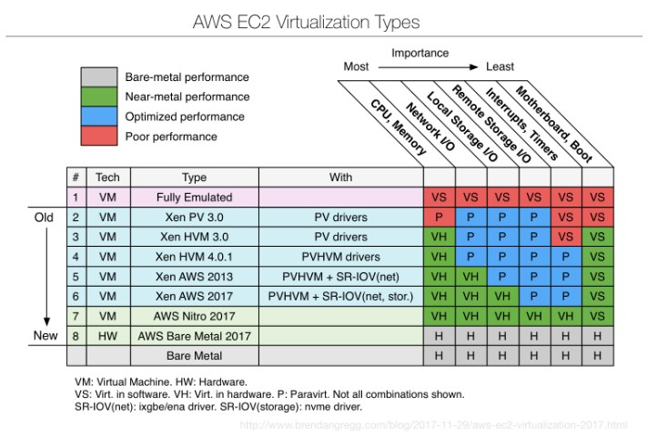  

### 原理
AWS提供的信息有限, 根据
https://www.twosixlabs.com/running-thousands-of-kvm-guests-on-amazons-new-i3-metal-instances
的解读: Niro基于KVM, 但去掉了qemu
> it is clear that the Nitro firmware includes a stripped-down version of the KVM hypervisor that forgoes the QEMU emulator and passes hardware directly to the running instance. In this sense, Nitro is more properly viewed as partitioning firmware that uses hardware self-virtualization features, including support for nested virtualization on the i3.metal instances.

* 基于Nitro的i3.metal实例, 可以直接运行自己的hypervisor

# virtio和vf互转
https://github.com/Netronome/virtio-forwarder

# 软件vf
https://www.usenix.net/legacy/events/wiov08/tech/full_papers/levasseur/levasseur_html

Standardized but Flexible I/O for Self-Virtualizing Devices

基本原理是使用pf驱动, 来模拟pcie总线, 对pf下面的逻辑功能做pcie配置空间的模拟, 使kernel认为它们是VF, 称软件VF.  
PF驱动对上是pcie设备, 对下是pcie总线.  
软件VF使用PF的mem空间和MSI-X中断, PF驱动负责分配这些资源.  
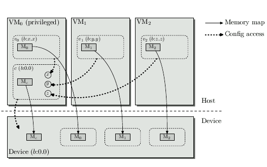  

# Netronome 智能网卡, 基于网络流处理器
Agilio CX 2x10GbE: `$440`
Agilio CX 2x25GbE: `$527`

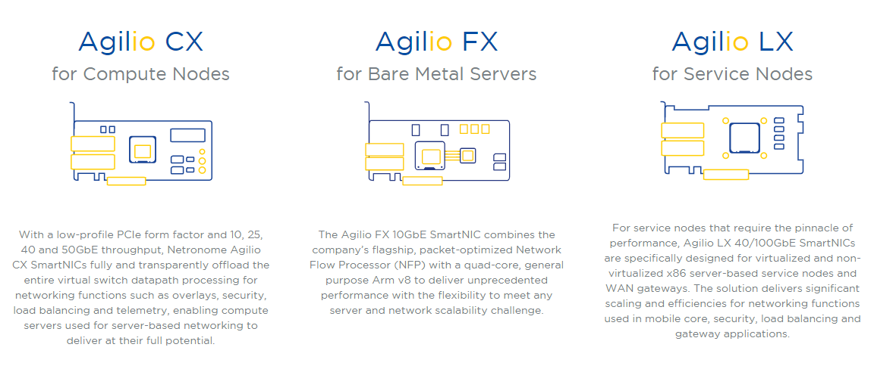  

另提供软件:

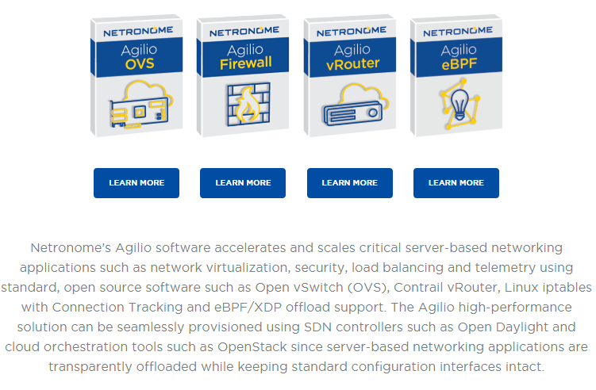  

## OVS offload
https://www.netronome.com/media/documents/WP_Agilio_SW.pdf

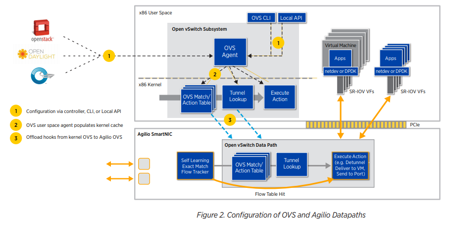  

## NFP core
https://www.netronome.com/media/documents/eBPF_HW_OFFLOAD_HNiMne8_2_.pdf

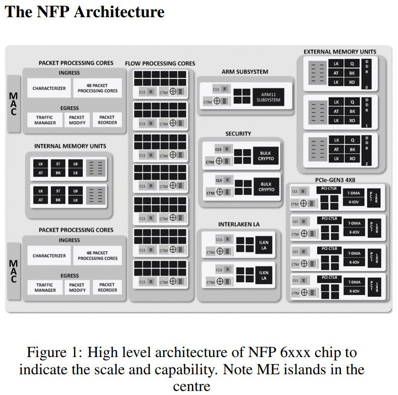  
片上有72 - 120个微核(ME), 12个一组叫flow processing cores.
一个ME有4线程或8线程, 共256个寄存器. 这些寄存器16个一组可以map到ebpf的寄存器(共11个)

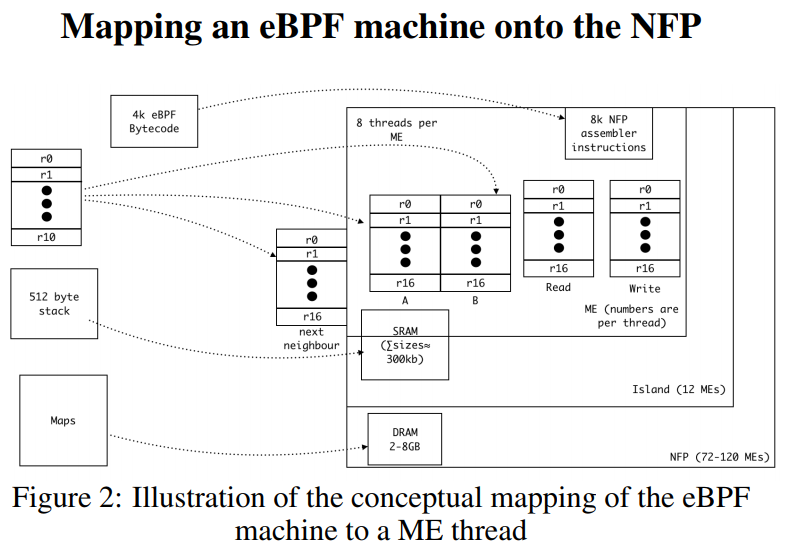  


# BCM智能网卡 BCM5880X 
支持:
* DPDK enhancement (mostly in poll mode driver) for SmartNIC representor pairing
* RoCE
* 128 VF on host; 64 VF on SOC

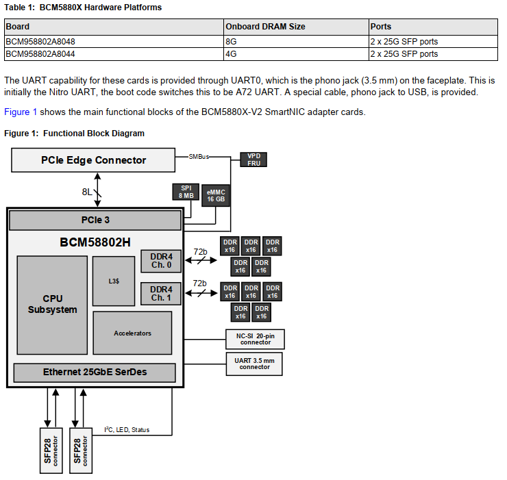  
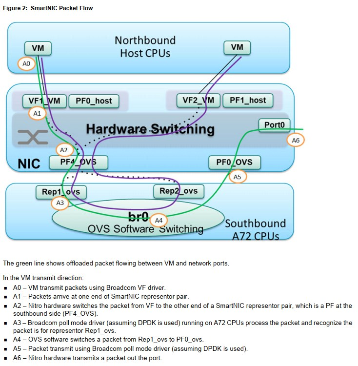  

## pairing model
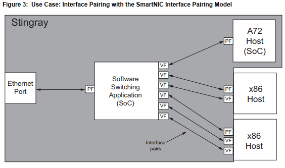  
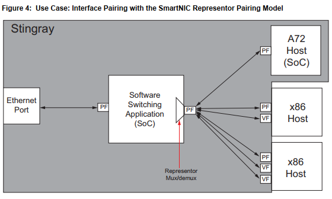  

在SOC的DPDK PMD里面, 用mbuf的metadata来标记接收端口和添加发送端口标记.

pairing会加tunnel头在报文里, 是由hw switch(或者叫internal loopback)来处理吗?

## 解读
A72 + eth core架构, A72跑OVS-DPDK, eth core支持HW switch, 提供VF接口给HOST的VM.  
A72跑的OVS没有vhost接口, 应该全是dpdk的物理口pmd. 这么看和virtio没有关系了.

## 软件
配置命令从host通过bcm kernel驱动发送到NIC上.

# MLX 智能网卡
## Innova 2
[mlx5+FPGA](http://120.52.51.16/www.mellanox.com/related-docs/prod_software/Innova-2_Flex_Open_for_Application_Acceleration_EN_Adapter_Card_User_Manual_18_11.pdf)

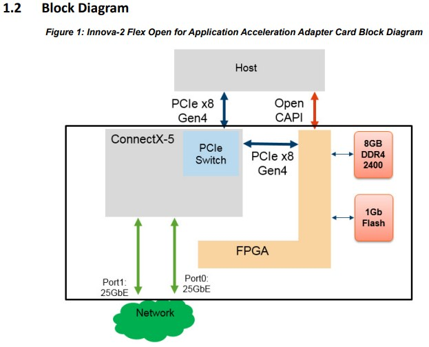  

* Open CAPI是(Open Coherent Accelerator Processor Interface), Power系列CPU才有.
* mlx5里面集成了PCIe switch, 使得mlx5core和FPGA能够被HOST分别识别为PCIe设备.  
Innova一代, mlx4core用私有总线和FPGA连接, FPGA对HOST不直接可见, 必须通过kernel module来交互.

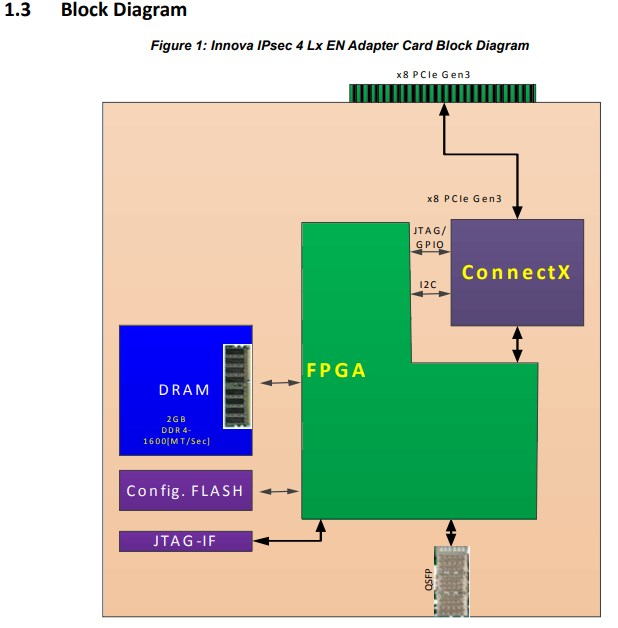  
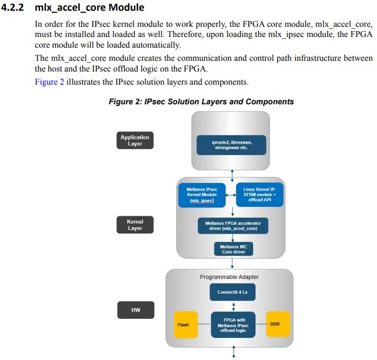  

## BlueField
mlx core + ARM core(up to 16个)  
主打:
* 存储: NVME SSD阵列; NVME over Fabric
* 网络: OVS NFV offload; VXLAN NVGRE等overlay网络offload; HPC offload

# EMC
> https://software.intel.com/en-us/articles/the-open-vswitch-exact-match-cache

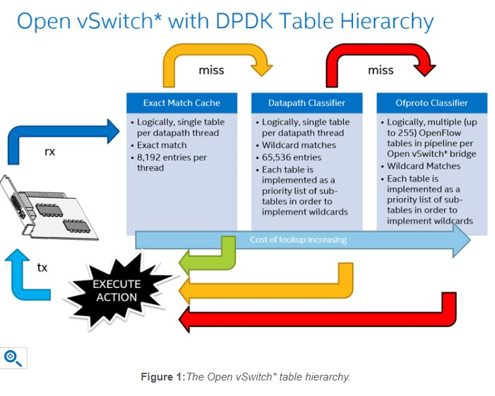  

## EMC处理
```c
//dpif-netdev.c
emc_processing( IN/OUT: dp_packet_batch, OUT: netdev_flow_key[]
            OUT: packet_batch_per_flow[])
    foreach packet in batch
        flowkey.miniflow = miniflow_extract (pkt)
        flowkey.hash = dpif_netdev_packet_get_rss_hash (pkt)
        dp_netdev_flow = emc_lookup(flowkey)
        if dp_netdev_flow
            /* EMC hit \0/ */
            Add packet to entry in packet_batch_per_flow[]
        else
            //EMC miss
            Write packet back to dp_packet_batch
```
> First, incoming packets have their netdev_flow_key calculated. Conceptually, the netdev_flow_key is a concatenation all the packet's header fields that OVS knows how to decode.
Then, this key is used to look up the EMC to find the corresponding dp_netdev_flow, which may (EMC hit) or may not (EMC miss) exist. The dp_netdev_flow structure contains an actions structure that determines how the packet should be processed, without having to perform a more expensive up-call to the datapath classifier.

> Once the action for a packet has been determined—which is to say once a dp_netdev_flow for the packet has been found—that action is not executed immediately. Instead, for performance reasons, all the packets for each action are batched together and returned via the packet_batch_per_flow argument. All the packets that missed the EMC are also batched together and returned via the dp_packet_batch argument to dp_netdev_input(). There, the packets that missed the EMC are passed to the datapath classifier with fast_path_processing(), and finally, the packet batches are dispatched using packet_batch_per_flow_execute().

> By batching packets in this manner, egressing packets to devices becomes more efficient as the cost of slow memory-mapped input/output (MMIO) operations is spread across multiple packets.


* netdev_flow_key是把所有报文头字段连起来的key
* emc查找后, 返回dp_netdev_flow, 包含action, 但不马上action
* emc miss后, 报文被保存到dp_packet_batch, 交给dp_netdev_input()处理, 后者执行fast_path_processing()来做datapath classifier:`dpcls_lookup()`
* 带action的报文集中一起, 调用packet_batch_per_flow_execute()


## EMC细节
* EM_FLOW_HASH_SHIFT来设置EMC的大小,  默认13位, 即8192
* 每个entry有570个字节, 一共4.4MB
* 默认是2 way 8192 set结构的cache, 可由EM_FLOW_HASH_SEGS配置N的个数
* 由报文头算hash, 可以硬件NIC算,也可以CPU算, 见dpif_netdev_packet_get_rss_hash()
    * 比如算出来hash是0x00B177EE, 而EM_FLOW_HASH_SEGS配成3, 那么在cache里, 这三个位置都可以: 0xB1, 0x77, or 0xEE

* 即使openflow有通配规则, 比如dst的mac是01:FC:09:xx:xx:xx则转发到某个端口, EMC也不会有通配的match, 还是每个匹配到的dst mac还是会有不同的entry
另外一个例子
> As another example, the IPv4 time-to-live (TTL) field is a known field to OVS, and is extracted into the miniflow structure described above. If a packet in a TCP connection takes a slightly different route before traversing OVS that packet will fail to match the existing EMC entry for the other packets in that TCP connection (as it will have a different TTL value); this will result in an up-call to the datapath classifier and a new entry into the EMC just for that packet.


* entry的插入不会fail, 报文的hash决定是哪(几)个可能的slot, 如果该slot空则插入, 如果不空, 则随机选一个(比如2选1)插入, 那么被插入的这个slot原来的值就没了.
不是基于least-recently used or least-frequently used算法.
  * 可以指定, 多少个packet在一个flow里才会被插入到EMC, 默认是1? 下面命令指定至少有5个packet的flow才会被EMC
  `$ ovs-vsctl --no-wait set Open_vSwitch . other_config:emc-insert-inv-prob=5`

* 每个entry指向一个dp_netdev_flow, 后者是个在datapath classifier里面的项, 它有生存时间的, 过期了就会被datapath classifier移除, 那同时也会移除EMC里相应的entry
* 每个PMD都有自己的EMC
* HASH key是根据OVS知道的报文头里的所有字段生成的; 也可以是NIC生成, 就和NIC做RSS的算法一样. 这样MLX网卡就不能对mac做hash了???


## miniflow
miniflow由miniflow_extract()算出, 包括了相对大而全的`struct flow`结构体来说, 较少的信息, 而且它是内存efficient的.


# OVS设计与实现
> The Design and Implementation of Open vSwitch-OVS设计与实现.pdf
OVS+DPDK Datapath 包分类技术


* OVS从一开始(inception)就支持openflow
* 用flow cache提高性能
* 开源并且多平台
* 上游controller通过openflow协议控制ovs-vswitchd的报文转发, 通过ovsdb协议和ovsdb-server通信, 来控制ovs的创建, 销毁, 端口添加/删除.
* ovs-vswitchd通过和上游的openflow控制器通信, 得到flow怎么转发, 有什么action, 比如修改报文, 报文采样和统计, 报文丢弃等
* data patch负责执行flow的action, 遇到没有命中的flow, 则上送给ovs-vswitchd
* flow可以包含报文的任意字段, 比如eht头, ip头, 端口等信息, 也可以是报文外的metadata, 比如ingress端口号.
## OVS的tuple space classifier
* 对同一个format的flow, 分类器为其创建一个hash表; 比如一个只看src mac和dst mac的flow, 对应一个hash表; 一个看src ip的flow, 对应另一个hash表
* 对一个进入分类器的报文, 分类器会对所有的hash表进行搜索匹配, 如果有多个匹配结果, 则取优先级最高的一个.
* 最开始的datapath是个内核模块, classifier代码都在内核态, 但upstream社区不接受. 后来的方案是内核模块实现microflow cache, 这是个hash表; 未被该表匹配到的报文会送到userspace, 查openflow流表, 这个过程是性能瓶颈, 报文不仅要在内核态和用户态传递, 还要走tuple classifier流程.
    * 一个方法是批处理模式和多线程, 比如一次上送32个报文给多个用户态thread的classifier. 但该方法治标不治本
    * 所以, 后来用megaflow cache替代了microflow cache, 它也是一个flow查找表, 但和后者相比, megaflow支持任意字段匹配; 同样的, megaflow对不同format的flow有不同的hash表, 一个报文的平均查找hash表的个数为(n+1)/2, 这也是不小的开销;
    * 所以, 再后来, microflow cache当做第一级, megaflow cache当做第二级

* openflow有200+个bit来做匹配, 但可以只看其中的一部分field, 比如L2 mac learning, 只看mac地址, 那么从它产生的megaflow也只关心mac字段, 其他字段是wildcard; 此时, 比如新增一个flow, 要看TCP的dst port, 那么是否所有的报文都要开始检查dst port了? 好像是的...
下面是一些针对这个问题的优化:
    * tuple优先级排序: 这里tuple是指某个format(或者说mask)的hash表, 即对这些format的hash表排序.
    * staged查表: 对一次全匹配来说, 包括metadata, L2, L3, L4, 分解成与操作, 即metadata && L2 && L3 && L4都必须匹配, 有一个stage不匹配就提前退出
    * Prefix Tracking: 对ip地址/掩码形式的flow用单词查找树结构做优化
## cache的invalidate
cache在很多时候需要更新, 比如openflow的流表的改变需要更新megaflow, 但能够精确定位到改变哪些吗? 似乎不太现实, 那么就invalidate整个datapath. 后面来的报文走first packet流程.
再后面的优化包括多线程来setup flow, 以及多线程去多flow的eviction(回收, 驱逐)


# Aliyun smartNIC
https://www.alibabacloud.com/blog/zero-copy-optimization-for-alibaba-cloud-smart-nic-solution_593986
* virtio + sriov = AVS(Application Virtual Switch), AVS和OVS功能类似, 最开始是纯软件实现

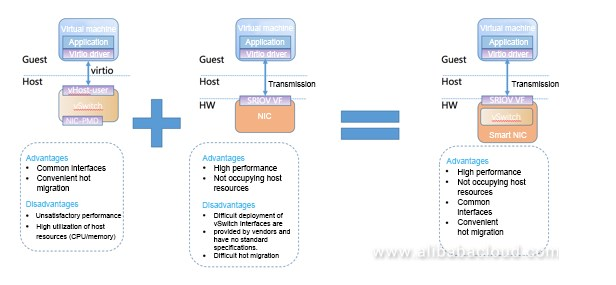  

* 纯软件的AVS需要加速, 所以有了后面的HW smartNIC
* 这个smartNIC是个标准的NIC + CPU, slow path和fast path分离
* 有个dpdk-based的程序跑在host上, 负责VF到virtio的转换.

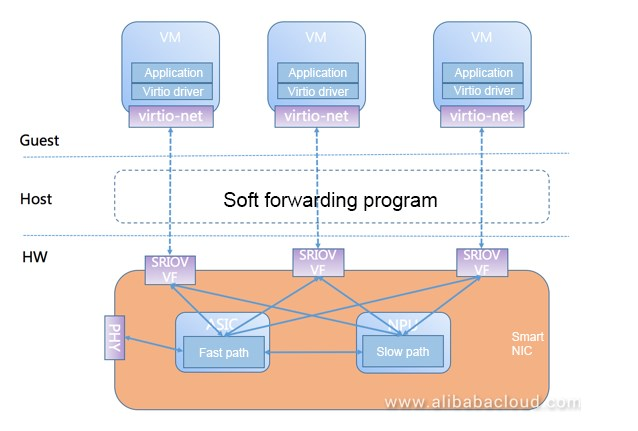  

* dpdk数据结构

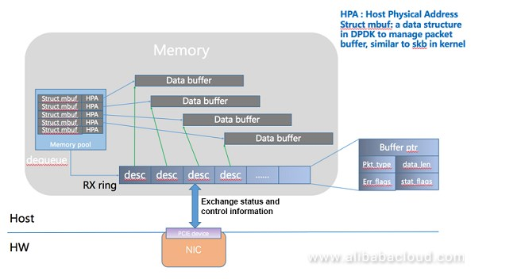  

* 收包流程

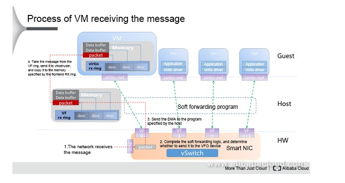  


## 零拷贝
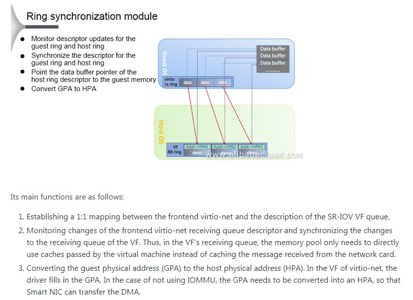  

* NIC直接DMA到VM的内存, 在host上跑的转换进程只负责VF格式到virtio格式的转换.
* 性能提高40%


# Azure FPGA SDN
## pdf
Azure Accelerated Networking: SmartNICs in the Public Cloud 


### 问题
* cpu的单流性能不好
We show that FPGAs are the best current platform for offloading our networking stack as ASICs do not provide sufficient programmability, and embedded CPU cores do not provide scalable performance, **especially on single network flows**. 
* AccelNet: providing consistent <15us VM-VM TCP latencies and 32Gbps throughput
* Azure的虚拟网络功能基于在host/hyperviser上运行的软件, vSwitch, 微软叫Virtual Filtering Platform (VFP)
* vSwitch类的实现, 最大的问题是要消耗HOST资源来打通NIC到VM路径, 包括拷贝报文, 注入中断给VM. 
* SRIOV的性能和隔离好, 但问题在于, 它不能处理SDN的策略, 通常这些策略都是在host上的vSwitch跑的.


### 用NIC来卸载流表来解决这些问题:
* 微软的流表Generic Flow Table(GFT)是match-action的一张大表, 每条流就是L2/L3/L4的元组
查不到表的flow, 通常是这个flow的首报文, 被上送到host上的VFP软件, 软件生成规则添加到到GFT表, 然后可以用硬件处理
* 总的来说, host软件处理首报文, 后面的报文交给SmartNIC查exact-match找action
即使很短的flow, 至少也有7-10个报文, 除了首报文, 能被加速的报文比例也挺大的.
* 数据中心3-5年服务器换代, CPU应该更多的被卖个用户, 相对于卖给用户的收益($900/year)来说, 用CPU来跑vSwitch太贵了.
* ASIC周期太长, multicore SOC在10G节点还可以, 但单核速度跟不上40G以后的节点, 而且核数也需要大大增加. 这带来了比较高的latency和抖动.
因为通常一个流会被通一个core处理, 是run to complete模式. 
* 以DPDK为代表的PMD提供了不错的性能和可编程性, 但上文说了, 消耗host上的CPU就是原罪.


### 微软选择FPGA
* 人们对FPGA通常的问题以及微软的解答: 1. 比ASIC大 -- 没那么大 2. 贵 -- 没那么贵, 因为量大 3. 编程难 --  确实难, 多招5个人搞FPGA开发, 软硬件协同开发, 搞敏捷. 4. 不好部署 -- 自己写工具(FPGA供应商提供一部分) 5. 和FPGA厂家锁定 -- 一共就两家, 用system verilog保证移植.
* FPGA的定位: 是NIC的增强, 而不是替代NIC, 主要用于offload SDN.

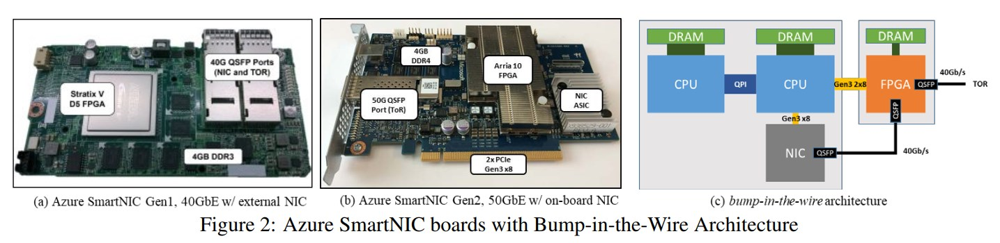  

* FPGA的driver被放在NIC的driver里, 叫GFT Lightweight Filter (LWF), 对外来说就是一个带GFT卸载功能的NIC
    * 首报文叫做exception packet, 被发往host的VFP. -- slow path
    * 为了知道TCP的状态, 当FPGA收到TCP终结报文, 比如有SYN, RST or FIN 标记的, FPGA复制报文, 一份走正常match-action路径(fast path),  一份发给host的VFP, 后者就知道这个tcp连接结束了, 从而删除这个规则.

    * 下图表示exception packet的处理流程 -- slow path.

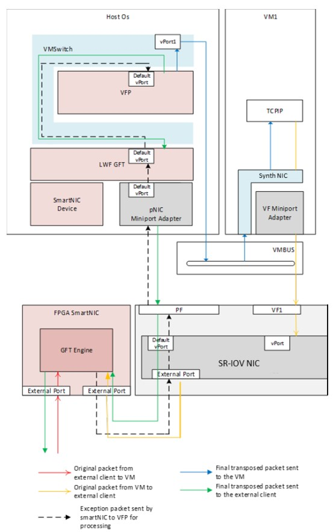  

* FPGA里面offload的核心: GFT engine
    * 一共两个报文处理单元, 每个单元都有四个组件, 如下图所示

    * parser负责解析报文头, 生成唯一的flow key

    * 在match阶段, 根据flow key算hash, 从而确定cache index. 一级cache在片内, 能保存2K个flow; 二级cache在片上的DDR里, 支持1M个flow; 剩下的flow table在DDR里, 不限个数.

    * 在action阶段, 根据查到的规则修改报文头. action执行的是微码.

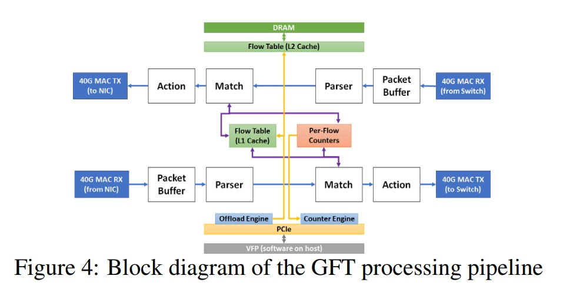  

* host的VFP通过pcie同步流表(GFT), GFT有个更新计数器用于同步


### 性能
* 在一个tcp连接里, 发送1M个ping, 普通的accel net平均延时50us, 99.9%在300us内; smartNIC方案下, 平均延时17us, 99.9%在80us内.
* 在DB query场景下, 平均延时从1ms下降到300us.


## ppt
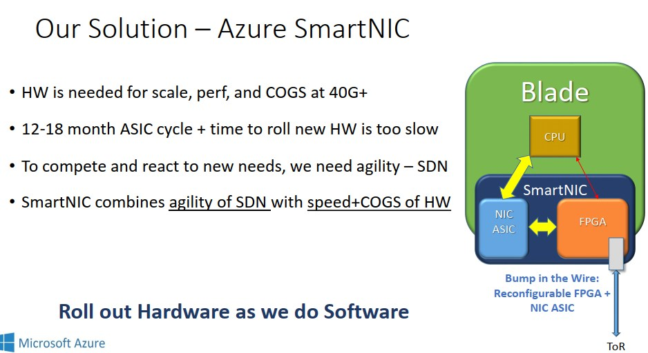  
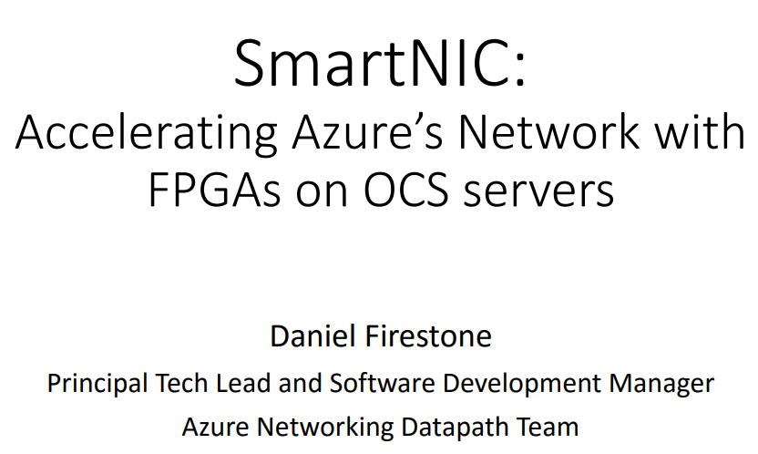  
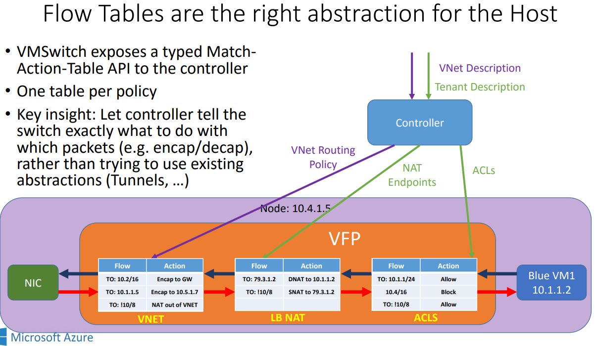  
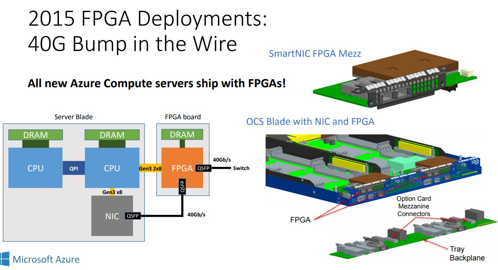  
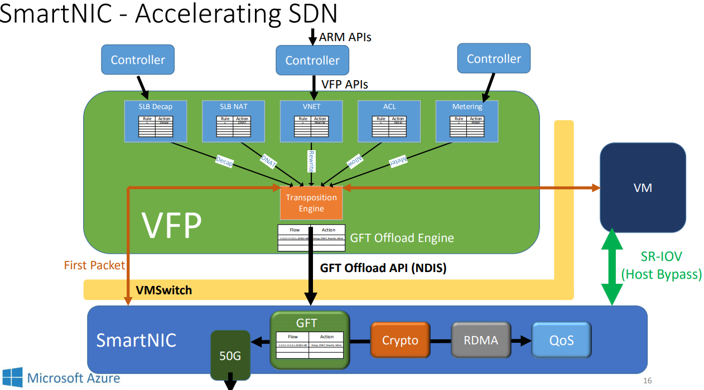  
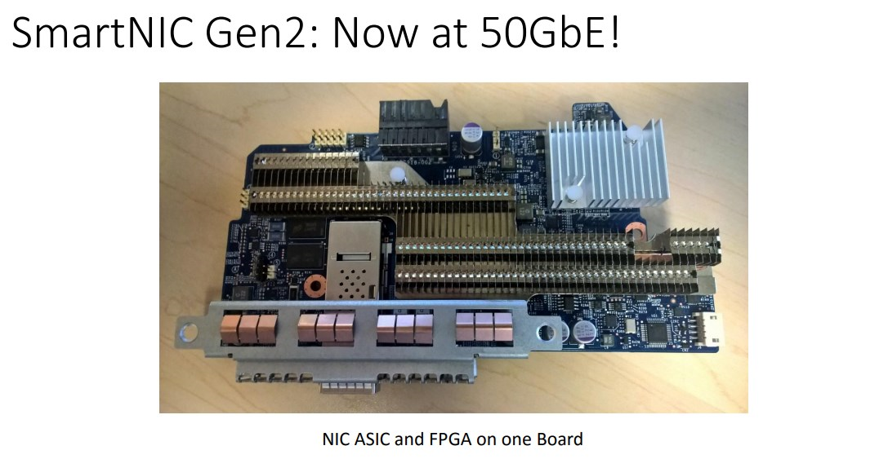  
