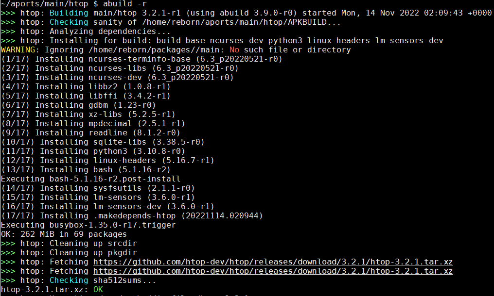
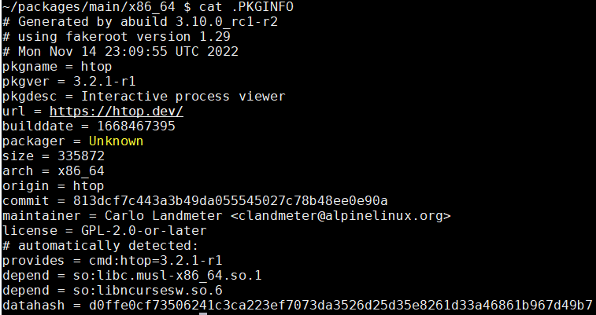
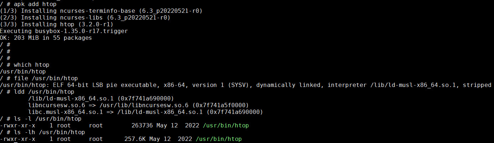
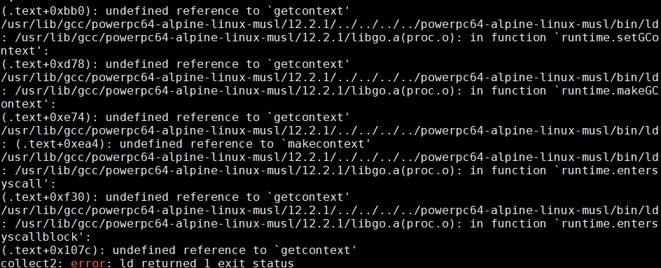
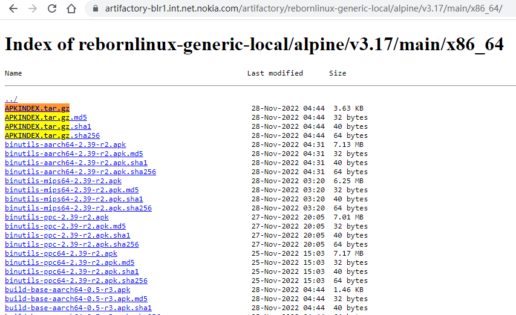

- [现代化的工程系统](#现代化的工程系统)
- [使用subgroup来组织repo](#使用subgroup来组织repo)
- [组织清爽, 源代码干净](#组织清爽-源代码干净)
- [发布周期](#发布周期)
- [aports](#aports)
	- [交叉编译](#交叉编译)
		- [交叉编译概念](#交叉编译概念)
		- [alpine中的不同arch](#alpine中的不同arch)
		- [结论](#结论)
	- [CHOST在alpine中的应用](#chost在alpine中的应用)
- [openrc](#openrc)
- [musl libc](#musl-libc)
- [编译htop实例](#编译htop实例)
	- [准备alpine编译环境](#准备alpine编译环境)
		- [安装alpine-sdk](#安装alpine-sdk)
		- [准备普通用户](#准备普通用户)
	- [命令汇总](#命令汇总)
	- [开始编译htop](#开始编译htop)
		- [`abuild checksum`](#abuild-checksum)
		- [`abuild -r`](#abuild--r)
		- [测试本地编译的apk](#测试本地编译的apk)
		- [编译选项由`/etc/abuild.conf`指定](#编译选项由etcabuildconf指定)
- [packages](#packages)
	- [build-base](#build-base)
- [abuild](#abuild)
	- [abuild.in](#abuildin)
	- [functions.sh](#functionssh)
	- [支持交叉编译](#支持交叉编译)
	- [交叉编译实例](#交叉编译实例)
	- [处理依赖](#处理依赖)
	- [distfiles缓存](#distfiles缓存)
- [apk使用](#apk使用)
	- [bootstrap](#bootstrap)
	- [编译gccgo for ppc](#编译gccgo-for-ppc)
	- [使用交叉编译的gccgo工具链](#使用交叉编译的gccgo工具链)
		- [调试过程](#调试过程)
		- [context相关符号找不到的问题](#context相关符号找不到的问题)
		- [最终操作](#最终操作)
		- [gccgo工具链里有什么](#gccgo工具链里有什么)
	- [编译gcgo前端](#编译gcgo前端)
- [repository 维护](#repository-维护)
	- [apk index文件](#apk-index文件)
	- [上传编译好的apk](#上传编译好的apk)
	- [更新`APKINDEX.tar.gz`文件](#更新apkindextargz文件)
		- [解决签名问题](#解决签名问题)
	- [更新apk index命令完整版(增量方式)](#更新apk-index命令完整版增量方式)
	- [下载并重建index(重打包方式)](#下载并重建index重打包方式)
	- [上传](#上传)
	- [删除main](#删除main)
- [APKBUILD 文件](#apkbuild-文件)
	- [depends](#depends)
	- [depends\_dev](#depends_dev)
	- [子package依赖](#子package依赖)
- [针对CPU优化](#针对cpu优化)
	- [普通abuild编译](#普通abuild编译)
	- [交叉编译的bootstrap](#交叉编译的bootstrap)
	- [为什么mips64默认是软浮点?](#为什么mips64默认是软浮点)
		- [musl](#musl)
		- [gcc](#gcc)
			- [octeon3](#octeon3)
			- [e500-mc](#e500-mc)
			- [e6500](#e6500)
			- [powerpc](#powerpc)
	- [引入新CPU架构参考](#引入新cpu架构参考)

# 现代化的工程系统
alpine linux的全部开发都在  
https://gitlab.alpinelinux.org/alpine  
mirror: https://git.alpinelinux.org/
* 自己搭建的gitlab服务器, 允许外部用户注册, fork库, 并提交MR
* 使用gitlab-ci的CI/CD做build test
* 用gitlab issue来跟踪bug
* 文档也是repo管理, 使用[Antora Playbook](https://docs.antora.org/antora/latest/playbook/)发布, 网页入口是 https://alpinelinux.org/

# 使用subgroup来组织repo
比如CI/CD工具库在`alpine/infra/docker/alpine-gitlab-ci`下面, 先是根alpine, 再是infra, 再是docker, 最后是repo

# 组织清爽, 源代码干净
比如`alpine-gitlab-ci/-/blob/master/overlay/usr/local/bin/build.sh`里面的shell 输出代码:
```shell
: "${CI_ALPINE_BUILD_OFFSET:=0}"
: "${CI_ALPINE_BUILD_LIMIT:=9999}"

msg() {
    local color=${2:-green}
    case "$color" in
        red) color="31";;
        green) color="32";;
        yellow) color="33";;
        blue) color="34";;
        *) color="32";;
    esac
    printf "\033[1;%sm>>>\033[1;0m %s\n" "$color" "$1" | xargs >&2
}

verbose() {
    echo "> " "$@"
    # shellcheck disable=SC2068
    $@
}

debugging() {
    [ -n "$CI_DEBUG_BUILD" ]
}

debug() {
    if debugging; then
        verbose "$@"
    fi
}

die() {
    msg "$1" red
    exit 1
}

capture_stderr() {
    "$@" 2>&1
}

report() {
    report=$1

    reportsdir=$APORTSDIR/logs/
    mkdir -p "$reportsdir"

    tee -a "$reportsdir/$report.log"
}
```

# 发布周期
一年两个大版本, 通常在5月和11月发布. 每个版本维护2年.


# aports
alpine支持的package都放在[aports](https://gitlab.alpinelinux.org/alpine/aports)这个库下面.
* main: alpine core team直接支持的package
* community: 由社区支持的package

因为aports下面的package非常多, 用gitlab网页浏览会非常慢.
用[这个简单的git网页会快](https://git.alpinelinux.org/aports/tree/?h=3.16-stable)

参考: https://wiki.alpinelinux.org/wiki/Repositories

`/etc/apk/repositories`是package的配置
```
/ # cat /etc/apk/repositories
https://dl-cdn.alpinelinux.org/alpine/v3.15/main
https://dl-cdn.alpinelinux.org/alpine/v3.15/community
```
比如`https://dl-cdn.alpinelinux.org/alpine/v3.15/main`目录下包括了所有arch的预编译好的apk  
  
点进去看这些apk的修改时间是不一样的, 说明apk是按需编译的.

## 交叉编译
似乎可以用bootstrap.sh来生成交叉编译的工具链  
参考: [musl-cross-make](https://github.com/richfelker/musl-cross-make.git)

### 交叉编译概念
在交叉编译中, 经常会出现`--build`, `--host`, `--target`概念.
* `--build`: 在哪编译
* `--host`: 编译后的程序在哪运行
* `--target`: 编译后的程序可以处理的arch

比如一般build就是x86_64服务器, 要编译gcc, 这个gcc也在x86_64上跑, 但要产生arm指令集:
* `--build`: x86_64
* `--host`: x86_64
* `--target`: arm

再比如在x86_64服务器编译htop, 这个htop在arm上跑
* `--build`: x86_64
* `--host`: arm
* `--target`: 不需要

参考:  
* https://sites.google.com/site/readliner/study/host-target-build
* https://gcc.gnu.org/onlinedocs/gccint/Configure-Terms.html
* https://www.gnu.org/software/autoconf/manual/autoconf-2.69/html_node/Hosts-and-Cross_002dCompilation.html

> The configure and build process has a long and colorful history, and can be confusing to anyone who doesn’t know why things are the way they are. While there are other documents which describe the configuration process in detail, here are a few things that everyone working on GCC should know.

> There are three system names that the build knows about: the machine you are building on (build), the machine that you are building for (host), and the machine that GCC will produce code for (target). When you configure GCC, you specify these with --build=, --host=, and --target=.

> Specifying the host without specifying the build should be avoided, as configure may (and once did) assume that the host you specify is also the build, which may not be true.

> If build, host, and target are all the same, this is called a native. If build and host are the same but target is different, this is called a cross. If build, host, and target are all different this is called a canadian (for obscure reasons dealing with Canada’s political party and the background of the person working on the build at that time). If host and target are the same, but build is different, you are using a cross-compiler to build a native for a different system. Some people call this a host-x-host, crossed native, or cross-built native. If build and target are the same, but host is different, you are using a cross compiler to build a cross compiler that produces code for the machine you’re building on. This is rare, so there is no common way of describing it. There is a proposal to call this a crossback.

> If build and host are the same, the GCC you are building will also be used to build the target libraries (like libstdc++). If build and host are different, you must have already built and installed a cross compiler that will be used to build the target libraries (if you configured with --target=foo-bar, this compiler will be called foo-bar-gcc).

> In the case of target libraries, the machine you’re building for is the machine you specified with --target. So, build is the machine you’re building on (no change there), host is the machine you’re building for (the target libraries are built for the target, so host is the target you specified), and target doesn’t apply (because you’re not building a compiler, you’re building libraries). The configure/make process will adjust these variables as needed. It also sets $with_cross_host to the original --host value in case you need it.

> The libiberty support library is built up to three times: once for the host, once for the target (even if they are the same), and once for the build if build and host are different. This allows it to be used by all programs which are generated in the course of the build process.

### alpine中的不同arch
原始代码在`abuild/functions.sh.in`

安装在:
`/usr/share/abuild/functions.sh`
```
arch_to_hostspec() {
	case "$1" in
	aarch64)	echo "aarch64-alpine-linux-musl" ;;
	armel)		echo "armv5-alpine-linux-musleabi" ;;
	armhf)		echo "armv6-alpine-linux-musleabihf" ;;
	armv7)		echo "armv7-alpine-linux-musleabihf" ;;
	loongarch32)	echo "loongarch32-alpine-linux-musl" ;;
	loongarchx32)	echo "loongarchx32-alpine-linux-musl" ;;
	loongarch64)	echo "loongarch64-alpine-linux-musl" ;;
	mips)           echo "mips-alpine-linux-musl" ;;
	mips64)         echo "mips64-alpine-linux-musl" ;;
	mipsel)         echo "mipsel-alpine-linux-musl" ;;
	mips64el)       echo "mips64el-alpine-linux-musl" ;;
	ppc)		echo "powerpc-alpine-linux-musl" ;;
	ppc64)		echo "powerpc64-alpine-linux-musl" ;;
	ppc64le)	echo "powerpc64le-alpine-linux-musl" ;;
	riscv32)	echo "riscv32-alpine-linux-musl" ;;
	riscv64)	echo "riscv64-alpine-linux-musl" ;;
	s390x)		echo "s390x-alpine-linux-musl" ;;
	x86)		echo "i586-alpine-linux-musl" ;;
	x86_64)		echo "x86_64-alpine-linux-musl" ;;
	*)		echo "unknown" ;;
	esac
}
```

大概看了一下`/usr/share/abuild/functions.sh`
* CBUILD从`apk --print-arch`而来, 检测当前的系统
* CHOST默认为CBUILD, 除非环境变量指定
* CTARGET默认为CHOST, 除非环境变量指定
* CARCH从CHOST而来
* 因为arch和hostspec可以通过函数`arch_to_hostspec`/`hostspec_to_arch`互相转换, 而且二者虽然形式不同但意义相同且唯一, 所以`CHOST` `CTARGET`也可以传入arch名.
  比如命令行传入`CHOST=ppc`, abuild会在内部把`CHOST`转换成`powerpc-alpine-linux-musl`

```shell
[ -z "$CBUILD" ] && CBUILD="$(${APK:-apk} --print-arch 2>/dev/null || :)"
[ -z "$CHOST" ] && CHOST="$CBUILD"
[ -z "$CTARGET" ] && CTARGET="$CHOST"

[ -z "$CARCH" ] && CARCH="$(hostspec_to_arch $CHOST)"
```

和[autoconf手册](https://www.gnu.org/software/autoconf/manual/autoconf-2.69/html_node/Hosts-and-Cross_002dCompilation.html)中说的一致:
> The relationship between build, host, and target have been cleaned up: the chain of default is now simply: target defaults to host, host to build, and build to the result of config.guess.

### 结论
比如我要在x86_64机器上, 交叉编译出一个ppc的编译器, 该编译器在x86_64运行, 但产生ppc的指令集.
* CBUILD不用指定, 这里是x86_64
* CHOST很重要, 决定了目标apk会被安装到哪个arch
  * 如果是编译gcc, CHOST就是x86_64, CTARGET是ppc
  * 如果是编译普通包, 比如musl或者libucontext, CHOST是ppc, CTARGET无意义.


## CHOST在alpine中的应用
比如`libucontext`这个包, 在`~/aports/main/libucontext`下  

如果直接`abuild -r`, 会编译出`libucontext-1.2-r0.apk`, 放在`~/packages/main/x86_64/`下面

我在系统上已经编译了ppc的交叉工具链, 则  
如果`CHOST=ppc abuild -r`, 则会交叉编译出`libucontext-1.2-r0.apk`, 放在`~/packages/main/ppc/`下面

但我的系统没有mips交叉工具链, 会提示出错:  
如果`CHOST=mips abuild -r`, 会提示`build-base-mips (no such package)`

结论:
在有相应交叉工具链的情况下, 用`CHOST=xxx`可以交叉编译package, 并放到对应的`~/packages/main/arch`下面.

# openrc
alpine使用openrc  
https://wiki.alpinelinux.org/wiki/OpenRC

# musl libc
alpine使用musl libc, 我看好musl的轻量简洁.  
[几种libc的比较](http://www.etalabs.net/compare_libcs.html)

# 编译htop实例
参考: https://wiki.alpinelinux.org/wiki/Creating_an_Alpine_package

alpine通过aports库管理package, 通过abuild来编译package.
编译也是在一个alpine系统下进行的.

下面我使用docker方式先在x86_64上启动alpine, 然后在里面配置编译环境, 再以编译htop为例, 先梳理一下alpine编译包的过程.

## 准备alpine编译环境
很简单, 先运行alpine容器:
`docker run -it alpine`

### 安装alpine-sdk
`apk add alpine-sdk`

alpine-sdk是最基础的编译系统, 包括基础库, musl c库, gcc, make等非常基础的工具.

### 准备普通用户
alpine默认是root登陆的, 但后面的abuild必须用普通用户来执行. 这里我使用`doas`来替代`sudo`, 因为`doas`包更小, 更符合alpine的理念.
```shell
apk add alpine-sdk
apk add doas
ln -s /usr/bin/doas /usr/bin/sudo	
echo "permit persist :wheel" >> /etc/doas.d/doas.conf
	
adduser -g "reborn" reborn
	passwd: platform
addgroup reborn wheel
addgroup reborn abuild
```

切换到普通用户
```shell
su reborn
cd ~
abuild-keygen -a -i
cat /etc/abuild.conf
cat ~/.abuild/abuild.conf
```

## 命令汇总
```shell
docker run -it alpine:edge
#使用稳定版本
docker run -it alpine:3.17

# 好像wget只认小写的proxy
#export http_proxy=http://10.158.100.9:8080
export http_proxy=http://10.158.100.6:8080
export https_proxy=$http_proxy
export HTTP_PROXY=$http_proxy
export HTTPS_PROXY=$http_proxy

apk update
apk upgrade

apk add alpine-sdk
apk add doas
ln -s /usr/bin/doas /usr/bin/sudo
echo "permit persist :wheel" >> /etc/doas.d/doas.conf

# passwd: platform
adduser -g "reborn" reborn
addgroup reborn wheel
addgroup reborn abuild

su reborn
cd ~
abuild-keygen -a -i
# cat /etc/abuild.conf
# cat ~/.abuild/abuild.conf

git config --global user.name "Bai Yingjie"
git config --global user.email "yingjie.bai@nokia-sbell.com"
#git clone https://gitlab.alpinelinux.org/alpine/aports --depth=1
git clone https://gitlabe1.ext.net.nokia.com/rebornlinux/aports.git --depth=1

cd aports/main/htop
abuild checksum && abuild -r
```

## 开始编译htop
编译aports中的package, 比如本例中的htop, 需要先clone aports库  
`git clone https://gitlab.alpinelinux.org/alpine/aports --depth=1`  
这里我使用`--depth=1`只取最后一个commit, 可以减小clone库需要的时间.

编译需要在package目录下进行, 只需要两个命令就好了:
```shell
cd aports/main/htop
abuild checksum && abuild -r
```

下面梳理一下编译过程

### `abuild checksum`
先下载了源码, 源码路径在`APKBUILD`文件里指定的:
```shell
pkgname=htop
pkgver=3.2.1
pkgrel=1
pkgdesc="Interactive process viewer"
url="https://htop.dev/"
arch="all"
license="GPL-2.0-or-later"
makedepends="ncurses-dev python3 linux-headers lm-sensors-dev"
subpackages="$pkgname-doc"
source="https://github.com/htop-dev/htop/releases/download/$pkgver/htop-$pkgver.tar.xz"
options="!check" # no upstream/available test-suite
```
注意到版本号`pkgver`是通用的三段式, `pkgrel`是说release号.  
源码路径用`source`指定.

### `abuild -r`
这个命令先是是递归的处理依赖, 然后编译.
```shell
>>> htop: Analyzing dependencies...
>>> htop: Installing for build: build-base ncurses-dev python3 linux-headers lm-sensors-dev
```
`makedepends`说htop依赖`"ncurses-dev python3 linux-headers lm-sensors-dev"`, 所以abuild就先下载安装这些依赖.

根据打印, abuild自己添加了`build-base`这个基础依赖. 注意这些依赖只是安装, 并没有现场编译. 这个过程很快.

  

编译的依赖是直接安装在系统里的, 编译完成后, abuild会移除这些依赖.
编译过程中的临时文件, 比如src等目录, 也会被移除.

后面就是解压源码包, 编译. 编译过程是htop的`APKBUILD`指定的:  
htop是典型的autoconf和make系统下的编译
```
build() {
        ./configure \
                --build=$CBUILD \
                --host=$CHOST \
                --prefix=/usr \
                --sysconfdir=/etc \
                --mandir=/usr/share/man \
                --localstatedir=/var \
                --enable-cgroup \
                --enable-taskstats
        make
}

package() {
        make DESTDIR="$pkgdir" pixmapdir=/usr/share/icons/hicolor/128x128/apps install
}
```

`configure`程序会自动检测当前系统类型:
```
checking build system type... x86_64-alpine-linux-musl
checking host system type... x86_64-alpine-linux-musl
...
后面会对gcc和libc做各种detect
...
最后打印summary
  platform:                  linux
  os-release file:           /etc/os-release
  (Linux) proc directory:    /proc
  (Linux) openvz:            no
  (Linux) vserver:           no
  (Linux) ancient vserver:   no
  (Linux) delay accounting:  no
  (Linux) sensors:           yes
  (Linux) capabilities:      no
  unicode:                   yes
  affinity:                  yes
  unwind:                    no
  hwloc:                     no
  debug:                     no
  static:                    no
```

编译完成后, 会进入package阶段.
该阶段会先进入fakeroot目录(一般是mktemp在`/var/tmp`下面生成的), 调用包的(比如htop的)`make install`, install到fakeroot目录, 然后打包.

在打包的过程中, 会做依赖解析:
```
>>> htop*: Tracing dependencies...
    so:libc.musl-x86_64.so.1
    so:libncursesw.so.6
```
生成`.PKGINFO`文件:  
  
这个文件中就包括so的依赖, 上图后三行.

顺利编译完成, 最后在`~/packages/main/x86_64`目录下, 有生成的apk文件:
```
~/packages/main/x86_64 $ ls -lh
total 136K
-rw-r--r--    1 reborn   reborn       825 Nov 14 02:10 APKINDEX.tar.gz
-rw-r--r--    1 reborn   reborn    119.1K Nov 14 02:10 htop-3.2.1-r1.apk
-rw-r--r--    1 reborn   reborn      9.4K Nov 14 02:10 htop-doc-3.2.1-r1.apk
```

安装后的htop很小, 会自动安装依赖`ncurses-terminfo-base`和`ncurses-libs`  
  

疑问: htop的`APKBUILD`并没有指定运行时依赖, `apk add`和`abuild`怎么知道的?

### 测试本地编译的apk
编译完成后, 对应apk包在`~/packages/main/x86_64`. 修改`/etc/apk/repositories`指向本地build, 就可以用`apk add`测试本地包了.

比如`/etc/apk/repositories`改成这样:
```
/home/reborn/packages/main
/home/reborn/packages/community
https://dl-cdn.alpinelinux.org/alpine/edge/main
https://dl-cdn.alpinelinux.org/alpine/edge/community

/media/sdc/apks
#http://dl-2.alpinelinux.org/alpine/v3.7/main
#http://dl-2.alpinelinux.org/alpine/v3.7/community
http://dl-2.alpinelinux.org/alpine/edge/main
http://dl-2.alpinelinux.org/alpine/edge/community
http://dl-2.alpinelinux.org/alpine/edge/testing
```

或者用`apk add`的`-X, --repository`功能:
`doas apk add --repository /home/USER/packages/testing $pkgname`

### 编译选项由`/etc/abuild.conf`指定
比如`/etc/abuild.conf`指定了:
```
~/aports/main/htop $ cat /etc/abuild.conf
export CFLAGS="-Os -fomit-frame-pointer"
export CXXFLAGS="$CFLAGS"
export CPPFLAGS="$CFLAGS"
export LDFLAGS="-Wl,--as-needed,-O1,--sort-common"
export GOFLAGS="-buildmode=pie"
# Do note that these should work with at least GDC and LDC
export DFLAGS="-Os"
```

和下面的`-Os -fomit-frame-pointer`是一致的
```
gcc -DHAVE_CONFIG_H -I.  -DNDEBUG -Os -fomit-frame-pointer -Wall -Wcast-align -Wcast-qual -Wextra -Wfloat-equal -Wformat=2 -Winit-self -Wmissing-format-attribute -Wmissing-noreturn -Wmissin
g-prototypes -Wpointer-arith -Wshadow -Wstrict-prototypes -Wundef -Wunused -Wwrite-strings -Wnull-dereference -pedantic -std=c99 -D_XOPEN_SOURCE_EXTENDED -DSYSCONFDIR="\"/etc\"" -I"./linux"
 -Os -fomit-frame-pointer -MT Panel.o -MD -MP -MF $depbase.Tpo -c -o Panel.o Panel.c &&\
```

# packages
## build-base
build-base是个元package, 方法就是列出依赖.  
APKBUILD如下:
```shell
# Maintainer: Natanael Copa <ncopa@alpinelinux.org>
pkgname=build-base
pkgver=0.5
pkgrel=3
url=http://dev.alpinelinux.org/cgit
pkgdesc="Meta package for build base"
depends="binutils file gcc g++ make libc-dev fortify-headers patch"
if [ "$CHOST" != "$CTARGET" ]; then
	pkgname="$pkgname-$CTARGET_ARCH"
	pkgdesc="$pkgdesc ($CTARGET_ARCH)"
	depends="binutils-$CTARGET_ARCH gcc-$CTARGET_ARCH g++-$CTARGET_ARCH $depends"
fi
arch="noarch"
license="MIT"
options="!check"

build() {
	:
}

package() {
	mkdir -p "$pkgdir"
}
```
如果是交叉编译`"$CHOST" != "$CTARGET"`, 包名就变成了`build-base-CTARGET_ARCH`, depends也增加了`"binutils-$CTARGET_ARCH gcc-$CTARGET_ARCH g++-$CTARGET_ARCH"`


# abuild

## abuild.in
https://gitlab.alpinelinux.org/alpine/abuild/-/blob/master/abuild.in

abuild其实是个ash脚本, 一般流程是:
```shell
all()
build_abuildrepo() {
	local part _check=check
	if options_has "checkroot"; then
		_check=check_fakeroot
	fi
	if ! want_check; then
		_check=true
	fi
	if ! apk_up2date || [ -n "$force" ]; then
		# check early if we have abuild key
		abuild-sign --installed
		logcmd "building $repo/$pkgname-$pkgver-r$pkgrel"
		local _starttime=$(date --utc +%s)
		msg "Building $repo/$pkgname $pkgver-r$pkgrel (using $program $program_version) started $(date -R)"

		# make sure SOURCE_DATE_EPOCH is set
		set_source_date

		for part in sanitycheck builddeps clean fetch unpack prepare mkusers build \
				$_check rootpkg; do
			runpart $part
		done
		local _endtime=$(date --utc +%s)
		local _difftime=$((_endtime - _starttime))
		msg "Build complete at $(date -R) elapsed time $((_difftime/3600))h $((_difftime/60%60))m $((_difftime%60))s"
		cleanup $CLEANUP
	fi
	update_abuildrepo_index
}

```

关键变量
* BOOTSTRAP

```shell
want_check() {
	[ -n "$ABUILD_BOOTSTRAP" ] && return 1
	cross_compiling && return 1
	options_has "!check" && return 1
	return 0
}

# build and install dependencies
builddeps() {
    ...
	case "$BOOTSTRAP" in
	no*)	BUILD_BASE="";;
	*)	if cross_creating || cross_compiling; then
			BUILD_BASE="build-base-$CTARGET_ARCH"
		else
			BUILD_BASE="build-base"
		fi
	esac
    ...
}
```
* CROSS_COMPILE
* CHOST CTARGET

```shell
# creating说的是正在build交叉工具链
# 比如此时BUILD=x86_64, HOST=x86_64, TARGET=ppc
cross_creating() {
	test "$CHOST" != "$CTARGET" -a -n "$CBUILDROOT"
}
# compiling说的是交叉工具链正在交叉编译目标
# 比如此时BUILD=x86_64, HOST=ppc, TARGET=ppc(理论上应该没有用到)
cross_compiling() {
	test "$CBUILD" != "$CHOST" -a -n "$CBUILDROOT"
}
```

## functions.sh
原始代码在`abuild/functions.sh.in`

安装在:
`/usr/share/abuild/functions.sh`

每次abuild运行时, 都被source一次.

设置默认值, 比如默认的各种路径和CC等.

## 支持交叉编译
functions.sh中, 直接支持交叉编译:
```shell
	if [ "$CHOST" != "$CTARGET" ]; then
		# setup environment for creating cross compiler
		[ -z "$CBUILDROOT" ] && export CBUILDROOT="$HOME/sysroot-$CTARGET_ARCH/"
	elif [ "$CBUILD" != "$CHOST" ]; then
		# setup build root
		[ -z "$CBUILDROOT" ] && export CBUILDROOT="$HOME/sysroot-$CTARGET_ARCH/"
		# prepare pkg-config for cross building
		[ -z "$PKG_CONFIG_PATH" ] && export PKG_CONFIG_PATH="${CBUILDROOT}/usr/lib/pkgconfig/"
		[ -z "$PKG_CONFIG_SYSROOT_DIR" ] && export PKG_CONFIG_SYSROOT_DIR="${CBUILDROOT}"
		# libtool bug workaround for extra rpaths
		[ -z "$lt_cv_sys_lib_dlsearch_path_spec" ] && \
			export lt_cv_sys_lib_dlsearch_path_spec="${CBUILDROOT}/lib ${CBUILDROOT}/usr/lib /usr/lib /lib /usr/local/lib"
		# setup cross-compiler
		if [ -z "$CROSS_COMPILE" ]; then
			export CROSS_COMPILE="${CHOST}-"
			export HOSTCC="$CC"
			export HOSTCXX="$CXX"
			export HOSTLD="$LD"
			export HOSTCPPFLAGS="$CPPFLAGS"
			export HOSTCXXFLAGS="$CXXFLAGS"
			export HOSTCFLAGS="$CFLAGS"
			export HOSTLDFLAGS="$LDFLAGS"
			export CC=${CROSS_COMPILE}$CC
			export CXX=${CROSS_COMPILE}$CXX
			export LD=${CROSS_COMPILE}$LD
			export CPPFLAGS="--sysroot=${CBUILDROOT} $CPPFLAGS"
			export CXXFLAGS="--sysroot=${CBUILDROOT} $CXXFLAGS"
			export CFLAGS="--sysroot=${CBUILDROOT} $CFLAGS"
			export LDFLAGS="--sysroot=${CBUILDROOT} $LDFLAGS"
		fi
	fi
```
* 如果`CHOST` 和 `CTARGET`不一样, 比如编译gcc时, 默认`CBUILDROOT="$HOME/sysroot-$CTARGET_ARCH/"`
* 如果`CBUILD`和`CHOST`不同, 说明正在用交叉编译器编译目标板的package.  
默认的`--sysroot`是`${CBUILDROOT}`, 被加到`CFLAGS`等变量中.

## 交叉编译实例
用我自己做的docker image, 交叉编译很简单:
```shell
# 用EXTRADEPENDS_TARGET增加依赖, 空格做列表
EXTRADEPENDS_TARGET="ncurses-dev" CHOST=ppc64 abuild -r
EXTRADEPENDS_TARGET="linux-headers musl musl-dev libucontext libucontext-dev" CTARGET=ppc64 abuild -r
```

## 处理依赖
native编译时, `build-base`是必选的依赖.  
交叉编译时, `build-base-$CTARGET_ARCH`是必选的依赖.

依赖又分build依赖和host依赖
```shell
calcdeps() {
	builddeps=
	hostdeps=

    # 在交叉编译的时候, $EXTRADEPENDS_BUILD被加入到builddeps
    # $EXTRADEPENDS_HOST和$EXTRADEPENDS_TARGET作用相同, 被加入到hostdeps
	if cross_compiling && [ -n "$makedepends_build" -o -n "$makedepends_host" ]; then
		for i in $EXTRADEPENDS_BUILD $1 $makedepends_build; do
			list_has $i $hostdeps && continue
			builddeps="$builddeps $i"
		done
		for i in $EXTRADEPENDS_HOST $EXTRADEPENDS_TARGET $makedepends_host; do
			[ "$pkgname" = "${i%%[<>=]*}" ] && continue
			list_has $i $hostdeps && continue
			subpackages_has ${i%%[<>=]*} || hostdeps="$hostdeps $i"
		done
    # 非交叉编译的时候(包括生成交叉工具链的时候)
    # $EXTRADEPENDS_BUILD和$EXTRADEPENDS_HOST被当作builddeps
    # 而$EXTRADEPENDS_TARGET则就是hostdeps
	else
		[ -z "$makedepends" ] && makedepends="$makedepends_build $makedepends_host"
		want_check && makedepends="$makedepends $checkdepends"
		for i in $EXTRADEPENDS_BUILD $EXTRADEPENDS_HOST $1 $depends $makedepends; do
			[ "$pkgname" = "${i%%[<>=]*}" ] && continue
			list_has $i $builddeps && continue
			subpackages_has ${i%%[<>=]*} || builddeps="$builddeps $i"
		done
		hostdeps="$EXTRADEPENDS_TARGET"
	fi
}
```

abuild本来就是编译用的, 编译过程中的依赖统统都是makedeps

deps函数就是用来安装依赖的. 先安装build依赖, 如果有`$CBUILDROOT`存在, 则安装host依赖.  
host依赖会被安装到`--root "$CBUILDROOT"`下面
```shell
deps() {
	[ -z "$hostdeps" -a -z "$builddeps" ] && calcdeps

	local _quiet="$1"
	[ -z "$_quiet" ] && msg "Installing for build:$builddeps"
	apk_add_makedeps make $_quiet $builddeps || return 1
	if [ -n "$CBUILDROOT" ]; then
		[ -z "$_quiet" ] && msg "Installing for host:$hostdeps"
		apk_add_makedeps host $_quiet --no-scripts \
			--root "$CBUILDROOT" --arch "$CTARGET_ARCH" $hostdeps \
			|| return 1
	fi
}
```

## distfiles缓存
由于某些原因, 在abuild fetch源代码阶段会失败, 通常是上游删除了对应版本的源码, 即上游的download url不再有效. 这个情况下, 可以使用alpine官方的distfiles:
`https://distfiles.alpinelinux.org/distfiles/v3.18/`

手动下载需要的源码版本, 并使用docker bind mount到`/var/cache/distfiles`就可以了.
比如
```shell
wget https://freeradius.org/ftp/pub/freeradius/freeradius-server-3.0.26.tar.gz
chown 4000:4000 freeradius-server-3.0.26.tar.gz

wget https://distfiles.alpinelinux.org/distfiles/v3.18/lpty-1.2.2-1.tar.gz
chown 4000:4000 lpty-1.2.2-1.tar.gz

wget https://distfiles.alpinelinux.org/distfiles/v3.18/rp-pppoe-4.0.tar.gz
chown 4000:4000 rp-pppoe-4.0.tar.gz

wget https://distfiles.alpinelinux.org/distfiles/v3.18/acpica-unix-20221020.tar.gz
chown 4000:4000 acpica-unix-20221020.tar.gz
```

# apk使用
前面说过, 在`/etc/apk/repositories`中可以配置apk使用本地包, 比如
```shell
cat /etc/apk/repositories
/home/reborn/packages/main
/home/reborn/packages/community
https://dl-cdn.alpinelinux.org/alpine/edge/main
https://dl-cdn.alpinelinux.org/alpine/edge/community
```
这样`apk add`会先去指定的本地目录搜索package

但如果用了`--root`来指定根目录, 就要配置目标root目录下的`etc/apk/repositories`

`--root`会使用目标root下的`etc/apk/repositories`和`etc/apk/arch`

比如
```shell
echo /home/reborn/packages/main > /home/reborn/sysroot-ppc/etc/apk/repositories

~ $ cat /home/reborn/sysroot-ppc/etc/apk/repositories
/home/reborn/packages/main
~ $ cat /home/reborn/sysroot-ppc/etc/apk/arch
ppc

#配置好root目录下的repositories, 就可以安装本地包了, 比如
sudo apk --root /home/reborn/sysroot-ppc/ add libedit
```

## bootstrap
```shell
aports/scripts/bootstrap.sh ppc64 gccgo,norust,nokernel
aports/scripts/bootstrap.sh ppc gccgo,norust,nokernel
```

## 编译gccgo for ppc
```shell
#需要卸载冲突包
# apk del gcc-ppc gcc-go-ppc gcc-ppc64 gcc-go-ppc64 gcc-mips64 gcc-aarch64
# rm -rf /home/reborn/sysroot*
APKBUILD=aports/main/gcc/APKBUILD EXTRADEPENDS_TARGET="linux-headers musl musl-dev libucontext libucontext-dev" CTARGET=ppc abuild -r
APKBUILD=aports/main/gcc/APKBUILD EXTRADEPENDS_TARGET="linux-headers musl musl-dev libucontext libucontext-dev" CTARGET=ppc64 abuild -r
```

## 使用交叉编译的gccgo工具链

### 调试过程
因为要在x86上使用交叉编译器gccgo, 所以先要在x86上安装
```shell
sudo apk add gcc-ppc64 gcc-go-ppc64
# gcc-go-ppc64和gcc-go-ppc有冲突, 会提示
(1/1) Installing gcc-go-ppc64 (12.2.1_git20220924-r4)
ERROR: gcc-go-ppc64-12.2.1_git20220924-r4: trying to overwrite usr/lib/libgo.a owned by gcc-go-ppc-12.2.1_git20220924-r4.
# usr/lib/libgo.a, usr/lib/libgo.so, usr/lib/libgobegin.a, usr/lib/libgolibbegin.a冲突

# 还需要解压gcc-go-ppc64-12.2.1_git20220924-r4.apk到目标sysroot
# 现在不需要了
apk fetch gcc-go-ppc64
tar xvf gcc-go-ppc64-12.2.1_git20220924-r4.apk -C /home/reborn/sysroot-ppc64 --exclude usr/libexec* --exclude usr/bin*
```
注: 按理说`apk add gcc-go-ppc64`后, gccgo程序应该会使用在x86_64编译机的`/usr/lib/go/12.2.1/powerpc64-alpine-linux-musl`下面的预编译的标准库(*.gox结尾的库文件), 因为不知道为什么, 这些文件存在, 但还是提示找不到. 

解决办法是:
* 用gcc的`-B`选项(意思是增加搜索目录)指定, 比如`/usr/bin/powerpc-alpine-linux-musl-gccgo -B /usr/lib/go/12.2.1/powerpc-alpine-linux-musl hello.go`
* 以上`-B`选项用`-L`也行, 效果一样:  
`powerpc64-alpine-linux-musl-gccgo -L /usr/lib/go/12.2.1/powerpc64-alpine-linux-musl/ -static -Wl,--whole-archive -lucontext -Wl,--no-whole-archive webhello.go`
* 或者直接解压gcc-go-ppc64-12.2.1_git20220924-r4.apk到目标sysroot
因为当时编译gccgo工具链的时候, 已经写死了sysroot目录, 一般在`/home/username/sysroot-$target_arch`
* 我改了`aports/main/gcc/APKBUILD`后, 现在编译不再需要上面的操作:  
`powerpc64-alpine-linux-musl-gccgo -static -Wl,--whole-archive -lucontext -Wl,--no-whole-archive webhello.go`

再用`--root`安装ppc64的包
```shell
echo /home/reborn/packages/main > /home/reborn/sysroot-ppc64/etc/apk/repositories

#会自动安装musl libgcc libucontext, 因为libgo依赖如上包
#还需要额外安装libucontext-dev musl-dev
sudo apk --root /home/reborn/sysroot-ppc64 add libgo libucontext-dev musl-dev
```

### context相关符号找不到的问题
gccgo默认是动态链接, 能够成功编译:  
```shell
# 动态链接
powerpc64-alpine-linux-musl-gccgo webhello.go
# 生成a.out, 大小100k
```

但静态链接的时候, 会报错, 提示很多`getcontext`相关的符号找不到:  
```shell
# 静态链接
powerpc64-alpine-linux-musl-gccgo -static webhello.go
```
提示错误:  
  

其原因, 我调查下来, 是因为libgo.a里面动态链接了libucontext的符号, 而后者的静态库(libucontext.a)虽然存在, 但还是提示找不到.
libucontext是gcc编译器自身产生的库.

参考下面文章的解决办法:  
https://www.mail-archive.com/adelie-users@lists.adelielinux.org/msg00044.html

增加类似这样的给ld的参数`-gccgoflags '-static -Wl,--whole-archive -lucontext -Wl,--no-whole-archive'`

我是这样编译的, 就好了:
```
powerpc64-alpine-linux-musl-gccgo -static -Wl,--whole-archive -lucontext -Wl,--no-whole-archive webhello.go
```
注意必须这样写:  
`-Wl,--whole-archive -lucontext -Wl,--no-whole-archive`

### 最终操作
```shell
# ppc64
apk add gcc-ppc64 gcc-go-ppc64

echo /home/reborn/packages/main > /home/reborn/sysroot-ppc64/etc/apk/repositories
apk --root /home/reborn/sysroot-ppc64 add libgo libucontext-dev musl-dev

# 编译
powerpc64-alpine-linux-musl-gccgo -static -Wl,--whole-archive -lucontext -Wl,--no-whole-archive webhello.go

# ppc
apk add gcc-ppc gcc-go-ppc

echo /home/reborn/packages/main > /home/reborn/sysroot-ppc/etc/apk/repositories
apk --root /home/reborn/sysroot-ppc add libgo libucontext-dev musl-dev

# 编译
powerpc-alpine-linux-musl-gccgo -static -Wl,--whole-archive -lucontext -Wl,--no-whole-archive webhello.go
```

### gccgo工具链里有什么
```shell
# 交叉go编译器bin
usr/bin/powerpc64-alpine-linux-musl-gccgo

# go的标准库, 比如
usr/lib/go/12.2.1/powerpc64-alpine-linux-musl/archive/tar.gox
usr/lib/go/12.2.1/powerpc64-alpine-linux-musl/fmt.gox
usr/lib/go/12.2.1/powerpc64-alpine-linux-musl/runtime.gox
usr/lib/go/12.2.1/powerpc64-alpine-linux-musl/runtime/cgo.gox
...

# 静态链接和动态链接需要的库
usr/lib/libgo.a
usr/lib/libgo.so
usr/lib/libgobegin.a
usr/lib/libgolibbegin.a

# 内部可执行文件
usr/libexec/gcc/powerpc64-alpine-linux-musl/12.2.1/go1
```

按理说交叉工具链的gccgo的安装包不应该把`libgo.a`等静态链接文件安装到`/usr/lib`下面. 我在自己的开发分钟修复了这个问题.

## 编译gcgo前端
```shell
apk add bash
git clone https://gitlabe1.ext.net.nokia.com/godevsig/golang-go.git -b godevsig --depth 10

cd golang-go/src
GOOS=linux GOARCH=amd64 ./bootstrap.bash

#上传
curl -H "X-JFrog-Art-Api:AKCp8hyinctVijrdqGaFc1YAT7e7KDHWJEaackjuv6oCheipkYU9jU5okRj8rnFkVvcZWnTVc" -X PUT "https://artifactory-blr1.int.net.nokia.com/artifactory/rebornlinux-generic-local/alpine/v3.17/golang-go/`git branch --show-current`-`git rev-parse --short HEAD`/"  -T ../../go-linux-amd64-bootstrap.tbz
```

# repository 维护

## apk index文件
APK的repository下面都有个`APKINDEX.tar.gz`文件, 有这个文件才是一个repository, 里面包括3个文件
```
.SIGN.RSA.reborn-638089aa.rsa.pub
DESCRIPTION
APKINDEX
```
* 第一个是build key
* 第二个里面的内容通常是main, 或者community
* 第三个是重点, 里面是所有的packge的信息

我原本编译了一个base的系统, 所有package都放到了  


后来我又重新编译了gcc, 并升级了小版本号:  


现在我想把新编的gcc r5版本也放到`rebornlinux-generic-local/alpine/v3.17/main/x86_64/`里面去.

## 上传编译好的apk
放apk好放:
```
curl -H "X-JFrog-Art-Api:AKCp8hyinctVijrdqGaFc1YAT7e7KDHWJEaackjuv6oCheipkYU9jU5okRj8rnFkVvcZWnTVc" -X PUT "https://artifactory-blr1.int.net.nokia.com:443/artifactory/godevsig-generic-local/alpine/v3.17/main/x86_64/" -T "{$(echo *.apk | tr ' ' ',')}"
```
注意curl不支持通配符, 这里用shell的echo和tr构造出`{file1.apk,file2.apk}`的形式

## 更新`APKINDEX.tar.gz`文件
现在问题是如何更新`APKINDEX.tar.gz`文件, 思路是把两个tar.gz文件里的APKINDEX合并:
```
wget -Y off https://artifactory-blr1.int.net.nokia.com/artifactory/rebornlinux-generic-local/alpine/v3.17/main/x86_64/APKINDEX.tar.gz -O origin_APKINDEX.tar.gz
mkdir origin && tar xvf origin_APKINDEX.tar.gz -C origin

(cat origin/APKINDEX; tar xf APKINDEX.tar.gz APKINDEX -O) > origin/APKINDEX.both
mv -f origin/APKINDEX.both origin/APKINDEX

cd origin && tar zcvf ../both_APKINDEX.tar.gz .SIGN.* DESCRIPTION APKINDEX && cd ..
```

这样concatenate后, `apk update`显示
```
# apk update
fetch https://artifactory-blr1.int.net.nokia.com/artifactory/godevsig-generic-local/alpine/v3.17/main/x86_64/APKINDEX.tar.gz
ERROR: https://artifactory-blr1.int.net.nokia.com/artifactory/godevsig-generic-local/alpine/v3.17/main: BAD signature
```
用`apk update --allow-untrusted`能过:
```
# apk update --allow-untrusted
fetch https://artifactory-blr1.int.net.nokia.com/artifactory/godevsig-generic-local/alpine/v3.17/main/x86_64/APKINDEX.tar.gz
fetch https://dl-cdn.alpinelinux.org/alpine/v3.17/main/x86_64/APKINDEX.tar.gz
fetch https://dl-cdn.alpinelinux.org/alpine/v3.17/community/x86_64/APKINDEX.tar.gz
main  [https://artifactory-blr1.int.net.nokia.com/artifactory/godevsig-generic-local/alpine/v3.17/main]
v3.17.3-120-g60944b2cca6 [https://dl-cdn.alpinelinux.org/alpine/v3.17/main]
v3.17.3-125-g510ba6022c3 [https://dl-cdn.alpinelinux.org/alpine/v3.17/community]
OK: 17879 distinct packages available
```
看起来我们整合的`APKINDEX.tar.gz`签名不对, 强行使用需要加`--allow-untrusted`, 比如
```
apk update --allow-untrusted
apk search gcc-go --allow-untrusted
```

### 解决签名问题
用下面的命令就好了:
```
abuild-sign APKINDEX.tar.gz
```

## 更新apk index命令完整版(增量方式)
思路是下载`APKINDEX.tar.gz`, 并增量更新
```shell
su reborn

update_apk_index() {
	local arch=$1
	cd ~/packages/main/$arch
	# apk index *.apk -o APKINDEX.tar.gz --description "main "

	mkdir index && tar xvf APKINDEX.tar.gz -C index
	pushd index
	wget -Y off https://artifactory-blr1.int.net.nokia.com/artifactory/rebornlinux-generic-local/alpine/v3.17/main/$arch/APKINDEX.tar.gz -O APKINDEX.tar.gz
	(tar xf APKINDEX.tar.gz APKINDEX -O;cat APKINDEX) > APKINDEX.both
	mv -f APKINDEX.both APKINDEX
	rm -f APKINDEX.tar.gz
	tar zcvf ../APKINDEX.tar.gz *
	popd && rm -rf index
	abuild-sign APKINDEX.tar.gz

	curl -H "X-JFrog-Art-Api:AKCp8hyinctVijrdqGaFc1YAT7e7KDHWJEaackjuv6oCheipkYU9jU5okRj8rnFkVvcZWnTVc" -X PUT "https://artifactory-blr1.int.net.nokia.com:443/artifactory/rebornlinux-generic-local/alpine/v3.17/main/$arch/" -T "{$(echo *.apk | tr ' ' ',')}"

	curl -H "X-JFrog-Art-Api:AKCp8hyinctVijrdqGaFc1YAT7e7KDHWJEaackjuv6oCheipkYU9jU5okRj8rnFkVvcZWnTVc" -X PUT "https://artifactory-blr1.int.net.nokia.com:443/artifactory/rebornlinux-generic-local/alpine/v3.17/main/$arch/" -T "APKINDEX.tar.gz"
}

cd ~/packages/main
for arch in *; do echo $arch; done
```

## 下载并重建index(重打包方式)
思路是把原来的apk都先从artifactory下载下来, 解压到packages目录; 本地新编的package就放到这个目录下, 然后重新一起打包`apk index *.apk -o APKINDEX.tar.gz --description "main "`; 最后上传整个main.tar
```
su reborn
export http_proxy=
export https_proxy=$http_proxy
export HTTP_PROXY=$http_proxy
export HTTPS_PROXY=$http_proxy

mkdir -p ~/packages/main && cd ~/packages/main
curl "https://artifactory-blr1.int.net.nokia.com/artifactory/api/archive/download/rebornlinux-generic-local/alpine/v3.17/main?archiveType=tar" -o main.tar

tar xvf main.tar
#编译packages...

update_apk_index() {
	local arch=$1
	pushd ~/packages/main/$arch
	apk index *.apk -o APKINDEX.tar.gz --description "main "
	abuild-sign APKINDEX.tar.gz
	popd
}

for arch in *; do update_apk_index $arch; done
cd ~/packages
tar cvf main.tar main

curl -H "X-JFrog-Art-Api:AKCp8hyinctVijrdqGaFc1YAT7e7KDHWJEaackjuv6oCheipkYU9jU5okRj8rnFkVvcZWnTVc" -H "X-Explode-Archive:true" -X PUT "https://artifactory-blr1.int.net.nokia.com:443/artifactory/rebornlinux-generic-local/alpine/v3.17/" -T main.tar
```

## 上传
```
su reborn
export http_proxy=
export https_proxy=$http_proxy
export HTTP_PROXY=$http_proxy
export HTTPS_PROXY=$http_proxy

upload() {
	local arch=$1
	pushd ~/packages/main/$arch
	curl -H "X-JFrog-Art-Api:AKCp8hyinctVijrdqGaFc1YAT7e7KDHWJEaackjuv6oCheipkYU9jU5okRj8rnFkVvcZWnTVc" -X PUT "https://artifactory-blr1.int.net.nokia.com/artifactory/rebornlinux-generic-local/alpine/v3.17/main/$arch/" -T "{$(echo * | tr ' ' ',')}"
	popd
}

for arch in *; do upload $arch; done
```

## 删除main
```
curl -H "X-JFrog-Art-Api:AKCp8hyinctVijrdqGaFc1YAT7e7KDHWJEaackjuv6oCheipkYU9jU5okRj8rnFkVvcZWnTVc" -X DELETE "https://artifactory-blr1.int.net.nokia.com/artifactory/rebornlinux-generic-local/alpine/v3.17/main"
```

# APKBUILD 文件
## depends
运行时的非so依赖. 动态链接库(so)的依赖是自动检测的, 不要写在这里. 用`!`前缀可以指定冲突的依赖.

## depends_dev
子package `$pkgname-dev`的运行时依赖

## 子package依赖
以下关键字是给对应的子package用的
* depends_doc
* depends_openrc
* depends_libs
* depends_static

# 针对CPU优化
使用场景是我想针对某个CPU, 比如octeon3, 做编译优化.

比如[gentoo的编译优化](https://wiki.gentoo.org/wiki/GCC_optimization)在`/etc/portage/make.conf`中:
```
CFLAGS="-march=skylake -O2 -pipe"
CXXFLAGS="${CFLAGS}"
```
还有其他的优化选项:
* `-march`: This tells the compiler what code it should produce for the system's processor architecture (or arch); it tells GCC that it should produce code for a certain kind of CPU.
* `-mtune`, `-mcpu`: Also available are the -mtune and -mcpu flags. These flags are normally only used when there is no available -march option; certain processor architectures may require -mtune or even -mcpu. Unfortunately, GCC's behavior isn't very consistent with how each flag behaves from one architecture to the next.
* `-O N`: 优化级别
* `-pipe`: This flag has no effect on the generated code, but it makes the compilation process faster. It tells the compiler to use pipes instead of temporary files during the different stages of compilation, which uses more memory. On systems with low memory, GCC might get killed. In those cases do not use this flag.

## 普通abuild编译
当使用`abuild -r`来编译package时, 一般地, 是没有优化选项的.
比如htop:
```
gcc -DHAVE_CONFIG_H -I.  -DNDEBUG -Os -Wformat -Werror=format-security -Wall -Wcast-align -Wcast-qual -Wextra -Wfloat-equal -Wformat=2 -Winit-self -Wmissing-format-attribute -Wmissing-noreturn -Wmissing-prototypes -Wpointer-arith -Wshadow -Wstrict-prototypes -Wundef -Wunused -Wwrite-strings -Wnull-dereference -pedantic -std=c99 -D_XOPEN_SOURCE_EXTENDED -DSYSCONFDIR="\"/etc\"" -I"./linux" -DNCURSES_WIDECHAR -Os -Wformat -Werror=format-security -MT MemorySwapMeter.o -MD -MP -MF $depbase.Tpo -c -o MemorySwapMeter.o MemorySwapMeter.c
```

再比如musl:
```
gcc -std=c99 -nostdinc -ffreestanding -fexcess-precision=standard -frounding-math -fno-strict-aliasing -Wa,--noexecstack -D_XOPEN_SOURCE=700 -I./arch/aarch64 -I./arch/generic -Iobj/src/internal -I./src/include -I./src/internal -Iobj/include -I./include -Os -Wformat -Werror=format-security -g -pipe -fno-unwind-tables -fno-asynchronous-unwind-tables -ffunction-sections -fdata-sections -Wno-pointer-to-int-cast -Werror=implicit-function-declaration -Werror=implicit-int -Werror=pointer-sign -Werror=pointer-arith -Werror=int-conversion -Werror=incompatible-pointer-types -Werror=discarded-qualifiers -Werror=discarded-array-qualifiers -Waddress -Warray-bounds -Wchar-subscripts -Wduplicate-decl-specifier -Winit-self -Wreturn-type -Wsequence-point -Wstrict-aliasing -Wunused-function -Wunused-label -Wunused-variable -Os -Wformat -Werror=format-security -g -fno-tree-loop-distribute-patterns -fno-stack-protector -fPIC -c -o obj/src/string/aarch64/memset.lo src/string/aarch64/memset.S
```

## 交叉编译的bootstrap
`scripts/bootstrap.sh`可以用交叉编译的方式, 从零开始构建一个基础系统.

* 首先创建sysroot, 一般都在`~/sysroot-$ARCH`, 比如`~/sysroot-aarch64`, 这个sysroot目录叫`CBUILDROOT`
* 在sysroot里新建一个apk的db: `abuild-apk add --quiet --initdb --arch $TARGET_ARCH --root $CBUILDROOT`
* abuild在交叉编译时, 会给gcc传入`--sysroot=`, 比如交叉编译musl:
```shell
aarch64-alpine-linux-musl-gcc -std=c99 -nostdinc -ffreestanding -fexcess-precision=standard -frounding-math -fno-strict-aliasing -Wa,--noexecstack -D_XOPEN_SOURCE=700 -I./arch/aarch64 -I./arch/generic -Iobj/src/internal -I./src/include -I./src/internal -Iobj/include -I./include --sysroot=/home/reborn/sysroot-aarch64/ -Os -Wformat -Werror=format-security -g -pipe -fno-unwind-tables -fno-asynchronous-unwind-tables -ffunction-sections -fdata-sections -Wno-pointer-to-int-cast -Werror=implicit-function-declaration -Werror=implicit-int -Werror=pointer-sign -Werror=pointer-arith -Werror=int-conversion -Werror=incompatible-pointer-types -Werror=discarded-qualifiers -Werror=discarded-array-qualifiers -Waddress -Warray-bounds -Wchar-subscripts -Wduplicate-decl-specifier -Winit-self -Wreturn-type -Wsequence-point -Wstrict-aliasing -Wunused-function -Wunused-label -Wunused-variable --sysroot=/home/reborn/sysroot-aarch64/ -Os -Wformat -Werror=format-security -g -fPIC -c -o obj/src/stdio/gets.lo src/stdio/gets.c
```
* 接下来编译cross版本的binutils: `CTARGET=$TARGET_ARCH BOOTSTRAP=nobase APKBUILD=$(apkbuildname binutils) abuild -r`
* 然后编译musl的头文件: `CHOST=$TARGET_ARCH BOOTSTRAP=nocc APKBUILD=$(apkbuildname musl) abuild -r`
* 然后编译交叉的gcc: `CTARGET=$TARGET_ARCH BOOTSTRAP=nolibc APKBUILD=$(apkbuildname gcc) abuild -r`
* 再编一次musl: `CHOST=$TARGET_ARCH BOOTSTRAP=nolibc APKBUILD=$(apkbuildname musl) abuild -r`
* 再编一次full cross gcc: `CTARGET=$TARGET_ARCH BOOTSTRAP=nobase APKBUILD=$(apkbuildname gcc) abuild -r`
* 编译build-base: `CTARGET=$TARGET_ARCH BOOTSTRAP=nobase APKBUILD=$(apkbuildname build-base) abuild -r`
* 依次编译基础包, 但限定`BOOTSTRAP=bootimage`: `fortify-headers linux-headers musl libc-dev pkgconf zlib openssl ca-certificates libmd gmp mpfr4 mpc1 isl26 libucontext zstd binutils gcc libbsd libretls mdev-conf busybox make apk-tools file libcap openrc alpine-conf alpine-baselayout alpine-keys alpine-base patch build-base attr acl fakeroot tar lzip abuild ncurses libedit openssh libcap-ng util-linux libaio lvm2 popt xz json-c argon2 cryptsetup kmod lddtree mkinitfs libffi brotli libev c-ares cunit nghttp2 libidn2 curl pcre libssh2 libxml2 pax-utils doas`

## 为什么mips64默认是软浮点?
用bootstrap编译mips64的基础包之后, 用qemu-user模式chroot到mips64的sysroot:

准备mips64 sysroot:
```shell
cd /repo/yingjieb/rebornlinux/aports
APORTSDIR=`pwd`
. ci/functions.sh

prepare_sysroot() {
	cat << EOF
	mkdir -p sysroot-$TARGET_ARCH/etc/apk
	echo "$REBORNLINUX_ARTIFACTORY/$ARTIFACTORY_DIR/$MAJOR_RELEASE_VER/main" \
		>> sysroot-$TARGET_ARCH/etc/apk/repositories
	echo "$REBORNLINUX_ARTIFACTORY/$ARTIFACTORY_DIR/$MAJOR_RELEASE_VER/comunity" \
		>> sysroot-$TARGET_ARCH/etc/apk/repositories
	echo "$REBORNLINUX_ARTIFACTORY/$ARTIFACTORY_DIR/$MAJOR_RELEASE_VER/nokia" \
		>> sysroot-$TARGET_ARCH/etc/apk/repositories

	apk add -p sysroot-$TARGET_ARCH \
		--initdb -U --arch $TARGET_ARCH \
		--allow-untrusted \
		alpine-base ca-certificates ca-certificates-bundle abuild build-base doas
	cp $PACKAGER_PRIVKEY sysroot-$TARGET_ARCH/$PACKAGER_PRIVKEY
	cp /etc/resolv.conf sysroot-$TARGET_ARCH/etc/resolv.conf

	unshare -mpf --setgroups allow chroot sysroot-$TARGET_ARCH /bin/sh -c \
		"ln -s /usr/bin/doas /usr/bin/sudo && \
		adduser reborn -u 4000 -D && \
		echo 'reborn:platform' | chpasswd && \
		addgroup reborn wheel && \
		addgroup reborn abuild && \
		echo 'permit keepenv nopass :wheel as root' > /etc/doas.d/doas.conf && \
		chmod 0600 /etc/doas.d/doas.conf"

	sed -i '/^want_check()/a return 1' sysroot-$TARGET_ARCH/usr/bin/abuild

	mkdir -p sysroot-$TARGET_ARCH/$APORTSDIR
	mount --bind $APORTSDIR sysroot-$TARGET_ARCH/$APORTSDIR
	mkdir -p sysroot-$TARGET_ARCH/$REPODEST
	mount --bind $REPODEST sysroot-$TARGET_ARCH/$REPODEST
	mount --bind /var/cache/distfiles sysroot-$TARGET_ARCH/var/cache/distfiles
EOF
}

TARGET_ARCH=mips64
doas sh -c "$(prepare_sysroot)"
```

进入mips64 chroot环境
```shell
doas unshare -mpf --setgroups allow chroot sysroot-$TARGET_ARCH /bin/sh

	mount -t devtmpfs none /dev
	mount -t devpts none /dev/pts
	mount -t proc none /proc
	mount -t sysfs none /sys
	su reborn
```
里面ldd显示
```
$ ldd
musl libc (mips64-sf)
Version 1.2.4
Dynamic Program Loader
Usage: /lib/ld-musl-mips64-sf.so.1 [options] [--] pathname
```
文件`/lib/ld-musl-mips64-sf.so.1`是`musl-1.2.4-r2.apk`包里的.

### musl
musl源码中, configure代码里有这么一段:
```shell
trycppif () {
printf "checking preprocessor condition %s... " "$1"
echo "typedef int x;" > "$tmpc"
echo "#if $1" >> "$tmpc"
echo "#error yes" >> "$tmpc"
echo "#endif" >> "$tmpc"
if $CC $2 -c -o /dev/null "$tmpc" >/dev/null 2>&1 ; then
printf "false\n"
return 1
else
printf "true\n"
return 0
fi
}

if test "$ARCH" = "mips64" ; then
trycppif "_MIPS_SIM != _ABI64" "$t" && ARCH=mipsn32
trycppif "__mips_isa_rev >= 6" "$t" && SUBARCH=${SUBARCH}r6
trycppif "_MIPSEL || __MIPSEL || __MIPSEL__" "$t" && SUBARCH=${SUBARCH}el
trycppif __mips_soft_float "$t" && SUBARCH=${SUBARCH}-sf
fi
```
编译记录里, 有这样的打印:
```
using compiler runtime libraries: -lgcc -lgcc_eh
checking preprocessor condition _MIPS_SIM != _ABI64... false
checking preprocessor condition __mips_isa_rev >= 6... false
checking preprocessor condition _MIPSEL || __MIPSEL || __MIPSEL__... false
checking preprocessor condition __mips_soft_float... true
configured for mips64 variant: mips64-sf
```
这说明在编译musl的早期configure阶段, 就检测到`__mips_soft_float`已经被define了.

是gcc默认填的吗?

### gcc
在gcc的编译log里, 有:
```shell
>>> gcc-pass2-mips64: Building the following:

  CBUILD=x86_64-alpine-linux-musl
  CHOST=x86_64-alpine-linux-musl
  CTARGET=mips64-alpine-linux-musl
  CTARGET_ARCH=mips64
  CTARGET_LIBC=musl
  languages=c
  arch_configure=--with-arch=mips3 --with-tune=mips64 --with-mips-plt --with-float=soft --with-abi=64 --disable-libquadmath
  libc_configure=--disable-libssp --disable-libsanitizer
  cross_configure=--disable-bootstrap --with-sysroot=/home/reborn/sysroot-mips64/
  bootstrap_configure=--with-newlib --disable-shared --enable-threads=no --disable-libgomp --disable-libatomic --disable-libitm
  hash_style_configure=--with-linker-hash-style=sysv

>>> gcc-mips64: Building the following:

  CBUILD=x86_64-alpine-linux-musl
  CHOST=x86_64-alpine-linux-musl
  CTARGET=mips64-alpine-linux-musl
  CTARGET_ARCH=mips64
  CTARGET_LIBC=musl
  languages=c,c++,ada
  arch_configure=--with-arch=mips3 --with-tune=mips64 --with-mips-plt --with-float=soft --with-abi=64 --disable-libquadmath
  libc_configure=--disable-libssp --disable-libsanitizer
  cross_configure=--disable-bootstrap --with-sysroot=/home/reborn/sysroot-mips64/
  bootstrap_configure=--enable-shared --enable-threads --enable-tls --disable-libgomp --disable-libitm
  hash_style_configure=--with-linker-hash-style=sysv

>>> gcc: Building the following:

  CBUILD=x86_64-alpine-linux-musl
  CHOST=mips64-alpine-linux-musl
  CTARGET=mips64-alpine-linux-musl
  CTARGET_ARCH=mips64
  CTARGET_LIBC=musl
  languages=c,c++,ada
  arch_configure=--with-arch=mips3 --with-tune=mips64 --with-mips-plt --with-float=soft --with-abi=64 --disable-libquadmath
  libc_configure=--disable-libssp --disable-libsanitizer
  cross_configure=--disable-bootstrap
  bootstrap_configure=--enable-shared --enable-threads --enable-tls --disable-libitm
  hash_style_configure=--with-linker-hash-style=sysv
```
注意这里的`--with-float=soft`, 应该就是它引入了`__mips_soft_float`

在`main/gcc/APKBUILD`中, 有这样的设置:
```shell
	case "$CTARGET" in
	aarch64-*-*-*)		_arch_configure="--with-arch=armv8-a --with-abi=lp64";;
	armv5-*-*-*eabi)	_arch_configure="--with-arch=armv5te --with-tune=arm926ej-s --with-float=soft --with-abi=aapcs-linux";;
	armv6-*-*-*eabihf)	_arch_configure="--with-arch=armv6zk --with-tune=arm1176jzf-s --with-fpu=vfp --with-float=hard --with-abi=aapcs-linux";;
	armv7-*-*-*eabihf)	_arch_configure="--with-arch=armv7-a --with-tune=generic-armv7-a --with-fpu=vfpv3-d16 --with-float=hard --with-abi=aapcs-linux --with-mode=thumb";;
	mips-*-*-*)		_arch_configure="--with-arch=mips32 --with-mips-plt --with-float=soft --with-abi=32";;
	mips64-*-*-*)		_arch_configure="--with-arch=mips3 --with-tune=mips64 --with-mips-plt --with-float=soft --with-abi=64";;
	mips64el-*-*-*)		_arch_configure="--with-arch=mips3 --with-tune=mips64 --with-mips-plt --with-float=soft --with-abi=64";;
	mipsel-*-*-*)		_arch_configure="--with-arch=mips32 --with-mips-plt --with-float=soft --with-abi=32";;
	powerpc-*-*-*)		_arch_configure="--enable-secureplt --enable-decimal-float=no";;
	powerpc64*-*-*-*)	_arch_configure="--with-abi=elfv2 --enable-secureplt --enable-decimal-float=no --enable-targets=powerpcle-linux";;
	i486-*-*-*)		_arch_configure="--with-arch=i486 --with-tune=generic --enable-cld";;
	i586-*-*-*)		_arch_configure="--with-arch=i586 --with-tune=generic --enable-cld";;
	s390x-*-*-*)		_arch_configure="--with-arch=z196 --with-tune=zEC12 --with-zarch --with-long-double-128 --enable-decimal-float";;
	riscv64-*-*-*)		_arch_configure="--with-arch=rv64gc --with-abi=lp64d --enable-autolink-libatomic";;
	esac
```
其中`mips64-*-*-*`确实配置了`--with-arch=mips3 --with-tune=mips64 --with-mips-plt --with-float=soft --with-abi=64`

最后这些config在gcc的configure阶段实现:
```shell
	local version="Alpine $pkgver-r$pkgrel"
	local gccconfiguration="
		--prefix=/usr
		--mandir=/usr/share/man
		--infodir=/usr/share/info
		--build=$CBUILD
		--host=$CHOST
		--target=$CTARGET
		--enable-checking=release
		--disable-fixed-point
		--disable-libstdcxx-pch
		--disable-multilib
		--disable-nls
		--disable-werror
		$_symvers
		--enable-__cxa_atexit
		--enable-default-pie
		--enable-default-ssp
		--enable-languages=$_languages
		$_arch_configure
		$_libc_configure
		$_cross_configure
		$_bootstrap_configure
		--with-bugurl=https://gitlab.alpinelinux.org/alpine/aports/-/issues
		--with-system-zlib
		$_hash_style_configure
		"
	mkdir -p "$_builddir"
	cd "$_builddir"
	"$_gccdir"/configure $gccconfiguration \
		--with-pkgversion="$version"

	msg "building gcc"
	make
```

`--with-xxx`的意思是设置gcc默认值, 比如`--with-abi=elfv2`设置生成的gcc的默认ABI是`elfv2`, 但并不是说其他的ABI就不支持了, 如果用户指定`-mabi=elfv1`应该也是可以的.

#### octeon3
我们的一部分CPU用的是mips64 octeon3, 是带硬浮点(FPU)的.
在`crosstool-ng`里, 我曾经配过`CT_ARCH_ARCH="octeon3"`

根据ChatGPT的说法, `--with-arch=mips3 --with-tune=mips64 --with-mips-plt --with-float=soft --with-abi=64`解释如下:
* `--with-arch=mips3`: mips3是比较老的64-bit的架构, 在1990s引入的. 对octeon3来说, 可以用`--with-arch=mips64r2`
* `--with-tune=mips64`: 可以尝试用`--with-tune=octeon3`
* `--with-float=soft`: 可以尝试用`--with-float=hard`
* `--with-mips-plt`: PLT (Procedure Linkage Table): PLT is a mechanism used in shared libraries to facilitate dynamic linking. It contains trampoline code that redirects function calls to the appropriate shared library functions.

对octeon3的优化, 可以优先考虑`--with-arch=mips64r2 --with-tune=octeon3 --with-float=hard`

#### e500-mc
* 在`crosstool-ng`里, 我曾经配过`CT_ARCH_TUNE="e500mc"`
* alpine里的配置参考:`--enable-secureplt --enable-decimal-float=no`
* ChatGPT推荐:
	* `--target=powerpc-e500mc-linux-gnu`: Specifies the target platform as e500mc.
	* `--with-arch=ppc476`: Specifies the PowerPC 476 architecture for e500mc.
	* `--with-tune=ppc476`: Tunes the compiler specifically for e500mc processors.
	* `--with-abi=elfv1`: Use ELFv1 ABI, typical for e500mc cores.
	* `--enable-secureplt`: Enables secure PLT for position-independent code.
	* `--enable-decimal-float=no`: Disables decimal float support.

我估计我会用`--with-tune=e500mc --with-abi=elfv1 --enable-secureplt --enable-decimal-float=no`

#### e6500
* 在`crosstool-ng`里, 我曾经配过`CT_ARCH_TUNE="e6500"`
* alpine里的配置参考:`--with-abi=elfv2 --enable-secureplt --enable-decimal-float=no --enable-targets=powerpcle-linux`
* ChatGPT推荐:
	* `--target=powerpc64-linux-gnu`: Specifies the target platform as e6500.
	* `--with-arch=powerpc64`: Specifies the PowerPC 64-bit architecture for e6500.
	* `--with-tune=e6500`: Tunes the compiler specifically for e6500 processors.
	* `--with-abi=elfv2`: Use ELFv2 ABI, typical for e6500 cores.
	* `--enable-secureplt`: Enables secure PLT for position-independent code.
	* `--enable-decimal-float=no`: Disables decimal float support.

我估计我会用`--with-arch=powerpc64 --with-tune=e6500 --with-abi=elfv2 --enable-secureplt --enable-decimal-float=no`

#### powerpc
Summary:
* e500mc: Use --with-arch=ppc476 and --with-tune=ppc476 with ELFv1 ABI.
* e6500: Use --with-arch=powerpc64 and --with-tune=e6500 with ELFv2 ABI.

## 引入新CPU架构参考
https://gitlab.alpinelinux.org/alpine/tsc/-/issues/72
https://gitlab.alpinelinux.org/huajingyun01/abuild/-/commits/master/?ref_type=HEADS
https://gitlab.alpinelinux.org/huajingyun01/abuild/-/blob/master/config.guess?ref_type=heads
