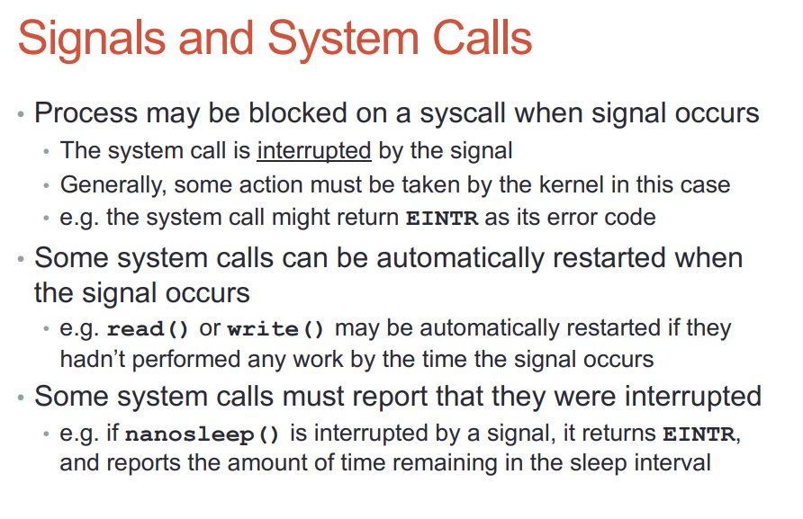

- [seccomp系统调用](#seccomp系统调用)
- [系统权限](#系统权限)
- [smaps解析性能](#smaps解析性能)
  - [打开smaps文件本身](#打开smaps文件本身)
  - [加上字符串操做](#加上字符串操做)
  - [结论](#结论)
- [使用其他用户启动进程](#使用其他用户启动进程)
  - [改变文件的owner为nobody:nogroup, 设置setuid属性](#改变文件的owner为nobodynogroup-设置setuid属性)
- [ruid euid](#ruid-euid)
  - [什么是uid euid?](#什么是uid-euid)
  - [补充](#补充)
  - [实验](#实验)
    - [然后用普通user启动](#然后用普通user启动)
    - [用root启动](#用root启动)
  - [进程的权限是看ruid, 而不是euid](#进程的权限是看ruid-而不是euid)
  - [golang权限降级](#golang权限降级)
- [什么是defunct进程?](#什么是defunct进程)
- [cgroup v2](#cgroup-v2)
  - [进程](#进程)
  - [线程](#线程)
  - [控制器使能](#控制器使能)
  - [不推荐动态迁移pid](#不推荐动态迁移pid)
  - [资源限制类型](#资源限制类型)
  - [控制器类型](#控制器类型)
    - [CPU](#cpu)
    - [内存](#内存)
    - [IO](#io)
    - [PID](#pid)
    - [Cpuset](#cpuset)
  - [配置文件交互](#配置文件交互)
  - [和V1的对比](#和v1的对比)
- [系统内存占用分析](#系统内存占用分析)
  - [其他统计](#其他统计)
  - [vm参数](#vm参数)
  - [文件缓存](#文件缓存)
- [CPU占用率分析](#cpu占用率分析)
  - [per CPU统计 user + sys + softirq + idle + iowait = 100](#per-cpu统计-user--sys--softirq--idle--iowait--100)
  - [softirq现象](#softirq现象)
  - [结论](#结论-1)
  - [补充](#补充-1)
- [系统调用都会触发调度吗?](#系统调用都会触发调度吗)
  - [Preemption and Context Switching](#preemption-and-context-switching)
  - [User Preemption](#user-preemption)
  - [Kernel Preemption](#kernel-preemption)
  - [调度代码](#调度代码)
  - [一些系统调用, 可能会阻塞, 此时会触发调度](#一些系统调用-可能会阻塞-此时会触发调度)
  - [调度器的参考文章](#调度器的参考文章)
- [signal的默认行为和打断系统调用](#signal的默认行为和打断系统调用)
  - [默认行为](#默认行为)
  - [signal和系统调用](#signal和系统调用)
- [内核收报文的时间片算在哪里?](#内核收报文的时间片算在哪里)
  - [背景: 驱动中断在哪里执行?](#背景-驱动中断在哪里执行)
  - [中断线程化后的CPU load](#中断线程化后的cpu-load)
  - [到底什么是中断上下文?](#到底什么是中断上下文)
  - [软中断上下文](#软中断上下文)
    - [softirq激活](#softirq激活)
    - [ksoftirqd线程](#ksoftirqd线程)
  - [上下文分类](#上下文分类)
  - [收报的时间算在哪里?](#收报的时间算在哪里)
- [socket什么情况下会发生短读short read/partial read?](#socket什么情况下会发生短读short-readpartial-read)
- [socket通信的时候, 要在应用侧做字节序转换吗?](#socket通信的时候-要在应用侧做字节序转换吗)
- [socket的stream模式和datagram模式有什么不同?](#socket的stream模式和datagram模式有什么不同)
  - [socket基础](#socket基础)
  - [SOCK_STREAM](#sock_stream)
  - [SOCK_SEQPACKET](#sock_seqpacket)
  - [SOCK_DGRAM](#sock_dgram)
  - [man 7 ip](#man-7-ip)
  - [man 7 tcp](#man-7-tcp)
  - [man 7 udp](#man-7-udp)
  - [man 7 unix](#man-7-unix)
  - [什么是message boundires?](#什么是message-boundires)
    - [TCP的stream模式怎么定界?](#tcp的stream模式怎么定界)
- [cgroup配置](#cgroup配置)
  - [写入pid](#写入pid)
  - [rt调度域的配额](#rt调度域的配额)
  - [一些命令](#一些命令)
- [linux调度方式有哪些?](#linux调度方式有哪些)
  - [非实时调度](#非实时调度)
  - [实时调度](#实时调度)
- [preemptive kernel是什么意思?](#preemptive-kernel是什么意思)
  - [为什么一直说内核抢占?](#为什么一直说内核抢占)
  - [嵌入式设备需要抢占吗?](#嵌入式设备需要抢占吗)
- [用户态上下文切换和ucontex.h](#用户态上下文切换和ucontexh)
  - [用户态上下文](#用户态上下文)
  - [例子](#例子)
  - [使用ucontext.h的api实现用户态协程](#使用ucontexth的api实现用户态协程)
- [多线程的情况下, signal被deliver到哪个线程?](#多线程的情况下-signal被deliver到哪个线程)
- [信号处理函数执行的上下文是什么? 为什么能打印当前进程的调用栈?](#信号处理函数执行的上下文是什么-为什么能打印当前进程的调用栈)
  - [sighandler执行的上下文](#sighandler执行的上下文)
    - [sigaltstack函数用于指定sighandler栈](#sigaltstack函数用于指定sighandler栈)
  - [回答](#回答)
- [信号处理原理](#信号处理原理)
  - [sigaction](#sigaction)
  - [pending和blocked向量](#pending和blocked向量)
  - [signal的产生和投递](#signal的产生和投递)
  - [signal和系统调用](#signal和系统调用-1)
  - [siglongjmp](#siglongjmp)
- [futex系统调用](#futex系统调用)
- [mmap和内核page](#mmap和内核page)
  - [shared和private](#shared和private)
  - [shared map](#shared-map)
  - [private map](#private-map)
  - [匿名映射](#匿名映射)
- [libevent主循环处理timer](#libevent主循环处理timer)
- [再议rm](#再议rm)
  - [普通用户可以rm root用户的文件](#普通用户可以rm-root用户的文件)
- [关于热升级, 正在使用的文件可以被rm](#关于热升级-正在使用的文件可以被rm)
- [__user有什么用?](#__user有什么用)
- [用户态通过系统调用陷入到内核态, 内存映射会变吗?](#用户态通过系统调用陷入到内核态-内存映射会变吗)
- [What happens to the cache contents on a context switch?](#what-happens-to-the-cache-contents-on-a-context-switch)
- [int的写是原子的吗?](#int的写是原子的吗)
  - [是, 也不是](#是-也不是)
- [uboot传mtdpart的时候，名字从哪来的？](#uboot传mtdpart的时候名字从哪来的)
- [为什么直接考过来的ls不能用？](#为什么直接考过来的ls不能用)
- [fork与malloc](#fork与malloc)

# seccomp系统调用
很多sandbox机制都使用了这个系统调用, 它是个系统调用的filter机制.
```c
#include <linux/seccomp.h>
#include <linux/filter.h>
#include <linux/audit.h>
#include <linux/signal.h>
#include <sys/ptrace.h>

int seccomp(unsigned int operation, unsigned int flags, void *args);
```

`seccomp`设置calling进程的Secure Computing属性,有几种operation:
* SECCOMP_SET_MODE_STRICT: 只有基本的read, write, exit和sigreturn可以用. 其他的系统调用会触发SIGKILL
* SECCOMP_SET_MODE_FILTER: args指向sock_fprog, 这是个bpf的指令, 可以设置任意组合的系统调用filter规则
```c
struct sock_fprog {
    unsigned short      len;    /* Number of BPF instructions */
    struct sock_filter *filter; /* Pointer to array of
                                   BPF instructions */
};
struct sock_filter {            /* Filter block */
    __u16 code;                 /* Actual filter code */
    __u8  jt;                   /* Jump true */
    __u8  jf;                   /* Jump false */
    __u32 k;                    /* Generic multiuse field */
};
```
* SECCOMP_RET_KILL_PROCESS: 导致进程终止
* SECCOMP_RET_KILL_THREAD: 导致调用者线程终止, 其他线程不受影响.
* SECCOMP_RET_TRAP: 系统调用会触发SIGSYS信号
* SECCOMP_RET_ERRNO:
* SECCOMP_RET_TRACE:
* SECCOMP_RET_LOG:
* SECCOMP_RET_ALLOW:

# 系统权限
`man capabilities`
权限检查是基于thread的, 特权用户(root, euid=0)的thread不用检查, 其他用户会走权限检查流程.
linux权限有很多类, 可以单独打开和关闭
比如
* CAP_DAC_OVERRIDE: 有这个属性就可以跳过文件或目录的rwx检查
* CAP_DAC_READ_SEARCH: 跳过read属性检查
* CAP_KILL: 是否有kill权限
* CAP_MKNOD: 是否能创建ssh设备文件
* CAP_NET_ADMIN: 网络配置
* CAP_NET_RAW: 使用raw socket
* CAP_SYS_ADMIN: 比如mount, setns, clone等

还有其他很多属性, 见`man capabilities`

子进程继承父进程的属性

# smaps解析性能
我要解析`/proc/1/smaps`, 它的格式如下:
```sh
~ # cat /proc/1/smaps
00010000-00013000 r-xp 00000000 00:02 8237                               /usr/bin/s6-svscan
Size:                 12 kB
Rss:                  12 kB
Pss:                  12 kB
Shared_Clean:          0 kB
Shared_Dirty:          0 kB
Private_Clean:         0 kB
Private_Dirty:        12 kB
Referenced:           12 kB
Anonymous:             0 kB
AnonHugePages:         0 kB
ShmemPmdMapped:        0 kB
Shared_Hugetlb:        0 kB
Private_Hugetlb:       0 kB
Swap:                  0 kB
SwapPss:               0 kB
KernelPageSize:        4 kB
MMUPageSize:           4 kB
Locked:                0 kB
VmFlags: rd ex mr mw me dw
00022000-00023000 r--p 00002000 00:02 8237                               /usr/bin/s6-svscan
Size:                  4 kB
Rss:                   4 kB
Pss:                   4 kB
Shared_Clean:          0 kB
Shared_Dirty:          0 kB
Private_Clean:         0 kB
Private_Dirty:         4 kB
Referenced:            4 kB
Anonymous:             4 kB
AnonHugePages:         0 kB
ShmemPmdMapped:        0 kB
Shared_Hugetlb:        0 kB
Private_Hugetlb:       0 kB
Swap:                  0 kB
SwapPss:               0 kB
KernelPageSize:        4 kB
MMUPageSize:           4 kB
Locked:                0 kB
VmFlags: rd mr mw me dw ac

...
```
我写了代码把所有`Pss:                  xx kB`加起来.

CPU消耗很高. 这里的消耗包括打开这个文件本身, 和字符串搜索和转换的消耗.

## 打开smaps文件本身
只是打开这个文件就已经很高了:
htop显示CPU在40到70之间, 均值大概在50.  
  
perf发现大部分时间在内核的`smaps_account()`函数, 这个函数在for里计算每个page, 确实比较耗时.

## 加上字符串操做
```go
        buf, err := os.ReadFile("/proc/" + pid + "/smaps_rollup")
        if err == nil {
            i := bytes.Index(buf, []byte("\nPss:"))
            if i != -1 {
                buf = buf[i+1:]
                size, _ := strconv.ParseUint(string(bytes.TrimSpace(buf[4:24])), 10, 64)
                //fmt.Fprintln(os.Stderr, string(bytes.TrimSpace(buf[4:24])), size)
                pssSize = size
                return
            }
        }
```
感觉CPU没有升高多少, 平均也在50+%.

## 结论
打开`"/proc/" + pid + "/smaps_rollup"`或`"/proc/" + pid + "/smaps"`本身就很消耗CPU.
因为kernel在open的时候才去调用`smaps_account()`函数.


# 使用其他用户启动进程
在shell里手动启动一个可执行程序, 其user是当前的登陆用户.
但有的时候, 比如开一个daemon进程, 不想用自己的用户来启动, 下面是方法:

## 改变文件的owner为nobody:nogroup, 设置setuid属性
这步需要sudo权限
```sh
# nobody和nogroup一般的linux系统都有
sudo chown nobody:nogroup gshell
# user和group都要设置setuid属性
sudo chmod ugo+ws gshell
# ls -l看到gshell程序已经是nobody:nogroup了, 而且u和g都有s属性
# 我专门把o的w属性也加上了
-rwsrwsrwx 1 nobody nogroup 22610134 Sep 26 01:14 gshell
```

# ruid euid
## 什么是uid euid?
最主要是看`man setuid`和`man seteuid`

> The distinction between a real and an effective user id is made because you may have the need to temporarily take another user's identity (most of the time, that would be `root`, but it could be any user). If you only had one user id, then there would be no way of changing back to your original user id afterwards (other than taking your word for granted, and in case you are `root`, using `root`'s privileges to change to any user).

> So, the real user id is who you really are (the one who owns the process), and the effective user id is what the operating system looks at to make a decision whether or not you are allowed to do something (most of the time, there are some exceptions).

> When you log in, the login shell sets both the real and effective user id to the same value (your real user id) as supplied by the password file.

> Now, it also happens that you execute a setuid program, and besides running as another user (e.g. `root`) the setuid program is _also_ supposed to do something on your behalf. How does this work?
After executing the setuid program, it will have your real id (since you're the process owner) and the effective user id of the file owner (for example `root`) since it is setuid.

> The program does whatever magic it needs to do with superuser privileges and then wants to do something on your behalf. That means, attempting to do something that you shouldn't be able to do _should fail_. How does it do that? Well, obviously by changing its effective user id to the real user id!

> Now that setuid program has no way of switching back since all the kernel knows is your id and... _your id_. Bang, you're dead.

> This is what the saved set-user id is for.

参考: 
https://stackoverflow.com/questions/32455684/difference-between-real-user-id-effective-user-id-and-saved-user-id
https://mudongliang.github.io/2020/09/17/ruid-euid-suid-usage-in-linux.html
https://stackoverflow.com/questions/33982789/difference-between-euid-suid-and-ruid-in-linux-systems

## 补充
使用`ps -eo user,pid,euid,ruid,suid,cmd | grep gshell`可以查看各种id
```
euid        EUID      effective user ID (alias uid).
ruid        RUID      real user ID.
suid        SUID      saved user ID.  (alias svuid).
```
## 实验
当我`sudo chmod ugo+ws bin/gshell`后, 看到
```
-rwsrwsrwx 1 nobody nogroup 23M Oct 22 05:34 gshell
```

### 然后用普通user启动
`bin/gshell -loglevel debug daemon -registry 10.182.105.179:11985 -bcast 9923`
看到:
```
$ ps -eo user,pid,euid,ruid,suid,cmd | grep gshell
nobody   27870 65534  1003 65534 bin/gshell -loglevel debug daemon -registry 10.182.105.179:11985 -bcast 9923
yingjieb 27893  1003  1003  1003 grep gshell
```
很明显:
* 普通进程`grep`, 其euid ruid suid都是一致的, 即都是1003(yingjieb)
* 但bin/gshell带s属性(即setuid属性), 用普通用户运行, euid和suid是65534(nobody), ruid是启动用户

### 用root启动
`sudo bin/gshell -loglevel debug daemon -registry 10.182.105.179:11985 -bcast 9923`
看到:
```
$ ps -eo user,pid,euid,ruid,suid,cmd | grep gshell
root     27897     0     0     0 sudo bin/gshell -loglevel debug daemon -registry 10.182.105.179:11985 -bcast 9923
nobody   27898 65534     0 65534 bin/gshell -loglevel debug daemon -registry 10.182.105.179:11985 -bcast 9923
yingjieb 27910  1003  1003  1003 grep gshell
```
可以看到, 先用root启动了该程序, 但会以nobody fork这个进程运行, fork的进程的euid和suid是nobody, 但ruid还是root.

## 进程的权限是看ruid, 而不是euid
比如上面的例子, root启动的进程27898, 虽然euid变成了nobody, 但实际该进程还是可以有root权限, 创建删除权限都是root的.
那euid有啥用?

## golang权限降级
思路是先让bin文件的owner是nobody, 带setuid属性. 然后任何用户启动这个文件, euid都是nobody的.
但ruid还是启动用户的. 要在代码里改ruid:

```go
        euid := os.Geteuid()
        if err := syscall.Setreuid(euid, euid); err != nil {
            return err
        }
```

改了ruid后, 再用`ps -eo user,pid,euid,ruid,suid,cmd | grep gshell`看, 所有的UID都是nobody了.
这个进程就只有nobody权限了.
补充, gid也要设置:
`ps -eo user,pid,euid,ruid,suid,egid,rgid,sgid,cmd | grep gshell`

# 什么是defunct进程?
gshell起了一个自己的new version的进程, 但显示:
```sh
$ ps -ef | grep gshell
yingjieb  6762  9291  2 12:18 pts/9    00:00:02 bin/gshell -wd .working -loglevel debug daemon -registry 10.182.105.138:11985 -bcast 9923 -root -repo gitlabe1.ext.net.nokia.com/godevsig/grepo/master -update http://10.182.105.179:8088/gshell/release/latest/%s
yingjieb  6777  6762  0 12:18 pts/9    00:00:00 bin/gshell -wd .working -loglevel debug __start -e master.v1.1.3
yingjieb  6799  6762  0 12:20 pts/9    00:00:00 [gshell] <defunct>
```
注意这里的`[gshell] <defunct>`是僵尸进程:
> Processes marked **`<defunct>`** are dead processes (so-called _"zombies"_) that remain because their parent has not destroyed them properly. These processes will be destroyed by `init(8)` if the parent process exits.

僵尸进程不能被kill, 因为它已经死了. 它还在这里显示是因为其父进程还在, 但没有清理这个死掉的子进程.
对应的go代码: 因为`Start()`并不会等待并清理子进程.
```go
if err := exec.Command(cmdArgs[0], cmdArgs[1:]...).Start(); err != nil {
    lg.Errorf("start new gshell failed: %v", err)
} else {
    lg.Infof("new version gshell started")
}
```

注: 这里子进程死掉的原因可以用下面的代码捕捉
```go
out, err := exec.Command(cmdArgs[0], cmdArgs[1:]...).Output()
lg.Debugf("out: %s, err: %v", out, err)
```
是因为传入的`-update`选项新的binary不认识.

# cgroup v2
https://www.kernel.org/doc/html/latest/admin-guide/cgroup-v2.html
```
mount -t cgroup2 none $MOUNT_POINT
```
* 和v1不同, cgroup v2只有一个树结构
* 一个进程只能属于一个cgroup
* `mkdir $CGROUP_NAME`创建一个子cgroup

## 进程
* 把进程pid写进`cgroup.procs`会migrate这个进程到该cgroup, 包括其所有线程.
* 每次只能写一个PID到`cgroup.procs`文件, 即一次`write`系统调用移动一个pid
* 没有子cgroup并且里面没有pid的cgrouup可以删除: `rmdir $CGROUP_NAME`
    * 如果里面只有zombie进程, 也是可以删除的
* `/proc/$PID/cgroup`可以显式pid所属的cgroup
    ```
    # cat /proc/842/cgroup
    ...
    0::/test-cgroup/test-cgroup-nested
    ```
    如果这个cgroup被删除了, 会是这样: 这个情况下, 这个进程一定是个僵尸进程
    ```
    # cat /proc/842/cgroup
    ...
    0::/test-cgroup/test-cgroup-nested (deleted)
    ```

## 线程
官方解释
> cgroup v2 supports thread granularity for a subset of controllers to support use cases requiring hierarchical resource distribution across the threads of a group of processes. By default, all threads of a process belong to the same cgroup, which also serves as the resource domain to host resource consumptions which are not specific to a process or thread. The thread mode allows threads to be spread across a subtree while still maintaining the common resource domain for them.

* 默认所有线程属于同一个cgroup, 但也支持分属于多个subtree. 就是说在同一个tree下面
* 支持thread模式的controller叫`threaded controllers`; 不支持的叫`domain controllers`
* 默认创建的cgroup是domain模式, 用`echo threaded > cgroup.type`可以将其改为threaded模式, 但要满足如下条件:
    * As the cgroup will join the parent’s resource domain. The parent must either be a valid (threaded) domain or a threaded cgroup.
    * When the parent is an unthreaded domain, it must not have any domain controllers enabled or populated domain children. The root is exempt from this requirement.
* threaded cgroup下面新建的cgroup默认是无效的
`A (threaded domain) - B (threaded) - C (domain, just created)`
这样的cgroup树, 在C刚刚创建的时候, 默认是domain控制器, 但它的父节点上都不是domain控制器. 这样C的`cgroup.type`文件会报告`domain (invalid)`, 直到配置其为threaded模式.
* 一个cgroup变为threaded模式会导致其父domain cgroup变为threaded domain
* 一个进程的线程只能在一个threaded domain下存在.
* > The threaded domain cgroup serves as the resource domain for the whole subtree, and, while the threads can be scattered across the subtree, all the processes are considered to be in the threaded domain cgroup. “cgroup.procs” in a threaded domain cgroup contains the PIDs of all processes in the subtree and is not readable in the subtree proper. However, “cgroup.procs” can be written to from anywhere in the subtree to migrate all threads of the matching process to the cgroup.
这段说的是线程domain组的`cgroup.procs`包含了子树的所有**进程**, 因为此时子树里面都是线程ID
* `A (threaded domain) - B (threaded)`在这个模式下, 一个线程在B中, 那B只算这个线程的资源. 但B所属的进程所有资源都算在A的头上, 因为A是domain控制器

## 控制器使能
* 每个cgroup都支持控制器类型
```
# cat cgroup.controllers
cpu io memory
```
* 默认全部都是不使能的. 需要显式使能:
`# echo "+cpu +memory -io" > cgroup.subtree_control`
* 只有空的domain cgroup才能使能domain控制器. 但root不受此限制

## 不推荐动态迁移pid
> Migrating a process across cgroups is a relatively expensive operation and stateful resources such as memory are not moved together with the process. This is an explicit design decision as there often exist inherent trade-offs between migration and various hot paths in terms of synchronization cost.

> As such, migrating processes across cgroups frequently as a means to apply different resource restrictions is discouraged. A workload should be assigned to a cgroup according to the system’s logical and resource structure once on start-up. Dynamic adjustments to resource distribution can be made by changing controller configuration through the interface files.

以上说的是动态迁移pid的cost有点大. 动态的配置可以作用在控制器的相关接口文件上.
就是说要静态pid到group, 但group的配置可以改.

## 资源限制类型
* Weights
比例方式. 范围从[1, 10000], 默认100
可以超配
* Limits
限额方式, 从[0, max], 默认max.
可以超配(这点和v1不一样?) -- 为什么可以超配? 因为普通模式收CFS调度, 完全公平, CPU 100%忙也受调度限制.
* Protections
保护方式. 看起来是保护最低限额.
* Allocations
分配方式.
不能超配. 似乎就是现在的用法?

## 控制器类型
### CPU
> The “cpu” controllers regulates distribution of CPU cycles. This controller implements weight and absolute bandwidth limit models for normal scheduling policy and absolute bandwidth allocation model for realtime scheduling policy.
说的很清楚, CPU类型的控制器实现了普通调度模式下的限额方式(可以超配)以及实时调度模式下的分配方式(不能超配)
> WARNING: cgroup2 doesn’t yet support control of realtime processes and the cpu controller can only be enabled when all RT processes are in the root cgroup. Be aware that system management software may already have placed RT processes into nonroot cgroups during the system boot process, and these processes may need to be moved to the root cgroup before the cpu controller can be enabled.
这个warn的意思是cgroup2对RT的支持还不好?

* 接口文件
    * `cpu.stat` 统计信息. 竟然就有利用率和用户态 内核态时间
    * `cpu.weight` normal调度用的比例方式
    * `cpu.max` 应该是给RT用的 allocation方式

### 内存
内存控制器是有状态的, 实现了limit方式和protection方式.
目前有三种类型的内存使用能够被统计到:
* 用户态页表: Userland memory - page cache and anonymous memory.
* 内核态数据: Kernel data structures such as dentries and inodes.
* TCP的内存: TCP socket buffers.
    
如下接口文件:
* `memory.current` 目前mem占用, 应是实际值
* `memory.min` 受保护的最小值, 默认是0
* `memory.low` 在low下都不会被kernel回收
* `memory.high` 超过high会被kernel严格回收
* `memory.max` 硬上限. 超过OOM
* `memory.stat` 详细统计: 匿名页 有名页 文件 共享内存 slab 

### IO
传统上应该是指disk IO

### PID
用于限制PID可以fork和clone的次数

### Cpuset
指定核. 主要用于NUMA场景. 可以和CPU以及mem联用. 比如在一个cgroup tree下面, 同时限制CPU使用, MEM使用以及指定CPU核
* `cpuset.cpus`

## 配置文件交互
* `cgroup.type`
控制cgroup是否为threaded模式
* `cgroup.procs`
进程加入cgroup. 所有线程也一起加入
在threaded模式下, 读这个文件返回`EOPNOTSUPP`, 因为这个cgroup只管线程, 线程所属的进程归这个threaded domain管(在cgroup tree的上游). 但写还是一样的语义.
* `cgroup.threads`
线程加入cgroup. 只有在同一个domain的线程才能加入. 即一个进程的线程, 只能在同一个domain的子树上.
* `cgroup.subtree_control`
管使能控制器的
* `cgroup.events`
能显示这个cgroup及其子树当前是否有有效的pid. 有效就是指有至少一个非zombine的pid
* `cgroup.freeze`
写1就freeze这个cgroup

## 和V1的对比
* v1允许多个树, 而v2只有一个树. 看似v1更灵活, 每个tree里面还可以有任意的控制器. 但过设计了.
* v1允许进程的线程分属于多个cgroup. 而v2只能是在一个domain; ok, 还是v1过设计了.
* v1会有父子竞争现象, 因为线程可以任意所属.

# 系统内存占用分析
参考文章: 
* https://www.cnblogs.com/arnoldlu/p/8568330.html
* http://linuxperf.com/?p=142
```sh
cat /proc/meminfo
MemTotal:        8054880 kB---------------------物理内存总容量，对应totalram_pages大小。
MemFree:         4004312 kB---------------------空闲内存容量，对应vm_stat[NR_FREE_PAGES]大小。
MemAvailable:    5678888 kB---------------------MemFree减去保留内存，加上部分pagecache和部分SReclaimable。
Buffers:          303016 kB---------------------块设备缓冲区大小.
Cached:          2029616 kB---------------------主要是vm_stat[NR_FILE_PAGES],再减去swap出的大小和块设备缓冲区大小。Buffers+Cached=Active(file)+Inactive(file)+Shmem。
SwapCached:            0 kB---------------------交换缓存上的内容容量。
Active:          2123084 kB---------------------Active=Active(anon)+Active(file)。
Inactive:        1476268 kB---------------------Inactive=Inactive(anon)+Inactive(file)。
Active(anon):    1273544 kB---------------------活动匿名内存，匿名指进程中堆上分配的内存，活动指最近被使用的内存。
Inactive(anon):   547988 kB---------------------不活动匿名内存，在内存不足时优先释放。
Active(file):     849540 kB---------------------活动文件缓存，表示内存内容与磁盘上文件相关联。
Inactive(file):   928280 kB---------------------不活动文件缓存。
Unevictable:       17152 kB---------------------不可移动的内存，当然也不可释放，所以不会放在LRU中。
Mlocked:           17152 kB---------------------使用mlocked()处理的页面。
SwapTotal:       7812092 kB---------------------交换空间总容量。
SwapFree:        7812092 kB---------------------交换空间剩余容量。
Dirty:              6796 kB---------------------脏数据，在磁盘缓冲区中尚未写入磁盘的内存大小。
Writeback:             0 kB---------------------待回写的页面大小。
AnonPages:       1283984 kB---------------------内核中存在一个rmap(Reverse Mapping)机制，负责管理匿名内存中每一个物理页面映射到哪个进程的那个逻辑地址等信息。rmap中记录的内存页综合就是AnonPages值。
Mapped:           455248 kB---------------------映射的文件占用内存大小。
Shmem:            550260 kB---------------------vm_stat[NR_SHMEM]，tmpfs所使用的内存，tmpfs即利用物理内存来提供RAM磁盘功能。在tmpfa上保存文件时，文件系统暂时将他们保存到RAM中。
Slab:             268208 kB---------------------slab分配器总量，通过slabinfo工具或者/proc/slabinfo来查看更详细的信息。
SReclaimable:     206964 kB---------------------不存在活跃对象，可回收的slab缓存vm_stat[NR_SLAB_RECLAIMABLE]。
SUnreclaim:        61244 kB---------------------对象处于活跃状态，不能被回收的slab容量。
KernelStack:       12736 kB---------------------内核代码使用的堆栈区。
PageTables:        50376 kB---------------------PageTables就是页表，用于存储各个用户进程的逻辑地址和物理地址的变化关系，本身也是一个内存区域。
NFS_Unstable:          0 kB
Bounce:                0 kB
WritebackTmp:          0 kB
CommitLimit:    11839532 kB
Committed_AS:    7934688 kB
VmallocTotal:   34359738367 kB------------------理论上内核可以用来映射的逻辑地址范围。
VmallocUsed:           0 kB---------------------内核将空闲内存页。
VmallocChunk:          0 kB
HardwareCorrupted:     0 kB
AnonHugePages:         0 kB
ShmemHugePages:        0 kB
ShmemPmdMapped:        0 kB
CmaTotal:              0 kB
CmaFree:               0 kB
HugePages_Total:       0
HugePages_Free:        0
HugePages_Rsvd:        0
HugePages_Surp:        0
Hugepagesize:       2048 kB
DirectMap4k:      226256 kB
DirectMap2M:     5953536 kB
DirectMap1G:     3145728 kB
```

`/proc/meminfo`和`free`的对应关系如下：

| free | /proc/meminfo |
| -- | -- |
| total | =MemTotal |
| used | =MemTotal - MemFree - (Cached + SReclaimable) - Buffers |
| free | =MemFree |
| shared | =Shmem |
| buffers | =Buffers |
| cache | =Cached + SReclaimable |
| available | =MemAvailable |

## 其他统计
```
/proc/buddyinfo
/proc/pagetypeinfo
/proc/vmstat
/proc/vmallocinfo
/proc/self/statm
/proc/self/maps
/proc/zoneinfo
/proc/slabinfo
/sys/kernel/mm/ksm
/proc/sys/vm/compact_memory
/proc/sys/vm/panic_on_oom
/proc/sys/vm/oom_kill_allocating_task
/proc/sys/vm/oom_dump_tasks
```

## vm参数
```
/proc/sys/vm/highmem_is_dirtyable
/proc/sys/vm/legacy_va_layout
/proc/sys/vm/lowmem_reserve_ratio
/proc/sys/vm/max_map_count
/proc/sys/vm/mmap_min_addr
/proc/sys/vm/min_free_kbytes
/proc/sys/vm/stat_interval
/proc/sys/vm/vfs_cache_pressure
/proc/sys/vm/page-cluster
```

## 文件缓存
```
/proc/sys/vm/dirty_background_bytes
/proc/sys/vm/dirty_background_ratio
/proc/sys/vm/dirty_bytes
/proc/sys/vm/dirty_ratio
/proc/sys/vm/dirty_expire_centisecs
/proc/sys/vm/drop_caches
```

# CPU占用率分析
下面的数据全部都是从proc文件系统里读出来的.

## per CPU统计 user + sys + softirq + idle + iowait = 100
  
看到图中core1的这几个值加起来是绝对的100
core0也一样, 绝对的100

## softirq现象
系统在打流的时候, 大约每2分钟就有10秒的冲高, 2个核加起来刚好100.  
  

从上面的图看, 在softirq高的时候, 有100的CPU占用. 按理说2核的CPU共200, 那么应该只剩下100的CPU了. 也就是说, 如果softirq也算是"独立"的统计的话, 按进程的叠加不应该超过剩下的100. 是吗?

不是. 见下图: 在蓝色尖峰的时候, 按进程的统计已经超过了150.  
  

## 结论
* 按CPU视角来统计, softirq是独立的
* 按进程视角来统计, softirq被统计进了sys. 因为proc文件系统只提供user和sys的占用, 目前我的结论是softirq在这个进程的占比(或者说"抢占了"这个进程的占比)会被加到这个进程的sys占比中.
* 当softirq高发生时, 通常都是burst的网络报文的处理导致的. 如果只看进程的CPU占用, 要注意里面已经包括了softirq的占用.

## 补充
  
上图显示了cpu1的softirq + idle + system + irq + user = 100  
注意softirq和irq不是一个.  
有个进程ksoftirqd也占了十几个点的CPU. 如果把它加到sys类里, 就超了100.  
  
又因为CPU1的system + user都只有不到5个点, 所以ksoftirqd内核线程的时间是算在softirq里面的.  
  

# 系统调用都会触发调度吗?
不是.
虽然内核会在返回到用户态之前, 检查是否调度, 但是有条件的:
它检查任务描述符里`need_resched`字段以判断是否需要调度.
这个字段在进程时间片用尽的时候, 由函数`scheduler_tick()`来置位, 或者是高优先级任务来的时候, 也要置位这个flag.

## Preemption and Context Switching
Context switching, the switching from one runnable task to another, is handled by the context_switch() function defined in kernel/sched.c. It is called by schedule() when a new process has been selected to run. It does two basic jobs:

Calls switch_mm(), which is defined in include/asm/mmu_context.h, to switch the virtual memory mapping from the previous process's to that of the new process.

Calls switch_to(), defined in include/asm/system.h, to switch the processor state from the previous process's to the current's. This involves saving and restoring stack information and the processor registers.

The kernel, however, must know when to call schedule(). If it only called schedule() when code explicitly did so, user-space programs could run indefinitely. Instead, the kernel provides the need_resched flag to signify whether a reschedule should be performed (See Table 3.2). This flag is set by scheduler_tick() when a process runs out of timeslice and by try_to_wake_up() when a process that has a higher priority than the currently running process is awakened. The kernel will check the flag, see that it is set, and call schedule() to switch to a new process. The flag is a message to the kernel that the scheduler should be invoked as soon as possible because another process deserves to run.

Functions for Accessing and Manipulating need_resched

|Function|Purpose
|--|--|
|set_tsk_need_resched(task)| Set the need_resched flag in the given process
|clear_tsk_need_resched(task)| Clear the need_resched flag in the given process
|need_resched()| Test the value of the need_resched flag; return true if set and false otherwise


Upon returning to user-space or returning from an interrupt, the need_resched flag is checked. If it is set, the kernel invokes the scheduler before continuing.

The flag is per-process, and not simply global, because it is faster to access a value in the process descriptor (because of the speed of current and because it might be in a cache line) than a global variable. Historically, the flag was global before the 2.2 kernel. In 2.2 and 2.4, the flag was an int inside the task_struct. In 2.6, it was moved into a single bit of a special flag variable inside the thread_info structure. As you can see, the kernel developers are never satisfied.

## User Preemption
User preemption occurs when the kernel is about to return to user-space, need_resched is set, and therefore, the scheduler is invoked. If the kernel is returning to user-space, it knows it is in a safe quiescent state. In other words, if it is safe to continue executing the current task, it is also safe to pick a new task to execute. Consequently, whenever the kernel is preparing to return to user-space, either on return from an interrupt or after a system call, the value of need_resched is checked. If it is set, the scheduler is invoked to select a new (more fit) process to execute. Both the return paths for return from interrupt and return from system call are architecture-dependent and typically implemented in assembly in entry.S (which, aside from kernel entry code, also contains kernel exit code).

In short, user preemption can occur

* When returning to user-space from a system call
* When returning to user-space from an interrupt handler

## Kernel Preemption
The Linux kernel, unlike most other Unix variants and many other operating systems, is a fully preemptive kernel. In non-preemptive kernels, kernel code runs until completion. That is, the scheduler is not capable of rescheduling a task while it is in the kernel—kernel code is scheduled cooperatively, not preemptively. Kernel code runs until it finishes (returns to user-space) or explicitly blocks. In the 2.6 kernel, however, the Linux kernel became preemptive; it is now possible to preempt a task at any point, so long as the kernel is in a state in which it is safe to reschedule.

So when is it safe to reschedule? The kernel is capable of preempting a task running in the kernel so long as it does not hold a lock. That is, locks are used as markers of regions of non-preemptibility. Because the kernel is SMP-safe, if a lock is not held, the current code is reentrant and capable of being preempted.

The first change in supporting kernel preemption was the addition of a preemption counter, preempt_count, to each process's task_struct. This counter begins at zero and increments for each lock that is acquired and decrements for each lock that is released. When the counter is zero, the kernel is preemptible. Upon return from interrupt, if returning to kernel-space, the kernel checks the values of need_resched and preempt_count. If need_resched is set and preempt_count is zero, then a more important task is runnable and it is safe to preempt. Thus, the scheduler is invoked. If preempt_count is nonzero, a lock is held and it is unsafe to reschedule. In that case, the interrupt returns as usual to the currently executing task. When all the locks that the current task is holding are released, preempt_count returns to zero. At that time, the unlock code checks if need_resched is set. If so, the scheduler will be invoked. Enabling and disabling kernel preemption is sometimes required in kernel code and will be discussed in Chapter 8.

Kernel preemption can also occur explicitly, when a task in the kernel blocks or explicitly calls schedule(). This form of kernel preemption has always been supported because no additional logic is required to ensure the kernel is in a state that is safe to preempt. It is assumed that the code that explicitly calls schedule() knows it is safe to reschedule.

Kernel preemption can occur
* When returning to kernel-space from an interrupt handler
* When kernel code becomes preemptible again
* If a task in the kernel explicitly calls schedule()
* If a task in the kernel blocks (which results in a call to schedule())

## 调度代码
调度发生时, `schedule()`调用`context_switch()`完成调度

## 一些系统调用, 可能会阻塞, 此时会触发调度
基本上大部分IO相关的系统调用都可能阻塞, 比如 open() read() write()等.
[这里](https://techpubs.jurassic.nl/manuals/0650/developer/Debugger_Ref/sgi_html/ch10.html)列出了常见的可能阻塞的系统调用

## 调度器的参考文章
https://www.cs.montana.edu/~chandrima.sarkar/AdvancedOS/SchedulingLinux/index.html
https://www.cs.columbia.edu/~smb/classes/s06-4118/l13.pdf
http://lass.cs.umass.edu/~shenoy/courses/spring20/lectures/Lec09.pdf
https://medium.com/@bundetcom/understanding-linux-scheduler-5c683ff482d0


# signal的默认行为和打断系统调用
`man 7 signal`
## 默认行为
```
       Signal     Value     Action   Comment
       ──────────────────────────────────────────────────────────────────────
       SIGHUP        1       Term    Hangup detected on controlling terminal
                                     or death of controlling process
       SIGINT        2       Term    Interrupt from keyboard
       SIGQUIT       3       Core    Quit from keyboard
       SIGILL        4       Core    Illegal Instruction
       SIGABRT       6       Core    Abort signal from abort(3)
       SIGFPE        8       Core    Floating-point exception
       SIGKILL       9       Term    Kill signal
       SIGSEGV      11       Core    Invalid memory reference
       SIGPIPE      13       Term    Broken pipe: write to pipe with no
                                     readers; see pipe(7)
       SIGALRM      14       Term    Timer signal from alarm(2)
       SIGTERM      15       Term    Termination signal
       SIGUSR1   30,10,16    Term    User-defined signal 1
       SIGUSR2   31,12,17    Term    User-defined signal 2
       SIGCHLD   20,17,18    Ign     Child stopped or terminated
       SIGCONT   19,18,25    Cont    Continue if stopped
       SIGSTOP   17,19,23    Stop    Stop process
       SIGTSTP   18,20,24    Stop    Stop typed at terminal
       SIGTTIN   21,21,26    Stop    Terminal input for background process
       SIGTTOU   22,22,27    Stop    Terminal output for background process

```
注:
* 有的signal是发给整个group的, 比如SIGINT, 会发给整个PGRP, 也就是说, 如果一个前台父进程A起了子进程B, 那么在前台Ctrl+C掉进程A, 那么除了进程A会收到SIGINT, 进程B也会收到SIGINT
* 但如果是用kill命令, 比如`kill -SIGINT 进程A`, 那么只有进程A会收到SIGINT, 其子进程B不会收到SIGINT. 进程A的退出也不会导致其子进程B退出
* 用setpgid 或 setsid来改变子进程的进程组, 可以避免子进程收到前台的SIGINT 
详见https://stackoverflow.com/questions/6803395/child-process-receives-parents-sigint

## signal和系统调用
signal打断系统调用的行为有几种, 和系统调用的类型以及注册sigaction的时候有没有SA_RESTART标记有关
* 下面的系统调用, 如果有SA_RESTART标记一般会被内核自动重新启动这个调用. 否则返回error EINTR

```
       * read(2),  readv(2),  write(2),  writev(2),  and ioctl(2) calls on "slow" devices.  A "slow" device is one where the I/O call may block for an indefinite time, for example, a
         terminal, pipe, or socket.  If an I/O call on a slow device has already transferred some data by the time it is interrupted by a signal handler, then the call will return  a
         success  status  (normally, the number of bytes transferred).  Note that a (local) disk is not a slow device according to this definition; I/O operations on disk devices are
         not interrupted by signals.

       * open(2), if it can block (e.g., when opening a FIFO; see fifo(7)).

       * wait(2), wait3(2), wait4(2), waitid(2), and waitpid(2).

       * Socket interfaces: accept(2), connect(2), recv(2), recvfrom(2), recvmmsg(2), recvmsg(2), send(2), sendto(2), and sendmsg(2), unless a timeout has been set on the socket (see
         below).

       * File locking interfaces: flock(2) and the F_SETLKW and F_OFD_SETLKW operations of fcntl(2)

       * POSIX message queue interfaces: mq_receive(3), mq_timedreceive(3), mq_send(3), and mq_timedsend(3).

       * futex(2) FUTEX_WAIT (since Linux 2.6.22; beforehand, always failed with EINTR).

       * getrandom(2).

       * pthread_mutex_lock(3), pthread_cond_wait(3), and related APIs.

       * futex(2) FUTEX_WAIT_BITSET.

       * POSIX semaphore interfaces: sem_wait(3) and sem_timedwait(3) (since Linux 2.6.22; beforehand, always failed with EINTR).

       * read(2) from an inotify(7) file descriptor (since Linux 3.8; beforehand, always failed with EINTR).
```

* 下面的系统调用直接返回EINTR, 不管是否有SA_RESTART

```
       * "Input" socket interfaces, when a timeout (SO_RCVTIMEO) has been set on the socket using setsockopt(2): accept(2), recv(2), recvfrom(2), recvmmsg(2) (also  with  a  non-NULL
         timeout argument), and recvmsg(2).

       * "Output" socket interfaces, when a timeout (SO_RCVTIMEO) has been set on the socket using setsockopt(2): connect(2), send(2), sendto(2), and sendmsg(2).

       * Interfaces used to wait for signals: pause(2), sigsuspend(2), sigtimedwait(2), and sigwaitinfo(2).

       * File descriptor multiplexing interfaces: epoll_wait(2), epoll_pwait(2), poll(2), ppoll(2), select(2), and pselect(2).

       * System V IPC interfaces: msgrcv(2), msgsnd(2), semop(2), and semtimedop(2).

       * Sleep interfaces: clock_nanosleep(2), nanosleep(2), and usleep(3).

       * io_getevents(2).
```

# 内核收报文的时间片算在哪里?

## 背景: 驱动中断在哪里执行?
驱动收报要注册irq handler, 一般的, 使用:
```c
int request_threaded_irq(unsigned int irq, irq_handler_t handler, irq_handler_t thread_fn, unsigned long irqflags, const char *devname, void *dev_id)
```
其中:
`handler`: 在中断上下文执行
`thread_fn`: 不为NULL就会新建一个内核线程`"irq/%irq-%irq_name"`来处理中断下半部.

当kernel启动参数包括`threadirqs`时, 即使`thread_fn`为null, 也会强制新建一个内核线程, 在该内核线程内处理中断. `threadirqs`只有在`CONFIG_IRQ_FORCED_THREADING=y`的时候才生效.

在板子上实验, 不加`threadirqs`, fglt-b上没有`irq/xxx`等进程. 加了`threadirqs`, 多了十几个`irq/xxx`进程, 每个中断一个.

一般的系统不会配置`threadirqs`强制把中断线程化.
所以, 根据驱动中断注册中断处理函数`request_threaded_irq()`是否有`thread_fn`, 决定中断是在内核线程上下文还是中断上下文

## 中断线程化后的CPU load
下面是打开`threadirqs`后, `irq/24-eth0`就是板子eth0网口收报的中断被强制线程化后的线程名.
可以看到, 在打流的时候, 这个线程load挺高的.  
  

默认的eth0驱动并没有使用线程化中断, 这里面大概15%的CPU load可能被均摊到其他进程中(看起来是的).
打1000/2000/4000/6000pps 上行dhcpv4 discovery

打开threadirqs功能:topid: http://10.182.105.138:9888/switchPerf/152917918  
  

关闭threadirqs功能:topid：http://10.182.105.138:9888/fgltb_dhcpv4/3501403790  
  

对比两组数据, 基本上可以得到, 每个app的CPU load里, 都包含了中断处理时间, 比较均匀, 大概都是在2%左右.
中断线程化了之后, 每个app的cpu占用统计都稍微降了一点, 这些CPU都被算到`irq/24-eth0`上了.

另外, 这里面没有看到`ksoftirqd`等软中断进程, 说明softirq大部分都在"中断"中处理了.


## 到底什么是中断上下文?
> interrupt context : it specifies that the kernel is currently executing either an interrupt handler or a **deferrable function**

根据上面的定义, softirq是中断上下文. 从属性上说, 是的. 但严格从CPU角度来讲, softirq并**不总是**在**硬件**中断上下文中执行的.

下文会讲到, softirq并不是硬件上的某种"软件触发中断", 而是kernel的一种延迟执行的机制, 这些执行可能在**硬件中断**上下文中, 也可能是在普通的内核态上下文, 但其环境还是类似"中断"环境的, 比如抢占级别很高(只能被硬件中断抢占), 单独的softirq栈等等.

## 软中断上下文
一般硬中断会关中断(比如关闭eth的中断), 而软中断虽然也是在中断上下文执行(这点并不是always true), 但软中断是在使能中断的状态下执行的; 并且, 软中断可以多核同时执行.
`<<深入理解linux内核>>`中, 把软中断和tasklet叫做延迟执行. [原文](https://www.oreilly.com/library/view/understanding-the-linux/0596005652/ch04s07.html#:~:text=As%20a%20matter%20of%20fact,handler%20or%20a%20deferrable%20function.)
对硬件中断来说, 是关中断情况下串行执行的, 速度越快越好.
softirq和tasklet和workqueue就是用来跑下半部的.
* softirq和tasklet又叫`deferrable functions`
* tasklet是基于softirq的
中断上下问的意思是kernel在执行interrupt handler, 或者在执行`deferrable functions`
mpstat可以看软中断统计, 实际上也是从`/proc/softirqs`得到的数据
下面是个4核A53的ARM板子上的统计

```sh
~ # mpstat -I SCPU
Linux 4.9.199-Arm-Cortex_a53 (fglt-b)   03/08/70        _aarch64_       (4 CPU)

01:47:49     CPU      HI/s   TIMER/s  NET_TX/s  NET_RX/s   BLOCK/s IRQ_POLL/s TASKLET/s  SCHED/s HRTIMER/s     RCU/s
01:47:49       0      0.00    100.00      0.00      3.58      0.00      0.00      0.14     98.45      0.00     48.13
01:47:49       1      0.00     87.55      0.00      8.61      0.00      0.00      0.00     98.95      0.00     38.53
01:47:49       2      0.00     79.42      0.00      6.46      0.00      0.00      3.09     98.73      0.00     47.22
01:47:49       3      0.00     65.90      0.00      2.41      0.00      0.00      0.00     97.61      0.00     39.11

```

* softirq是静态分配的
* tasklet可以动态分配, 比如加载一个内核模块时
* 同类型的softirq也可以同时运行在多核上, 必须可重入, 用锁保护关键区. 
* 同类tasklet同时只能一个核运行, 不用担心竞争问题.

`deferrable functions`在使用上, 类似中断, 都有如下操作:
* 初始化(_Initialization_): 定义一个延迟函数, 一般在kernel初始化时候确定或者在module load的时候做
* 激活(_Activation_): 标记为pending, pending的延迟函数会在下次调度到的时候执行. 在中断里也可以标记.
* 屏蔽(_Masking_): 临时禁止执行
* 执行(_Execution_): 执行pending的`deferrable functions`, 如果pending的很多, 只执行预定义的一部分.

激活和执行操作是同一个CPU, 这么设计主要是考虑到cache的利用率会高一点.

### softirq激活
在用`open_softirq()`注册softirq后, `raise_softirq()`函数用来激活softirq, 执行流程:
1. 关本地中断
2. 给这个softirq标记为pending
3. 调用`wakeup_softirqd()`唤醒ksoftirqd进程
4. 开本地中断

kernel会在关键点上检查softirq的pending状态, 这些关键点(checkpoints)包括:
* kernel调用`local_bh_enable`
* 当中断处理函数`do_IRQ()`完成硬中断处理, 最后调用`irq_exit()`时
* apic timer`smp_apic_timer_interrupt()`结束时
* 核间中断处理完成时
* _ksoftirqd_ 内核进程运行时

可以看到, 这里面既有中断上下文, 又有进程上下文. 即软中断函数可能在不同的上下文中执行.

当以上checkpoint检查得知有softirq要处理时, 就会调用`do_softirq()`, 其执行流程如下:
* in_interrupt()如果是1, 表示已经在中断里调用过了`do_softirq()`, 或者这个softirq被禁止了. 直接return
* `local_irq_save()`关中断
* 切换到softirq自己的栈
* 执行`_ _do_softirq( )`
    * 这里应该把所有pending的事情都做完, 但这个函数可能是在中断上下文中, 执行太久会有问题. 所以只能执行固定数量的work, 剩下的交给ksoftirqd线程处理.
    * 默认处理10个work
    * `local_bh_disable()`禁止并发的`_ _do_softirq( )`执行? **why? 不是说好了softirq支持并发吗?**
    * `local_irq_enable()`开中断
    * 执行对应的`softirq_vec[n]->action`
    * `wakeup_softirqd( )`唤醒ksoftirqd处理这里剩下的work
    * softirq counter减一, 再次使能
* 切换回之前的栈
* `local_irq_restore()`开中断

### ksoftirqd线程
这个线程是用来做剩下来的工作的. 
```c
    for(;;) {
        set_current_state(TASK_INTERRUPTIBLE );
        schedule( );
        /* now in TASK_RUNNING state */
        while (local_softirq_pending( )) {
            preempt_disable();
            do_softirq( );
            preempt_enable();
            cond_resched( );
        }
    }
```


这个线程是为了解决softirq过快产生的时候, 占用中断时间太长的问题的.
因为softirq可以被自己, 或者被外部事件激活.
> Softirq functions may reactivate themselves; in fact, both the networking softirqs and the tasklet softirqs do this. Moreover, external events, such as packet flooding on a network card, may activate softirqs at very high frequency.

## 上下文分类
前面分析了, 软中断上下文可以在硬中断中, 也可能是kernel checkpoints, 但都不是用户进程上下文(可能也不是绝对的, 比如用户态的系统调用里面, 调用的driver函数里有`local_bh_enable()`调用, 那么softirq就是在这个进程上下文处理的)  
  

用户上下文永远可能被抢占  
  

纯内核线程没有MM  
  

softirq是在预定义的kernel "checkpoint"里执行的  
  

中断里不能sleep  
  

## 收报的时间算在哪里?
从用户态调用recv开始, 用户态等待packet  
  

网卡收报, 中断上下文驱动处理, 激活softirq  
  

这个图有点片面. 大概率是在中断上下文处理10个, 剩下的叫给ksoftirqd  
  

唤醒用户进程  
  

补充: kernel的一些api用于判断当前上下文  
  

实际上, 网卡驱动收报, IP层处理, 都不会算在进程上下文上.
但到TCP阶段, 已经绑定到socket了, `tcp_v4_do_rcv()`有可能在进程上下执行, 也有可能在softirq上下文执行.
结合`<<Potential Performance Bottleneck in Linux TCP>>`的分析, 如果正好用户进程在run, 但还没有调用`recv()`, 就会在softirq上下文执行`tcp_v4_do_rcv()`  
  

那么收报的时间算在进程头上吗?  
答: 应该说大部分时间不会. 比如驱动收报和IP层处理.


# socket什么情况下会发生短读short read/partial read?
答: 应该主要是和syscall的被打断有关; 或者当时receive queue里面确实没有那么多的字节.
> A characteristic of earlier UNIX systems was that if a process caught a signal while the process was blocked in a ‘‘slow’’ system call, the system call was interrupted. The system call returned an error and errno was set to EINTR. This was done under the assumption that since a signal occurred and the process caught it, there is a good chance that something has happened that should wake up the blocked system call.

> To prevent applications from having to handle interrupted system calls, 4.2BSD introduced the automatic restarting of certain interrupted system calls. The system calls that were automatically restarted are ioctl, read, readv, write, writev, wait, and waitpid. As we’ve mentioned, the first five of these functions are interrupted by a signal only if they are operating on a slow device; wait and waitpid are always interrupted when a signal is caught. Since this caused a problem for some applications that didn’t want the operation restarted if it was interrupted, 4.3BSD allowed the process to disable this feature on a per-signal basis.

stackoverflow的回答:
Interruption of a system call by a signal handler occurs only in the case of various blocking system calls, and happens when the system call is interrupted by a signal handler that was explicitly established by the programmer.

Furthermore, in the case where a blocking system call is interrupted by a signal handler, automatic system call restarting is an _optional_ feature. You elect to automatically restart system calls by specifying the `SA_RESTART` flag when establishing the signal handler. As stated in (for example) the Linux [signal(7)](http://man7.org/linux/man-pages/man7/signal.7.html) manual page:

```
   If  a  signal  handler  is  invoked while a system call or library
   function call is blocked, then either:

   * the call is automatically restarted  after  the  signal  handler
     returns; or

   * the call fails with the error EINTR.

   Which  of  these two behaviors occurs depends on the interface and
   whether or not  the  signal  handler  was  established  using  the
   SA_RESTART  flag (see sigaction(2)). 

```

As hinted by the last sentence quoted above, even when you elect to use this feature, it does not work for all system calls, and the set of system calls for which it does work varies across UNIX implementations. The Linux `signal(7)` manual page notes a number of system calls that are automatically restarted when using the `SA_RESTART` flag, but also goes on to note various system calls that are never restarted, even if you specify that flag when establishing a handler, including:

```
   * "Input" socket interfaces, when a timeout (SO_RCVTIMEO) has been
     set  on  the  socket  using  setsockopt(2):  accept(2), recv(2),
     recvfrom(2), recvmmsg(2) (also with  a  non-NULL  timeout  argu‐
     ment), and recvmsg(2).

   * "Output"  socket  interfaces,  when  a timeout (SO_RCVTIMEO) has
     been set on the socket using setsockopt(2): connect(2), send(2),
     sendto(2), and sendmsg(2).

   * File   descriptor   multiplexing   interfaces:    epoll_wait(2),
     epoll_pwait(2), poll(2), ppoll(2), select(2), and pselect(2).

   * System  V  IPC  interfaces:  msgrcv(2), msgsnd(2), semop(2), and
     semtimedop(2).

```

For these system calls, manual restarting using a loop of the form described in APUE is essential, something like:

```
while ((ret = some_syscall(...)) == -1 && errno == EINTR)
    continue;
if (ret == -1)
    /* Handle error */ ;
```

# socket通信的时候, 要在应用侧做字节序转换吗?
答: 要. 尤其是binary编码情况下. 一般类似GPB的codec已经做了. 

# socket的stream模式和datagram模式有什么不同?
## socket基础
`man socket`
```c
       #include <sys/types.h>          /* See NOTES */
       #include <sys/socket.h>

       int socket(int domain, int type, int protocol);

```
domain有如下方式
```
       Name                Purpose                          Man page
       AF_UNIX, AF_LOCAL   Local communication              unix(7)
       AF_INET             IPv4 Internet protocols          ip(7)
       AF_INET6            IPv6 Internet protocols          ipv6(7)
       AF_IPX              IPX - Novell protocols
       AF_NETLINK          Kernel user interface device     netlink(7)
       AF_X25              ITU-T X.25 / ISO-8208 protocol   x25(7)
       AF_AX25             Amateur radio AX.25 protocol
       AF_ATMPVC           Access to raw ATM PVCs
       AF_APPLETALK        AppleTalk                        ddp(7)
       AF_PACKET           Low level packet interface       packet(7)
       AF_ALG              Interface to kernel crypto API

```

type有
```
       SOCK_STREAM     Provides sequenced, reliable, two-way, connection-based byte streams.  An out-of-band data transmission mechanism may be supported.

       SOCK_DGRAM      Supports datagrams (connectionless, unreliable messages of a fixed maximum length).

       SOCK_SEQPACKET  Provides a sequenced, reliable, two-way connection-based data transmission path for datagrams of fixed maximum length; a consumer is required to read an entire packet with each input system call.

       SOCK_RAW        Provides raw network protocol access.

       SOCK_RDM        Provides a reliable datagram layer that does not guarantee ordering.

       SOCK_PACKET     Obsolete and should not be used in new programs; see packet(7).

```

type还支持OR标记
```
       SOCK_NONBLOCK   Set the O_NONBLOCK file status flag on the new open file description.  Using this flag saves extra calls to fcntl(2) to achieve the same result.

       SOCK_CLOEXEC    Set the close-on-exec (FD_CLOEXEC) flag on the new file descriptor.  See the description of the O_CLOEXEC flag in open(2) for reasons why this may be useful.
```

socket的选项是SO_xxxx形式的, 用`setsockopt(2)`来设置. 用`getsockopt(2)` 来获取.
```
SO_SNDBUF
              Sets or gets the maximum socket send buffer in bytes.  The
              kernel doubles this value (to allow space for bookkeeping
              overhead) when it is set using setsockopt(2), and this doubled
              value is returned by getsockopt(2).  The default value is set
              by the /proc/sys/net/core/wmem_default file and the maximum
              allowed value is set by the /proc/sys/net/core/wmem_max file.
              The minimum (doubled) value for this option is 2048.
```

我这里显示, 默认的发送buf是229K
```sh
~ # cat /proc/sys/net/core/wmem_default
229376
~ # cat /proc/sys/net/core/wmem_max
229376
```

## SOCK_STREAM
* AF_INET domain里面对应TCP, 有链接, 可靠, 保序.
* 没有记录边界. 这就是字节流的核心要义.
* 通俗来讲, 发送方发2次5字节, 接收方可以一次读到10个字节. 并且, 接收方并不知道这10个字节是两次发送的还是一次发送的.
* send()和recv()API, 支持带外数据发送
* 如果超时后还是有段数据没有收到, 则这个连接就是broken了.
* 对broken的连接读写会产生`SIGPIPE`信号

## SOCK_SEQPACKET
* 底层和SOCK_STREAM一致, 有链接, 可靠, 保序
* 是packet模式, 有界. 一次读会把这个packet的所有数据读出, 超出的数据会被丢弃.
> all message boundaries in incoming datagrams are preserved

## SOCK_DGRAM
* 无连接, 有size限制的数据报模式
* 使用sendto()和recvfrom() API. recvfrom()返回下一个数据报.
> Datagrams are generally received with recvfrom(2), which returns the next datagram along with the address of its sender.
* 天然有界: 所有的收报都是一个packet. 小报直接收, 大包被截断, 剩余部分丢弃.
>  All receive operations return only one packet.  When the packet is smaller than the passed buffer, only that much data is returned; when it is bigger, the packet is truncated and the MSG_TRUNC flag is set.
* 发送端的sendto()和接收端的recvfrom()永远是1:1的, 一个对一个. 比如sendto()两次, 也必须recvfrom()两次才能收完报文. 这点和TCP不一样. 这也是data gram的含义.
* 有个api, 支持一次系统调用, 收多个datagram: `recvmmsg()` 估计是在内核态多次recv收报.

## man 7 ip
```c
       #include <sys/socket.h>
       #include <netinet/in.h>
       #include <netinet/ip.h> /* superset of previous */

       tcp_socket = socket(AF_INET, SOCK_STREAM, 0);
       udp_socket = socket(AF_INET, SOCK_DGRAM, 0);
       raw_socket = socket(AF_INET, SOCK_RAW, protocol);
```
proc下面有些全局的配置: `/proc/sys/net/ipv4/`

## man 7 tcp
```c
       #include <sys/socket.h>
       #include <netinet/in.h>
       #include <netinet/tcp.h>

       tcp_socket = socket(AF_INET, SOCK_STREAM, 0);
```
* 一些全局的配置
```sh
~ # cat /proc/sys/net/ipv4/tcp_wmem
4096    16384   4194304
~ # cat /proc/sys/net/ipv4/tcp_rmem
4096    87380   6291456
```
* /proc/sys/net/core/rmem_max
* /proc/sys/net/core/wmem_max
* 支持urgent data, 用send的MSG_OOB选项发送
* 支持ioctl

## man 7 udp
```c
       #include <sys/socket.h>
       #include <netinet/in.h>
       #include <netinet/udp.h>

       udp_socket = socket(AF_INET, SOCK_DGRAM, 0);
```

* 默认最大MTU, 写报文超过MTU会有EMSG‐SIZE错误.

## man 7 unix
```c
       #include <sys/socket.h>
       #include <sys/un.h>

       unix_socket = socket(AF_UNIX, type, 0);
       error = socketpair(AF_UNIX, type, 0, int *sv);
```
* 同时支持SOCK_STREAM和SOCK_DGRAM, 并且SOCK_DGRAM是可靠和保序的
* 也支持SOCK_SEQPACKET
* 不支持out-of-band数据
* 支持fd传递到其他进程, 见SCM_RIGHTS
> Send  or  receive a set of open file descriptors from another process.  The data portion contains an integer array of the file descriptors.  The passed file descriptors behave as though they have been created with dup(2).
* datagram模式时, SO_SNDBUF起作用, 这个是send()数据报的上限. 上限是: `2*SO_SNDBUF-32`
SO_RCVBUF没有作用


## 什么是message boundires?
>  UDP preserves message boundaries. If you send "FOO" and then "BAR" over UDP, the other end will receive two datagrams, one containing "FOO" and the other containing "BAR".
> 
If you send "FOO" and then "BAR" over TCP, no message boundary is preserved. The other end might get "FOO" and then "BAR". Or it might get "FOOBAR". Or it might get "F" and then "OOB" and then "AR". TCP does not make any attempt to preserve application message boundaries -- it's just a stream of bytes in each direction.

对于datagram类型的报文接收, 用
```c
ssize_t recvfrom(int sockfd, void *buf, size_t len, int flags,
                        struct sockaddr *src_addr, socklen_t *addrlen);
```
> The `recvfrom` function reads **one packet** from the socket _socket_ into the buffer _buffer_. The _size_ argument specifies the maximum number of bytes to be read.
>
> UDP operates on messages, not streams like TCP does. There is a 1-to-1 relationship between `sendto()` and `recvfrom()` when using UDP
>
If the packet is longer than <var>size</var> bytes, then you get the first <var>size</var> bytes of the packet and the rest of the packet is lost. There’s no way to read the rest of the packet. Thus, when you use a packet protocol, you must always know how long a packet to expect.
>
> The arguments to this call are basically the same as the standard socket call. The Recvfrom() call reads **one packet at a time**. It returns the length of the message written to the buffer pointed to by the buf argument (the second argument). Even if one packet worth of message does not **fill up** the buffer, Recvfrom() will return immediately and will not read the second packet. However, if a message in a packet is too long to fit in the supplied buffer, the excess bytes are discarded.
> 
By default, Recvfrom() is blocking: when a process issues a Recvfrom() that cannot be completed immediately (because there is no packet), the process is put to sleep waiting for a packet to arrive at the socket. Therefore, a call to Recvfrom() will return immediately only if a packet is available on the socket.
>
When the argument flags of Recvfrom() is set to MSG_NOBLOCK, Recvfrom() does not block if there is no data to be read, but returns immediately with a return value of 0 bytes. MSG_NOBLOCK is defined in $PDIR/include/systm.h. In an actual UNIX system, socket descriptors are set to be non-blocking using fcntl() with type O_NONBLOCK, and Recvfrom() returns errno EWOULDBLOCK when there is no data to be read on the non-blocking socket.

### TCP的stream模式怎么定界?
stream流, 接收方并不知道发送放分多少次发送的. 接收方只看到一个字节流. 这就需要在应用层定界, 即双方约定如何分割和理解这个字节流.
通常的方法有:
* 加固定size的头. 这个头里有size信息
> So you first receive the header (fixed size), extract the message size information and then receive in a second loop the real user data.
* 加delimiter, 即特殊符号标记
> Alternatively some protocols are using delimiters to mark message boundaries.


# cgroup配置
## 写入pid
`/sys/fs/cgroup/cpu`的cgroups树下面, 有两个文件
* cgroup.procs : 将pid写入这个文件, 这个pid下面的所有线程都受cgroups控制
* tasks : 只有这个pid的线程受cgroups控制

## rt调度域的配额
```
/mnt/cgroups/cpu # cat cpu.rt_runtime_us
950000
```

## 一些命令
```sh
# 查看cgBase组里的进程
cat /mnt/cgroups/cpu/cgBase/cgroup.procs | xargs -i cat /proc/{}/comm
# 查看cgBase组里的线程
cat /mnt/cgroups/cpu/cgBase/tasks | xargs -i cat /proc/{}/comm

# 查看cgNonDelayCrit组里的进程
cat /mnt/cgroups/cpu/cgBase/cgNonDelayCrit/cgroup.procs | xargs -i cat /proc/{}/comm
# 查看cgNonDelayCrit组里的线程
cat /mnt/cgroups/cpu/cgBase/cgNonDelayCrit/tasks | xargs -i cat /proc/{}/comm

# 查看onu_engine group
cat /mnt/cgroups/cpu/cgBase/cgNonDelayCrit/onu_engine/cgroup.procs | xargs -i cat /proc/{}/comm

# 查看所有不在cgroup组的进程
cat /mnt/cgroups/cpu/cgroup.procs | xargs -i cat /proc/{}/comm
```

# linux调度方式有哪些?
`man sched`
所有的调度策略是对同一个优先级下面的runnable队列而言的; 高优先级抢占低优先级是宇宙法则, 所有调度策略必须都要遵守.

## 非实时调度
SCHED_OTHER, SCHED_IDLE, SCHED_BATCH: 静态优先级是0

## 实时调度
SCHED_FIFO, SCHED_RR: 静态优先级是1 - 99
SCHED_FIFO: 没有时间片, 低优先级随时被高优先级抢占. 同一个优先级按先进先出排队
SCHED_RR: 有时间片, 按时间片轮转.

对于实时调度, 所有的实时优先级组都共享三个配置:
* sched_rr_timeslice_ms : 管轮转的时间片的
* sched_rt_period_us : 实时优先级和普通优先级的总时间. 默认1秒. 对应100% CPU. 
* sched_rt_runtime_us : 可以认为是所有实时优先级占比. 默认0.95秒. 即95% CPU 

```sh
~ # cat /proc/sys/kernel/sched_rr_timeslice_ms
10
~ # cat /proc/sys/kernel/sched_rt_period_us
1000000
~ # cat /proc/sys/kernel/sched_rt_runtime_us
950000
~ # ls
~ # zcat /proc/config.gz | grep -i empt
# CONFIG_PREEMPT_NONE is not set
# CONFIG_PREEMPT_VOLUNTARY is not set
CONFIG_PREEMPT=y
CONFIG_PREEMPT_COUNT=y
CONFIG_PREEMPT_RCU=y
CONFIG_DEBUG_PREEMPT=y
~ # zcat /proc/config.gz | grep -i hz
# CONFIG_HZ_24 is not set
# CONFIG_HZ_48 is not set
CONFIG_HZ_100=y
# CONFIG_HZ_128 is not set
# CONFIG_HZ_250 is not set
# CONFIG_HZ_256 is not set
# CONFIG_HZ_1000 is not set
# CONFIG_HZ_1024 is not set
CONFIG_SYS_SUPPORTS_ARBIT_HZ=y
CONFIG_HZ=100
CONFIG_HZ_PERIODIC=y
# CONFIG_NO_HZ_IDLE is not set
# CONFIG_NO_HZ_FULL is not set
# CONFIG_NO_HZ is not set
```

解释一下:

几乎所有的moswa app 都是SCHED_RR, 静态分配优先级; 同一个优先级内按时间片轮转.

*   默认时间片10ms
*   所有实时优先级进程占CPU比例上限 95%
    *   即有5%的CPU留给了非实时优先级, 目前只有内核线程`loop* bio* ubi* spi1`等几个线程享用
    *   这个不归cgroup管, 也是为什么cgroup的cg_base最大只能配950000
*   目前是抢占式调度, 也就是说虽然5%留给了非实时进程, 但这些进程大概率经常被抢占. 应该说系统越忙, 雪崩效应越明显: 有更多的抢占发生

推荐优化思路:

*   禁止内核抢占CONFIG_PREEMPT=n或者CONFIG_PREEMPT_VOLUNTARY=y
*   重新整理系统实时进程和非实时进程策略, 一个比较粗糙的想法是业务处理搞SCHED_RR, 并且不那么在内部细分优先级, 比如按业务组定几个就好了, 让调度器去轮转调度;
其他进程, 比如ping, ssh, 各种脚本的衍生进程, 非核心path下的eqpt等进程, 都放到非实时
*   可以尝试增大SCHED_RR到100ms
*   调整实时进程组和非实时进程组的比例, 现在是95% : 5%

# preemptive kernel是什么意思?
内核现在有三个抢占模式:
`CONFIG_PREEMPT=y`的时候, 打开内核抢占; 为n的时候关闭内核抢占
后来又加了`CONFIG_PREEMPT_VOLUNTARY`, 意思是主动在内核特定点可以抢占.

抢占的意思是低优先级被高优先级抢占.

## 为什么一直说内核抢占?
答: 因为用户态代码总是可以被抢占的, 无论CONFIG_PREEMPT怎么配置. 例如用户态代码的死循环变量加一, 也是有时间片的, 时间片耗尽也是要被kernel切换出去的.
内核抢占说的是, 当一个进程陷入到内核态, 代表这个进行运行的内核代码能否被抢占. 在古老的kernel版本里面, 内核态代码是不能被抢占的. 后来为了能够即使响应桌面等UI互动等场景, 加入了抢占.
CONFIG_PREEMPT的解释如下:
> This option reduces the latency of the kernel by making all kernel code (that is not executing in a critical section) preemptible. This allows reaction to interactive events by permitting a low priority process to be preempted involuntarily even if it is in kernel mode executing a system call and would otherwise not be about to reach a natural preemption point. This allows applications to run more 'smoothly' even when the system is under load, at the cost of slightly lower throughput and a slight runtime overhead to kernel code.
>
Select this if you are building a kernel for a desktop or embedded system with latency requirements in the milliseconds range.

## 嵌入式设备需要抢占吗?
抢占主要是给用户体验用的, 比如用户的鼠标键盘希望能响应快一点. 对时延要求高的系统, 比如工业控制系统, 需要打开内核抢占. 而一般的嵌入式系统, 应该更追求处理业务的吞吐量, 此时不抢占更合适.
一般的x86服务器, 都开的是`CONFIG_PREEMPT_VOLUNTARY=y`, 这是一种介于中间的状态.
[这篇文章对比过](https://www.codeblueprint.co.uk/2019/12/23/linux-preemption-latency-throughput.html) `CONFIG_PREEMPT_VOLUNTARY`有很好的平衡, 所以一般的主流OS(CentOS, Ubuntu, SUSE)都默认此模式(估计是server版本).

# 用户态上下文切换和ucontex.h
参考:
[我所理解的ucontext族函数(主要是概念和使用)](https://www.jianshu.com/p/dfd7ac1402f0)
[协程：posix::ucontext用户级线程实现原理分析(包括汇编实现原理)](https://segmentfault.com/p/1210000009166339/read)

posix提供了用户态上下文切换的API
```c
#include <ucontext.h>

int getcontext(ucontext_t *ucp);
int setcontext(const ucontext_t *ucp);
void makecontext(ucontext_t *ucp, void (*func)(), int argc, ...);
int swapcontext(ucontext_t *oucp, const ucontext_t *ucp);
```
`man getcontext`

## 用户态上下文
`ucontext_t`描述了用户态上下文: 其中`mcontext_t`是个硬件相关的结构
```c
typedef struct ucontext_t {
    struct ucontext_t *uc_link;
    sigset_t          uc_sigmask;
    stack_t           uc_stack;
    mcontext_t        uc_mcontext;
    ...
} ucontext_t;
```

* getcontext()函数把当前的上下文保存在ucp指针指向的ucontext_t中
* setcontext()函数恢复到ucp指向的上下文, 然后从那个上下文执行. 这个函数不retrun. 
* makecontext()函数新生成一个上下文, 并指定在这个上下文中执行的func
* sighandler也可以返回一个上下文

## 例子
下面的程序不断打印"hello world"
因为第10行转而在第7行保存的上下文中执行, 效果就像直接goto到第8行一样.
```c
#include <stdio.h>
#include <ucontext.h> 
#include <unistd.h> 
int main(int argc, char *argv[]) 
{ 
  ucontext_t context; 
  getcontext(&context); 
  puts("Hello world"); 
  sleep(1); 
  setcontext(&context); 
  return 0; 
}
```

## 使用ucontext.h的api实现用户态协程
[基于ucontext.h的轻量级协程库](https://www.jianshu.com/p/4f7d3aa83088)

*   **协程**可以理解为一种**用户态的轻量级线程**, 切换由用户定义
*   协程上下文切换很快, 因为不会陷入内核态
*   **协程拥有自己的寄存器上下文和栈**, 协程调度切换时，将寄存器上下文和栈保存到其他地方，在切换回来的时候，恢复先前保存的寄存器上下文和栈
*   协程具有**极高的执行效率** 因为子程序切换不是线程切换，是由程序自身控制，因此**协程没有线程切换的开销**, **多线程的线程数量越多，协程的性能优势就越明显**
*   **访问共享资源不需要多线程的锁机制**, 因为只有一个线程, 也不存在同时写变量冲突, 所以在协程中控制共享资源无需加锁, 只需要判断状态就好了，执行效率比多线程高很多, 而且代码编写难度也可以相应降低
*   以同步代码的方式写异步逻辑
*   无法利用多核资源, 除非和多进程配合

# 多线程的情况下, signal被deliver到哪个线程?
问答: https://stackoverflow.com/questions/11679568/signal-handling-with-multiple-threads-in-linux

先准备几个知识:
* 所有线程都在一个进程空间
* signal都是先入queue, 待线程被调度到运行时再执行的.
* signal是共享的, 但每个thread可以有自己的mask[`pthread_sigmask(3)`](http://man7.org/linux/man-pages/man3/pthread_sigmask.3.html)

内核里deliver signal的代码:
```c
/*
 * Now find a thread we can wake up to take the signal off the queue.
 *
 * If the main thread wants the signal, it gets first crack.
 * Probably the least surprising to the average bear.
 */
if (wants_signal(sig, p))
        t = p;
else if (!group || thread_group_empty(p))
        /*
         * There is just one thread and it does not need to be woken.
         * It will dequeue unblocked signals before it runs again.
         */
        return;
else {
        /*
         * Otherwise try to find a suitable thread.
         */
        t = signal->curr_target;
        while (!wants_signal(sig, t)) {
                t = next_thread(t);
                if (t == signal->curr_target)
                        /*
                         * No thread needs to be woken.
                         * Any eligible threads will see
                         * the signal in the queue soon.
                         */
                        return;
        }
        signal->curr_target = t;
}

/*
 * Found a killable thread.  If the signal will be fatal,
 * then start taking the whole group down immediately.
 */
if (sig_fatal(p, sig) &&
    !(signal->flags & SIGNAL_GROUP_EXIT) &&
    !sigismember(&t->real_blocked, sig) &&
    (sig == SIGKILL || !p->ptrace)) {
        /*
         * This signal will be fatal to the whole group.
         */
```

结论:
* 默认是deliver给main thread, 如果main thread不want这个signal, 就尝试下一个thread
* 用户可以用[`pthread_sigmask(3)`](http://man7.org/linux/man-pages/man3/pthread_sigmask.3.html)设置thread的mask, 从而让signal被deliver到特定的thread.
* 可以向指定的thread发signal. 见`pthread_kill(3)` `tgkill(2)`
* 一些同步异常, 比如SIGSEGV和SIGFPE, 是由当前thread的某个指令引起的, 那么signal就直接被deliver到这个线程.
* 有些signal是以进程为单位产生的, 理论上会被deliver到任意一个线程. 但参考第一条, 通常是deliver到main thread.

# 信号处理函数执行的上下文是什么? 为什么能打印当前进程的调用栈?
目前已知的知识, 以golang的signal处理为例:
* SIGKILL and SIGSTOP不能被捕获
* 同步的signal, 一般是SIGBUS, SIGFPE, and SIGSEGV, 是由正在执行的go程序引起的 
在go里, 这些signal被转换为运行时的panic
* 剩下的signal, 是其他进程异步通知的signal, 用os/signal包来处理

经过实验得到的现象, 还是以golang为例:
* case 1: 对于一个纯用户态循环, ctrl+c(SIGINT)能够立即终止该进程

```go
    for {
        i++
    }
```
从shell执行`kill -SIGQUIT`命令发送SIGQUIT信号给目标进程, 目标进程的call stack能精确定位到for循环里的`i++`那一行

```sh
$ ./signal 
hello
^\SIGQUIT: quit
PC=0x48cfd5 m=0 sigcode=128

goroutine 1 [running]:
main.main()
        /repo/yingjieb/godev/practice/src/signal/main.go:15 +0x75 fp=0xc0000aef60 sp=0xc0000aef00 pc=0x48cfd5
runtime.main()
        /usr/local/go/src/runtime/proc.go:203 +0x206 fp=0xc0000aefe0 sp=0xc0000aef60 pc=0x42b136
runtime.goexit()
        /usr/local/go/src/runtime/asm_amd64.s:1357 +0x1 fp=0xc0000aefe8 sp=0xc0000aefe0 pc=0x453651
```

* case 2: 对上面的for稍加一句sleep
```go
    for {
        i++
        time.Sleep(time.Second * 10)
    }
```
发送SIGQUIT也一样能够**立即**打印调用栈; 不意外的, ctrl+c也能够立即终止这个进程. 
都不受sleep的干扰.
调用栈显示两个goroutine(实际上, 如果有环境变量GOTRACEBACK=system, 能显示更多goroutine), sleep的调用栈就是main程序当前的代码.

结合代码和现象来看, 这个进程在收到SIGQUIT时, 大概率是在sleep, 没有在运行. 这时操作系统发现有人发送SIGQUIT给该进程, 就执行该进程的sighandler. 在本例中, 这个sighandler就是golang默认的处理.
```sh
$ ./signal 
hello
^\SIGQUIT: quit
PC=0x455813 m=0 sigcode=128

goroutine 6 [syscall]:
runtime.notetsleepg(0x5613a0, 0x2540bc392, 0x0)
        /usr/local/go/src/runtime/lock_futex.go:227 +0x34 fp=0xc000064760 sp=0xc000064730 pc=0x409d04
runtime.timerproc(0x561380)
        /usr/local/go/src/runtime/time.go:311 +0x2f1 fp=0xc0000647d8 sp=0xc000064760 pc=0x4450b1
runtime.goexit()
        /usr/local/go/src/runtime/asm_amd64.s:1357 +0x1 fp=0xc0000647e0 sp=0xc0000647d8 pc=0x453911
created by runtime.(*timersBucket).addtimerLocked
        /usr/local/go/src/runtime/time.go:169 +0x10e

goroutine 1 [sleep]:
runtime.goparkunlock(...)
        /usr/local/go/src/runtime/proc.go:310
time.Sleep(0x2540be400)
        /usr/local/go/src/runtime/time.go:105 +0x157
main.main()
        /repo/yingjieb/godev/practice/src/signal/main.go:24 +0x88
```

golang对于各种signal, 都有默认的sighandler, 那么如标题的问题
* sighandler一般被认为是**异步**的方式执行, 和正常的进程代码是两回事. 那么sighandler究竟是在什么上下文执行的?
* 以SIGQUIT的handler为例, 为什么一个异步执行的handler, 能够知道正常代码的调用栈?
* 结合case 1和2, sighandler被调用的时机是怎样的? case 2中, 大概率是在进程没有被执行的时候发生了SIGQUIT. 但case 1中, 进程死循环做`i++`, 会用尽调度器分给它的时间片. 那么sighandler又是什么时候执行呢?

## sighandler执行的上下文
> 程序运行在用户态时->进程由于系统调用或中断进入内核->转向用户态执行信号处理函数->信号处理函数完毕后进入内核->返回用户态继续执行程序  
首先程序执行在用户态，在进程陷入内核并从内核返回的前夕，会去检查有没有信号没有被处理，如果有且没有被阻塞就会调用相应的信号处理程序去处理。首先，内核在用户栈上创建一个层，该层中将返回地址设置成信号处理函数的地址，这样，从内核返回用户态时，就会执行这个信号处理函数。当信号处理函数执行完，会再次进入内核，主要是检测有没有信号没有处理，以及恢复原先程序中断执行点，恢复内核栈等工作，这样，当从内核返回后便返回到原先程序执行的地方了。

关键点在kernel在收到signal的时候, 会在用户栈上新建一个栈帧, 作用是给sighandler提供运行上下文. 我理解, 如果这个进程正在运行(在另外一个核上), 内核应该会把它调度出去, 再建立sighandler的栈帧.

### sigaltstack函数用于指定sighandler栈
`man sigaltstack`解释到: `sigaltstack`用于显式建立一个栈帧. 默认情况下, kernel会在用户栈上建立这个栈帧, 但对于用户栈溢出造成的SIGSEGV的情况, 在用户栈上的sighandler也就不能执行了. `sigaltstack()`函数用于这种情况, 在别处指定这个栈帧.
```c
       #include <signal.h>

       int sigaltstack(const stack_t *ss, stack_t *old_ss);
```
>The  most common usage of an alternate signal stack is to handle the SIGSEGV signal that is generated if the space available for the normal process stack is exhausted: in this case, a signal handler for SIGSEGV cannot be invoked on the process stack; if we wish to handle it, we must use an alternate signal stack.
Establishing an alternate signal stack is useful if a process expects that it may exhaust its standard stack.  This may occur, for example, because the stack  grows  so  large that  it  encounters  the upwardly growing heap, or it reaches a limit established by a call to setrlimit(RLIMIT_STACK, &rlim).  If the standard stack is exhausted, the kernel sends the process a SIGSEGV signal.  In these circumstances the only way to catch this signal is on an alternate signal stack.

## 回答
* sighandler一般被认为是**异步**的方式执行, 和正常的进程代码是两回事. 那么sighandler究竟是在什么上下文执行的?  
答: 默认在用户栈上新建新的栈帧来执行. 可以用`sigaltstack`改变这个栈帧的位置
* 以SIGQUIT的handler为例, 为什么一个异步执行的handler, 能够知道正常代码的调用栈?  
答: handler执行的时候, 是异步的. 此时"正常"的进程代码位置应该可以通过上下文的PC指针查到, 那么就可以栈回溯.
* 结合case 1和2, sighandler被调用的时机是怎样的? case 2中, 大概率是在进程没有被执行的时候发生了SIGQUIT. 但case 1中, 进程死循环做`i++`, 会用尽调度器分给它的时间片. 那么sighandler又是什么时候执行呢?  
答: 内核在返回用户态进程的时候, 会执行sighandler. 从实验结果来看, 向进程发送信号会唤醒这个进程.

# 信号处理原理
[signal原理讲义](http://courses.cms.caltech.edu/cs124/lectures/CS124Lec15.pdf)

## sigaction
sigaction结构体定义了handler的形式: 第三个参数就是ucontext  
  

## pending和blocked向量
* kernel给每个进程维护这两个向量
* 顾名思义, pending向量是要发给目标进程的向量表; 而blocked向量是不允许发送给进程的向量表. 
* 当一个signal已经被deliver到进程, 该signal会自动被kernel放到blocked向量, 阻止进程在处理singal的时候, 又被同类型signal中断. 类似于关中断. 但不同类型的signal可以打断当前的siganl handler函数.  
  

## signal的产生和投递
* signal产生时, kernel要填的结构体  
  
* 产生和投递是两个过程  
  
* 产生signal是填一些结构体, 然后把进程状态转为ready(如果之前是睡眠)  
  
  
* 投递signal到进程, 进程必须拥有CPU执行权才能运行其handler  
  
* 默认的handler由内核执行, 自定义的handler必须等到用户态执行  
  
* handler执行完还要回到内核态
* signal可以打断系统调用
* handler可以调用系统调用, 系统调用返回后还是回到handler上下文
* handler可以调用siglongjmp()来跳转到用户态的其他部分代码, 但执行上下文还在handler?  
  
  
* SIGCHLD默认是ignore的, handler是SIG_IGN也是要被跳过的.  
  
* 默认的handler **SIG_DFL在内核执行: 不到用户态**  
  
* 不是内核处理的signal, 内核要唤醒这个进程到其用户态处理.  
  
* 不能简单的把sighandler设为这次返回用户态的入口, 而是要为sighandler建立自己的上下文; 有一部分的上下文是从kernel栈拷到用户栈的. 新建的sighandler栈帧在用户态栈上, 称为uctxt  
  
  
* handler返回的时候, 要返回到内核态. 这是通过一个间接的sigreturn系统调用实现的.`man sigreturn`说的很清楚: 现代linux系统上, 是vdso或libc提供的sigreturn wrapper, 它的作用是利用之前保存在栈上的相关信息, undo所有之前为sig handler运行做的准备工作, 回复进程被signal中断之前的上下文.  
  
`do_signal`是给用户的sighandler设置运行环境, 实际的handler不是在它里面执行的, 而是后面内核态切换到用户态时, 因为eip的改变, 导致用户的sighandler被执行.
sighandler可以执行系统调用, 没有任何问题.  
  
  

## signal和系统调用
* 系统调用会被signal打断, 内核需要返回EINTR来指示系统调用被打断了. 被打断的read和write可能会被内核重新执行. 可以配置是返回EINTR还是rerun  
  
  
* 进程在系统调用期间收到signal, 那它的之前都在内核态.  
  

## siglongjmp

* 调用siglongjmp会导致handler退出, 并把执行上下文交给用户态进程的那部分代码段.
siglongjmp和longjmp差不多, 只是多了一些sig mask的操作.  
  
* siglongjmp并没有破环内核的sig投递 执行 返回的流程.  
  
  
  
  

# futex系统调用
man futex
linux的futex可以当作比较-阻塞的原子操作使用.
```c
       #include <linux/futex.h>
       #include <sys/time.h>

       int futex(int *uaddr, int futex_op, int val,
                 const struct timespec *timeout,   /* or: uint32_t val2 */
                 int *uaddr2, int val3);

       Note: There is no glibc wrapper for this system call; see NOTES.

```
`int *uaddr`是个用户提供的地址, 其值时32位的, 即使在64位机器上, 也是32位.
这个地址可以在共享内存中, 比如用mmap(2) or shmat(2)创建的共享内存, 这样不同的进程也可以使用同一个futex, futex在内核中看的是这个指针的物理地址.
futex支持像epoll等系统调用的超时机制.

当futex_op可以是FUTEX_WAIT也可以是FUTEX_WAKE, 即futex有wait和wakeup两种功能.
* FUTEX_WAIT时, futex比较这个地址指向的32位值, 如果和val相等则休眠; 不等的话, 马上返回, errorno为EAGAIN.
* FUTEX_WAKE时, 唤醒val个等待在uaddr上的线程. 通常val为1个随机的线程, 或者所有(INT_MAX)的线程.

# mmap和内核page
mmap的任务是在一个进程里, map一个文件到一个虚拟地址范围.
当这个虚拟地址被访问的时候, 没有PTE的时候会产生page fault异常, kernel才分配物理页, 从文件copy实际内容到这个物理页.

* page是有cache的, 使用Least Recently Used (LRU)策略换出不经常使用的page. 当dirty page超过一个ratio, kernel会flush脏页.
* Read-ahead技术预加载page从而避免缺页异常的产生.
* madvise系统调用可以告知kernel app对内容范围的期望.

## shared和private
用mmap来map文件一般都用shared map. 顾名思义, 多个进程都用shared map一个文件, 他们的改动是彼此可见的, 写操作也会真正的写到那个文件里.
```
MAP_SHARED
        Share this mapping.  Updates to the mapping are visible to
        other processes mapping the same region, and (in the case
        of file-backed mappings) are carried through to the
        underlying file.  (To precisely control when updates are
        carried through to the underlying file requires the use of
        msync(2).)
```

private map使用copy on write技术, 写操作实际上是写到新分配的物理页上. 所以写的东西别的进程是看不见的, 而且写的内容不会真正写到文件里.
```
MAP_PRIVATE
        Create a private copy-on-write mapping.  Updates to the
        mapping are not visible to other processes mapping the
        same file, and are not carried through to the underlying
        file.  It is unspecified whether changes made to the file
        after the mmap() call are visible in the mapped region.
```

## shared map
linux的mmap系统调用, 比如:
```c
mmap(
    /* addr = */ 0x400000,
    /* length = */ 0x1000,
    PROT_READ | PROT_WRITE,
    MAP_SHARED,
    /* fd = */ 3,
    /* offset = */ 0);
```
创建一个从fd `3`到`virtual memory areas` (`VMAs`)的mapping.
这个mapping从`VA 0x400000`开始, 长度为`0x1000`字节, offset是`0`.  
假设fd 3对应的文件是`/tmp/foo`,
内核中这个mapping表示为:
```
VMA:     VA:0x400000 -> /tmp/foo:0x0
```
创建VMA的时候并没有分配`PA`, 因为这个时候linux还没有准备物理地址来保存`/tmp/foo`的内容. 直到应用读`VA`地址`0x400000`, 产生缺页异常, 才分配物理页, 然后copy文件内容到这个物理页. 比如kernel选择了`PA:0x2fb000`, 此时VMA是这样的:
```
VMA:     VA:0x400000 -> /tmp/foo:0x0
Filemap:                /tmp/foo:0x0 -> PA:0x2fb000
```
这里的Filemap对应kernel的`struct address_space`

这个时候kernel使用`page table entry` (`PTE`)来做`VA`到`PA`的转换表.
```
VMA:     VA:0x400000 -> /tmp/foo:0x0
Filemap:                /tmp/foo:0x0 -> PA:0x2fb000
PTE:     VA:0x400000 -----------------> PA:0x2fb000
```
注意, VMA和Filemap是相对独立的东西, 而PTE受二者的影响, 比如:
* 这个应用调用了munmap系统调用, 这就解除了`VMA:     VA:0x400000 -> /tmp/foo:0x0`的映射, 进而解除了`PTE:     VA:0x400000 -----------------> PA:0x2fb000`. 但是, `Filemap:                /tmp/foo:0x0 -> PA:0x2fb000`不一定就解除了, 因为从文件`/tmp/foo:0x0`到物理地址`PA:0x2fb000`的映射以后还能用得上.
* 这个应用也可能调用`ftruncate`来invalidate这个文件的内容. 这就解除了`Filemap:                /tmp/foo:0x0 -> PA:0x2fb000`, 进而解除了`PTE:     VA:0x400000 -----------------> PA:0x2fb000`; 而`VMA:     VA:0x400000 -> /tmp/foo:0x0`就不需要改变, 因为PTE解除了, `VA:0x400000`需要另一个缺页异常来分配新的物理页, 所以VA仍然反应了文件内容的改变.

## private map
对private map来说, 读和写都可能会有缺页异常.
首次读产生的缺页异常会产生一个只读的物理页:
```
VMA:     VA:0x400000 -> /tmp/foo:0x0 (private)
Filemap:                /tmp/foo:0x0 -> PA:0x2fb000
PTE:     VA:0x400000 -----------------> PA:0x2fb000 (read-only)
```
此时如果是shared map, 写操做也会写到`PA:0x2fb000`. 但private map会产生另外一个缺页异常, kernel另外选择一个物理页(比如0x5ea000), 拷贝之前的物理页内容到这个新分配的物理页, 然后更新map:
```
VMA:     VA:0x400000 -> /tmp/foo:0x0 (private)
Filemap:                /tmp/foo:0x0 -> PA:0x2fb000
PTE:     VA:0x400000 -----------------> PA:0x5ea000
```

## 匿名映射
flag里面如果有`MAP_ANONYMOUS`就使用匿名映射, 就是不需要文件的映射. 匿名也分shared和private.
* shared模式下面, 会产生一个临时的零字节的文件, 大家都map到这个文件.
* private模式下面, 就没有这个临时文件了. 而是一开始都用一个固定的readonly的全零的页, 直到copy on write新分配一个可写的物理页.


# libevent主循环处理timer
在libevent/event.c
```c
int event_base_loop(struct event_base *base, int flags)
    while (!done) {
        //没有event则退出循环
        //从定时器堆里算下次超时时间
        timeout_next(base, &tv_p);
        //调用底层poll, 对linux来说, 是epoll
        res = evsel->dispatch(base, tv_p);
        //handle 定时器堆, 把有效的(active)的定时器回调函数加入base的active队列, 带优先级的入队列
        timeout_process(base);
        //真正执行active队列里面的回调; 
        int n = event_process_active(base);
    }

/* Activate every event whose timeout has elapsed. */
static void
timeout_process(struct event_base *base)
{
    gettime(base, &now);

    //获取每个timer
    while ((ev = min_heap_top_(&base->timeheap))) {
        if (evutil_timercmp(&ev->ev_timeout, &now, >))
            break;

        /* delete this event from the I/O queues */
        event_del_nolock_(ev, EVENT_DEL_NOBLOCK);

        event_debug(("timeout_process: event: %p, call %p",
             ev, ev->ev_callback));
        //正如上面打印的提示一样, 执行每个timer的回调.
        event_active_nolock_(ev, EV_TIMEOUT, 1);
            //实际上这里是加入到一个链表: base->activequeues, 由event_process_active()执行这个链表
    }
}
```

# 再议rm
rm实际上是unlink调用, 实际上是减小文件的link计数.
* 如果link减小到0, 而且没有进程open它, 文件会被删除.
* 如果link减小到0, 但有进程在使用它, 那么文件在进程close它之前都存在.
见`man 2 unlink`
实验中, 我用vim打开一个文件, 在另外一个窗口rm这个文件, rm没有返回任何错误, 文件已经从文件系统不可见. 但实际上, 这个文件还存在, vim依旧可以访问它.
## 普通用户可以rm root用户的文件
在一次实验中, 我在test文件夹中, 用root账户创建了文件aaa, 但退出root后, 用普通账户就能删除aaa文件.
```sh
yingjieb@yingjieb-VirtualBox ~/test
Linux Mint 19.1 Tessa $ ll
total 0
yingjieb@yingjieb-VirtualBox ~/test
Linux Mint 19.1 Tessa $ sudo touch aaa
yingjieb@yingjieb-VirtualBox ~/test
Linux Mint 19.1 Tessa $ ll
total 0
-rw-r--r-- 1 root root 0 Mar 4 21:12 aaa
yingjieb@yingjieb-VirtualBox ~/test
Linux Mint 19.1 Tessa $ rm -f aaa
yingjieb@yingjieb-VirtualBox ~/test
Linux Mint 19.1 Tessa $ ll
total 0
```
怎么, aaa是`-rw-r--r--`权限, 理论上不应该能被普通用户删除呀?
有人问了这个问题, 见: https://superuser.com/questions/1336951/user-can-delete-root-owned-files-in-their-home-directory-or-what-are-the-rules  
其实原理是:  
目录和文件的关系是, 目录是对其下文件的link, 所以shell命令`rm`其实是`unlink`调用, `unlink`减小对文件的link引用数.  
如果引用数减到0, 这个文件就没人引用了, 就被删除了.  
删除一个文件, 并不是作用于这个文件, 而是作用于它的目录, 减小目录对文件的引用.  
**所以, 在本例中, `rm`作用于目录`~/test`, 这是个用户有权限访问的目录. `rm`操作和文件`aaa`的权限没有关系.**

# 关于热升级, 正在使用的文件可以被rm
比如ubuntu系统在update的时候, 一般是不需要重启的. 但既然要升级, 就必然要替换掉原来的bin或者so之类的文件, 又要app不重启, 怎么做到的呢?

以vim为例, 当前正在打开vim窗口编辑, 同时在另外一个窗口升级vim, 升级成功了, 原来打开的vim还能继续使用. 那打开的vim是新版本还是老版本呢? --是老版本

这主要是文件系统的工作, 每个打开的文件, 都有个文件句柄, 这个句柄是这个文件的一个访问实例; 句柄里保存了文件的实体(inode)在文件系统中的引用.

升级的过程, 是先删除旧文件, 再写入新文件, 虽然文件名相同, 但inode不同. 已经打开的旧文件, 在其句柄里保存的inode, 指向的文件"看起来"不存在了, 但实际还在文件系统里.

所有对这个老的inode的引用结束后, 文件系统把这部分在磁盘上的实体空间标记为空闲.
```sh
#打开vim, 进程是28919

#pmap发现其mmap的文件
Linux Mint 19.1 Tessa $ pmap 28919
28919: vim drivers/spi/spidev.c
0000556832e5d000 2940K r-x-- vim.gtk
000055683333b000 64K r---- vim.gtk
000055683334b000 104K rw--- vim.gtk

#此时, 对vim.gtk的open是不能写的, 因为写是对同一个inode操作.
Linux Mint 19.1 Tessa $ sudo dd if=/dev/zero of=/usr/bin/vim.gtk bs=4M count=1
dd: failed to open '/usr/bin/vim.gtk': Text file busy
yingjieb@yingjieb-VirtualBox ~
Linux Mint 19.1 Tessa $ sudo cp /usr/bin/x86_64-linux-gnu-gcc-7 /usr/bin/vim.gtk
cp: cannot create regular file '/usr/bin/vim.gtk': Text file busy

#但是可以删除
Linux Mint 19.1 Tessa $ sudo rm -f /usr/bin/vim.gtk

#此时pmap能知道这个文件被删除了
#但28919进程的vim还能继续使用, 因为1. 其文件并没有真正消亡. 2. 文件被装载到内存里了(page). 
#我估计这两项都为真. 文件被mmap到进程内存空间, 即使只有部分文件被page了, 访问另外的文件部分, 会有page fault, 进而通过文件系统装载文件内容到物理页.
#我认为即使page fault, 也会访问到老的inode的文件, 也会成功 -- 未验证
Linux Mint 19.1 Tessa $ pmap 28919
28919: vim drivers/spi/spidev.c
0000556832e5d000 2940K r-x-- vim.gtk (deleted)
000055683333b000 64K r---- vim.gtk (deleted)
000055683334b000 104K rw--- vim.gtk (deleted)

#也可以mv
Linux Mint 19.1 Tessa $ sudo mv /usr/bin/vim.gtk /usr/bin/vim.gtk.back
#此时pmap知道inode没变, 文件变了.
Linux Mint 19.1 Tessa $ pmap 28919
28919: vim drivers/spi/spidev.c
0000556832e5d000 2940K r-x-- vim.gtk.back
000055683333b000 64K r---- vim.gtk.back
000055683334b000 104K rw--- vim.gtk.back


#删除vim.gtk后, 可以新建个同名文件; 但新文件有新的inode
Linux Mint 19.1 Tessa $ sudo cp vim.gtk.save /usr/bin/vim.gtk
Linux Mint 19.1 Tessa $ llh /usr/bin/vim.gtk
-rwxr-xr-x 1 root root 3.1M Jun 13 17:08 /usr/bin/vim.gtk
#pmap依然显示vim.gtk是已经删除状态, 因为这里用的老的inode
Linux Mint 19.1 Tessa $ pmap 28919
28919: vim drivers/spi/spidev.c
0000556832e5d000 2940K r-x-- vim.gtk (deleted)
000055683333b000 64K r---- vim.gtk (deleted)
000055683334b000 104K rw--- vim.gtk (deleted)

```
结论:
* mv文件不改变文件的inode, 只改变文件名;
* cp新文件到正在打开的文件是非法的, 因为cp要open这个目的文件, 是对同一个inode操作. 如果合法, 那正在执行的文件, 其内容更改会引发未知错误.
* rm打开的文件是可以的, 或者说"看起来"是马上生效的, 但实际上, 如果老的inode还在被引用, 还是能被文件系统访问到.
* 升级正在运行的可执行文件, 比如vim.gtk, 要制造新的inode, 具体是: 先rm, 再cp成同名文件
* 升级后的文件, 只有app重新加载的时候才生效.

# __user有什么用?
内核里面, 用户指针有`__user`前缀, 其定义如下  
`# define __user __attribute__((noderef, address_space(1)))`

但为什么需要它? kernel不是能访问当前进程的所有内存吗? 为什么有的文章说kernel不能直接访问用户态内存?  
答: kernel是能访问当前进程所有内存空间, 当然也包括其用户态空间, 所以`__user`并不能阻止kernel访问用户态空间, 但用`__user`往往表示其后面的指针是用户态的, 可能不安全, 或者是无效的, `__user`提示开发者或者系统要多加注意, 同样的, 理论上`memcpy`和`strcpy`也能拷贝东西到用户态空间, 但实际中, 一般用`copy_to_user`保证安全性. 

下面是Linus Torvalds的解释:  
> This is important to remember: for gcc, the sparse annotations are meaningless. They can still be useful just to tell the programmer that "hey, that pointer you got wasn't a normal pointer" in a fairly readable manner, but in the end, unless you use sparse, they don't actually do anything.  
HOWEVER. When you do use parse, it is another matter entirely. For "sparse", that "__iomem" has lots of meaning:  
`# define __iomem __attribute__((noderef, address_space(2)))`  
ie "iomem" means two separate things: it means that sparse should complain  
if the pointer is ever dereferenced (it's a "noderef" pointer) directly, and it's in "address space 2" as opposed to the normal address space (0).  
Now, that means that sparse will complain if such a pointer is ever passed into a function that wants a regular pointer (because it is not a normal pointer, and you obviously shouldn't do things like "strcmp()" etc on it), and sparse will also complain if you try to cast it to another pointer in another address space.

# 用户态通过系统调用陷入到内核态, 内存映射会变吗?
不会

> You've got the general idea mostly right, but make this adjustment: there's only one "kernelspace" for the whole machine, and all processes share it.
 
> When a process is active, it can either be running in "user mode" or "kernel mode".
 
> In user mode, the instructions being executed by the CPU are in the userspace side of the memory map. The program is running its own code, or code from a userspace library. In user mode, a process has limited abilities. There is a flag in the CPU which tells it not to allow the use of privileged instructions, and kernel memory, although it exists in the process's memory map, is inaccessible. (You wouldn't want let any program just read and write the kernel's memory - all security would be gone.)
 
> When a process wants to do something other than move data around in its own (userspace) virtual memory, like open a file for example, it must make a syscall. Each CPU architecture has its own unique quirky method of making syscalls, but they all boil down to this: a magic instruction is executed, the CPU turns on the "privileged mode" flag, and jumps to a special address in kernelspace, the "syscall entry point".
 
> Now the process is running in kernel mode. Instructions being executed are located in kernel memory, and they can read and write any memory they want to. The kernel examines the request that the process just made and decides what to do with it.
 
> In the open example, the kernel receives 2 or 3 parameters corresponding to the arguments of int open(const char *filename, int flags[, int mode]). The first argument provides an example of when kernelspace needs access to userspace. You said open("foo", O_RDONLY) so the string "foo" is part of your program in userspace. The syscall mechanism only passed a pointer, not a string, so the kernel must read the string from user memory.
 
> To find the requested file, the kernel may consult with filesystem drivers (to figure out where the file is) and block device drivers (to load the necessary blocks from disk) or network device drivers and protocols (to load the file from a remote source). All of those things are part of the kernel, i.e. in kernelspace, regardless of whether they are built-in or were loaded as modules.
 
> If the request can't be satisfied immediately, the kernel may put the process to sleep. That means the process will be taken off the CPU until a response is received from the disk or network. Another process may get a chance to run now. Later, when the response comes in, your process starts running again (still in kernel mode). Now that it's found the file, the open syscall can finish up (check the permissions, create a file descriptor) and return to userspace.
 
> Returning to userspace is a simple matter of putting the CPU back in non-privileged mode and restoring the registers to what they were before the user->kernel transition, with the instruction pointer pointing at the instruction after the magic syscall instruction.
 
> Besides syscalls, there are other things that can cause a transition from user mode to kernel mode, including:
 
> page faults - if your process accesses a virtual memory address that doesn't have a physical address assigned to it, the CPU enters kernel mode and jumps to the page fault handler. The kernel then decides whether the virtual address is valid or not, and it either creates a physical page and resumes the process in userspace where it left off, or sends a SIGSEGV.

> interrupts - some hardware (network, disk, serial port, etc.) notifies the CPU that it requires attention. The CPU enters kernel mode and jumps to a handler, the kernel responds to it and then resumes the userspace process that was running before the interrupt.

> Loading a module is done with a syscall that asks the kernel to copy the module's code and data into kernelspace and run its initialization code in kernel mode.
 
> This is pretty long, so I'm stopping. I hope the walk-through focusing on user-kernel transitions has provided enough examples to solidify the idea.

# What happens to the cache contents on a context switch?
> In a multicore processor, what happens to the contents of a core's cache (say L1) when a context switch occurs on that cache?

> Is the behaviour dependent on the architecture or is it a general behaviour followed by all chip manufacturers?

> That depends both on the processor (not just the processor series, it can vary from model to model) and the operating systems, but there are general principles. Whether a processor is multicore has no direct impact on this aspect; the same process could be executing on multiple cores simultaneously (if it's multithreaded), and memory can be shared between processes, so cache synchronization is unavoidable regardless of what happens on a context switch.

> When a processor looks up a memory location in the cache, if there is an MMU, it can use either the physical or the virtual address of that location (sometimes even a combination of both, but that's not really relevant here).

> With physical addresses, it doesn't matter which process is accessing the address, the contents can be shared. So there is no need to invalidate the cache content during a context switch. If the two processes map the same physical page with different attributes, this is handled by the MMU (acting as a MPU (memory protection unit)). The downside of a physically addressed cache is that the MMU has to sit between the processor and the cache, so the cache lookup is slow. L1 caches are almost never physically addresses; higher-level caches may be.

> The same virtual address can denote different memory locations in different processes. Hence, with a virtually addressed cache, the processor and the operating system must cooperate to ensure that a process will find the right memory. There are several common techniques. The context-switching code provided by the operating system can invalidate the whole cache; this is correct but very costly. Some CPU architectures have room in their cache line for an ASID (address space identifier) the hardware version of a process ID, also used by the MMU. This effectively separates cache entries from different processes, and means that two processes that map the same page will have incoherent views of the same physical page (there is usually a special ASID value indicating a shared page, but these need to be flushed if they are not mapped to the same address in all processes where they are mapped). If the operating system takes care that different processes use non-overlapping address spaces (which defeats some of the purpose of using virtual memory, but can be done sometimes), then cache lines remain valid.

> Most processors that have an MMU also have a TLB. The TLB is a cache of mappings from virtual addresses to physical addresses. The TLB is consulted before lookups in physically-addressed caches, to determine the physical address quickly when possible; the processor may start the cache lookup before the TLB lookup is complete, as often candidate cache lines can be identified from the middle bits of the address, between the bits that determine the offset in a cache line and the bits that determine the page. Virtually-addressed caches bypass the TLB if there is a cache hit, although the processor may initiate the TLB lookup while it is querying the cache, in case of a miss.

> The TLB itself must be managed during a context switch. If the TLB entries contain an ASID, they can remain in place; the operating system only needs to flush TLB entries if their ASID has changed meaning (e.g. because a process has exited). If the TLB entries are global, they must be invalidated when switching to a different context.

# int的写是原子的吗?
比如一个64位CPU, 写一个`i int64`是原子的吗? 我们知道, `i++`并不是原子的, 因为它有读-更改-写三个过程.  
那单纯的写变量`i`是原子的吗?  

原子的意思是比如  
Thread A: `i = 0x08`  
Thread B: `i = 0x80`  
那么, 最终这个变量的结果要么是0x08, 要么是0x80. 不可能是中间的某个值.

## 是, 也不是
* 一般是的. 和变量是否cache line对齐有关. 默认的整型变量被编译器安排到自然地址对齐的地方, 在现代CPU上, cache line对齐的变量会落在一个cache line里面.  
CPU对内存的更改是以cache line为单位的, 这个更新是原子的. 如果同时多个CPU的核心都更新指向同一个地址的cache line, 比如CPU0在其L1 cache里面改了变量A, CPU1也在其cacheline里面更改了相同的变量A, 但最终只能有一个cacheline真正写到L2, 即使两个CPU物理上"同时"发生这个更改操作, 总线也会仲裁.  
结果就是这个变量A要么是CPU0改的值, 要么是CPU1改的值. 不可能是中间值
* 如果这个变量, 因为程序的有意操作, 跨了两个cache line. 那么在更新它的时候, 就不是原子的. 两个CPU同时改的时候, 其值有可能不是二选一, 而是两个拼出来的. 但也不可能是其他乱七八糟的值.

# uboot传mtdpart的时候，名字从哪来的？
比如uboot会传cmdline给内核
```
mtdparts=octeon_nand0:0x20000000@0x0(nand);bootflash:0x20000@0x140000(statusA),0x20000@0x160000(statusB),0x140000@0x180000(bootA),0x140000@0x2c0000(bootB),0x1900000@0x400000(linuxA),0x1900000@0x1d00000(linuxB)
```
那么octeon_nand0和bootflash怎么来的？ 
下面是内核的启动记录：
```
[02.11] [   30.741082] Bootbus flash: Setting flash for 64MB flash at 0x1bc00000
[02.11] [   30.760360] bootflash: Found 1 x16 devices at 0x0 in 8-bit bank. Manufacturer ID 0x0000c2 Chip ID 0x00007e
[02.11] [   30.782739] Amd/Fujitsu Extended Query Table at 0x0040
[02.11] [   30.800628]   Amd/Fujitsu Extended Query version 1.3.
[02.11] [   30.818400] number of CFI chips: 1
[02.11] [   30.834545] 6 cmdlinepart partitions found on MTD device bootflash
[02.11] [   30.853523] Creating 6 MTD partitions on "bootflash":
[02.11] [   30.871305] 0x000000140000-0x000000160000 : "statusA"
[02.11] [   30.889434] 0x000000160000-0x000000180000 : "statusB"
[02.11] [   30.907519] 0x000000180000-0x0000002c0000 : "bootA"
[02.11] [   30.925437] 0x0000002c0000-0x000000400000 : "bootB"
[02.11] [   30.943334] 0x000000400000-0x000001d00000 : "linuxA"
[02.11] [   30.961321] 0x000001d00000-0x000003600000 : "linuxB"
[02.11] [   30.979710] cvmx_nand_initialize: Setting timing parameter mode to 0
[02.11] [   30.998826] octeon-nand 1070001000000.nand-flash-interface: NAND using BCH ecc
[02.11] [   31.018967] NAND 1 OOB size: 64, write size: 2048, erase size: 131072
[02.11] [   31.038133] NAND device: Manufacturer ID: 0x2c, Chip ID: 0xf1 (Micron NAND 128MiB 3,3V 8-bit), 128MiB, page size: 2048, OOB size: 64
[02.11] [   31.063631] Scanning device for bad blocks
[02.11] [   31.159228] mtd: octeon_nand0: partitioning exceeds flash size, truncating
[02.11] [   31.178825] 1 cmdlinepart partitions found on MTD device octeon_nand0
[02.11] [   31.197990] Creating 1 MTD partitions on "octeon_nand0":
[02.11] [   31.216023] 0x000000000000-0x000008000000 : "nand"
[02.11] [   31.238898] Freeing unused kernel memory: 8952K (ffffffff80792000 - ffffffff81050000)
```
先说bootflash：  
在arch/mips/cavium-octeon/flash_setup.c中， 是cfi_flash的驱动
在它的probe函数里面，写死了名字：  
`flash_map.name = "bootflash";`  
并调用mtd_device_parse_register来解析mtd分区， 传入type cmdlinepart，意思是优先使用cmdlinepart来解析mtd分区
实际上，mtd支持两种，按顺序是"cmdlinepart"和"ofpart"  
这个函数里面调用：  
parse_mtd_partitions会根据以上两种规则创建mtd分区。

另外：uboot里面也有关于mtd的定义，估计是给uboot自己看的。
```c
#define MTDPARTS_DEFAULT                \        
    "octeon_nor0:2560k(bootloader)ro,"          \
    "2m(kernel),"                   \            
    "3520k(cramfs),"                \            
    "64k(environment)ro\0"
 
#define MTDIDS_DEFAULT  "nor0=octeon_nor0\0"    
```

# 为什么直接考过来的ls不能用？
mount debian的rootfs，从下面考了一个perl但不能直接运行，提示not found。
其实不是这个可执行文件找不到，而是它依赖的动态库不满足。本质上还是个依赖问题。
可以在编译的时候用-static来编成静态链接，这样随便考到哪里都能用了。

# fork与malloc
问题:
在fork之前, 父进程malloc了内存, 比如char *p;
那么:
1. 子进程能正常访问p吗? 内容与父进程一样吗?
2. 子进程修改了p内存的内容, 父进程能看到吗?
3. 子进程需要free(p)吗?

回答:
```c
#include <stdio.h>
#include <stdlib.h>
#include <unistd.h>
#include <sys/wait.h>
#include <sys/types.h>
 
int main(void)
{
    char *something = malloc(256);
    sprintf(something, "hello");
 
    pid_t child_pid = fork();
 
    if (child_pid == 0) //child
    { 
        /*子进程能够访问这个指针, 并且内容一样*/
        printf("from child:%s\n", something);
        /*子进程修改这块内存, 但不影响父进程 C-O-W*/
        sprintf(something, "change to 11111");
        printf("from child:%s\n", something);
        /*虽然父子进程是独立的进程空间, 但这里指针的地址却是一样的*/
        printf("from child:addr %p\n", something);
        /*如果不调用exec*函数, 和exit*函数, 那么确实需要在子进程也free, 所以这个例子里free应该写在最后return之前, 这样父子都都要调用*/
        free(something);
    } 
    else //parent
    {
        int status;
        while(wait(&status) != child_pid);
        printf("from parent:%s\n", something);
        printf("from parent:addr %p\n", something);
        free(something);
    } 
 
    printf("dddddddddddddddddd\n");
    return 0;
}
```

运行结果

```sh
$ gcc test_fork_malloc.c
ASBLX28:/home/yingjieb/tmp
$ ./a.out             
from child:hello
from child:change to 11111
from child:addr 0x84ec010
dddddddddddddddddd
from parent:hello
from parent:addr 0x84ec010
dddddddddddddddddd
```