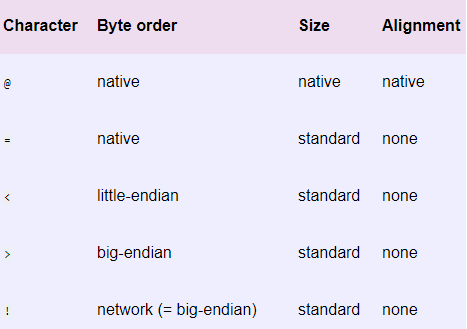
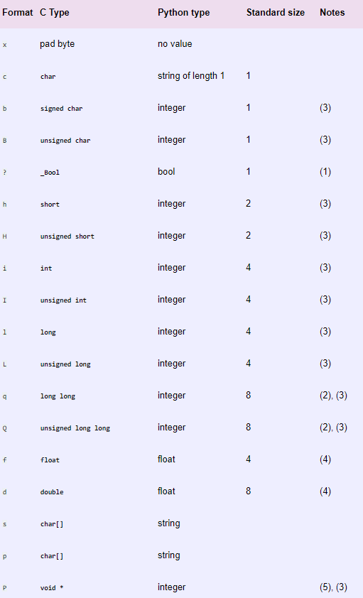
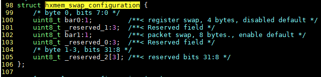
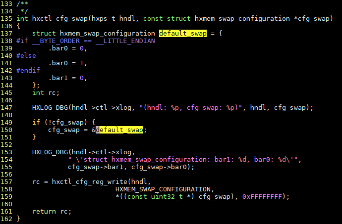
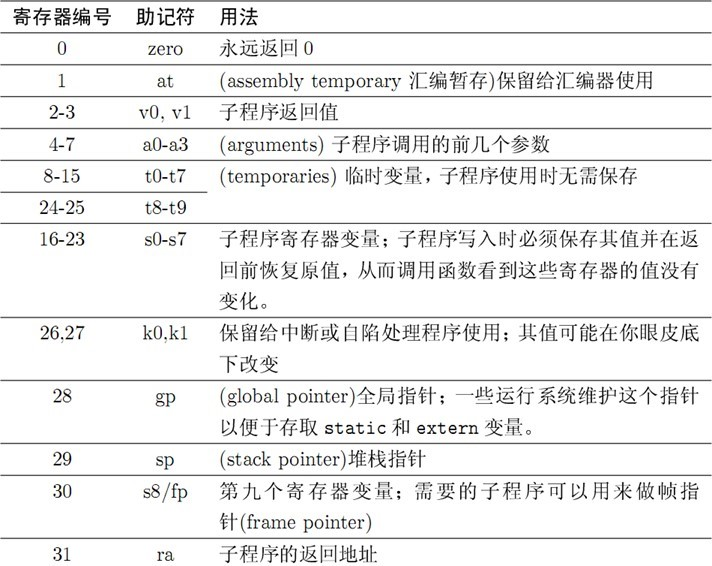
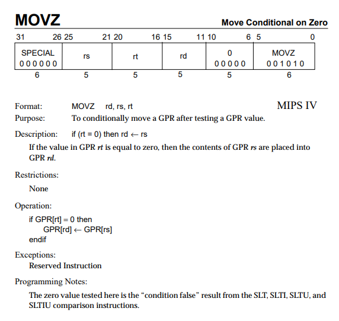
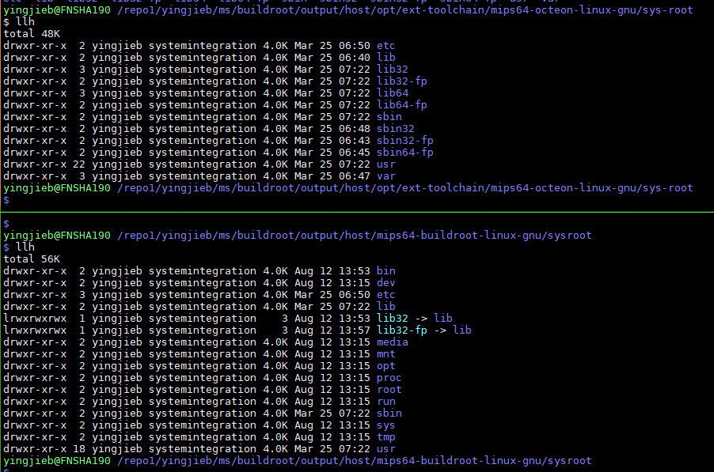
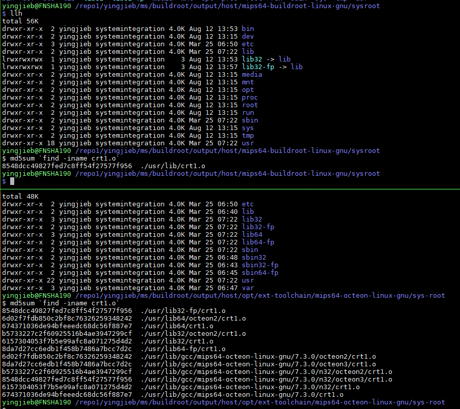

- [浮点运算的内核模拟问题 floating-point](#浮点运算的内核模拟问题-floating-point)
  - [排查](#排查)
  - [解决](#解决)
- [so不匹配问题](#so不匹配问题)
  - [解决](#解决-1)
    - [用python直接修改二进制](#用python直接修改二进制)
- [指针强转和编译器的 strict aliasing原则](#指针强转和编译器的-strict-aliasing原则)
  - [详细解释](#详细解释)
    - [代码](#代码)
    - [编译](#编译)
  - [参考](#参考)
- [cannot find crt1.o 问题](#cannot-find-crt1o-问题)
  - [现象](#现象)
  - [分析](#分析)
  - [buildroot](#buildroot)
    - [octeon3用的是lib32-fp](#octeon3用的是lib32-fp)
  - [gcc4.7和gcc7.3的搜索路径不一样](#gcc47和gcc73的搜索路径不一样)
  - [原因](#原因)
  - [解决](#解决-2)

# 浮点运算的内核模拟问题 floating-point
在工具链升级后, MIPS的板子在跑一个厂家提供的SDK时, 变得非常慢.
提前剧透一下, 跟floating-point有关.

## 排查
根据版本比较, 和之前升级的问题经验, 排除了`-fno-strict-aliasing`的问题. 见下文[指针强转和编译器的 strict aliasing原则](#指针强转和编译器的-strict-aliasing原则)
过程如下:
1. 启动慢了30秒, 定位到慢的code block, 其中cmpPorts函数是热点

2. 调查这个函数, 用新老toolchain都对照分析, 虽然最后的汇编不太一样, 但执行时间和结果都没有不同
3. 基本排除这个函数, 但要加更多调试打印来看整个code block
4. 用perf抓到很多软浮点函数的调用, 那可能是硬浮点没使能?
5. 确认硬浮点已经使能, 但为什么还有软浮点的函数调用?

## 解决
上面已经很接近root cause了. 是浮点emulation导致的性能下降.  
硬浮点已经正确使能了.为什么还要浮点emulation呢?  
为什么测试程序不复现, 只有sdk代码复现?  
那关键点在于, 什么情况下, 会使用软浮点?

因为--
浮点指令`ldc1`的data不对齐, 会导致浮点异常.
实际上, datasheet上确实要求这个指令要64bit对齐. 如果不对齐, 会触发异常.  
kernel捕获这个异常, 用软浮点模拟了计算  

接下来就要看, sdk代码里, 到底是不是data不对齐造成的?  
C语言要求malloc返回的地址要8字节对齐, 但SDK没有follow.

解决办法是使能SDK里面已有的预定义宏, 使malloc 8字节对齐.

为什么老的工具链不复现? 因为老的工具链没有用这个浮点指令.

# so不匹配问题
板子上confd起不来, 显示
```
/run # confd --start-phase0
Internal error: Failed to load NIF library: '/lib/confd/lib/core/util/priv/syslog_nif.so: cannot open shared object file: No such file or directory'
Daemon died status=19
```
但实际上, 这个so文件是存在的
```
~ # ls -lh /lib/confd/lib/core/util/priv/syslog_nif.so
-rwxr-xr-x 1 root root 6.3K Sep 9 2019 /lib/confd/lib/core/util/priv/syslog_nif.so
```
用readelf命令, 可以看到编译时的flags:
```
readelf -h `find -name *.so` | grep Flag
```

在octeon3系列上, 一般是这样:  
`Flags: 0x808e0827, noreorder, pic, cpic, abi2, octeon3, mips64r2`

而`/lib/confd/lib/core/util/priv/syslog_nif.so`是这样的:  
`Flags: 0x808e0227, noreorder, pic, cpic, abi2, fp64, octeon3, mips64r2`  
多了fp64, 因为toolchain的bug, 这个flag会导致so文件打不开.

在buildroot output目录下, 寻找所有的fp64标记的so
```
for f in `find -name *.so`; do echo $f; readelf -h $f | grep Flag | grep fp64; done > so.log
```
发现全部都是`./build/confd-7.1.1.5/confd/lib/confd`下面的so才有fp64标记.

----
调查结果是: confd的so是自己带的, 不是新的工具链编出来的.

## 解决
这个问题的root cause是: cavium提供的gcc7.3, 以及binutils, 和老的gcc4.7不兼容

confd是第三方提供的, 他们不肯重新用新gcc来编译.  
那只能自己直接修改老的so. 把ELF头的flag给改掉.  

### 用python直接修改二进制
先把so mmap, 然后修改其中的字段.  
这个和ultraedit直接改二进制一样道理.
代码如下:
```python
#!/usr/bin/env python2
# Cavium (Marvell) toolchain based on gcc 7.x introduced a change in ELF flags
# such that objects from old toolchain and new toolchain are not compatible.
# Specifically, the following change was made in glibc to align with binutils
 
# values:
#
# -#define EF_MIPS_HARD_FLOAT 0x00000200
# -#define EF_MIPS_SINGLE_FLOAT 0x00000400
# +#define EF_MIPS_HARD_FLOAT 0x00000800
# +#define EF_MIPS_SINGLE_FLOAT 0x00001000
#
# The normal solution to this problem is to make sure to recompile all objects
# with the new toolchain. However, in case of ConfD, the recompilation needs to
# happen by the third-party vendor (TailF) which is not open to taking in the
# new toolchain.
# We can workaround this problem by patching the flag values manually.
# Note: below we only change the 'HARD_FLOAT' value (0x200 -> 0x800), we don't
# seem to encounter the SINGLE_FLOAT case.


import mmap
import os
import struct
import sys
ELF32_HEADER_SIZE = 0x34
ELF64_HEADER_SIZE = 0x40
ELF_EI_MAG0 = 0x0
ELF_EI_MAG1 = 0x1
ELF_EI_MAG2 = 0x2
ELF_EI_MAG3 = 0x3
ELF_EI_CLASS = 0x4
ELF_EI_DATA = 0x5
ELF_E_MACHINE = 0x12 #size 2
ELF32_E_FLAGS = 0x24 #size 4
ELF64_E_FLAGS = 0x30 #size 4
if len(sys.argv) < 2:
    sys.stderr.write('Error: please pass filenames as arguments\n')
    sys.exit(1)
for filename in sys.argv[1:]:
    if not os.path.exists(filename):
        sys.stderr.write('Error: file %s does not exist\n' % filename)
        sys.exit(1)
for filename in sys.argv[1:]:
    with open(filename, "r+b") as f:
        mm = mmap.mmap(f.fileno(), ELF64_HEADER_SIZE)
        # check it's actually an ELF file
        if not (mm[ELF_EI_MAG0] == '\x7f' and
                mm[ELF_EI_MAG1] == 'E' and
                mm[ELF_EI_MAG2] == 'L' and
                mm[ELF_EI_MAG3] == 'F'
        ):
            sys.stderr.write('Error: not an ELF file: %s\n' % filename)
            sys.exit(1)
        # ELF32 or ELF64?
        class_ = struct.unpack('B', mm[ELF_EI_CLASS])[0]
        if class_ == 1:
            # ELF32
            flags_offset = ELF32_E_FLAGS
        elif class_ == 2:
            # ELF64
            flags_offset = ELF64_E_FLAGS
        else:
            sys.stderr.write('Error: invalid ELF class in file: %s\n' % filename)
            sys.exit(1)
        # endianness
        endianness = struct.unpack('B', mm[ELF_EI_DATA])[0]
        if endianness != 2:
            sys.stderr.write('Error: expected big-endian ELF file: %s\n' % filename)
            sys.exit(1)
        # MIPS only
        machine = struct.unpack('>H', mm[ELF_E_MACHINE:ELF_E_MACHINE+2])[0]
        if machine != 0x0008:
            sys.stderr.write('Error: not a MIPS ELF file: %s\n' % filename)
            sys.exit(1)
        # Patch hard-float flags
        flags = struct.unpack('>L', mm[flags_offset:flags_offset+4])[0]
        if flags & 0x200:
 
            newflags = flags & ~0x200 | 0x800
            print('File %s: changing flags from %x to %x' % (filename, flags, newflags))
            mm[flags_offset:flags_offset+4] = struct.pack('>L', newflags)
        else:
            print('File %s already has suitable flags: %x' % (filename, flags))
    mm.close()
```
注:
* mmap提供把文件mmap到内存的功能, 这里返回的mm就像个数组
* struct是python的一个包, 用来把二进制和pythone值之间进行转换. 
比如`struct.unpack(fmt, string)`接受一个fmt, 表示要如何进行转换:  
  
  

# 指针强转和编译器的 strict aliasing原则
使用gcc7.3导致marvell.user运行失败

对应代码  
  
  

解释:
* 135行, 入参cfg_swap是NULL
* 应该是大端, default_swap应该是1
* 传入hxctl_cfg_reg_write函数的结构体cfg_swap全是0 -- 为什么? 见下文
* 导致marvell芯片配置成小端模式, 实际应该是大端模式.
* 解决办法是加`-fno-strict-aliasing`

注:
* 根据解释, 打开strict-aliasing选项后, 编译器会认为不同类型的指针, 不可能指向同一个内存地址. 所以放心的做一些优化. 
**这要求代码也同样遵守这个规则: 不同类型的指针不能指向同一个内存.**
**指针强制转换会破坏这个rule, 在`-fstrict-aliasing`打开的情况下, 会出现未知结果.**
所以为了更好的享受编译器优化, 建议不要在代码里做强制类型转换.
* `-fstrict-aliasing`在较新的编译器里, 默认打开. 比如这次从gcc4.9升级到gcc7.3, 7.3就默认打开了这个选项.

## 详细解释
### 代码
```c
#include <stdio.h>

typedef unsigned char __uint8_t;
typedef unsigned short int __uint16_t;
typedef unsigned int __uint32_t;
typedef __uint8_t uint8_t;
typedef __uint16_t uint16_t;
typedef __uint32_t uint32_t;

struct configuration {
    uint8_t value[4];
};

int bar(uint32_t data);
int baz(struct configuration x);

int foo(struct configuration *cfg_swap)
{
    struct configuration default_swap = {
        .value[0] = 0xaa,
        .value[1] = 0xbb,
        .value[2] = 0xcc,
        .value[3] = 0xdd,
    };
    int rc;

    if (!cfg_swap) {
        //printf("foo\n"); // adding the print fixes the problem too
        cfg_swap = &default_swap;
    }

    rc = bar(* (uint32_t *)cfg_swap); // the cast here triggers the issue
    //rc = baz(*cfg_swap); // passing cfg_swap without cast works correctly

    return rc;
}
```
### 编译
对代码编译:  
* A: `gcc -fpic -O2 -fno-strict-aliasing -c test.c -o test.o`  
反汇编
```c
00000000 <foo>:
   0:    27bdffe0 addiu    sp,sp,-32
   4:    3c02aabb lui    v0,0xaabb
   8:    03a4200a movz    a0,sp,a0
   c:    3442ccdd ori    v0,v0,0xccdd
  10:    ffbc0010 sd    gp,16(sp)
  14:    3c1c0000 lui    gp,0x0
  18:    ffbf0018 sd    ra,24(sp)
  1c:    0399e021 addu    gp,gp,t9
  20:    afa20000 sw    v0,0(sp)
  24:    279c0000 addiu    gp,gp,0
  28:    8f990000 lw    t9,0(gp)
  2c:    0320f809 jalr    t9
  30:    8c840000 lw    a0,0(a0)
  34:    dfbf0018 ld    ra,24(sp)
  38:    dfbc0010 ld    gp,16(sp)
  3c:    03e00008 jr    ra
  40:    27bd0020 addiu    sp,sp,32
```

* B: `gcc -fpic -O2 -c test.c -o test.o`
```
00000000 <foo>:
   0:    27bdffe0 addiu    sp,sp,-32
   4:    ffbc0010 sd    gp,16(sp)
   8:    03a4200a movz    a0,sp,a0
   c:    ffbf0018 sd    ra,24(sp)
  10:    3c1c0000 lui    gp,0x0
  14:    0399e021 addu    gp,gp,t9
  18:    279c0000 addiu    gp,gp,0
  1c:    8f990000 lw    t9,0(gp)
  20:    0320f809 jalr    t9
  24:    8c840000 lw    a0,0(a0)
  28:    dfbf0018 ld    ra,24(sp)
  2c:    dfbc0010 ld    gp,16(sp)
  30:    03e00008 jr    ra
  34:    27bd0020 addiu    sp,sp,32
```

* 补充汇编知识  
  
  

解释:
* 在B情况下, 调用bar的入参是寄存器a0, 而a0是前面赋值来的:`movz    a0,sp,a0`, 即如果a0为0, 则把sp赋值给a0; 
对应
    ```c
    if (!cfg_swap)
        cfg_swap = &default_swap;
    ```
* 在foo函数入参是NULL的情况下, a0为sp的值, 而sp指向变量default_swap, 并为其保留了32byte的栈空间
所以`if (!cfg_swap)`成立, `cfg_swap`指向栈上的`default_swap`, 从而`bar(* (uint32_t *)cfg_swap)`是把栈变量`default_swap`强转成uint32_t 
* 编译器默认打开了strict-aliasing, 认为`(uint32_t *)`和`struct configuration *cfg_swap`不可能是同一块地址, 这是strict-aliasing的原则. 这也要求代码里不要对指针强转.  
所以编译器认为既然你最后用的是`uint32_t *`, 没用`struct configuration *`, 所以对`struct configuration`类型的`default_swap`赋值没有意义, 也没有哪里用到. 就优化掉了.  
从反汇编结果看, 没有`aabbccdd`的赋值
* 所以`default_swap`在栈上分配了空间, 但没有初始化, 其值随机; 到真实的marvell sdk代码, 值应该是1(代表大端), 但因为上述原因, 一般是0(代表小端). 导致配置错误.

----
* 对case A来说, 有`-fno-strict-aliasing`, 关闭了编译器关于strict-aliasing的假设, 编译器还是老老实实的把default_swap赋值成`aabbccdd`.

## 参考
https://blog.csdn.net/dbzhang800/article/details/6720141
https://xania.org/200712/cpp-strict-aliasing
https://cellperformance.beyond3d.com/articles/2006/06/understanding-strict-aliasing.html

# cannot find crt1.o 问题
## 现象
直接把gcc4.7替换成gcc7.3, 有找不到crt1.o错误
```
make dtc-dirclean
make -j1 dtc V=1
```
前面编译没错误, 但在链接时, 找不到crt1.o; 这个东西之前也见过, 估计是C Run Time的缩写
```
/repo1/yingjieb/ms/buildroot/output/host/bin/mips64-octeon-linux-gnu-gcc -D_LARGEFILE_SOURCE -D_LARGEFILE64_SOURCE -D_FILE_OFFSET_BITS=64 -Os -g2 -fPIC -I libfdt -I . -o convert-dtsv0 srcpos.o util.o convert-dtsv0-lexer.lex.o
/repo1/yingjieb/ms/buildroot/output/host/opt/ext-toolchain/bin/../lib/gcc/mips64-octeon-linux-gnu/7.3.0/../../../../mips64-octeon-linux-gnu/bin/ld: cannot find crt1.o: No such file or directory
/repo1/yingjieb/ms/buildroot/output/host/opt/ext-toolchain/bin/../lib/gcc/mips64-octeon-linux-gnu/7.3.0/../../../../mips64-octeon-linux-gnu/bin/ld: cannot find crti.o: No such file or directory
collect2: error: ld returned 1 exit status
```

## 分析
`/repo1/yingjieb/ms/buildroot/output/host/bin/mips64-octeon-linux-gnu-gcc`是buildroot提供的"wrapper", 代码在`buildroot/toolchain/toolchain-wrapper.c`
```
yingjieb@FNSHA190 /repo1/yingjieb/ms/buildroot
$ ll /repo1/yingjieb/ms/buildroot/output/host/bin/mips64-octeon-linux-gnu-gcc
lrwxrwxrwx 1 yingjieb systemintegration 17 Aug 12 13:57 /repo1/yingjieb/ms/buildroot/output/host/bin/mips64-octeon-linux-gnu-gcc -> toolchain-wrapper
```
单独运行出错的那行命令, 加环境变量`BR2_DEBUG_WRAPPER`, 同样能复现:
```
yingjieb@FNSHA190 /repo1/yingjieb/ms/buildroot/output/build/dtc-1.4.7
$ BR2_DEBUG_WRAPPER=1 /repo1/yingjieb/ms/buildroot/output/host/bin/mips64-octeon-linux-gnu-gcc -mabi=n32 -D_LARGEFILE
_SOURCE -D_LARGEFILE64_SOURCE -D_FILE_OFFSET_BITS=64 -Os -g2 -fPIC -I libfdt -I . -o convert-dtsv0 srcpos.o util.
o convert-dtsv0-lexer.lex.o
Toolchain wrapper executing: CCACHE_BASEDIR='/repo1/yingjieb/ms/buildroot/output' '/repo1/yingjieb/ms/buildroot/output/host/bin/ccache' '/repo1/yingjieb/ms/buildroot/output/host/opt/ext-toolchain/bin/mips64-octeon-linux-gnu-gcc' '--sy
sroot' '/repo1/yingjieb/ms/buildroot/output/host/mips64-buildroot-linux-gnu/sysroot' '-mabi=n32' '-mnan=legacy' '-EB' '-pipe' '-mno-branch-likely' '-march=octeon3' '-mabi=n32' '-D_LARGEFILE_SOURCE' '-D_LARGEFILE64_SOURCE' '-D_FILE_OFF
SET_BITS=64' '-Os' '-g2' '-fPIC' '-I' 'libfdt' '-I' '.' '-o' 'convert-dtsv0' 'srcpos.o' 'util.o' 'convert-dtsv0-lexer.lex.o'
/repo1/yingjieb/ms/buildroot/output/host/opt/ext-toolchain/bin/../lib/gcc/mips64-octeon-linux-gnu/7.3.0/../../../../mips64-octeon-linux-gnu/bin/ld: cannot find crt1.o: No such file or directory
/repo1/yingjieb/ms/buildroot/output/host/opt/ext-toolchain/bin/../lib/gcc/mips64-octeon-linux-gnu/7.3.0/../../../../mips64-octeon-linux-gnu/bin/ld: cannot find crti.o: No such file or directory
```
说明这个wrapper最后还是调用了`/repo1/yingjieb/ms/buildroot/output/host/opt/ext-toolchain/bin/mips64-octeon-linux-gnu-gcc`, 默认传入一些参数`--sysroot /repo1/yingjieb/ms/buildroot/output/host/mips64-buildroot-linux-gnu/sysroot -mabi=n32 -mnan=legacy -EB -pipe -mno-branch-likely -march=octeon3 -mabi=n32`  
在命令行还原这些参数如下:
```
yingjieb@FNSHA190 /repo1/yingjieb/ms/buildroot/output/build/dtc-1.4.7
$ /repo1/yingjieb/ms/buildroot/output/host/opt/ext-toolchain/bin/mips64-octeon-linux-gnu-gcc --sysroot /repo1/yingjieb/ms/buildroot/output/host/mips64-buildroot-linux-gnu/sysroot '-mabi=n32' '-mnan=legacy' '-EB' '-pipe' '-mno-branch-l
ikely' '-march=octeon3' '-mabi=n32' '-D_LARGEFILE_SOURCE' '-D_LARGEFILE64_SOURCE' '-D_FILE_OFFSET_BITS=64' '-Os' '-g2' '-fPIC' '-I' 'libfdt' '-I' '.' '-o' 'convert-dtsv0' 'srcpos.o' 'util.o' 'convert-dtsv0-lexer.lex.o'
/repo1/yingjieb/ms/buildroot/output/host/opt/ext-toolchain/bin/../lib/gcc/mips64-octeon-linux-gnu/7.3.0/../../../../mips64-octeon-linux-gnu/bin/ld: cannot find crt1.o: No such file or directory
/repo1/yingjieb/ms/buildroot/output/host/opt/ext-toolchain/bin/../lib/gcc/mips64-octeon-linux-gnu/7.3.0/../../../../mips64-octeon-linux-gnu/bin/ld: cannot find crti.o: No such file or directory
```
至此说明问题出在新的GCC7.3

## buildroot
编译器在`buildroot/output/host/opt/ext-toolchain/mips64-octeon-linux-gnu`  
buildroot会把编译器的sysroot, 拷贝到`buildroot/output/host/mips64-buildroot-linux-gnu/sysroot`, 但只保留lib  
  

### octeon3用的是lib32-fp
  

## gcc4.7和gcc7.3的搜索路径不一样
用strace可以看出来
```
strace -o ld47.log /repo/yingjieb/ms/buildrootmlt/output/host/bin/mips64-octeon-linux-gnu-gcc -D_LARGEFILE_SOURCE -D_LARGEFILE64_SOURCE -D_FILE_OFFSET_BITS=64 -Os -g2 -fPIC -I libfdt -I . -o convert-dtsv0 srcpos.o util.o convert-dtsv0-lexer.lex.o
strace -o ld73.log /repo1/yingjieb/ms/buildroot/output/host/bin/mips64-octeon-linux-gnu-gcc -D_LARGEFILE_SOURCE -D_LARGEFILE64_SOURCE -D_FILE_OFFSET_BITS=64 -Os -g2 -fPIC -I libfdt -I . -o convert-dtsv0 srcpos.o util.o convert-dtsv0-lexer.lex.o
```
对比如下:
```shell
#前面几个路径类似, 在toolchain目录下找
host/opt/ext-toolchain/bin/../lib/gcc/mips64-octeon-linux-gnu/4.7.0/n32/octeon3/crt1.o
host/opt/ext-toolchain/bin/../lib/gcc/n32/octeon3/crt1.o
host/opt/ext-toolchain/bin/../lib/gcc/mips64-octeon-linux-gnu/4.7.0/../../../../mips64-octeon-linux-gnu/lib/mips64-octeon-linux-gnu/4.7.0/n32/octeon3/crt1.o
host/opt/ext-toolchain/bin/../lib/gcc/mips64-octeon-linux-gnu/4.7.0/../../../../mips64-octeon-linux-gnu/lib/../lib32-fp/crt1.o
#下面开始, 在sysroot下面找, sysroot是传参来的
host/mips64-buildroot-linux-gnu/sysroot/lib/mips64-octeon-linux-gnu/4.7.0/n32/octeon3/crt1.o
#gcc4.7找的是lib/../lib32-fp
host/mips64-buildroot-linux-gnu/sysroot/lib/../lib32-fp/crt1.o
#而gcc7.3找的是lib64../lib32-fp
host/mips64-buildroot-linux-gnu/sysroot/lib64/../lib32-fp/crt1.o

host/mips64-buildroot-linux-gnu/sysroot/usr/lib/mips64-octeon-linux-gnu/4.7.0/n32/octeon3/crt1.o
#GCC4.7到这里找到了
host/mips64-buildroot-linux-gnu/sysroot/usr/lib/../lib32-fp/crt1.o
#问题在这, lib32-fp里面是由cr1.o的, 但是相对于lib64目录的, 而buildroot没拷贝lib64目录.
host/mips64-buildroot-linux-gnu/sysroot/usr/lib64/../lib32-fp/crt1.o
```

## 原因
buildroot拷贝sysroot的时候, 做了裁剪, 导致gcc7.3找不到crt1.o

## 解决
```shell
/repo1/yingjieb/ms/buildroot/output/host/mips64-buildroot-linux-gnu/sysroot/usr
#加lib64软链接
ln -s lib lib64
```

