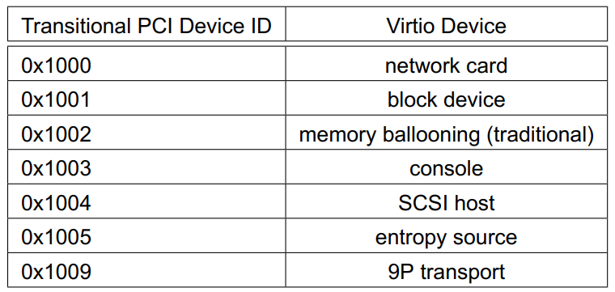
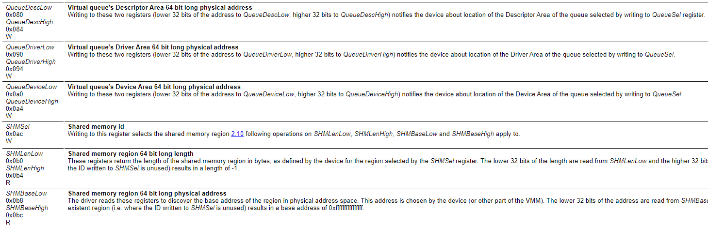
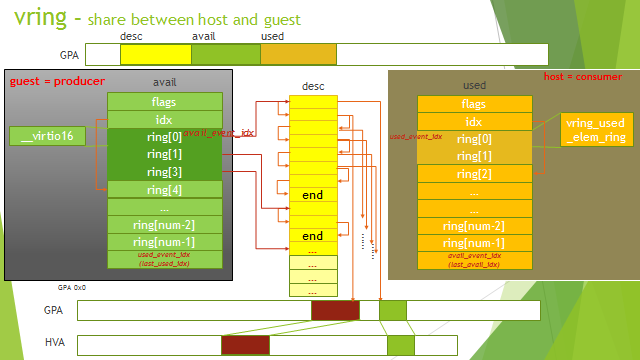

- [virtio规范](#virtio规范)
  - [virtio设备组成](#virtio设备组成)
    - [Device status field](#device-status-field)
    - [Feature bits](#feature-bits)
    - [Device Configuration space](#device-configuration-space)
    - [One or more virtqueues](#one-or-more-virtqueues)
      - [描述符格式](#描述符格式)
      - [Virtqueue Available Ring格式](#virtqueue-available-ring格式)
      - [中断抑制](#中断抑制)
      - [Virtqueue Used Ring](#virtqueue-used-ring)
      - [通知抑制](#通知抑制)
  - [初始化](#初始化)
  - [驱动和设备交互](#驱动和设备交互)
    - [驱动提供buffer给设备](#驱动提供buffer给设备)
    - [从设备接受buffer](#从设备接受buffer)
  - [virtio over pci](#virtio-over-pci)
    - [device的配置空间](#device的配置空间)
      - [Common configuration, cfg_type 1](#common-configuration-cfg_type-1)
      - [Notification structure, cfg_type 2](#notification-structure-cfg_type-2)
      - [ISR status寄存器, cfg_type 3](#isr-status寄存器-cfg_type-3)
      - [PCI configuration access capability, cfg_type 5](#pci-configuration-access-capability-cfg_type-5)
    - [virtio pci设备初始化过程](#virtio-pci设备初始化过程)
    - [通知和中断](#通知和中断)
      - [驱动通知设备](#驱动通知设备)
      - [从设备的Virtqueue中断到驱动](#从设备的virtqueue中断到驱动)
      - [驱动处理中断](#驱动处理中断)
  - [Virtio Over MMIO](#virtio-over-mmio)
    - [MMIO Device Discovery](#mmio-device-discovery)
    - [MMIO Device Register Layout](#mmio-device-register-layout)
    - [Virtqueue Configuration](#virtqueue-configuration)
  - [device类型](#device类型)
    - [Network Device](#network-device)
    - [Block Device](#block-device)
    - [其他类型的virtio device](#其他类型的virtio-device)
- [以前整理](#以前整理)
  - [分离式 split virtqueue](#分离式-split-virtqueue)
  - [queue的操作](#queue的操作)
    - [给device提供buffer](#给device提供buffer)
    - [处理device用过的buffer](#处理device用过的buffer)
  - [紧凑式 packed queue](#紧凑式-packed-queue)
    - [Scatter-Gather支持](#scatter-gather支持)

# virtio规范
[virtio规范v1.0](http://docs.oasis-open.org/virtio/virtio/v1.0/virtio-v1.0.html)  
[virtio规范v1.12](http://docs.oasis-open.org/virtio/virtio/v1.2/virtio-v1.2.html)

## virtio设备组成
virtio设备可以被pci, mmio, channel io等bus发现, 每个virtio设备包括:
### Device status field
包括几个状态flag, 用于指示初始化过程的每个阶段的状态.
* ACKNOWLEDGE
* DRIVER
* FAILED
* FEATURES_OK
* DRIVER_OK
* DEVICE_NEEDS_RESET

### Feature bits
device提供feature list, driver来选择. 在初始化时协商

### Device Configuration space
* 配置空间用于初始化, 一般不经常改动
* 小端字节序
* driver必须按32bit读写
* 有些configuration是可选的, 先查对应的feature bit是否生效

### One or more virtqueues
virtqueue负责数据传输, 设备可以有0个或多个virtqueue. 每个queue有16bit的size参数, 用于设置entry个数(最大32768)
每个queue都包括:
* Descriptor Table
* Available Ring
* Used Ring

这三部分都在guest内存里, 物理地址连续.
这三部分的对齐要求和size如下:

|Virtqueue Part| Alignment| Size(in bytes)
|--|--|--
|Descriptor Table| 16| 16∗(Queue Size)
|Available Ring| 2| 6 + 2∗(Queue Size)
|Used Ring| 4| 6 + 8∗(Queue Size)

guest驱动想发送一个buffer到virtio设备时:
1. 驱动先在`Descriptor Table`填好一个slot, 或者几个slot链
2. 驱动写这个Descriptor index到`Available Ring`
3. 驱动写notification通知device
4. device使用完这个buffer后, 写Descriptor index到`Used Ring`
5. device发中断给驱动

驱动来安排descriptors的frame, 比如network使用12字节头后面加1514字节的packet, 或者直接安排一个1526字节的output descriptor
设备不该对这个frame有假设.

#### 描述符格式
buffer分为可读的和可写的, 一个描述符只能是二者之一.
addr是在guest内存的物理地址.
```c
struct virtq_desc { 
        /* Address (guest-physical). */ 
        le64 addr; 
        /* Length. */ 
        le32 len; 
 
/* This marks a buffer as continuing via the next field. */ 
#define VIRTQ_DESC_F_NEXT   1 
/* This marks a buffer as device write-only (otherwise device read-only). */ 
#define VIRTQ_DESC_F_WRITE     2 
/* This means the buffer contains a list of buffer descriptors. */ 
#define VIRTQ_DESC_F_INDIRECT   4 
        /* The flags as indicated above. */ 
        le16 flags; 
        /* Next field if flags & NEXT */ 
        le16 next; 
};
```

#### Virtqueue Available Ring格式
```c
struct virtq_avail { 
#define VIRTQ_AVAIL_F_NO_INTERRUPT      1 
        le16 flags; 
        le16 idx; 
        le16 ring[ /* Queue Size */ ]; 
        le16 used_event; /* Only if VIRTIO_F_EVENT_IDX */ 
};
```
这个avail ring是驱动写, device读的, 用于驱动向device提供buffer. 一个entry对应一个descriptor table里的entry(如果是链的话, 对应链表头的那个entry)
idx表示驱动会把下一个descriptor放在ring的哪里.

#### 中断抑制
搜索VIRTIO_F_EVENT_IDX feature bit

#### Virtqueue Used Ring
```c
struct virtq_used { 
#define VIRTQ_USED_F_NO_NOTIFY  1 
        le16 flags; 
        le16 idx; 
        struct virtq_used_elem ring[ /* Queue Size */]; 
        le16 avail_event; /* Only if VIRTIO_F_EVENT_IDX */ 
}; 
 
/* le32 is used here for ids for padding reasons. */ 
struct virtq_used_elem { 
        /* Index of start of used descriptor chain. */ 
        le32 id; 
        /* Total length of the descriptor chain which was used (written to) */ 
        le32 len; 
};
```
设备写, 驱动读. 表示设备把用完的buffer还给驱动.

#### 通知抑制
类似中断抑制

## 初始化
driver对device初始化从reset device开始, 然后设置状态标记bit, 比如set ACKNOWLEDGE status bit.
driver和device都可以对device的configuration spce的每个域做修改, 为了避免昂贵的配置空间读, 如果配置空间发生改变, 修改方通知另一方.

The driver MUST follow this sequence to initialize a device:

1.  Reset the device.
2.  Set the ACKNOWLEDGE status bit: the guest OS has notice the device.
3.  Set the DRIVER status bit: the guest OS knows how to drive the device.
4.  Read device feature bits, and write the subset of feature bits understood by the OS and driver to the device. During this step the driver MAY read (but MUST NOT write) the device-specific configuration fields to check that it can support the device before accepting it.
5.  Set the FEATURES_OK status bit. The driver MUST NOT accept new feature bits after this step.
6.  Re-read device status to ensure the FEATURES_OK bit is still set: otherwise, the device does not support our subset of features and the device is unusable.
7.  Perform device-specific setup, including discovery of virtqueues for the device, optional per-bus setup, reading and possibly writing the device’s virtio configuration space, and population of virtqueues.
8.  Set the DRIVER_OK status bit. At this point the device is “live”.

## 驱动和设备交互
比如, 最简单的virtio net设备, 有一个`transmit virtqueue`和一个`receive virtqueue`
驱动把要发送的packet放到`transmit virtqueue`, 并在device use掉这个packet后释放对应的buffer
设备把收到的packet放到`receive virtqueue`, 驱动处理这个"used" buffer.

所以, 对驱动来说, 有两个类型的操作
* Supplying Buffers to The Device
* Receiving Used Buffers From The Device

### 驱动提供buffer给设备
A buffer consists of zero or more device-readable physically-contiguous elements followed by zero or more physically-contiguous device-writable elements (each has at least one element). This algorithm maps it into the descriptor table to form a descriptor chain:

for each buffer element, b:

1.  Get the next free descriptor table entry, d
2.  Set d.addr to the physical address of the start of b
3.  Set d.len to the length of b.
4.  If b is device-writable, set d.flags to VIRTQ_DESC_F_WRITE, otherwise 0.
5.  If there is a buffer element after this:
    1.  Set d.next to the index of the next free descriptor element.
    2.  Set the VIRTQ_DESC_F_NEXT bit in d.flags.

然后驱动更新aviable ring, 然后更新idx. 驱动在更新inx前要做barrier操作, 让前面的操作生效.
然后驱动通知device, 这个通知的方法是按bus来的. 通知一般比较昂贵, 可以设置通知抑制来减小overhead.

### 从设备接受buffer
驱动在收到中断后, 处理used ring. 这个中断需要VMM来实施中断注入guest, 也非常昂贵. 同样可以被抑制.

## virtio over pci
virtio device首先要满足PCI规范. 注: PCI都是小端的.
* PCI Vendor ID: 0x1AF4
* device ID 分类: 过渡阶段的的PCI device ID如下  
  
正式的device id从0x1040开始. 比如network card的正式ID是0x1041, 而过渡ID是0x1000

### device的配置空间
小端格式, 64bit寄存器也要分两个32bit寄存器来访问, 低32bit在前, 高32bit在后.
device的配置空间包括以下几部分:
*   1 Common configuration
*   2 Notifications
*   3 ISR Status
*   4 Device-specific configuration (optional)
*   5 PCI configuration access

每部分都可以分别用bar(Base Address register)来map到物理地址空间; 或者用PCI配置空间的特殊寄存器VIRTIO_PCI_CAP_PCI_CFG来访问.

使用pci配置空间的capability list来配置以上5个部分.
```c
struct virtio_pci_cap { 
        u8 cap_vndr;    /* Generic PCI field: PCI_CAP_ID_VNDR */ 
        u8 cap_next;    /* Generic PCI field: next ptr. */ 
        u8 cap_len;     /* Generic PCI field: capability length */ 
        u8 cfg_type;    /* Identifies the structure. 序号如上 */ 
        u8 bar;         /* Where to find it. 0x0到0x5, 表示用哪个bar来map上面的cfg_type*/ 
        u8 padding[3];  /* Pad to full dword. */ 
        le32 offset;    /* Offset within bar. */ 
        le32 length;    /* Length of the structure, in bytes. */ 
};
```

#### Common configuration, cfg_type 1
用于和driver协商feature, queue个数, queue size, desc table, avail ring和used ring的地址.
```c
struct virtio_pci_common_cfg {
    /* About the whole device. */
    le32 device_feature_select; /* read-write */
    le32 device_feature; /* read-only for driver */
    le32 driver_feature_select; /* read-write */
    le32 driver_feature; /* read-write */
    le16 msix_config; /* read-write */
    le16 num_queues; /* read-only for driver */
    u8 device_status; /* read-write */
    u8 config_generation; /* read-only for driver */
    /* About a specific virtqueue. */
    le16 queue_select; /* read-write */
    le16 queue_size; /* read-write */
    le16 queue_msix_vector; /* read-write */
    le16 queue_enable; /* read-write */
    le16 queue_notify_off; /* read-only for driver */
    
    //以下就是描述符区, driver区, device区的物理地址
    //guest driver把物理地址写入下面三个寄存器, 分别对应desc区, avail区和used区.
    le64 queue_desc; /* read-write */
    le64 queue_avail; /* read-write */ 
    le64 queue_used; /* read-write */ 
};
```

#### Notification structure, cfg_type 2
This capability is immediately followed by an additional field, like so:
```c
struct virtio_pci_notify_cap { 
        struct virtio_pci_cap cap; 
        le32 notify_off_multiplier; /* Multiplier for queue_notify_off. */ 
};
```
这个notify_off_multiplier和其他两个参数一起, 可以计算出queue notification在bar内的偏移地址:  
`cap.offset + queue_notify_off * notify_off_multiplier`  
The cap.offset and notify_off_multiplier are taken from the notification capability structure above, and the queue_notify_off is taken from the common configuration structure. Note: For example, if notifier_off_multiplier is 0, the device uses the same Queue Notify address for all queues.

#### ISR status寄存器, cfg_type 3
只有一个字节, 其中只有2位有用, 用于区分是queue中断还是配置变更中断. 驱动读清, 即驱动读这个isr状态寄存器的时候, 寄存器清零, 中断de-assert.

#### PCI configuration access capability, cfg_type 5
提供另外一种访问device配置空间(cfg_type 1, 2,, 3, 4)的方法.
The capability is immediately followed by an additional field like so:
```c
struct virtio_pci_cfg_cap { 
        struct virtio_pci_cap cap; 
        u8 pci_cfg_data[4]; /* Data for BAR access. */ 
};
```
The fields cap.bar, cap.length, cap.offset and pci_cfg_data are read-write (RW) for the driver.

To access a device region, the driver writes into the capability structure (ie. within the PCI configuration space) as follows:

* The driver sets the BAR to access by writing to cap.bar.
* The driver sets the size of the access by writing 1, 2 or 4 to cap.length.
* The driver sets the offset within the BAR by writing to cap.offset.

At that point, pci_cfg_data will provide a window of size cap.length into the given cap.bar at offset cap.offset.

### virtio pci设备初始化过程
* 驱动scan PCI capability list, 检测出上面五种配置layout
* MSI-x配置
* Virtqueue配置
  * 1  Write the virtqueue index (first queue is 0) to queue_select.
  * 2  Read the virtqueue size from queue_size. This controls how big the virtqueue is (see [2.4](http://docs.oasis-open.org/virtio/virtio/v1.0/cs04/virtio-v1.0-cs04.html#x1-220004) [Virtqueues](http://docs.oasis-open.org/virtio/virtio/v1.0/cs04/virtio-v1.0-cs04.html#x1-220004)). If this field is 0, the virtqueue does not exist.
  * 3  Optionally, select a smaller virtqueue size and write it to queue_size.
  * 4  Allocate and zero Descriptor Table, Available and Used rings for the virtqueue in contiguous physical memory.
  * 5  Optionally, if MSI-X capability is present and enabled on the device, select a vector to use to request interrupts triggered by virtqueue events. Write the MSI-X Table entry number corresponding to this vector into queue_msix_vector. Read queue_msix_vector: on success, previously written value is returned; on failure, NO_VECTOR value is returned.

### 通知和中断
#### 驱动通知设备
The driver notifies the device by writing the 16-bit virtqueue index of this virtqueue to the Queue Notify address.
#### 从设备的Virtqueue中断到驱动
If an interrupt is necessary for a virtqueue, the device would typically act as follows:
* If MSI-X capability is disabled:
  * Set the lower bit of the ISR Status field for the device.
  * Send the appropriate PCI interrupt for the device.
* If MSI-X capability is enabled:
  * If queue_msix_vector is not NO_VECTOR, request the appropriate MSI-X interrupt message for the device, queue_msix_vector sets the MSI-X Table entry number.

#### 驱动处理中断
The driver interrupt handler would typically:

* If MSI-X capability is disabled:
  * Read the ISR Status field, which will reset it to zero.
  * If the lower bit is set: look through the used rings of all virtqueues for the device, to see if any progress has been made by the device which requires servicing.
  * If the second lower bit is set: re-examine the configuration space to see what changed.
* If MSI-X capability is enabled:
  * Look through the used rings of all virtqueues mapped to that MSI-X vector for the device, to see if any progress has been made by the device which requires servicing.
  * If the MSI-X vector is equal to config_msix_vector, re-examine the configuration space to see what changed.

## Virtio Over MMIO
Virtual environments without PCI support (a common situation in embedded devices models) might use simple memory mapped device (“virtio-mmio”) instead of the PCI device.
The memory mapped virtio device behaviour is based on the PCI device specification. Therefore most operations including device initialization, queues configuration and buffer transfers are nearly identical. Existing differences are described in the following sections.

### MMIO Device Discovery
mmio的virtio设备一般需要配dts, 因为mmio没有一个发现机制
Unlike PCI, MMIO provides no generic device discovery mechanism. For each device, the guest OS will need to know the location of the registers and interrupt(s) used. The suggested binding for systems using flattened device trees is shown in this example:
```c
// EXAMPLE: virtio_block device taking 512 bytes at 0x1e000, interrupt 42. 
virtio_block@1e000 { 
        compatible = "virtio,mmio"; 
        reg = <0x1e000 0x200>; 
        interrupts = <42>; 
}
```

### MMIO Device Register Layout
virtio的所有寄存器都以上面的base地址为开始, 依次排列
MMIO virtio devices provide a set of memory mapped control registers followed by a device-specific configuration space, described in the table 4.1.
All register values are organized as Little Endian.
下面的table定义了mmio的寄存器layout
比如

|Name Offset RW|Description
|--|--
|MagicValue 0x000 R | 0x74726976 (a Little Endian equivalent of the “virt” string).
|QueueNumMax 0x034 R | Maximum virtual queue size Reading from the register returns the maximum size (number of elements) of the queue the device is ready to process or zero (0x0) if the queue is not available. This applies to the queue selected by writing to QueueSel.
|QueueReady 0x044 RW | Virtual queue ready bit Writing one (0x1) to this register notifies the device that it can execute requests from this virtual queue. Reading from this register returns the last value written to it. Both read and write accesses apply to the queue selected by writing to QueueSel.
|InterruptStatus 0x60 R | 中断状态寄存器
|InterruptACK 0x064 W | 中断应答寄存器
|0x100..=0xfff | 控制空间寄存器 Configuration space Device-specific configuration space starts at the offset 0x100 and is accessed with byte alignment. Its meaning and size depend on the device and the driver.

补充, 下面的几组寄存器是和driver交换virt queue地址信息的:  
  

另外0x50这个offset也很重要, 这个是guest driver通知device的寄存器, driver写这个地址, 就会触发关联的eventfd给device发信号.

### Virtqueue Configuration

The driver will typically initialize the virtual queue in the following way:

1.  Select the queue writing its index (first queue is 0) to QueueSel.
2.  Check if the queue is not already in use: read QueueReady, and expect a returned value of zero (0x0).
3.  Read maximum queue size (number of elements) from QueueNumMax. If the returned value is zero (0x0) the queue is not available.
4.  Allocate and zero the queue memory, making sure the memory is physically contiguous.
5.  Notify the device about the queue size by writing the size to QueueNum.
6.  Write physical addresses of the queue’s Descriptor Area, Driver Area and Device Area to (respectively) the QueueDescLow/QueueDescHigh, QueueDriverLow/QueueDriverHigh and QueueDeviceLow/QueueDeviceHigh register pairs.
7.  Write 0x1 to QueueReady.

## device类型
### [Network Device](https://docs.oasis-open.org/virtio/virtio/v1.2/csd01/virtio-v1.2-csd01.html#x1-2170001)
* virtqueue  
network设备的virtqueue是一对或多对receiveq和transmitq, 最后一个是controlq  
0 receiveq1  
1 transmitq1  
…  
2(N-1) receiveqN  
2(N-1)+1 transmitqN  
2N controlq
* 要发送的`报文头+报文`被放到transmitq, 接收到的`报文头+报文`被放到receiveq  
这个报文头的格式如下:  
```c
struct virtio_net_hdr { 
#define VIRTIO_NET_HDR_F_NEEDS_CSUM    1 
#define VIRTIO_NET_HDR_F_DATA_VALID    2 
#define VIRTIO_NET_HDR_F_RSC_INFO      4 
        u8 flags; 
#define VIRTIO_NET_HDR_GSO_NONE        0 
#define VIRTIO_NET_HDR_GSO_TCPV4       1 
#define VIRTIO_NET_HDR_GSO_UDP         3 
#define VIRTIO_NET_HDR_GSO_TCPV6       4 
#define VIRTIO_NET_HDR_GSO_UDP_L4      5 
#define VIRTIO_NET_HDR_GSO_ECN      0x80 
        u8 gso_type; 
        le16 hdr_len; 
        le16 gso_size; 
        le16 csum_start; 
        le16 csum_offset; 
        le16 num_buffers; 
        le32 hash_value;        (Only if VIRTIO_NET_F_HASH_REPORT negotiated) 
        le16 hash_report;       (Only if VIRTIO_NET_F_HASH_REPORT negotiated) 
        le16 padding_reserved;  (Only if VIRTIO_NET_F_HASH_REPORT negotiated) 
};
```

### [Block Device](https://docs.oasis-open.org/virtio/virtio/v1.2/csd01/virtio-v1.2-csd01.html#x1-2740002)
The virtio block device is a simple virtual block device (ie. disk). Read and write requests (and other exotic requests) are placed in one of its queues, and serviced (probably out of order) by the device except where noted.
* virtqueue  
0 requestq1  
…  
N-1 requestqN  
N=1 if VIRTIO_BLK_F_MQ is not negotiated, otherwise N is set by num_queues.
* 驱动把virtio_blk_req放到virtqueues, layout如下  
```c
struct virtio_blk_req { 
        le32 type; //io有很多种操作, 读/写/flush/erase等等
        le32 reserved; 
        le64 sector; 
        u8 data[]; 
        u8 status; 
};
```
* configuration layout  
```c
struct virtio_blk_config { 
        le64 capacity; 
        le32 size_max; 
        le32 seg_max; 
        struct virtio_blk_geometry { 
                le16 cylinders; 
                u8 heads; 
                u8 sectors; 
        } geometry; 
        le32 blk_size; 
        struct virtio_blk_topology { 
                // # of logical blocks per physical block (log2) 
                u8 physical_block_exp; 
                // offset of first aligned logical block 
                u8 alignment_offset; 
                // suggested minimum I/O size in blocks 
                le16 min_io_size; 
                // optimal (suggested maximum) I/O size in blocks 
                le32 opt_io_size; 
        } topology; 
        u8 writeback; 
        u8 unused0; 
        u16 num_queues; 
        le32 max_discard_sectors; 
        le32 max_discard_seg; 
        le32 discard_sector_alignment; 
        le32 max_write_zeroes_sectors; 
        le32 max_write_zeroes_seg; 
        u8 write_zeroes_may_unmap; 
        u8 unused1[3]; 
        le32 max_secure_erase_sectors; 
        le32 max_secure_erase_seg; 
        le32 secure_erase_sector_alignment; 
};
```

### 其他类型的virtio device
* [Console Device](https://docs.oasis-open.org/virtio/virtio/v1.2/csd01/virtio-v1.2-csd01.html#x1-2900003)
* [Entropy Device](https://docs.oasis-open.org/virtio/virtio/v1.2/csd01/virtio-v1.2-csd01.html#x1-3050004)
* [Traditional Memory Balloon Device](https://docs.oasis-open.org/virtio/virtio/v1.2/csd01/virtio-v1.2-csd01.html#x1-3140005)
* [SCSI Host Device](https://docs.oasis-open.org/virtio/virtio/v1.2/csd01/virtio-v1.2-csd01.html#x1-3430006)
* [GPU Device](https://docs.oasis-open.org/virtio/virtio/v1.2/csd01/virtio-v1.2-csd01.html#x1-3650007)
* [Input Device](https://docs.oasis-open.org/virtio/virtio/v1.2/csd01/virtio-v1.2-csd01.html#x1-3850008)
* [Crypto Device](https://docs.oasis-open.org/virtio/virtio/v1.2/csd01/virtio-v1.2-csd01.html#x1-3960009)
* [Socket Device](https://docs.oasis-open.org/virtio/virtio/v1.2/csd01/virtio-v1.2-csd01.html#x1-43600010)
* [File System Device](https://docs.oasis-open.org/virtio/virtio/v1.2/csd01/virtio-v1.2-csd01.html#x1-45800011)
* [RPMB Device](https://docs.oasis-open.org/virtio/virtio/v1.2/csd01/virtio-v1.2-csd01.html#x1-47800012)
* [IOMMU device](https://docs.oasis-open.org/virtio/virtio/v1.2/csd01/virtio-v1.2-csd01.html#x1-49300013)
* [Sound Device](https://docs.oasis-open.org/virtio/virtio/v1.2/csd01/virtio-v1.2-csd01.html#x1-52900014)
* [Memory Device](https://docs.oasis-open.org/virtio/virtio/v1.2/csd01/virtio-v1.2-csd01.html#x1-56800015)
* [I2C Adapter Device](https://docs.oasis-open.org/virtio/virtio/v1.2/csd01/virtio-v1.2-csd01.html#x1-59300016)
* [SCMI Device](https://docs.oasis-open.org/virtio/virtio/v1.2/csd01/virtio-v1.2-csd01.html#x1-60400017)
* [GPIO Device](https://docs.oasis-open.org/virtio/virtio/v1.2/csd01/virtio-v1.2-csd01.html#x1-62100018)
* [PMEM Device](https://docs.oasis-open.org/virtio/virtio/v1.2/csd01/virtio-v1.2-csd01.html#x1-64100019)


# 以前整理
## 分离式 split virtqueue
老的spec用的格式, 在内存上是一段连续的地址空间, 包括三部分:
* Descriptor Table - occupies the Descriptor Area
* Available Ring - occupies the Driver Area, 只可driver写
* Used Ring - occupies the Device Area, 只可device写

```c
//代码: linux/include/uapi/linux/virtio_ring.h
struct vring {
 unsigned int num;
 struct vring_desc *desc;
 struct vring_avail *avail;
 struct vring_used *used;
};
/* The standard layout for the ring is a continuous chunk of memory which looks
 * like this. We assume num is a power of 2.
 *
 * struct vring
 * {
 * // The actual descriptors (16 bytes each)
 * struct vring_desc desc[num];
 *
 * // A ring of available descriptor heads with free-running index.
 * __virtio16 avail_flags;
 * __virtio16 avail_idx;
 * __virtio16 available[num];
 * __virtio16 used_event_idx;
 *
 * // Padding to the next align boundary.
 * char pad[];
 *
 * // A ring of used descriptor heads with free-running index.
 * __virtio16 used_flags;
 * __virtio16 used_idx;
 * struct vring_used_elem used[num];
 * __virtio16 avail_event_idx;
 * };
 */
```

## queue的操作
比如NIC驱动, 有两个队列: 发送队列(transmit virtqueue)和接收队列(receive virtqueue)  
driver把出报文加到发送队列, 在报文buffer被device使用完后再free报文buffer  
device把入报文加到接收队列; 更新used index, 后面driver再处理.  
  

### 给device提供buffer
1. driver把buffer放到Descriptor Table, descriptor有next域, 可以做链
2. dirver把buffer链表头放到Available Ring的available[next entry]
3. batching模式允许一次放多个报文
4. driver执行memory barrier指令, 确保device能看到描述符表和available ring的更新
5. driver更新available idx, 加上本次的描述符链表头的个数.
6. driver还要执行memory barrier指令, 确保在通知device之前, idx已经更新成功
7. 如果通知没有被抑制, dirver发available buffer通知给device
* available ring和descriptor table的size是一样的(最大32768), 这样的话, 只要descriptor不溢出, ring就不会溢出
* 因为通知通常比较昂贵, 可以抑制通知; 通过used_event_idx和avil_event_idx配合来实现.
通知昂贵到什么程度呢? 比如OVS的vhost-user backend(这里的device)通知VM的kernel virtio-net驱动(这里的driver), 过程如下:
  * 写eventfd, 产生系统调用到内核态
  * 在内核态里, write()系统调用KVM注册的回调函数irqfd_wakeup()
  * 唤醒kworker线程, 后者调用irqfd_inject()完成中断注入到VM, 唤醒VM的VCPU进程.
  * VM的VCPU被唤醒, 开始处理中断  
  * 根据实验测算, 以上过程在几十us量级.

### 处理device用过的buffer
1. device使用完buffer, 或是读或是写
2. device发used buffer通知给driver
3. driver处理这些用过的buffer, 处理期间, 可能禁止通知, 再打开通知的时候, 检查并处理新的used buffer.

## 紧凑式 packed queue
分离式的queue对driver和device来说, 是读写分离的; 而紧凑式的queue是可读可写的, driver和device都可以读写.
通过协商VIRTIO_F_RING_PACKED标志来判断是否支持packed queue.
packed queue最大支持32768个entry
也有三部分: 
* descriptor ring - 描述符区
```c
struct pvirtq_desc {
    /* Buffer Address. */
    le64 addr;
    /* Buffer Length. */
    le32 len;
    /* Buffer ID. */
    le16 id;
    /* The flags depending on descriptor type. */
    le16 flags;
};
```
* driver event suppression - driver写, device读; 控制device发used buffer通知的频率? 减小通知发送次数
* device event suppression - device写, driver读; 控制driver发available buffer通知的频率? 减小通知发送次数
```c
struct pvirtq_event_suppress {
    le16 {
        desc_event_off : 15; /* Descriptor Ring Change Event Offset */
        desc_event_wrap : 1; /* Descriptor Ring Change Event Wrap Counter */
    } desc; /* If desc_event_flags set to RING_EVENT_FLAGS_DESC */
    le16 {
        desc_event_flags : 2, /* Descriptor Ring Change Event Flags */
        reserved : 14; /* Reserved, set to 0 */
    } flags;
};
```

driver把buffer ID写入描述符ring, 通知device; device处理完成后, 把描述符写回描述符ring(覆盖之前driver写的那个)

### Scatter-Gather支持
有些驱动需要有能力提供多个buffer的列表(Scatter-Gather list), 或者是描述符链的结构, 或者是用间接描述符(indirect descriptor)
* 链式的方式, 除了list的最后一个描述符, 其他描述符的flags都有`VIRTQ_DESC_F_NEXT`标记; 这其实和上面的链方式差不多, 我理解看到flag里有`VIRTQ_DESC_F_NEXT`, 那描述符ring里的下一个描述符, 也属于同一个描述符链, 这样依次找下去, 没有标记的就是最后一个描述符, 它带buffer ID.
* 间接描述符方式
描述符带VIRTQ_DESC_F_INDIRECT标记, 指向一个间接描述符表
