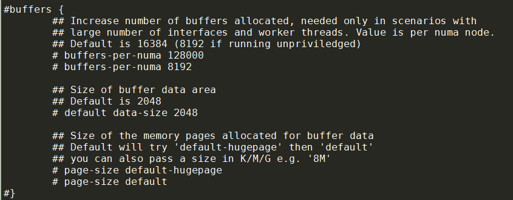
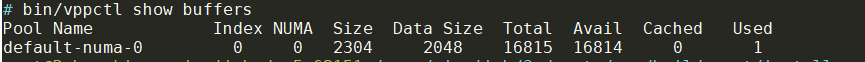
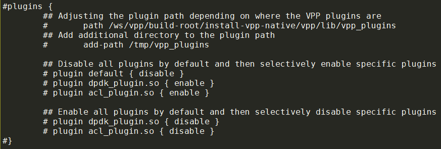

在Alpine Linux上编译VPP, 目标是运行一个不依赖dpdk的vpp做vswitch

- [背景](#背景)
- [编译](#编译)
  - [build-root/Makefile](#build-rootmakefile)
  - [尝试编译](#尝试编译)
    - [错误fatal error: execinfo.h: No such file or directory](#错误fatal-error-execinfoh-no-such-file-or-directory)
    - [memcpy和编译host有关](#memcpy和编译host有关)
    - [dlopen的RTLD\_DEEPBIND flag](#dlopen的rtld_deepbind-flag)
    - [增加musl libc没有的一些宏定义](#增加musl-libc没有的一些宏定义)
- [初步运行vpp](#初步运行vpp)
  - [验证vpp的基本功能](#验证vpp的基本功能)
  - [内存使用](#内存使用)
- [在aports中增加vpp包](#在aports中增加vpp包)
- [build vpp APK](#build-vpp-apk)
- [在container中运行VPP](#在container中运行vpp)
  - [Start vpp daemon](#start-vpp-daemon)
  - [The block diagram](#the-block-diagram)
  - [Use vppctl client](#use-vppctl-client)
- [vpp接口类型](#vpp接口类型)
- [参考](#参考)


# 背景
VPP是向量化的包处理框架, 提供开箱即用的路由功能, 具有高性能和支持插件化等优点.

我想把vpp做为一个package, 可以在alpine linux上运行. alpine用的是musl libc, vpp不支持. 下面记录一下如何修改vpp的源码, 支持vpp在musl libc下的编译.

# 编译
vpp支持DEB和RPM的包管理系统. 我们重点看build和build-release  
根目录的Makefile里面有
```makefile
define make
	@make -C $(BR) PLATFORM=$(PLATFORM) TAG=$(1) $(2)
endef

.PHONY: build
build: $(BR)/.deps.ok
	$(call make,$(PLATFORM)_debug,$(addsuffix -install,$(TARGETS)))

.PHONY: build-release
build-release: $(BR)/.deps.ok
	$(call make,$(PLATFORM),$(addsuffix -install,$(TARGETS)))
```
这里的`$(BR)/.deps.ok`是安装全部依赖包后的标记.  
`BR`是`build-root`子目录.  
依赖包有Debian的deb和redhat的RPM两种格式, 分不同的发行版, 有不同的依赖, 比如rocky linux依赖:
```makefile
else ifeq ($(OS_ID),rocky)
	RPM_DEPENDS += yum-utils
	RPM_DEPENDS += subunit subunit-devel
	RPM_DEPENDS += openssl-devel
	RPM_DEPENDS += python3-devel  # needed for python3 -m pip install psutil
	RPM_DEPENDS += python3-ply  # for vppapigen
	RPM_DEPENDS += python3-virtualenv python3-jsonschema
	RPM_DEPENDS += infiniband-diags llvm clang cmake
	RPM_DEPENDS_GROUPS = 'Development Tools'
```

另外一个依赖是`install-ext-dep`
```makefile
.PHONY: install-ext-deps
install-ext-deps:
	make -C build/external install-$(PKG)

.PHONY: install-ext-dep
install-ext-dep: install-ext-deps
```

## build-root/Makefile
这个Makefile主要是include了`build-data`目录下的sub makefile, 比如`build-data/packages/vpp.mk`

这里我暂时不考虑external的package, 比如`build/external`下面的dpdk, ipsec-mb, quick, rdma, xdp等. 所以需要去掉这些依赖:
```diff
$ git show 56f62f02e
commit 56f62f02e2b9eea079941089a0276eb0f91ad887 (HEAD)
Author: Bai Yingjie <byj.tea@gmail.com>
Date:   Mon Jul 3 07:15:09 2023 +0000

    remove external-install dependency for vpp configure

diff --git a/build-data/packages/vpp.mk b/build-data/packages/vpp.mk
index ad1d1fc9a..6a4ac77cf 100644
--- a/build-data/packages/vpp.mk
+++ b/build-data/packages/vpp.mk
@@ -35,7 +35,7 @@ ifneq ($(VPP_EXTRA_CMAKE_ARGS),)
 vpp_cmake_args += $(VPP_EXTRA_CMAKE_ARGS)
 endif

-vpp_configure_depend += external-install
+#vpp_configure_depend += external-install
 vpp_configure = \
   cd $(PACKAGE_BUILD_DIR) && \
   $(CMAKE) -G Ninja $(vpp_cmake_args) $(call find_source_fn,$(PACKAGE_SOURCE))
```

## 尝试编译
需要切换到root
```shell
apk add cmake linux-headers openssl-dev util-linux-dev libunwind-dev
pip install ninja
pip install ply

touch build-root/.deps.ok
make build-release
```

### 错误fatal error: execinfo.h: No such file or directory
gnu libc中提供了函数`backtrace()`, 用来unwind自己的调用栈. 需要头文件`execinfo.h`.  
而musl libc认为backtrace不在规范里, 就没有提供.  
在alpine 3.17之前, 有个库叫libexecinfo提供了这个头文件和动态链接库, 但在[最新的alpine中被去掉了](https://gitlab.alpinelinux.org/alpine/aports/-/commit/50795a14dee639ce2dcc836e2b2baca9bad4a1b1)

[这个讨论](https://www.openwall.com/lists/musl/2021/07/16/1)里面提到了[libunwind](https://www.nongnu.org/libunwind/index.html), 在alpine中是支持的: `apk add libunwind-dev`

[man libunwind](https://www.nongnu.org/libunwind/man/libunwind(3).html)中说这个库挺容易用的:
```c
#include <libunwind.h>

int unw_getcontext(unw_context_t *);
int unw_init_local(unw_cursor_t *, unw_context_t *);
int unw_init_remote(unw_cursor_t *, unw_addr_space_t, void *);
int unw_step(unw_cursor_t *);
int unw_get_reg(unw_cursor_t *, unw_regnum_t, unw_word_t *);
int unw_get_fpreg(unw_cursor_t *, unw_regnum_t, unw_fpreg_t *);
int unw_set_reg(unw_cursor_t *, unw_regnum_t, unw_word_t);
int unw_set_fpreg(unw_cursor_t *, unw_regnum_t, unw_fpreg_t);
int unw_resume(unw_cursor_t *);
unw_addr_space_t unw_local_addr_space;
unw_addr_space_t unw_create_addr_space(unw_accessors_t, int);
void unw_destroy_addr_space(unw_addr_space_t);
unw_accessors_t unw_get_accessors(unw_addr_space_t);
void unw_flush_cache(unw_addr_space_t, unw_word_t, unw_word_t);
int unw_set_caching_policy(unw_addr_space_t, unw_caching_policy_t);
int unw_set_cache_size(unw_addr_space_t, size_t, int);
const char *unw_regname(unw_regnum_t);
int unw_get_proc_info(unw_cursor_t *, unw_proc_info_t *);
int unw_get_save_loc(unw_cursor_t *, int, unw_save_loc_t *);
int unw_is_fpreg(unw_regnum_t);
int unw_is_signal_frame(unw_cursor_t *);
int unw_get_proc_name(unw_cursor_t *, char *, size_t, unw_word_t *);
void _U_dyn_register(unw_dyn_info_t *);
void _U_dyn_cancel(unw_dyn_info_t *);
```
比如你在函数`F()`中, 要unwind调用栈, 基本的用法是
1. 用`unw_getcontext()`得到当前的CPU寄存器
2. 初始化curser指向当前栈帧: `unw_init_local()`
3. 向上移动栈帧: `unw_step()`, 这个函数返回正值表示还有更多的栈帧.
4. `unw_step()`返回`0`表示栈回溯结束.

例子:
```c
#define UNW_LOCAL_ONLY
#include <libunwind.h>

void show_backtrace (void) {
  unw_cursor_t cursor; unw_context_t uc;
  unw_word_t ip, sp;

  unw_getcontext(&uc);
  unw_init_local(&cursor, &uc);
  while (unw_step(&cursor) > 0) {
    unw_get_reg(&cursor, UNW_REG_IP, &ip);
    unw_get_reg(&cursor, UNW_REG_SP, &sp);
    printf ("ip = %lx, sp = %lx\n", (long) ip, (long) sp);
  }
}
```

上面的例子用的local unwind模式. 还有个模式是remote unwind, 比如要unwind另一个进程或者另外一个机器的调用栈. 这里省略.

我把基于glibc的`backtrace()`改成了基于libunwind的实现. 编译通过, 修改如下:
```diff
diff --git a/src/vppinfra/backtrace.c b/src/vppinfra/backtrace.c
index e713bae68..13040a06c 100644
--- a/src/vppinfra/backtrace.c
+++ b/src/vppinfra/backtrace.c
@@ -219,27 +219,30 @@ backtrace_done:
 #ifndef clib_backtrace_defined
 #define clib_backtrace_defined

-/* use glibc backtrace for stack trace */
-#include <execinfo.h>
+/* use libunwind for stack trace */
+#define UNW_LOCAL_ONLY
+#include <libunwind.h>

 __clib_export uword
 clib_backtrace (uword * callers, uword max_callers, uword n_frames_to_skip)
 {
-  int size;
-  void *array[20];
-  /* Also skip current frame. */
-  n_frames_to_skip += 1;
-
-  size = clib_min (ARRAY_LEN (array), max_callers + n_frames_to_skip);
+  unw_cursor_t cursor;
+  unw_context_t uc;
+  unw_word_t ip;

-  size = backtrace (array, size);
+  unw_getcontext (&uc);
+  unw_init_local (&cursor, &uc);

   uword i;
-
-  for (i = 0; i < max_callers + n_frames_to_skip && i < size; i++)
+  while (unw_step (&cursor) > 0)
     {
-      if (i >= n_frames_to_skip)
-       callers[i - n_frames_to_skip] = pointer_to_uword (array[i]);
+      if (i++ < n_frames_to_skip)
+       {
+         continue;
+       }
+
+      unw_get_reg (&cursor, UNW_REG_IP, &ip);
+      callers[i - n_frames_to_skip] = ip;
     }

   if (i < n_frames_to_skip)
@@ -248,7 +251,6 @@ clib_backtrace (uword * callers, uword max_callers, uword n_frames_to_skip)
     return i - n_frames_to_skip;
 }

-
 #endif /* clib_backtrace_defined */

```

### memcpy和编译host有关
vpp默认在哪里编译, 就在哪里跑. 比如会在编译时检查机器类型, 对memcpy进行优化.  
比如提供了X86和ARM的实现, 这些都是在编译时确定的.
* src/vppinfra/vector_sse42.h
* src/vppinfra/vector_neon.h

如何对特定code去掉编译告警: 比如编译警告超过array的boundary
```c
#pragma GCC diagnostic push
#pragma GCC diagnostic ignored "-Warray-bounds"
    dst_byte = a->dst_address.as_u8[dst_address_byte_index];
#pragma GCC diagnostic pop
```

也可以全部加编译选项`-Wno-array-bounds`

### dlopen的RTLD_DEEPBIND flag
musl libc不支持RTLD_DEEPBIND  
```diff
# git show abb00d588
commit abb00d58883488b78296ff82852309bca6a0f373
Author: Bai Yingjie <byj.tea@gmail.com>
Date:   Tue Jul 4 02:15:13 2023 +0000

    vlib: dlopen with flag RTLD_DEEPBIND only if glibc is used

diff --git a/src/vlib/unix/plugin.c b/src/vlib/unix/plugin.c
index 1260089f4..f93339b7f 100644
--- a/src/vlib/unix/plugin.c
+++ b/src/vlib/unix/plugin.c
@@ -19,6 +19,7 @@
 #include <vppinfra/elf.h>
 #include <dlfcn.h>
 #include <dirent.h>
+#include <features.h>

 plugin_main_t vlib_plugin_main;

@@ -306,8 +307,13 @@ process_reg:
     }
   vec_free (version_required);

-  handle = dlopen ((char *) pi->filename,
-                  RTLD_LAZY | (reg->deep_bind ? RTLD_DEEPBIND : 0));
+#ifdef __GLIBC__
+#define DL_OPEN_FLAGS (RTLD_LAZY | (reg->deep_bind ? RTLD_DEEPBIND : 0))
+#else
+#define DL_OPEN_FLAGS (RTLD_LAZY)
+#endif
+
+  handle = dlopen ((char *) pi->filename, DL_OPEN_FLAGS);

   if (handle == 0)
     {
```

### 增加musl libc没有的一些宏定义
```diff
diff --git a/src/vcl/ldp_glibc_socket.h b/src/vcl/ldp_glibc_socket.h
index dcd37208f..e67bda0bf 100644
--- a/src/vcl/ldp_glibc_socket.h
+++ b/src/vcl/ldp_glibc_socket.h
@@ -27,6 +27,26 @@
 #include <signal.h>
 #include <poll.h>

+#ifndef __SOCKADDR_ARG
+#define __SOCKADDR_ARG struct sockaddr *__restrict
+#endif
+
+#ifndef __CONST_SOCKADDR_ARG
+#define __CONST_SOCKADDR_ARG __const struct sockaddr *
+#endif
+
+#ifndef __THROW
+#define __THROW
+#endif
+
+#ifndef __wur
+#define __wur
+#endif
+
+#ifndef __sigset_t
+#define __sigset_t sigset_t
+#endif
+
 /*
  *
  * Generic glibc fd api
```

# 初步运行vpp
devkit启动一个基于alpine的docker container.
```shell
./devkit start --cap SYS_ADMIN,NET_ADMIN,NET_RAW yingjieb_dev5
```
注: 如果没有`NET_RAW`这个linux capability, vpp会报af_packet的mmap错误.  
chatgpt解释的很好:
```
To use mmap on an AF_PACKET socket in Linux, the required capability is CAP_NET_RAW. This capability allows a process to create raw network sockets and perform low-level network operations.

To add the CAP_NET_RAW capability to a Docker container, you can use the --cap-add option when running the container:

docker run --cap-add=NET_RAW myimage

This grants the container the necessary capability to use mmap on AF_PACKET sockets.

It's important to note that granting capabilities to a container should be done carefully and only when necessary for the proper functioning of the containerized application. Limiting the capabilities to only those required enhances the security and isolation of the container environment.
```

container启动后
```shell
# 安装依赖
apk add libunwind util-linux iproute2

# 到目标文件目录
cd /repo/yingjieb/3rdparty/vpp/build-root/install-vpp-native/vpp

bin/vpp -c etc/vpp/startup.conf
```

## 验证vpp的基本功能
按照vpp的[入门文档](https://s3-docs.fd.io/vpp/23.06/gettingstarted/progressivevpp/interface.html)

先配置一个veth对
```shell
ip link add name vpp1out type veth peer name vpp1host
ip link set dev vpp1out up
ip link set dev vpp1host up
ip addr add 10.10.1.1/24 dev vpp1host
```
进入vpp命令行, 配置如下内容
```
vppctl
create host-interface name vpp1out
set int ip address host-vpp1out 10.10.1.2/24
set int state host-vpp1out up
```

用下面的命令检查vpp配置
```
show int
show int addr
show runtime
show buffers
```

## 内存使用
top看到vpp daemon用了213m RSS内存.  
调整`startup.conf`中的buffers小节可以调整内存使用:  


得到下面的数据:
```
buffers-per-numa 128000      : 703m
defaut 16384                 : 266m
buffers-per-numa 8192        : 235m
buffers-per-numa 2048        : 211m
```
用`vppctl show buffer`可以看  


另外, 如果配置了`page-size default`, vpp就不会尝试使能huge page.

还可以配置plugins小节, 默认所有plugin都不使能:  


但结果测试, load所有plugin只增加10m内存.

总结: 就用默认的值就挺好.

# 在aports中增加vpp包
我参考了`aports/community/openvswitch/APKBUILD`, 新增了`aports/community/vpp/APKBUILD`
```shell
# Contributor: Bai Yingjie <yingjie.bai@nokia-sbell.com>
# Maintainer: Bai Yingjie <yingjie.bai@nokia-sbell.com>
pkgname=vpp
pkgver=23.06
pkgrel=0
pkgdesc="Vector Packet Processor (VPP) is a fast, scalable layer 2-4 multi-platform network stack"
url="https://fd.io/"
arch="all"
license="Apache-2.0"
options="!check" # No tests
makedepends="linux-headers openssl-dev util-linux-dev libunwind-dev
	python3 py3-pip cmake ninja py3-ply chrpath"
subpackages="$pkgname-dbg"
	#$pkgname-openrc"

source="$pkgname-v$pkgver.tar.gz::https://github.com/FDio/vpp/archive/refs/tags/v$pkgver.tar.gz
	0001-plugins-add-missing-headers-for-musl-libc.patch
	0002-remove-external-install-dependency-for-vpp-configure.patch
	0003-vppinfra-use-libunwind-to-unwind-call-stack.patch
	0004-vlib-dlopen-with-flag-RTLD_DEEPBIND-only-if-glibc-is.patch
	0005-ignore-some-compliation-warnings.patch
	0006-wireguard-include-endian.h-for-le64toh-htobe64.patch
	0007-ldp-fix-compliation-errors-for-sockaddr-and-__sigset.patch
	"

prepare() {
	default_prepare
	echo v$pkgver-$pkgrel-0000000000 > src/scripts/.version
}

build() {
	touch build-root/.deps.ok
	make build-release
}

check() {
	make test
}

package() {
	mkdir -p "$pkgdir"
	"$builddir"/src/scripts/remove-rpath "$builddir"/build-root/install-vpp-native/vpp
	cp -dr "$builddir"/build-root/install-vpp-native/vpp/* "$pkgdir"
}

sha512sums="
f2e767264eef34ff4670214c52aabc1c7ef5fd10e9016bec79a265c8d7d7b2fffcc0079f17ceffc08fd0ed6eda3057ad11e30d44b1b45e50a8c47812d084a63d  vpp-v23.06.tar.gz
32d50be8a0f56e4d58c25a53a989b066afb63e57ca35f234e9ca64845cc0881a4152ce2a007063f746f3f80ee64539285fd05c30a96db0aa395b48ca636f0336  0001-plugins-add-missing-headers-for-musl-libc.patch
d1aa45a4b210d3630876707ad22971079800e54354c672709401f80d7822d409547a5548d2113b15c190f45096473ca301fe12fa94fd69c16662a0d15722d795  0002-remove-external-install-dependency-for-vpp-configure.patch
b86025837db684830514bb97a1ba12b5b2de2f692b6c7042aa83e1804393f5b0f470c8eb23b6787be36b5936fe16bcb22f7c3e3844ef9b734c46d694ef44b3be  0003-vppinfra-use-libunwind-to-unwind-call-stack.patch
34f0375deb2395e02a17019be4654a6b2d6ca1a353b8549bf092d24944e4dc76125a3edcd48dc696b23bf6a4d9312cb322a17bbf76e496c1118a4f29f1fec1b3  0004-vlib-dlopen-with-flag-RTLD_DEEPBIND-only-if-glibc-is.patch
1e85decc639a821c19edc64affdefe6fa3a7aa08e48e53d4273c44080ce218372003464304a212c4fd0ef7c944346f492460ef9e068a1ec28a620e6712054e8f  0005-ignore-some-compliation-warnings.patch
c6ff9e0d19a5608149c17b76c4ecc729d5a7b2bb847701ab3d38316d2df35b463866c4da2b648c1fbf36c0f245bf559637f7b03605663f0426e66b359239fa83  0006-wireguard-include-endian.h-for-le64toh-htobe64.patch
f6175e312b9fe4acd4de09523881ff729e07688914deb70c7d780775d98aed9b815512691a5dc2328b360f2ffd91a32b052aeb14a1d0233f69a6aa3d9ab12bab  0007-ldp-fix-compliation-errors-for-sockaddr-and-__sigset.patch
"
```

注:
* 用`git format-patch -7 -o patches`生成patch放到patches目录, `-7`是7个patch的意思
* `subpackages`目前只包含了`$pkgname-dbg`.`abuild -r`以后, 会在`/home/reborn/packages/community/x86_64`下生成两个vpp的apk文件
```shell
vpp-23.06-r0.apk 17.4M
vpp-dbg-23.06-r0.apk 120.1M
```
* `prepare()` `build()` `check()`和`package()`分别对应编译前,编译,UT和打包, 需要对源码的编译系统做适配.

# build vpp APK
用上面的APKFILE, 就可以在alpine linux中编译vpp了:
```shell
yingjieb@RebornLinux:yingjieb_dev4:63120 /repo/yingjieb/rebornlinux/aports
$ cd community/vpp/

yingjieb@RebornLinux:yingjieb_dev4:63120 /repo/yingjieb/rebornlinux/aports/community/vpp
$ abuild -r
```

# 在container中运行VPP
启动devkit container
```shell
# using vpp requires more privileges, we pass them via --cap
./devkit start --cap SYS_ADMIN,NET_ADMIN,NET_RAW yingjieb_vpp4
./devkit login yingjieb_vpp4

# under root user
apk add /home/yingjieb/packages/community/x86_64/vpp-23.06-r0.apk
```

## Start vpp daemon
vpp daemon will load all possible plugins
```shell
# under root user
vpp -c /etc/vpp/startup.conf
```
The vpp daemon now is running at foreground.

## The block diagram
```
           ┌──────────────────────────────┐
           │container                     │
           │                              │
           ├────┐  ┌───────────────────┐  │
172.17.0.36│eth0│  │vpp                │  │
           ├────┘  │     10.10.1.2     │  │
           │       │   ┌────────────┐  │  │
           │       │   │host-vpp1out│  │  │
           │       └───┼───────┬────┴──┘  │
           │           │vpp1out│          │
           │           └───┬───┘          │
           │               │              │
           │           ┌───┴────┐         │
           │           │vpp1host│         │
           │           └────────┘         │
           │            10.10.1.1         │
           └──────────────────────────────┘
```

## Use vppctl client
All operations are inside devkit docker instance `yingjieb_vpp4`

We start a new terminal:
```shell
# under root user
# create a veth pair
# vpp1host will be used in the container instance `yingjieb_vpp4`
# vpp1out will be used inside vpp vswitch
ip link add name vpp1out type veth peer name vpp1host

# set them up
ip link set dev vpp1out up
ip link set dev vpp1host up

# set IP 10.10.1.1 to vpp1host
ip addr add 10.10.1.1/24 dev vpp1host
```

Now use vppctl cli
```c
// to enter vpp command line
# vppctl

// entered vpp command line
// create an interface inside vpp vswitch which is a link to vpp1out
// the interface name will be host-vpp1out
vpp# create host-interface name vpp1out
vpp# set int ip address host-vpp1out 10.10.1.2/24

// show interfaces to check
vpp# show inter
              Name               Idx    State  MTU (L3/IP4/IP6/MPLS)     Counter          Count
host-vpp1out                      1      up          9000/0/0/0
local0                            0     down          0/0/0/0

// ping the container IP in which we run the vswitch
vpp# ping 10.10.1.1
116 bytes from 10.10.1.1: icmp_seq=1 ttl=64 time=8.7383 ms
116 bytes from 10.10.1.1: icmp_seq=2 ttl=64 time=8.6319 ms
116 bytes from 10.10.1.1: icmp_seq=3 ttl=64 time=8.7625 ms
116 bytes from 10.10.1.1: icmp_seq=4 ttl=64 time=4.6752 ms
116 bytes from 10.10.1.1: icmp_seq=5 ttl=64 time=13.0765 ms

Statistics: 5 sent, 5 received, 0% packet loss
```

From the container, we can also ping vpp's IP 10.10.1.2
```c
# ping 10.10.1.2
PING 10.10.1.2 (10.10.1.2): 56 data bytes
64 bytes from 10.10.1.2: seq=0 ttl=64 time=0.833 ms
64 bytes from 10.10.1.2: seq=1 ttl=64 time=4.112 ms
64 bytes from 10.10.1.2: seq=2 ttl=64 time=7.910 ms
64 bytes from 10.10.1.2: seq=3 ttl=64 time=3.484 ms
^C
--- 10.10.1.2 ping statistics ---
4 packets transmitted, 4 packets received, 0% packet loss
round-trip min/avg/max = 0.833/4.084/7.910 ms
```

# vpp接口类型
* tap: 对接kernel tap 设备
* memif: 对接另外一个vpp, 用户态
* AVF: x710的VF
* vhost-user: 用户态后端, 和VM对接
* netmap: Free BSD 用户态接口

# 参考
[vpp开发入门系列](https://pantheon.tech/vpp-guide/)
[基于vpp的商用包处理平台TNSR的内存优化文档](https://docs.netgate.com/tnsr/en/latest/troubleshooting/memory.html)