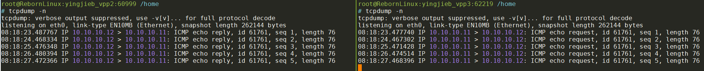
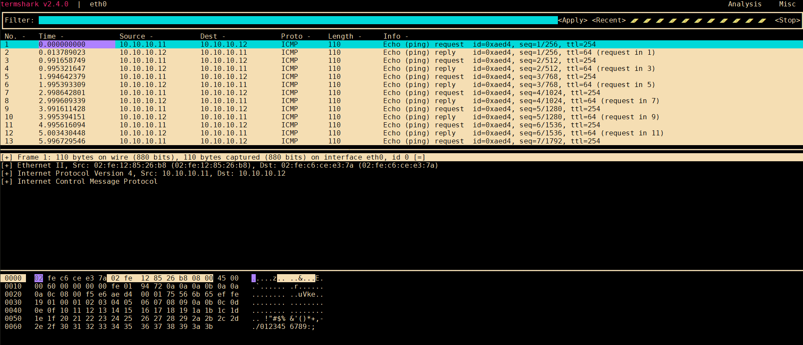
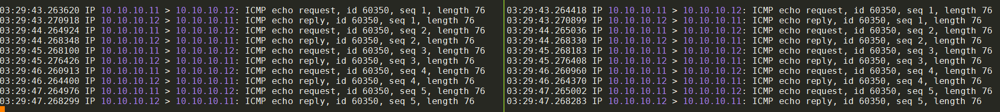
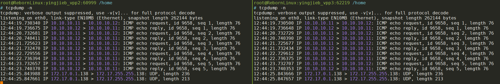

在container里面使用`vpp -c /etc/vpp/startup.conf`启动vpp.  
container的IP是:`eth0 172.17.0.53/16`

使用`vppctl create host-interface name eth0`可以创建一个host interface `host-eth0`
```
vpp# create host-interface ?
  create host-interface                    create host-interface [v2] name <ifname> [num-rx-queues <n>] [num-tx-queues <n>] [hw-addr <mac-addr>] [mode ip] [qdisc-bypass-disable] [cksum-gso-disable]
```
按照这个命令的[解释](https://s3-docs.fd.io/vpp/24.10/cli-reference/interface/create_interface.html):
> Create a host interface that will attach to a linux AF_PACKET interface, one side of a veth pair. The veth pair must already exist. Once created, a new host interface will exist in VPP with the name 'host-<ifname>', where '<ifname>' is the name of the specified veth pair. Use the show interface command to display host interface details.
>

本质上, host-interface host是在eth0上的一个`AF_PACKET`的`SOCK_RAW` socket.

下面从代码流程上解读一下这个host interface.

- [创建host interface](#创建host-interface)
- [发送packet到host-eth0](#发送packet到host-eth0)
- [从host-eth0收packet](#从host-eth0收packet)
- [RX/Tx ring的状态](#rxtx-ring的状态)
- [trace packet](#trace-packet)
- [小实验](#小实验)
  - [框图](#框图)
  - [from vpp2 ping vpp3](#from-vpp2-ping-vpp3)
    - [on vpp3(ping的对象)](#on-vpp3ping的对象)
    - [on VPP2(ping 发送方)](#on-vpp2ping-发送方)
    - [分析](#分析)
  - [为什么tcpdump抓不到outgoing的报文](#为什么tcpdump抓不到outgoing的报文)
  - [时间都花在哪了?](#时间都花在哪了)
    - [vpp运行时状态](#vpp运行时状态)
    - [关于符号](#关于符号)
    - [找到关键函数](#找到关键函数)
      - [第一次实验](#第一次实验)
    - [第二次实验](#第二次实验)
      - [分析](#分析-1)
  - [drop杂包](#drop杂包)


# 创建host interface
在`src/plugins/af_packet/cli.c`中, 注册`create host-interface`命令:
```c
VLIB_CLI_COMMAND (af_packet_create_command, static) = {
  .path = "create host-interface",
  .short_help = "create host-interface [v2] name <ifname> [num-rx-queues <n>] "
		"[num-tx-queues <n>] [hw-addr <mac-addr>] [mode ip] "
		"[qdisc-bypass-disable] [cksum-gso-disable]",
  .function = af_packet_create_command_fn,
};
```
这个命令支持一下的选项:
* `name %s`
* `rx-size %u`
* `tx-size %u`
* `rx-per-block %u`
* `tx-per-block %u`
* `num-rx-queues %u`: 默认1. 一个queue对应一个socket
* `num-tx-queues %u`: 默认1. 一个queue对应一个socket
* `qdisc-bypass-disable`: 默认enable qdiscipline bypass
* `cksum-gso-disable`: 默认enable gso chksum
* `mode ip`: 默认是AF_PACKET_IF_MODE_ETHERNET, 如果是ip模式的话, 看不到二层头
* `v2`: 默认是TPACKET_V3
* `hw-addr %U`

简要流程如下:
```c
af_packet_create_if
//1. 对应的host interface必须up
//2. 标记是否bridge
//3. 为每个queue都创建
    af_packet_device_init
        for each queue
            af_packet_queue_init
                create_packet_sock
                    //new a socket
                    fd = socket (AF_PACKET, SOCK_RAW, htons (ETH_P_ALL))
                    //bind rx packet socket
                    bind(fd, (struct sockaddr *) &sll, sizeof (sll))
                    //set rx packet interface version
                    setsockopt(fd, SOL_PACKET, PACKET_VERSION, &ver, sizeof (ver))
                    //set packet tx ring
                    setsockopt (fd, SOL_PACKET, PACKET_LOSS, &opt, sizeof (opt)
                    //set packet vnet hdr
                    setsockopt (fd, SOL_PACKET, PACKET_VNET_HDR, &opt2, sizeof (opt2)
                    //set qdisc bypass
                    setsockopt (fd, SOL_PACKET, PACKET_QDISC_BYPASS, &opt, sizeof (opt)
                    //set fanout options
                    setsockopt (*fd, SOL_PACKET, PACKET_FANOUT, &fanout, sizeof (fanout)
                    //set packet rx ring
                    setsockopt (*fd, SOL_PACKET, PACKET_RX_RING, rx_req, req_sz)
                    //set packet tx ring options
                    setsockopt (*fd, SOL_PACKET, PACKET_TX_RING, tx_req, req_sz)
                    //mmap fd 到tx/rx queue, 这些queue是vpp维护的
                    ring->ring_start_addr = mmap (NULL, ring_sz, PROT_READ | PROT_WRITE,
				MAP_SHARED | MAP_LOCKED, *fd, 0)
```

# 发送packet到host-eth0
在`src/plugins/af_packet/device.c`里注册了tx相关的函数
```c
VNET_DEVICE_CLASS (af_packet_device_class) = {
  .name = "af-packet",
  .format_device_name = format_af_packet_device_name,
  .format_device = format_af_packet_device,
  .format_tx_trace = format_af_packet_tx_trace,
  .tx_function_n_errors = AF_PACKET_TX_N_ERROR,
  .tx_function_error_strings = af_packet_tx_func_error_strings,
  .rx_redirect_to_node = af_packet_set_interface_next_node,
  .clear_counters = af_packet_clear_hw_interface_counters,
  .admin_up_down_function = af_packet_interface_admin_up_down,
  .mac_addr_change_function = af_packet_set_mac_address_function,
  .rx_mode_change_function = af_packet_interface_rx_mode_change,
};
```
这个`af_packet_device_class`的简要定流程如下:
```c
VNET_DEVICE_CLASS_TX_FN (af_packet_device_class) (vlib_main_t * vm,
						  vlib_node_runtime_t * node,
						  vlib_frame_t * frame)
    vnet_hw_if_tx_frame_t *tf = vlib_frame_scalar_args (frame);
    u16 queue_id = tf->queue_id;
    //找到tx_queue
    af_packet_queue_t *tx_queue = vec_elt_at_index (apif->tx_queues, queue_id);
    //需要发送的frame的大小和个数
    frame_size = tx_queue->tx_req->req.tp_frame_size;
    frame_num = tx_queue->tx_req->req.tp_frame_nr;
    //tx ring的起始地址和待发送的frame
    block_start = tx_queue->tx_ring[0];
    tx_frame = tx_queue->next_tx_frame;
    while(n_left)
        //找到待发送的第一个header
        tph3 = (tpacket3_hdr_t *) (block_start + tx_frame * frame_size);
        //检查状态
        //如果是tph3->tp_status是TP_STATUS_SEND_REQUEST | TP_STATUS_SENDING就break

        //计算好需要memcpy的位置和大小后, 做memcpy
        //注意memcpy是在while里进行的, 每个frame可能是多个离散的buffer, 这些buffer都有VLIB_BUFFER_NEXT_PRESENT标记
        clib_memcpy_fast ((u8 *) tph3 + tpacket_align + offset, vlib_buffer_get_current (b0), len);
        //置TP_STATUS_SEND_REQUEST标记
        tph2->tp_len = tph2->tp_snaplen = offset;
        tph2->tp_status = TP_STATUS_SEND_REQUEST;
    //前面在循环里memcpy每个frame后, 在其header里面置位tph3->tp_status = TP_STATUS_SEND_REQUEST
    //马上调用sendto通知kernel去触发底层driver的发送函数真正发送packet
    sendto (tx_queue->fd, NULL, 0, MSG_DONTWAIT, NULL, 0)
```
整个流程下来
* mmap + memcpy的作用是避免第二次内存拷贝, 即如果使用send等函数带来的从用户态到内核态的内存拷贝.
* 还是要调用`sendto()`来trigger内核做真正的`dev_xmit()`.

`/usr/include/linux/if_packet.h`里面定义了`tpacket3_hdr`
> The tpacket3_hdr structure is part of the Linux AF_PACKET socket family, specifically for version 3 (TPACKET_V3) of the packet mmap ring buffer. This structure provides the necessary metadata for each packet in the ring buffer, allowing user-space applications to interface efficiently with the kernel for high-speed packet capture and transmission.

```c
struct tpacket3_hdr {
	__u32		tp_next_offset;
	__u32		tp_sec;
	__u32		tp_nsec;
	__u32		tp_snaplen;
	__u32		tp_len;
	__u32		tp_status;
	__u16		tp_mac;
	__u16		tp_net;
	/* pkt_hdr variants */
	union {
		struct tpacket_hdr_variant1 hv1;
	};
	__u8		tp_padding[8];
};
```


# 从host-eth0收packet
在`src/plugins/af_packet/node.c`
```c
typedef struct
{
  u32 dev_instance;
  u32 queue_id;
} vnet_hw_if_rxq_poll_vector_t;

VLIB_NODE_FN (af_packet_input_node) (vlib_main_t * vm,
				     vlib_node_runtime_t * node,
				     vlib_frame_t * frame)
{
  u32 n_rx_packets = 0;
  af_packet_main_t *apm = &af_packet_main;
  vnet_hw_if_rxq_poll_vector_t *pv;
  //这个pv应该是个可变数组, 元素是上面的vnet_hw_if_rxq_poll_vector_t, 代表一个queue有interrupt到来了
  pv = vnet_hw_if_get_rxq_poll_vector (vm, node);
  for (int i = 0; i < vec_len (pv); i++)
    {
      af_packet_if_t *apif;
      apif = vec_elt_at_index (apm->interfaces, pv[i].dev_instance);
      if (apif->is_admin_up)
	{
	  if (apif->is_cksum_gso_enabled)
	    n_rx_packets += af_packet_device_input_fn (vm, node, frame, apif,
						       pv[i].queue_id, 1);
	  else
	    n_rx_packets += af_packet_device_input_fn (vm, node, frame, apif,
						       pv[i].queue_id, 0);
	}
    }
  return n_rx_packets;
}

VLIB_REGISTER_NODE (af_packet_input_node) = {
  .name = "af-packet-input",
  .flags = VLIB_NODE_FLAG_TRACE_SUPPORTED,
  .sibling_of = "device-input",
  .format_trace = format_af_packet_input_trace,
  .type = VLIB_NODE_TYPE_INPUT,
  .state = VLIB_NODE_STATE_INTERRUPT, //interrupt模式, 另外一个模式是VLIB_NODE_FLAG_ADAPTIVE_MODE
  .n_errors = AF_PACKET_INPUT_N_ERROR,
  .error_strings = af_packet_input_error_strings,
};
```
vpp框架调用到`af_packet_input_node`的时候, 说明incoming的packet已经到来了, 我猜也是通过epoll等机制kernel通知vpp框架的. 因为一个interface可以有多个queue, 所以在一个for循环里对每个queue调用`af_packet_device_input_fn`

`af_packet_device_input_fn`是核心的收报文函数, 比较复杂, 大致上就是从kernel的socket buffer里面, 拷贝到vpp的buffer里
```c
//先申请frame
vlib_get_next_frame (vm, node, next_index, to_next, n_left_to_next);
//拷贝packet
clib_memcpy_fast (((u8 *) vlib_buffer_get_current (b0)) + bytes_copied + vlan_len,	 (u8 *) tph + tph->tp_mac + offset + bytes_copied,(bytes_to_copy - bytes_copied));
//这里应该是往vpp上层的协议栈走了
vlib_put_next_frame (vm, node, next_index, n_left_to_next);
```

# RX/Tx ring的状态
在`/usr/include/linux/if_packet.h`有定义:
```c
/* Rx ring - header status */
#define TP_STATUS_KERNEL		      0
#define TP_STATUS_USER			(1 << 0)
#define TP_STATUS_COPY			(1 << 1)
#define TP_STATUS_LOSING		(1 << 2)
#define TP_STATUS_CSUMNOTREADY		(1 << 3)
#define TP_STATUS_VLAN_VALID		(1 << 4) /* auxdata has valid tp_vlan_tci */
#define TP_STATUS_BLK_TMO		(1 << 5)
#define TP_STATUS_VLAN_TPID_VALID	(1 << 6) /* auxdata has valid tp_vlan_tpid */
#define TP_STATUS_CSUM_VALID		(1 << 7)
#define TP_STATUS_GSO_TCP		(1 << 8)

/* Tx ring - header status */
#define TP_STATUS_AVAILABLE	      0
#define TP_STATUS_SEND_REQUEST	(1 << 0)
#define TP_STATUS_SENDING	(1 << 1)
#define TP_STATUS_WRONG_FORMAT	(1 << 2)

/* Rx and Tx ring - header status */
#define TP_STATUS_TS_SOFTWARE		(1 << 29)
#define TP_STATUS_TS_SYS_HARDWARE	(1 << 30) /* deprecated, never set */
#define TP_STATUS_TS_RAW_HARDWARE	(1U << 31)
```

# trace packet
`vppctl trace add`命令可以追踪报文, 但和`tcpdump`不太一样:
* trace不是针对interface的, 而是针对input node的, 支持的node有
  * af-packet-input: 主要是veth, 也可以是任何基于AF_PACKET类型的socket的input
  * virtio-input: tap v2
  * tapcli-rx: tap v1
  * dpdk-input: dpdk, gbe, phys*
* 正如trace这个名字所说, trace会"追踪"input packet的整个处理路径, 每个路径下的node都有时间戳, 方便分析性能.

完整的支持trace的node列表:
* af-packet-input
* avf-input
* bond-process
* dpdk-crypto-input
* dpdk-input
* handoff-trace
* ixge-input
* memif-input
* mrvl-pp2-input
* netmap-input
* p2p-ethernet-input
* pg-input
* punt-socket-rx
* rdma-input
* session-queue
* tuntap-rx
* vhost-user-input
* virtio-input
* vmxnet3-input

这里的`af-packet-input`就是使用`AF_PACKET` raw socket over host interface的node, 在上面的node声明中, 可以看到有`VLIB_NODE_FLAG_TRACE_SUPPORTED`标记
```c
VLIB_REGISTER_NODE (af_packet_input_node) = {
  .name = "af-packet-input",
  .flags = VLIB_NODE_FLAG_TRACE_SUPPORTED,
  .sibling_of = "device-input",
  .format_trace = format_af_packet_input_trace,
  .type = VLIB_NODE_TYPE_INPUT,
  .state = VLIB_NODE_STATE_INTERRUPT, //interrupt模式, 另外一个模式是VLIB_NODE_FLAG_ADAPTIVE_MODE
  .n_errors = AF_PACKET_INPUT_N_ERROR,
  .error_strings = af_packet_input_error_strings,
};
```

具体用法在[官方文档](https://s3-docs.fd.io/vpp/24.06/gettingstarted/progressivevpp/traces.html)

参考contiv的[这篇文章](https://fdio-vpp.readthedocs.io/en/latest/usecases/contiv/VPPTRACE.html)

我的例子
```shell
vpp# trace add af-packet-input 100
vpp# ping 10.10.10.12
vpp# show trace
```

# 小实验

用到的命令
```shell
vppctl create host-interface name eth0
vppctl set interface state host-eth0 up
vppctl set interface ip address host-eth0 10.10.10.11/24

vpp# trace add af-packet-input 100

vpp# show int addr
host-eth0 (up):
  L3 10.10.10.11/24
local0 (dn):

vpp# show hardware-interfaces
              Name                Idx   Link  Hardware
host-eth0                          1     up   host-eth0
  Link speed: unknown
  RX Queues:
    queue thread         mode
    0     main (0)       interrupt
  TX Queues:
    TX Hash: [name: hash-eth-l34 priority: 50 description: Hash ethernet L34 headers]
    queue shared thread(s)
    0     no     0
  Ethernet address 02:fe:12:85:26:b8
  Linux PACKET socket interface v3
  FEATURES:
    qdisc-bpass-enabled
    cksum-gso-enabled
  RX Queue 0:
    block size:65536 nr:160  frame size:2048 nr:5120 next block:133
  TX Queue 0:
    block size:69206016 nr:1  frame size:67584 nr:1024 next frame:312
    available:1024 request:0 sending:0 wrong:0 total:1024
local0                             0    down  local0
  Link speed: unknown
  local
```

## 框图
```
                                                                                                                           
                                                                                                                           
    ┌─────────────────────────────────────────────────┐          ┌─────────────────────────────────────────────────┐       
    │  Container2(vpp2)                               │          │  Container3(vpp3)                               │       
    │                                                 │          │                                                 │       
    │                                                 │          │                                                 │       
    │        ┌─────────────────────────────────┐      │          │        ┌─────────────────────────────────┐      │       
    │        │VPP                              │      │          │        │VPP                              │      │       
    │        │                                 │      │          │        │                                 │      │       
    │        │                                 │      │          │        │                                 │      │       
    │        │          host-eth0              │      │          │        │          host-eth0              │      │       
    │        │          10.10.10.11/24         │      │          │        │          10.10.10.12/24         │      │       
    │        │          02:fe:12:85:26:b8      │      │          │        │          02:fe:c6:ce:e3:7a      │      │       
    │        └──────────────┬──────────────────┘      │          │        └──────────────┬──────────────────┘      │       
    │                       │                         │          │                       │                         │       
    │                       │af_packet raw socket     │          │                       │af_packet raw socket     │       
    │                       │                         │          │                       │                         │       
    │                       │                         │          │                       │                         │       
    └──────────────────────eth0───────────────────────┘          └──────────────────────eth0───────────────────────┘       
                      172.17.0.53/16                                               172.17.0.54/16                          
                      02:42:ac:11:00:35                                            02:42:ac:11:00:36                       
                            │                                                            │                                 
                            │                                                            │                                 
                            │                                                            │                                 
                            │                                                            │                                 
                            │                   ┌──────────────────────┐                 │                                 
                            │                   │                      │                 │                                 
                            │                   │    docker0 bridge    │                 │                                 
                            └───────────────────┤                      ├─────────────────┘                                 
                                                │                      │                                                   
                                                └──────────────────────┘                                                   
                                                                                                                           
                                                                                                                           
```

## from vpp2 ping vpp3
on vpp2
```shell
vpp# ping 10.10.10.12
116 bytes from 10.10.10.12: icmp_seq=1 ttl=64 time=25.8177 ms
116 bytes from 10.10.10.12: icmp_seq=2 ttl=64 time=9.0134 ms
116 bytes from 10.10.10.12: icmp_seq=3 ttl=64 time=16.9887 ms
116 bytes from 10.10.10.12: icmp_seq=4 ttl=64 time=21.0252 ms
116 bytes from 10.10.10.12: icmp_seq=5 ttl=64 time=12.9954 ms

Statistics: 5 sent, 5 received, 0% packet loss
```

`tcpdump -n`: 注意这里我使用`-n`选项, 防止tcpdump自身解析DNS带来的不必要的报文交互, 这点很重要!  


用更高级的`termshark`的效果更好:  


### on vpp3(ping的对象)
```shell
vpp# show trace
------------------- Start of thread 0 vpp_main -------------------
Packet 1

23:30:10:687985: af-packet-input
  af_packet: hw_if_index 1 rx-queue 0 next-index 4
    block 56:
      address 0x7fb98507b000 version 2 seq_num 6777 pkt_num 0
    tpacket3_hdr:
      status 0x81 len 110 snaplen 110 mac 92 net 106
      sec 0x66a8a1cf nsec 0x1c79c3d1 vlan 0 vlan_tpid 0
    vnet-hdr:
      flags 0x00 gso_type 0x00 hdr_len 0
      gso_size 0 csum_start 0 csum_offset 0
23:30:10:688220: ethernet-input
  IP4: 02:fe:12:85:26:b8 -> 02:fe:c6:ce:e3:7a
23:30:10:688657: ip4-input
  ICMP: 10.10.10.11 -> 10.10.10.12
    tos 0x00, ttl 254, length 96, checksum 0x9472 dscp CS0 ecn NON_ECN
    fragment id 0x0000
  ICMP echo_request checksum 0x9b3d id 61761
23:30:10:688760: ip4-lookup
  fib 0 dpo-idx 7 flow hash: 0x00000000
  ICMP: 10.10.10.11 -> 10.10.10.12
    tos 0x00, ttl 254, length 96, checksum 0x9472 dscp CS0 ecn NON_ECN
    fragment id 0x0000
  ICMP echo_request checksum 0x9b3d id 61761
23:30:10:689398: ip4-receive
    fib:0 adj:7 flow:0x00000000
  ICMP: 10.10.10.11 -> 10.10.10.12
    tos 0x00, ttl 254, length 96, checksum 0x9472 dscp CS0 ecn NON_ECN
    fragment id 0x0000
  ICMP echo_request checksum 0x9b3d id 61761
23:30:10:689471: ip4-icmp-input
  ICMP: 10.10.10.11 -> 10.10.10.12
    tos 0x00, ttl 254, length 96, checksum 0x9472 dscp CS0 ecn NON_ECN
    fragment id 0x0000
  ICMP echo_request checksum 0x9b3d id 61761
23:30:10:689602: ip4-icmp-echo-request
  ICMP: 10.10.10.11 -> 10.10.10.12
    tos 0x00, ttl 254, length 96, checksum 0x9472 dscp CS0 ecn NON_ECN
    fragment id 0x0000
  ICMP echo_request checksum 0x9b3d id 61761
23:30:10:689826: ip4-load-balance
  fib 0 dpo-idx 2 flow hash: 0x00000000
  ICMP: 10.10.10.12 -> 10.10.10.11
    tos 0x00, ttl 64, length 96, checksum 0x78bd dscp CS0 ecn NON_ECN
    fragment id 0xd9b5
  ICMP echo_reply checksum 0xa33d id 61761
23:30:10:689913: ip4-rewrite
  tx_sw_if_index 1 dpo-idx 2 : ipv4 via 10.10.10.11 host-eth0: mtu:9000 next:3 flags:[] 02fe128526b802fec6cee37a0800 flow hash: 0x00000000
  00000000: 02fe128526b802fec6cee37a080045000060d9b50000400178bd0a0a0a0c0a0a
  00000020: 0a0b0000a33df14100012946a6e81ac8170100010203040506070809
23:30:10:690055: host-eth0-output
  host-eth0 flags 0x02180005
  IP4: 02:fe:c6:ce:e3:7a -> 02:fe:12:85:26:b8
  ICMP: 10.10.10.12 -> 10.10.10.11
    tos 0x00, ttl 64, length 96, checksum 0x78bd dscp CS0 ecn NON_ECN
    fragment id 0xd9b5
  ICMP echo_reply checksum 0xa33d id 61761
23:30:10:690444: host-eth0-tx
  af_packet: hw_if_index 1 tx-queue 0
    tpacket3_hdr:
      status 0x1 len 120 snaplen 120 mac 0 net 0
      sec 0x0 nsec 0x0 vlan 0 vlan_tpid 0
    vnet-hdr:
      flags 0x00 gso_type 0x00 hdr_len 0
      gso_size 0 csum_start 0 csum_offset 0
    buffer 0x94832:
      current data 0, length 110, buffer-pool 0, ref-count 1, trace handle 0x0
      local l2-hdr-offset 0 l3-hdr-offset 14
    IP4: 02:fe:c6:ce:e3:7a -> 02:fe:12:85:26:b8
    ICMP: 10.10.10.12 -> 10.10.10.11
      tos 0x00, ttl 64, length 96, checksum 0x78bd dscp CS0 ecn NON_ECN
      fragment id 0xd9b5
    ICMP echo_reply checksum 0xa33d id 61761

Packet 2

23:30:11:671324: af-packet-input
  af_packet: hw_if_index 1 rx-queue 0 next-index 4
    block 57:
      address 0x7fb98508b000 version 2 seq_num 6778 pkt_num 0
    tpacket3_hdr:
      status 0x81 len 110 snaplen 110 mac 92 net 106
      sec 0x66a8a1d0 nsec 0x1bda7f1c vlan 0 vlan_tpid 0
    vnet-hdr:
      flags 0x00 gso_type 0x00 hdr_len 0
      gso_size 0 csum_start 0 csum_offset 0
23:30:11:671337: ethernet-input
  IP4: 02:fe:12:85:26:b8 -> 02:fe:c6:ce:e3:7a
23:30:11:671343: ip4-input
  ICMP: 10.10.10.11 -> 10.10.10.12
    tos 0x00, ttl 254, length 96, checksum 0x9472 dscp CS0 ecn NON_ECN
    fragment id 0x0000
  ICMP echo_request checksum 0xe01b id 61761
23:30:11:671373: ip4-lookup
  fib 0 dpo-idx 7 flow hash: 0x00000000
  ICMP: 10.10.10.11 -> 10.10.10.12
    tos 0x00, ttl 254, length 96, checksum 0x9472 dscp CS0 ecn NON_ECN
    fragment id 0x0000
  ICMP echo_request checksum 0xe01b id 61761
23:30:11:671376: ip4-receive
    fib:0 adj:7 flow:0x00000000
  ICMP: 10.10.10.11 -> 10.10.10.12
    tos 0x00, ttl 254, length 96, checksum 0x9472 dscp CS0 ecn NON_ECN
    fragment id 0x0000
  ICMP echo_request checksum 0xe01b id 61761
23:30:11:671377: ip4-icmp-input
  ICMP: 10.10.10.11 -> 10.10.10.12
    tos 0x00, ttl 254, length 96, checksum 0x9472 dscp CS0 ecn NON_ECN
    fragment id 0x0000
  ICMP echo_request checksum 0xe01b id 61761
23:30:11:671378: ip4-icmp-echo-request
  ICMP: 10.10.10.11 -> 10.10.10.12
    tos 0x00, ttl 254, length 96, checksum 0x9472 dscp CS0 ecn NON_ECN
    fragment id 0x0000
  ICMP echo_request checksum 0xe01b id 61761
23:30:11:671381: ip4-load-balance
  fib 0 dpo-idx 2 flow hash: 0x00000000
  ICMP: 10.10.10.12 -> 10.10.10.11
    tos 0x00, ttl 64, length 96, checksum 0x609e dscp CS0 ecn NON_ECN
    fragment id 0xf1d4
  ICMP echo_reply checksum 0xe81b id 61761
23:30:11:671383: ip4-rewrite
  tx_sw_if_index 1 dpo-idx 2 : ipv4 via 10.10.10.11 host-eth0: mtu:9000 next:3 flags:[] 02fe128526b802fec6cee37a0800 flow hash: 0x00000000
  00000000: 02fe128526b802fec6cee37a080045000060f1d400004001609e0a0a0a0c0a0a
  00000020: 0a0b0000e81bf141000240d849771bc8170100010203040506070809
23:30:11:671385: host-eth0-output
  host-eth0 flags 0x02180005
  IP4: 02:fe:c6:ce:e3:7a -> 02:fe:12:85:26:b8
  ICMP: 10.10.10.12 -> 10.10.10.11
    tos 0x00, ttl 64, length 96, checksum 0x609e dscp CS0 ecn NON_ECN
    fragment id 0xf1d4
  ICMP echo_reply checksum 0xe81b id 61761
23:30:11:671389: host-eth0-tx
  af_packet: hw_if_index 1 tx-queue 0
    tpacket3_hdr:
      status 0x1 len 120 snaplen 120 mac 0 net 0
      sec 0x0 nsec 0x0 vlan 0 vlan_tpid 0
    vnet-hdr:
      flags 0x00 gso_type 0x00 hdr_len 0
      gso_size 0 csum_start 0 csum_offset 0
    buffer 0x9480d:
      current data 0, length 110, buffer-pool 0, ref-count 1, trace handle 0x1
      local l2-hdr-offset 0 l3-hdr-offset 14
    IP4: 02:fe:c6:ce:e3:7a -> 02:fe:12:85:26:b8
    ICMP: 10.10.10.12 -> 10.10.10.11
      tos 0x00, ttl 64, length 96, checksum 0x609e dscp CS0 ecn NON_ECN
      fragment id 0xf1d4
    ICMP echo_reply checksum 0xe81b id 61761

Packet 3
...
Packet 4
...
Packet 5
...
```
一个ICMP的ping报文在VPP的处理流程

packet 1: 整个处理过程大约2ms
* 23:30:10:687985: af-packet-input
* 23:30:10:688220: ethernet-input
* 23:30:10:688760: ip4-lookup
* 23:30:10:689398: ip4-receive
* 23:30:10:689471: ip4-icmp-input
* 23:30:10:689602: ip4-icmp-echo-request
* 23:30:10:689826: ip4-load-balance
* 23:30:10:689913: ip4-rewrite
* 23:30:10:690055: host-eth0-output
* 23:30:10:690444: host-eth0-tx

packet 2: 整个处理过程不到1ms
* 23:30:11:671324: af-packet-input
* 23:30:11:671337: ethernet-input
* 23:30:11:671343: ip4-input
* 23:30:11:671373: ip4-lookup
* 23:30:11:671376: ip4-receive
* 23:30:11:671377: ip4-icmp-input
* 23:30:11:671378: ip4-icmp-echo-request
* 23:30:11:671381: ip4-load-balance
* 23:30:11:671383: ip4-rewrite
* 23:30:11:671385: host-eth0-output
* 23:30:11:671389: host-eth0-tx

### on VPP2(ping 发送方)
```
------------------- Start of thread 0 vpp_main -------------------
Packet 1

23:31:11:666212: af-packet-input
  af_packet: hw_if_index 1 rx-queue 0 next-index 4
    block 135:
      address 0x7f110a840000 version 2 seq_num 5576 pkt_num 0
    tpacket3_hdr:
      status 0x81 len 110 snaplen 110 mac 92 net 106
      sec 0x66a8a1cf nsec 0x1d12c6f5 vlan 0 vlan_tpid 0
    vnet-hdr:
      flags 0x00 gso_type 0x00 hdr_len 0
      gso_size 0 csum_start 0 csum_offset 0
23:31:11:666400: ethernet-input
  IP4: 02:fe:c6:ce:e3:7a -> 02:fe:12:85:26:b8
23:31:11:666728: ip4-input
  ICMP: 10.10.10.12 -> 10.10.10.11
    tos 0x00, ttl 64, length 96, checksum 0x78bd dscp CS0 ecn NON_ECN
    fragment id 0xd9b5
  ICMP echo_reply checksum 0xa33d id 61761
23:31:11:666923: ip4-lookup
  fib 0 dpo-idx 7 flow hash: 0x00000000
  ICMP: 10.10.10.12 -> 10.10.10.11
    tos 0x00, ttl 64, length 96, checksum 0x78bd dscp CS0 ecn NON_ECN
    fragment id 0xd9b5
  ICMP echo_reply checksum 0xa33d id 61761
23:31:11:667032: ip4-receive
    fib:0 adj:7 flow:0x00000000
  ICMP: 10.10.10.12 -> 10.10.10.11
    tos 0x00, ttl 64, length 96, checksum 0x78bd dscp CS0 ecn NON_ECN
    fragment id 0xd9b5
  ICMP echo_reply checksum 0xa33d id 61761
23:31:11:667234: ip4-icmp-input
  ICMP: 10.10.10.12 -> 10.10.10.11
    tos 0x00, ttl 64, length 96, checksum 0x78bd dscp CS0 ecn NON_ECN
    fragment id 0xd9b5
  ICMP echo_reply checksum 0xa33d id 61761
23:31:11:667382: ip4-icmp-echo-reply
  ICMP4 echo id 61761 seq 1 send to cli node 712

Packet 2

23:31:12:650102: af-packet-input
  af_packet: hw_if_index 1 rx-queue 0 next-index 4
    block 136:
      address 0x7f110a850000 version 2 seq_num 5577 pkt_num 0
    tpacket3_hdr:
      status 0x81 len 110 snaplen 110 mac 92 net 106
      sec 0x66a8a1d0 nsec 0x1bea3b05 vlan 0 vlan_tpid 0
    vnet-hdr:
      flags 0x00 gso_type 0x00 hdr_len 0
      gso_size 0 csum_start 0 csum_offset 0
23:31:12:650121: ethernet-input
  IP4: 02:fe:c6:ce:e3:7a -> 02:fe:12:85:26:b8
23:31:12:650129: ip4-input
  ICMP: 10.10.10.12 -> 10.10.10.11
    tos 0x00, ttl 64, length 96, checksum 0x609e dscp CS0 ecn NON_ECN
    fragment id 0xf1d4
  ICMP echo_reply checksum 0xe81b id 61761
23:31:12:650132: ip4-lookup
  fib 0 dpo-idx 7 flow hash: 0x00000000
  ICMP: 10.10.10.12 -> 10.10.10.11
    fragment id 0xf1d4
  ICMP echo_reply checksum 0xe81b id 61761
23:31:12:650135: ip4-receive
    fib:0 adj:7 flow:0x00000000
  ICMP: 10.10.10.12 -> 10.10.10.11
    tos 0x00, ttl 64, length 96, checksum 0x609e dscp CS0 ecn NON_ECN
    fragment id 0xf1d4
  ICMP echo_reply checksum 0xe81b id 61761
23:31:12:650137: ip4-icmp-input
  ICMP: 10.10.10.12 -> 10.10.10.11
    tos 0x00, ttl 64, length 96, checksum 0x609e dscp CS0 ecn NON_ECN
    fragment id 0xf1d4
  ICMP echo_reply checksum 0xe81b id 61761
    fragment id 0xf1d4
  ICMP echo_reply checksum 0xe81b id 61761
23:31:12:650138: ip4-icmp-echo-reply
  ICMP4 echo id 61761 seq 2 send to cli node 712

Packet 3

23:31:13:658086: af-packet-input
  af_packet: hw_if_index 1 rx-queue 0 next-index 4
    block 137:
      address 0x7f110a860000 version 2 seq_num 5578 pkt_num 0
    tpacket3_hdr:
      status 0x81 len 110 snaplen 110 mac 92 net 106
      sec 0x66a8a1d1 nsec 0x1c64823c vlan 0 vlan_tpid 0
    vnet-hdr:
      flags 0x00 gso_type 0x00 hdr_len 0
      gso_size 0 csum_start 0 csum_offset 0
23:31:13:658096: ethernet-input
  IP4: 02:fe:c6:ce:e3:7a -> 02:fe:12:85:26:b8
23:31:13:658106: ip4-input
  ICMP: 10.10.10.12 -> 10.10.10.11
    tos 0x00, ttl 64, length 96, checksum 0x2076 dscp CS0 ecn NON_ECN
    fragment id 0x31fd
  ICMP echo_reply checksum 0x5406 id 61761
23:31:13:658109: ip4-lookup
  fib 0 dpo-idx 7 flow hash: 0x00000000
  ICMP: 10.10.10.12 -> 10.10.10.11
    tos 0x00, ttl 64, length 96, checksum 0x2076 dscp CS0 ecn NON_ECN
    fragment id 0x31fd
  ICMP echo_reply checksum 0x5406 id 61761
23:31:13:658112: ip4-receive
    fib:0 adj:7 flow:0x00000000
  ICMP: 10.10.10.12 -> 10.10.10.11
    tos 0x00, ttl 64, length 96, checksum 0x2076 dscp CS0 ecn NON_ECN
    fragment id 0x31fd
  ICMP echo_reply checksum 0x5406 id 61761
23:31:13:658114: ip4-icmp-input
  ICMP: 10.10.10.12 -> 10.10.10.11
    tos 0x00, ttl 64, length 96, checksum 0x2076 dscp CS0 ecn NON_ECN
    fragment id 0x31fd
  ICMP echo_reply checksum 0x5406 id 61761
23:31:13:658115: ip4-icmp-echo-reply
  ICMP4 echo id 61761 seq 3 send to cli node 712

Packet 4
...
Packet 5
...
```
处理流程(ping 发送方)
packet 1:
* 23:31:11:666212: af-packet-input
* 23:31:11:666400: ethernet-input
* 23:31:11:666728: ip4-input
* 23:31:11:666923: ip4-lookup
* 23:31:11:667032: ip4-receive
* 23:31:11:667234: ip4-icmp-input
* 23:31:11:667382: ip4-icmp-echo-reply

packet 2:
* 23:31:12:650102: af-packet-input
* 23:31:12:650121: ethernet-input
* 23:31:12:650129: ip4-input
* 23:31:12:650132: ip4-lookup
* 23:31:12:650135: ip4-receive
* 23:31:12:650137: ip4-icmp-input
* 23:31:12:650138: ip4-icmp-echo-reply

### 分析
```
处理流程(ping 发送方)
packet 1: 这里只能显示对方发过来的ICMP echo reply报文到达后的处理过程. 实际上也不用怎么处理, 只收报就好了. 这里大概1ms
* 23:31:11:666212: af-packet-input
* 23:31:11:666400: ethernet-input
* 23:31:11:666728: ip4-input
* 23:31:11:666923: ip4-lookup
* 23:31:11:667032: ip4-receive
* 23:31:11:667234: ip4-icmp-input
* 23:31:11:667382: ip4-icmp-echo-reply

packet 2: 不到1ms
* 23:31:12:650102: af-packet-input
* 23:31:12:650121: ethernet-input
* 23:31:12:650129: ip4-input
* 23:31:12:650132: ip4-lookup
* 23:31:12:650135: ip4-receive
* 23:31:12:650137: ip4-icmp-input
* 23:31:12:650138: ip4-icmp-echo-reply

处理流程(ping接收方)
packet 1: 整个处理过程大约2ms
* 23:30:10:687985: af-packet-input
* 23:30:10:688220: ethernet-input
* 23:30:10:688760: ip4-lookup
* 23:30:10:689398: ip4-receive
* 23:30:10:689471: ip4-icmp-input
* 23:30:10:689602: ip4-icmp-echo-request
* 23:30:10:689826: ip4-load-balance
* 23:30:10:689913: ip4-rewrite
* 23:30:10:690055: host-eth0-output
* 23:30:10:690444: host-eth0-tx

packet 2: 整个处理过程不到1ms
* 23:30:11:671324: af-packet-input
* 23:30:11:671337: ethernet-input
* 23:30:11:671343: ip4-input
* 23:30:11:671373: ip4-lookup
* 23:30:11:671376: ip4-receive
* 23:30:11:671377: ip4-icmp-input
* 23:30:11:671378: ip4-icmp-echo-request
* 23:30:11:671381: ip4-load-balance
* 23:30:11:671383: ip4-rewrite
* 23:30:11:671385: host-eth0-output
* 23:30:11:671389: host-eth0-tx
```

注意到几个很tricky的地方:
* tcpdump不能抓到eth0的outgoing的packet -- 很奇怪, 因为在container里面的normal ping是可以抓到eth0发出的报文的
* vpp trace系统关注的是一个packet从入口(input)开始的的处理流程
  * 在ping request的发送方(vpp2)上, 只能看到从(vpp 3)返回的echo reply 报文
  * 在ping的对象(vpp3)上, 可以看到从`af-packet-input`开始, vpp自己的协议栈处理ICMP echo request报文, 到从`host-eth0-tx`发出ICMP echo reply报文, 这个完整的处理流程
* vpp trace显示的时间和系统时间对不上, 两个vpp系统的时间也对不上... 这点很不友好, 对报文的处理时间的分析带来很大困扰, 所以只能从各自的处理时间来分析:
  * 被ping的一方稍微处理时间长点, 大概2ms
  * ping的发起方的接收ICMP echo reply的处理时间一般是1ms
  * ping的发起方的发送路径估计也是小于1ms
  * 仅从这部分看, vpp处理ICMP的效率远远慢于kernel
* 实际上, 从ping的统计来看, 其处理时间有点太大了:
```
vpp# ping 10.10.10.12
116 bytes from 10.10.10.12: icmp_seq=1 ttl=64 time=25.8177 ms
116 bytes from 10.10.10.12: icmp_seq=2 ttl=64 time=9.0134 ms
116 bytes from 10.10.10.12: icmp_seq=3 ttl=64 time=16.9887 ms
116 bytes from 10.10.10.12: icmp_seq=4 ttl=64 time=21.0252 ms
116 bytes from 10.10.10.12: icmp_seq=5 ttl=64 time=12.9954 ms

Statistics: 5 sent, 5 received, 0% packet loss
```

## 为什么tcpdump抓不到outgoing的报文
最后的packet肯定是从eth0发出的, 也就是必须走kernel, 那么tcpdump不能抓到就非常少见.

注意到

在vpp2和vpp3上, 用vppctl执行:
```shell
#先disable qdisc-bypass
set host-interface qdisc-bypass host-eth0 disable
#再重新trace
clear trace
trace add af-packet-input 100
#再ping
vpp# ping 10.10.10.12
116 bytes from 10.10.10.12: icmp_seq=1 ttl=64 time=16.6176 ms
116 bytes from 10.10.10.12: icmp_seq=2 ttl=64 time=15.5092 ms
116 bytes from 10.10.10.12: icmp_seq=3 ttl=64 time=23.3749 ms
116 bytes from 10.10.10.12: icmp_seq=4 ttl=64 time=15.4622 ms
116 bytes from 10.10.10.12: icmp_seq=5 ttl=64 time=15.5163 ms

Statistics: 5 sent, 5 received, 0% packet loss
```
在vpp2和vpp3的container内部分别`tcpdump -n`得到:  


这样就可以抓到从`host-eth0`发送的报文, 该报文通过`af_packet`的raw socket走`eth0`发送出去.

## 时间都花在哪了?
从tcpdump的时间戳来看, 其实vpp的ping没有它自己显示的那么慢:
```
//大概7ms
03:29:43.263620 IP 10.10.10.11 > 10.10.10.12: ICMP echo request, id 60350, seq 1, length 76
03:29:43.270918 IP 10.10.10.12 > 10.10.10.11: ICMP echo reply, id 60350, seq 1, length 76  
//大概4ms
03:29:44.264924 IP 10.10.10.11 > 10.10.10.12: ICMP echo request, id 60350, seq 2, length 76
03:29:44.268348 IP 10.10.10.12 > 10.10.10.11: ICMP echo reply, id 60350, seq 2, length 76  
//大概8ms
03:29:45.268100 IP 10.10.10.11 > 10.10.10.12: ICMP echo request, id 60350, seq 3, length 76
03:29:45.276426 IP 10.10.10.12 > 10.10.10.11: ICMP echo reply, id 60350, seq 3, length 76  
//大概4ms
03:29:46.260913 IP 10.10.10.11 > 10.10.10.12: ICMP echo request, id 60350, seq 4, length 76
03:29:46.264400 IP 10.10.10.12 > 10.10.10.11: ICMP echo reply, id 60350, seq 4, length 76  
//大概4ms
03:29:47.264976 IP 10.10.10.11 > 10.10.10.12: ICMP echo request, id 60350, seq 5, length 76
03:29:47.268299 IP 10.10.10.12 > 10.10.10.11: ICMP echo reply, id 60350, seq 5, length 76  
```
但因为tcpdump的时间不包括ping发送方的发包时间和用户态收报时间, 从图片右边vpp3的时间戳来看, 大概比左侧的时间差小个1ms左右, 那么这个1ms就是报文在vpp3的eth0和vpp2的eth0往返的时间.

那为什么在vpp2的ping看来, 时间多那么多呢?

### vpp运行时状态
在跟踪vpp之前, 我们先要对vpp的代码和运行框架有所了解:
* vpp启动的时候使用`vpp -c /etc/vpp/startup.conf`, 看到vpp只有一个主进程. 用`vppctl show threads`可以看到目前只有`vpp_main`一个线程.
```
vpp# show threads
ID     Name                Type        LWP     Sched Policy (Priority)  lcore  Core   Socket State
0      vpp_main                        63      (nil) (n/a)              n/a    n/a    n/a
```
* 用`vppctl show runtime`看到各种运行时统计, 里面有很多东西都很有意思; 用`vppctl show runtime verbose`能看到更多的统计
```
  vector rates in 1.9398e-2, out 5.2409e-4, drop 1.8889e-2, punt 0.0000e0
             Name                 State         Calls          Vectors        Suspends         Clocks       Vectors/Call
acl-plugin-fa-cleaner-process  event wait                0               0               1          2.44e5            0.00
af-packet-input               interrupt wa           10170           14842               0          1.94e6            1.46
api-rx-from-ring                any wait                 0               0           38261          2.23e5            0.00
arp-input                        active               4431            4452               0          1.92e5            1.00
arp-reply                        active               4431            4452               0          2.74e6            1.00
avf-process                    event wait                0               0               1          1.19e5            0.00
bfd-process                    event wait                0               0               1          1.22e5            0.00
bond-process                   event wait                0               0               1          2.23e5            0.00
cnat-scanner-process           event wait                0               0               1          6.44e5            0.00
dev-config                        done                   1               0               0          2.98e5            0.00
dhcp-client-process             any wait                 0               0             766          2.37e6            0.00
dhcp6-client-cp-process         any wait                 0               0               1          2.29e5            0.00
dhcp6-pd-client-cp-process      any wait                 0               0               1          6.23e4            0.00
dhcp6-pd-reply-publisher-proce event wait                0               0               1          2.28e5            0.00
dhcp6-reply-publisher-process  event wait                0               0               1          2.88e5            0.00
drop                             active              12752           14453               0          3.13e5            1.13
error-drop                       active              12752           14453               0          3.36e5            1.13
ethernet-input                   active              10022           14842               0          1.18e6            1.48
fib-walk                        any wait                 0               0          382461          6.43e4            0.00
flow-report-process             any wait                 0               0               1          1.09e4            0.00
flowprobe-timer-process         any wait                 0               0               1          1.61e5            0.00
host-eth0-output                 active                401             401               0          6.35e4            1.00
host-eth0-tx                     active                401             401               0          6.37e5            1.00
igmp-timer-process             event wait                0               0               1          1.96e5            0.00
ikev2-manager-process          event wait                0               0               1          2.64e5            0.00
ioam-export-process             any wait                 0               0               1          3.34e5            0.00
ip-neighbor-event              event wait                0               0               1          3.29e5            0.00
ip4-drop                         active               1441            1640               0          2.68e6            1.14
ip4-full-reassembly-expire-wal  any wait                 0               0        15252086          1.68e4            0.00
ip4-glean                        active                  6               6               0          1.77e5            1.00
ip4-icmp-echo-reply              active                380             380               0          4.00e4            1.00
ip4-icmp-echo-request            active                 15              15               0          1.27e5            1.00
ip4-icmp-input                   active                395             395               0          2.86e4            1.00
ip4-input                        active               1830            2029               0          2.19e6            1.11
ip4-load-balance                 active                 15              15               0          4.93e4            1.00
ip4-lookup                       active               2216            2415               0          1.49e6            1.09
ip4-neighbor-age-process       event wait                0               0               1          7.74e4            0.00
ip4-receive                      active                395             395               0          2.78e4            1.00
ip4-rewrite                      active                395             395               0          3.48e4            1.00
ip4-sv-reassembly-expire-walk   any wait                 0               0           76500          2.42e5            0.00
ip6-full-reassembly-expire-wal  any wait                 0               0        15252086          1.70e4            0.00
ip6-input                        active                312             321               0          1.22e6            1.03
ip6-mld-process                 any wait                 0               0          764840          1.65e4            0.00
ip6-neighbor-age-process       event wait                0               0               1          2.94e5            0.00
ip6-not-enabled                  active                312             321               0          1.01e6            1.03
ip6-ra-process                  any wait                 0               0          764840          3.01e4            0.00
ip6-rs-process                  any wait                 0               0               1          2.92e5            0.00
ip6-sv-reassembly-expire-walk   any wait                 0               0           76500          4.58e5            0.00
l2-arp-term-publisher          event wait                0               0               1          1.97e4            0.00
l2fib-mac-age-scanner-process  event wait                0               0               1          5.25e5            0.00
lldp-process                   event wait                0               0               1          2.06e5            0.00
memif-process                  event wait                0               0               1          1.19e5            0.00
nat44-ei-ha-process            event wait                0               0               1          1.18e4            0.00
nsh-md2-ioam-export-process     any wait                 0               0               1          1.65e5            0.00
rd-cp-process                   any wait                 0               0               1          2.89e5            0.00
send-dhcp6-client-message-proc  any wait                 0               0               1          1.27e5            0.00
send-dhcp6-pd-client-message-p  any wait                 0               0               1          2.12e5            0.00
startup-config-process            done                   1               0               1          3.82e4            0.00
statseg-collector-process       time wait                0               0           76500          2.42e7            0.00
udp-ping-process                any wait                 0               0               1          1.14e5            0.00
unix-cli-new-session           event wait                0               0              34          7.88e5            0.00
unix-cli-process-0             event wait                7               0            4995          8.99e8            0.00
unix-cli-process-1               active                  0               0             312          1.64e5            0.00
unix-epoll-input                 polling       11993183211               0               0          1.52e5            0.00
vhost-user-process              any wait                 0               0               1          9.34e4            0.00
vhost-user-send-interrupt-proc  any wait                 0               0               1          2.58e5            0.00
vpe-link-state-process         event wait                0               0               3          2.88e5            0.00
vrrp-periodic-process          event wait                0               0               1          7.99e4            0.00
vxlan-gpe-ioam-export-process   any wait                 0               0               1          2.52e5            0.00
wg-timer-manager               event wait                0               0               1          1.48e5            0.00
```
* `/bin/vpp`本身并不大, 核心库如下, 最关键的应该就是最大的那个`libvnet.so`
```shell
# ls -lh /lib/lib*.24.06
-rwxr-xr-x    1 root     root       49.9K Jul 24 06:22 /lib/libnat.so.24.06
-rwxr-xr-x    1 root     root      133.8K Jul 24 06:22 /lib/libsvm.so.24.06
-rwxr-xr-x    1 root     root       29.7K Jul 24 06:22 /lib/libsvmdb.so.24.06
-rwxr-xr-x    1 root     root       61.6K Jul 24 06:22 /lib/libvapiclient.so.24.06
-rwxr-xr-x    1 root     root       13.7K Jul 24 06:22 /lib/libvatclient.so.24.06
-rwxr-xr-x    1 root     root       13.7K Jul 24 06:22 /lib/libvatplugin.so.24.06
-rwxr-xr-x    1 root     root       66.0K Jul 24 06:22 /lib/libvcl_ldpreload.so.24.06
-rwxr-xr-x    1 root     root        1.3M Jul 24 06:22 /lib/libvlib.so.24.06
-rwxr-xr-x    1 root     root       66.4K Jul 24 06:22 /lib/libvlibapi.so.24.06
-rwxr-xr-x    1 root     root      191.8K Jul 24 06:22 /lib/libvlibmemory.so.24.06
-rwxr-xr-x    1 root     root       41.8K Jul 24 06:22 /lib/libvlibmemoryclient.so.24.06
-rwxr-xr-x    1 root     root       17.7M Jul 24 06:22 /lib/libvnet.so.24.06
-rwxr-xr-x    1 root     root       37.7K Jul 24 06:22 /lib/libvppapiclient.so.24.06
-rwxr-xr-x    1 root     root      250.4K Jul 24 06:22 /lib/libvppcom.so.24.06
-rwxr-xr-x    1 root     root      670.3K Jul 24 06:22 /lib/libvppinfra.so.24.06
-rwxr-xr-x    1 root     root       13.8K Jul 24 06:22 /lib/libvppmem_preload.so.24.06
```
* vpp使用了plugin机制, 用`vppctl show plugins`可以看到load的plugin, 基本上主流的协议都支持:
```shell
# ls /lib/vpp_plugins
abf_plugin.so                  det44_plugin.so                hsi_plugin.so                  lisp_unittest_plugin.so        oddbuf_plugin.so               svs_plugin.so
acl_plugin.so                  dev_ena_plugin.so              http_plugin.so                 lldp_plugin.so                 perfmon_plugin.so              tlsopenssl_plugin.so
adl_plugin.so                  dev_iavf_plugin.so             http_static_plugin.so          mactime_plugin.so              ping_plugin.so                 tracedump_plugin.so
af_packet_plugin.so            dhcp_plugin.so                 idpf_plugin.so                 map_plugin.so                  pnat_plugin.so                 tracenode_plugin.so
arping_plugin.so               dispatch_trace_plugin.so       igmp_plugin.so                 mdata_plugin.so                pppoe_plugin.so                unittest_plugin.so
avf_plugin.so                  dma_intel_plugin.so            ikev2_plugin.so                memif_plugin.so                prom_plugin.so                 urpf_plugin.so
bufmon_plugin.so               dns_plugin.so                  ila_plugin.so                  mss_clamp_plugin.so            snort_plugin.so                vhost_plugin.so
builtinurl_plugin.so           dslite_plugin.so               ioam_plugin.so                 nat44_ei_plugin.so             srmpls_plugin.so               vmxnet3_plugin.so
cdp_plugin.so                  fateshare_plugin.so            ip_session_redirect_plugin.so  nat64_plugin.so                srv6ad_plugin.so               vrrp_plugin.so
cnat_plugin.so                 flowprobe_plugin.so            l2tp_plugin.so                 nat66_plugin.so                srv6adflow_plugin.so           vxlan_plugin.so
crypto_native_plugin.so        geneve_plugin.so               l3xc_plugin.so                 nat_plugin.so                  srv6am_plugin.so               wireguard_plugin.so
crypto_openssl_plugin.so       gre_plugin.so                  lacp_plugin.so                 npt66_plugin.so                srv6as_plugin.so
crypto_sw_scheduler_plugin.so  gtpu_plugin.so                 lb_plugin.so                   nsh_plugin.so                  srv6mobile_plugin.so
ct6_plugin.so                  hs_apps_plugin.so              lisp_plugin.so                 nsim_plugin.so                 stn_plugin.so
```
* `pmap $(pidof vpp)`可以看到vpp已经map的so, 其中就有`af_packet_plugin.so`
```shell
# pmap $(pidof vpp)
61: vpp -c /etc/vpp/startup.conf
000000013000f000     132K rw-s  /dev/shm/global_vm
0000000130030000   16516K rw-s  /dev/shm/vpe-api
0000000131051000   48888K rw-s  /dev/shm/global_vm
0000000ffffff000       4K ---p    [ anon ]
0000001000000000   38912K rw-s  /memfd:buffers-numa-0
0000001002600000 16738304K ---p    [ anon ]
000055cd3e879000      20K r--p  /bin/vpp
000055cd3e87e000      68K r-xp  /bin/vpp
000055cd3e88f000      24K r--p  /bin/vpp
000055cd3e895000       4K r--p  /bin/vpp
000055cd3e896000       4K rw-p  /bin/vpp
000055cd3e897000       4K rw-p    [ anon ]
000055cd3ea72000       4K ---p  [heap]
000055cd3ea73000      36K rw-p  [heap]
00007fb984cba000       4K ---p    [ anon ]
00007fb984cbb000     256K rw-p    [ anon ]
00007fb984cfb000   77824K rw-s  socket:[1867794799]
00007fb9898fb000       4K ---p    [ anon ]
00007fb9898fc000      64K rw-p    [ anon ]
00007fb98990c000       4K ---p    [ anon ]
00007fb98990d000     256K rw-p    [ anon ]

#几乎所有的/lib/vpp_plugins/下面的so都在这里
00007fb98d627000      12K r--p  /lib/vpp_plugins/af_packet_plugin.so
00007fb98d62a000     228K r-xp  /lib/vpp_plugins/af_packet_plugin.so
00007fb98d663000      32K r--p  /lib/vpp_plugins/af_packet_plugin.so
00007fb98d66b000       4K r--p  /lib/vpp_plugins/af_packet_plugin.so
00007fb98d66c000       4K rw-p  /lib/vpp_plugins/af_packet_plugin.so
...
00007fb9cd986000       8K r--p  /usr/lib/libunwind.so.8.0.1
00007fb9cd988000      28K r-xp  /usr/lib/libunwind.so.8.0.1
00007fb9cd98f000      12K r--p  /usr/lib/libunwind.so.8.0.1
00007fb9cd992000       4K r--p  /usr/lib/libunwind.so.8.0.1
00007fb9cd993000       4K rw-p  /usr/lib/libunwind.so.8.0.1
00007fb9cd994000      40K rw-p    [ anon ]
00007fb9cd99e000      20K r--p  /lib/libsvm.so.24.06
00007fb9cd9a3000      92K r-xp  /lib/libsvm.so.24.06
00007fb9cd9ba000      16K r--p  /lib/libsvm.so.24.06
00007fb9cd9be000       4K r--p  /lib/libsvm.so.24.06
00007fb9cd9bf000       4K rw-p  /lib/libsvm.so.24.06
00007fb9cd9c0000      40K r--p  /lib/libvppinfra.so.24.06
00007fb9cd9ca000     556K r-xp  /lib/libvppinfra.so.24.06
00007fb9cda55000      68K r--p  /lib/libvppinfra.so.24.06
00007fb9cda66000       8K r--p  /lib/libvppinfra.so.24.06
00007fb9cda68000       4K rw-p  /lib/libvppinfra.so.24.06
00007fb9cda69000      48K r--p  /lib/libvlib.so.24.06
00007fb9cda75000    1160K r-xp  /lib/libvlib.so.24.06
00007fb9cdb97000      76K r--p  /lib/libvlib.so.24.06
00007fb9cdbaa000       8K r--p  /lib/libvlib.so.24.06
00007fb9cdbac000      20K rw-p  /lib/libvlib.so.24.06
00007fb9cdbb1000       4K rw-p    [ anon ]
00007fb9cdbb2000      12K r--p  /lib/libvlibapi.so.24.06
00007fb9cdbb5000      44K r-xp  /lib/libvlibapi.so.24.06
00007fb9cdbc0000       8K r--p  /lib/libvlibapi.so.24.06
00007fb9cdbc2000       4K r--p  /lib/libvlibapi.so.24.06
00007fb9cdbc3000       4K rw-p  /lib/libvlibapi.so.24.06
00007fb9cdbc4000     400K r--p  /lib/libvnet.so.24.06
00007fb9cdc28000   15276K r-xp  /lib/libvnet.so.24.06
00007fb9ceb13000    2160K r--p  /lib/libvnet.so.24.06
00007fb9ced2f000      76K r--p  /lib/libvnet.so.24.06
00007fb9ced42000     184K rw-p  /lib/libvnet.so.24.06
00007fb9ced70000     140K rw-p    [ anon ]
00007fb9ced93000      20K r--p  /lib/libvlibmemory.so.24.06
00007fb9ced98000     124K r-xp  /lib/libvlibmemory.so.24.06
00007fb9cedb7000      40K r--p  /lib/libvlibmemory.so.24.06
00007fb9cedc1000       4K r--p  /lib/libvlibmemory.so.24.06
00007fb9cedc2000       4K rw-p  /lib/libvlibmemory.so.24.06
00007fb9cedc3000      80K r--p  /lib/ld-musl-x86_64.so.1
00007fb9cedd7000     304K r-xp  /lib/ld-musl-x86_64.so.1
00007fb9cee23000     216K r--p  /lib/ld-musl-x86_64.so.1
00007fb9cee59000       4K r--p  /lib/ld-musl-x86_64.so.1
00007fb9cee5a000       4K rw-p  /lib/ld-musl-x86_64.so.1
00007fb9cee5b000      12K rw-p    [ anon ]
00007fff2184f000     132K rw-p  [stack]
00007fff218ca000      12K r--p  [vvar]
00007fff218cd000       8K r-xp  [vdso]
ffffffffff600000       4K r-xp  [vsyscall]
mapped: 18057172K
```

### 关于符号

在没有安装`vpp-dbg`时, 是看不到多少函数符号的:
* 
* af_packet_plugin.so
```shell
# perf probe -x /lib/vpp_plugins/af_packet_plugin.so -F
.plt
af_packet_device_class_tx_fn_hsw
af_packet_device_class_tx_fn_icl
af_packet_device_class_tx_fn_skx
af_packet_input_node_fn_hsw
af_packet_input_node_fn_icl
af_packet_input_node_fn_skx
vlib_plugin_registration

#readelf能看到上面的符号, 同时也能看到af_packet_plugin.so要引用的其他so的符号, 比如ioctl mmap vlib_global_main vlib_put_next_frame vnet_device_main
readelf /lib/vpp_plugins/af_packet_plugin.so -a

#只有上面几个符号, 用nm都看不到符号
# nm /lib/vpp_plugins/af_packet_plugin.so
nm: /lib/vpp_plugins/af_packet_plugin.so: no symbols
```

安装`vpp-dbg`后, 符号表文件被安装到`/usr/lib/debug`目录下. 这些符号表是用`objcopy --add-gnu-debuglink`制作的, 所以和原始elf是有关联的
* af_packet_plugin.so
```shell
# nm和readelf 原始的bin或者so 显示和没安装debug符号表一样
# 但对.debug文件, 可以看到更多的符号
nm /usr/lib/debug/lib/vpp_plugins/af_packet_plugin.so.debug
readelf /usr/lib/debug/lib/vpp_plugins/af_packet_plugin.so.debug -a

# 这里我们重点关注 perf probe -F, 可以被probe的函数:
perf probe -x /lib/vpp_plugins/af_packet_plugin.so -F
```

### 找到关键函数
```shell
perf probe -x /lib/vpp_plugins/af_packet_plugin.so -F | grep af_packet_input_node

perf probe -x /lib/vpp_plugins/af_packet_plugin.so -F | grep af_packet_device_class
```
* input方向: 应该是`af_packet_input_node_fn`, 在`src/plugins/af_packet/node.c`
* output方向: 应该是`af_packet_device_class_tx_fn`, 在`src/plugins/af_packet/device.c`

```shell
perf probe -x /lib/vpp_plugins/af_packet_plugin.so --add af_packet_input_node_fn*

perf probe -x /lib/vpp_plugins/af_packet_plugin.so --add af_packet_device_class*

perf probe --list

perf record -e probe_af_packet_plugin:af_packet_input_node_fn* -e probe_af_packet_plugin:af_packet_device_class_tx_fn* -R -p $(pidof vpp) -- sleep 30
```

#### 第一次实验
在vpp2上ping vpp3:  


tcpdump:  


在vpp3上perf:
```shell
# perf record -e probe_af_packet_plugin:af_packet_input_node_fn* -e probe_af_packet_plugin:af_packet_device_class_tx_fn* -R -p $(pidof vpp) -- sleep 30
Couldn't synthesize bpf events.
[ perf record: Woken up 1 times to write data ]
[ perf record: Captured and wrote 0.046 MB perf.data (11 samples) ]

root@RebornLinux:yingjieb_vpp3:62219 /home
# perf script
        vpp_main    61 [010] 20587651.672177:                         probe_af_packet_plugin:af_packet_input_node_fn_hsw: (7fb98d62ae20)
        vpp_main    61 [010] 20587651.672495:                    probe_af_packet_plugin:af_packet_device_class_tx_fn_hsw: (7fb98d633a10)
        vpp_main    61 [010] 20587652.676184:                         probe_af_packet_plugin:af_packet_input_node_fn_hsw: (7fb98d62ae20)
        vpp_main    61 [010] 20587652.676237:                    probe_af_packet_plugin:af_packet_device_class_tx_fn_hsw: (7fb98d633a10)
        vpp_main    61 [010] 20587653.668214:                         probe_af_packet_plugin:af_packet_input_node_fn_hsw: (7fb98d62ae20)
        vpp_main    61 [010] 20587653.668274:                    probe_af_packet_plugin:af_packet_device_class_tx_fn_hsw: (7fb98d633a10)
        vpp_main    61 [010] 20587654.672169:                         probe_af_packet_plugin:af_packet_input_node_fn_hsw: (7fb98d62ae20)
        vpp_main    61 [010] 20587654.672223:                    probe_af_packet_plugin:af_packet_device_class_tx_fn_hsw: (7fb98d633a10)
        vpp_main    61 [010] 20587655.676133:                         probe_af_packet_plugin:af_packet_input_node_fn_hsw: (7fb98d62ae20)
        vpp_main    61 [010] 20587655.676181:                    probe_af_packet_plugin:af_packet_device_class_tx_fn_hsw: (7fb98d633a10)
        vpp_main    61 [010] 20587657.784336:                         probe_af_packet_plugin:af_packet_input_node_fn_hsw: (7fb98d62ae20)
```

### 第二次实验
第一次实验里, 只在vpp3做了perf, 这次我们同时在vpp2上也做perf:

注意!!!

在同一个host上的多个容器, 共享`perf probe --add`的配置, 原因应该是perf直接和kernel交互. 其他的container里面用`perf probe --list`能看到其他container的probe点. 如果需要在本container再次add, 必须加`-f`选项:
```
perf probe -x /lib/vpp_plugins/af_packet_plugin.so --add af_packet_input_node_fn* -f

perf probe -x /lib/vpp_plugins/af_packet_plugin.so --add af_packet_device_class* -f
```
这样其实每个probe的函数会出现两次, 即`perf probe --list`能看到两次:
```
probe_af_packet_plugin:af_packet_input_node_fn_hsw
probe_af_packet_plugin:af_packet_input_node_fn_hsw_1
```

在vpp2上再ping一次  


tcpdump:  


使用同样的方法在vpp2上同时抓perf  


#### 分析
`perf script`显示的时间, 是相对machine的boot time的时间.

```sequence
participant "vppctl process on container2" as vppctl2
participant "vpp process on container2" as vpp2
participant "eth0 on container2" as eth02
participant "eth0 on container3" as eth03
participant "vpp process on container3" as vpp3

group pint totoal time: 17.8ms
note over vppctl2: ping 10.10.10.12
vppctl2->vpp2: trigger ping command
note over vpp2: send_ip46_ping
group record time by perf: 9.2ms
note over vpp2: af_packet_device_class_tx_fn_hsw
vpp2->eth02: vpp packet send
group record time by tcpdump: 2.5ms
eth02->eth03: 0.6ms
group record time by tcpdump: 1.8ms
eth03->vpp3: vpp packet receive
note over vpp3: notify vpp: 0.4ms(calculated)
group record time by perf: 1.4ms
note over vpp3: af_packet_input_node_fn_hsw
note over vpp3: af_packet_device_class_tx_fn_hsw
end
vpp3->eth03: vpp packet send
end
eth03->eth02: 0.05ms
end
eth02->vpp2: vpp packet receive
note over vpp2: notify vpp ?????
note over vpp2: af_packet_input_node_fn_hsw
end
note over vpp2: print_ip46_icmp_reply
vpp2->vppctl2: output result
note over vppctl2: display ping result
end
```

## drop杂包
多抓一会, 还会有drop的报文. 原因是作为`AF_PACKET`的raw socket, 这个socket可以接收任何从eth0来的报文.
* packet 6和packet 7在步骤ip4-lookup被丢弃, 因为`172.17.255.255`是vpp所在的container的网段, 这个网段在vpp内部没有任何信息.
* packet 8在ip6-input阶段被drop, 因为ip6-not-enabled
```shell
Packet 6

23:31:24:325006: af-packet-input
  af_packet: hw_if_index 1 rx-queue 0 next-index 4
    block 61:
      address 0x7fb9850cb000 version 2 seq_num 6782 pkt_num 0
    tpacket3_hdr:
      status 0x9 len 278 snaplen 278 mac 92 net 106
      sec 0x66a8a219 nsec 0x7208f8a vlan 0 vlan_tpid 0
    vnet-hdr:
      flags 0x01 gso_type 0x00 hdr_len 0
      gso_size 0 csum_start 34 csum_offset 6
23:31:24:325017: ethernet-input
  IP4: 02:42:1e:a6:fa:68 -> ff:ff:ff:ff:ff:ff
23:31:24:325403: ip4-input
  UDP: 172.17.0.1 -> 172.17.255.255
    tos 0x00, ttl 64, length 264, checksum 0x4b46 dscp CS0 ecn NON_ECN
    fragment id 0x967b, flags DONT_FRAGMENT
  UDP: 138 -> 138
    length 244, checksum 0x5929
23:31:24:325729: ip4-lookup
  fib 0 dpo-idx 0 flow hash: 0x00000000
  UDP: 172.17.0.1 -> 172.17.255.255
    tos 0x00, ttl 64, length 264, checksum 0x4b46 dscp CS0 ecn NON_ECN
    fragment id 0x967b, flags DONT_FRAGMENT
  UDP: 138 -> 138
    length 244, checksum 0x5929
23:31:24:325989: ip4-drop
    fib:0 adj:0 flow:0x00000000
  UDP: 172.17.0.1 -> 172.17.255.255
    tos 0x00, ttl 64, length 264, checksum 0x4b46 dscp CS0 ecn NON_ECN
    fragment id 0x967b, flags DONT_FRAGMENT
  UDP: 138 -> 138
    length 244, checksum 0x5929
23:31:24:326130: error-drop
  rx:host-eth0
23:31:24:338325: drop
  ethernet-input: no error

Packet 7

23:31:24:325006: af-packet-input
  af_packet: hw_if_index 1 rx-queue 0 next-index 4
    block 61:
      address 0x7fb9850cb000 version 2 seq_num 6782 pkt_num 1
    tpacket3_hdr:
      status 0x9 len 255 snaplen 255 mac 92 net 106
      sec 0x66a8a219 nsec 0x7518f61 vlan 0 vlan_tpid 0
    vnet-hdr:
      flags 0x01 gso_type 0x00 hdr_len 0
      gso_size 0 csum_start 34 csum_offset 6
23:31:24:325017: ethernet-input
  IP4: 02:42:1e:a6:fa:68 -> ff:ff:ff:ff:ff:ff
23:31:24:325403: ip4-input
  UDP: 172.17.0.1 -> 172.17.255.255
    tos 0x00, ttl 64, length 241, checksum 0x4b5c dscp CS0 ecn NON_ECN
    fragment id 0x967c, flags DONT_FRAGMENT
  UDP: 138 -> 138
    length 221, checksum 0x5912
23:31:24:325729: ip4-lookup
  fib 0 dpo-idx 0 flow hash: 0x00000000
  UDP: 172.17.0.1 -> 172.17.255.255
    tos 0x00, ttl 64, length 241, checksum 0x4b5c dscp CS0 ecn NON_ECN
    fragment id 0x967c, flags DONT_FRAGMENT
  UDP: 138 -> 138
    length 221, checksum 0x5912
23:31:24:325989: ip4-drop
    fib:0 adj:0 flow:0x00000000
  UDP: 172.17.0.1 -> 172.17.255.255
    tos 0x00, ttl 64, length 241, checksum 0x4b5c dscp CS0 ecn NON_ECN
    fragment id 0x967c, flags DONT_FRAGMENT
  UDP: 138 -> 138
    length 221, checksum 0x5912
23:31:24:326130: error-drop
  rx:host-eth0
23:31:24:338325: drop
  ethernet-input: no error

Packet 8

23:35:05:284106: af-packet-input
  af_packet: hw_if_index 1 rx-queue 0 next-index 4
    block 62:
      address 0x7fb9850db000 version 2 seq_num 6783 pkt_num 0
    tpacket3_hdr:
      status 0x1 len 70 snaplen 70 mac 92 net 106
      sec 0x66a8a2f6 nsec 0x2aa72fe vlan 0 vlan_tpid 0
    vnet-hdr:
      flags 0x00 gso_type 0x00 hdr_len 0
      gso_size 0 csum_start 0 csum_offset 0
23:35:05:284403: ethernet-input
  IP6: f6:4e:1a:65:f3:14 -> 33:33:00:00:00:02
23:35:05:284440: ip6-input
  ICMP6: fe80::f44e:1aff:fe65:f314 -> ff02::2
    tos 0x00, flow label 0x0, hop limit 255, payload length 16
23:35:05:284567: ip6-not-enabled
    fib:0 adj:0 flow:0x00000000
  ICMP6: fe80::f44e:1aff:fe65:f314 -> ff02::2
    tos 0x00, flow label 0x0, hop limit 255, payload length 16
23:35:05:304612: error-drop
  rx:host-eth0
23:35:05:304616: drop
  ethernet-input: no error
```