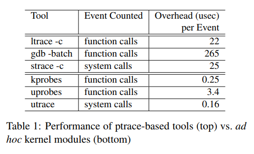
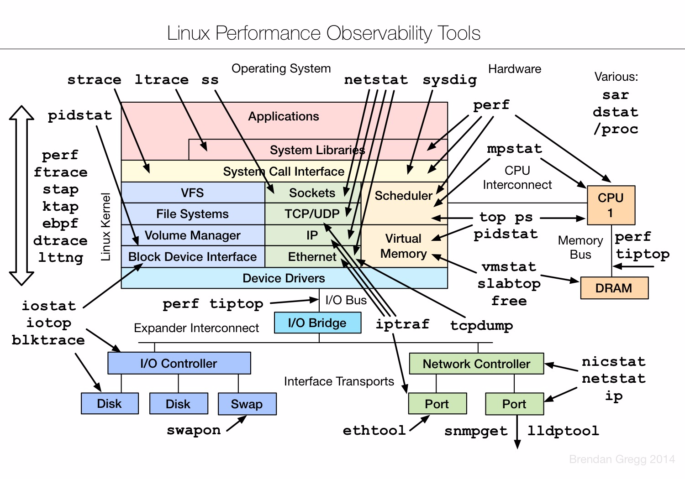
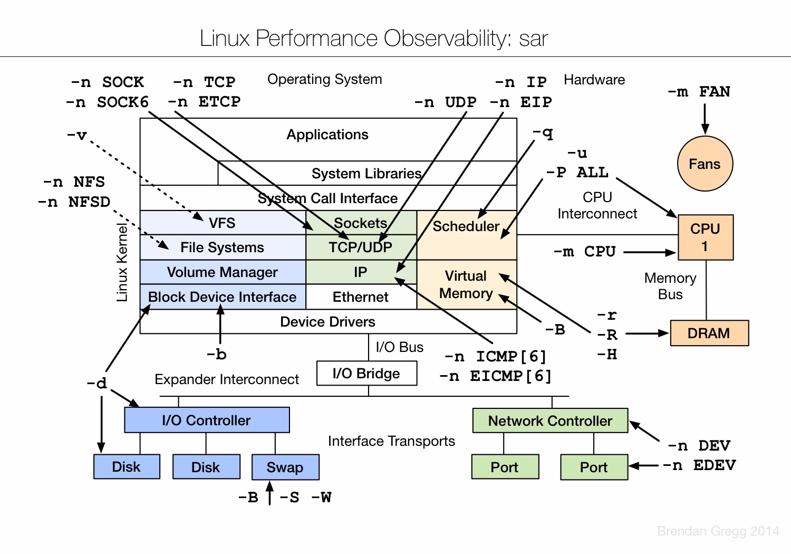
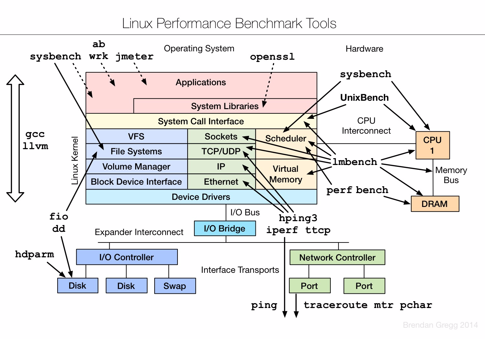

# eBPF和uprobe在调试用户态程序的异同
uprobe方法本质上是代码注入, 在被probe进程的虚拟内存上, 把用户态代码替换成breakpoint指令, 以及注册相应的handler来完成调试任务. handler运行的就是被注入的代码.

eBPF本质是内核解释器执行脚本, 在解释器的JIT环境下执行.

目前我的理解是: uprobe等probe方法更暴力, 需要将代码"注入"到被调试进程空间. 而eBPF通过解释执行的方法, 更安全, 更可控, 但可能效率低一点.

# 调试手段性能损耗对比:
  

# 调试工具图解
## 性能观测工具
  

  

## 性能评测工具
  

## 性能优化工具
  
